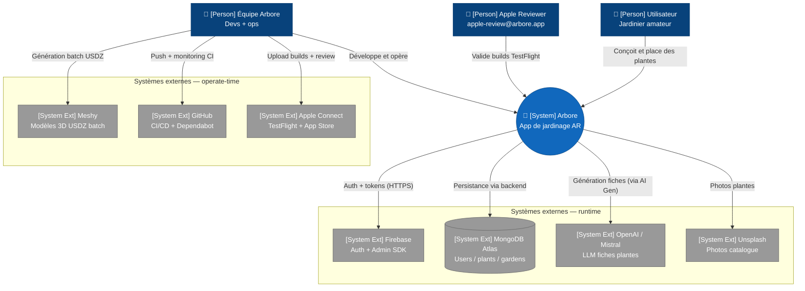

# C4 — Niveau 1 : Context

Cette vue décrit, au plus haut niveau d'abstraction, les **acteurs utilisant Arbore et les systèmes externes avec lesquels l'application interagit**. La structure interne d'Arbore n'est pas représentée à ce niveau : seules les frontières du système et ses interfaces sont visibles.

## Diagramme

> **Note de rendu** : la sémantique C4 (Person, System, External) est préservée dans les labels. La syntaxe utilisée est `flowchart` plutôt que `C4Context` natif, car la layout du C4 Mermaid est encore expérimentale et produit des chevauchements d'arêtes sur les graphes denses. Voir [README §Outils](../README.md#outils-et-statut).

## Points clés

- **Arbore vu de l'extérieur** constitue une boîte unique qui communique avec cinq systèmes externes en runtime (Firebase, MongoDB Atlas, OpenAI/Mistral, Unsplash) et deux systèmes utilisés exclusivement en operate-time (Meshy, GitHub Actions, Apple Connect).
- **Trois catégories d'acteurs humains** sont distinguées : utilisateurs finaux (jardiniers), reviewer Apple (compte dédié `apple-review@arbore.app`) et équipe interne. La review Apple est représentée comme un acteur distinct car son parcours d'usage fait l'objet d'une documentation spécifique (notes TestFlight).
- **Meshy n'intervient pas en runtime.** Ce service est utilisé en amont par l'équipe pour pré-générer le catalogue de modèles 3D ; il n'est jamais appelé depuis l'application. Ce choix est volontaire : le coût et la latence de Meshy sont incompatibles avec un usage AR temps réel.
- **Aucun système de paiement externe** n'est intégré à ce jour : Arbore est gratuit et ne propose pas d'achats in-app. Toute évolution dans ce sens devra mettre à jour ce diagramme (Apple In-App Purchase et éventuellement Stripe).
- **iCloud Private Relay n'est pas représenté** car il ne constitue pas une intégration mais un proxy transparent susceptible de perturber les appels HTTP sortants (cf. issue #90 résolue et choix HTTPS détaillé dans l'ADR à venir).

## Vue suivante

Le [niveau 2 — Container](02-containers.md) ouvre la boîte « Arbore » et expose les applications et services qui la composent : application iOS, backend Go, AI Generator Python.
