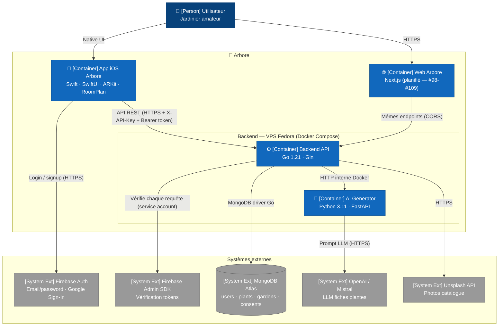

# C4 — Niveau 2 : Containers

Cette vue ouvre la boîte « Arbore » et représente les **applications et services déployables**. Un container correspond à une unité runtime indépendamment déployable : un process iOS, un container Docker ou un service Apple managé.

Pour le niveau de granularité supérieur (acteurs et systèmes externes), consulter [`01-context.md`](01-context.md).

## Diagramme

> **Note de rendu** : la sémantique C4 (Person, Container, System Ext) est préservée dans les labels. La syntaxe utilisée est `flowchart` plutôt que `C4Container` natif, car la layout du C4 Mermaid est encore expérimentale et produit des chevauchements d'arêtes sur les graphes denses.

## Points clés

- **Trois containers Arbore sont actuellement en production** : l'application iOS, le backend Go et l'AI Generator Python. Les deux derniers tournent en containers Docker sur un VPS Fedora unique. Le **front web Next.js** est planifié mais n'est pas encore déployé (cf. issues #98 à #109).
- **Deux barrières de sécurité protègent l'accès aux données** :
  1. **X-API-Key** validée par un middleware backend dédié — limite l'exposition à un scrape massif depuis l'extérieur.
  2. **Bearer Firebase token** validé par le Firebase Admin SDK côté backend — garantit que la requête provient d'un utilisateur authentifié et fournit son `uid`.
- **L'AI Generator est isolé du client** : seul le backend l'appelle, jamais l'application iOS directement. Ce choix volontaire permet de cacher la clé OpenAI/Mistral et d'appliquer caching et throttling côté backend.
- **MongoDB Atlas est externe au système Arbore** mais piloté exclusivement par le backend. L'application iOS n'ouvre **jamais** de connexion MongoDB directe.
- **Backend et AI Generator partagent le même VPS** mais communiquent via le réseau Docker interne (`http://ai-generator:8000`) plutôt que via l'IP publique. La latence reste inférieure à 5 ms.
- **HTTPS est utilisé en sortie de l'iOS** mais le backend lui-même reste accessible en HTTP simple à la date de rédaction (cf. issue #121). Ce point sécurité est inscrit au Sprint 3.

## Choix d'infrastructure

- **VPS Fedora unique** : un serveur unique héberge backend, AI generator et le stockage des thumbnails de plantes. Cette topologie simple convient à l'échelle actuelle (équipe de cinq personnes). Une séparation en services indépendants sera à envisager si l'application monte en charge.
- **Docker Compose** orchestre les deux containers via le fichier `docker-compose.yml` à la racine du dépôt. Kubernetes est volontairement écarté à ce stade pour limiter la complexité opérationnelle.
- **Firebase est un service managé** : le projet consomme l'authentification sans en assumer l'exploitation. Le compromis vendor lock-in / vitesse de delivery sera tracé dans l'ADR 0004 (Phase 5).

## Hors-scope de cette vue

- Le détail des **modules à l'intérieur** d'un container relève du niveau 3 (Component), traité dans `03-components-*.md` (Phase 2).
- Le **schéma de données MongoDB** (collections, champs, relations) est documenté dans `04-data-model.md` (Phase 2).
- Les **parcours utilisateur** (signup, AR placement, sauvegarde de jardin) sont décrits dans `flows/*.md` (Phase 3).
