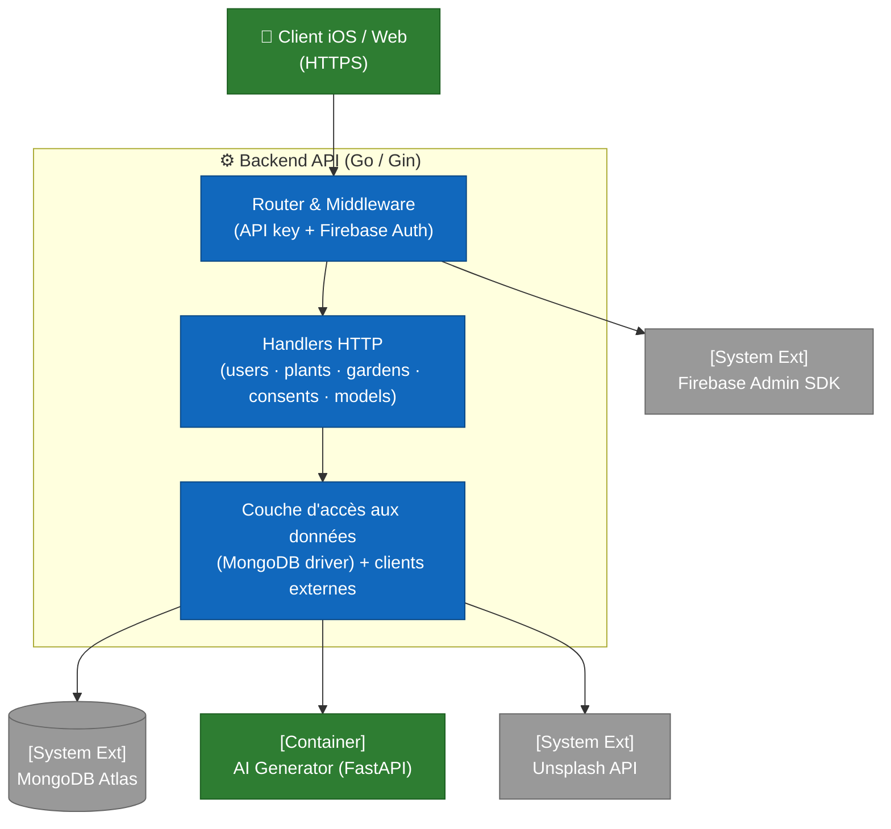

# C4 — Niveau 3 : Composants Backend

Cette vue ouvre le container **Backend API** (Go 1.21 + Gin) et expose ses modules principaux. Le code source est organisé autour d'un fichier monolithique `main.go` (~1 400 lignes) regroupant déclarations de types, handlers et bootstrap, complété par un sous-dossier `middleware/` pour l'authentification.

Pour la vue d'ensemble des containers, consulter [`02-containers.md`](02-containers.md). Pour les composants côté iOS, consulter [`03-components-ios.md`](03-components-ios.md).

## Topologie en couches

Toutes les requêtes franchissent la chaîne **Router → Middleware → Handler → Accès données**. Cette discipline est imposée par la configuration du `router.Group("/")` dans `main.go`, qui applique les deux middlewares à toutes les routes protégées.

## Middleware

Le sous-dossier `middleware/` expose deux fonctions chaînées dans cet ordre :

| Fichier | Fonction | Rôle |
|---|---|---|
| `middleware/api_key.go` | `APIKeyMiddleware()` | Valide l'en-tête `X-API-Key` contre la variable d'environnement `ARBORE_API_KEY`. Bloque toute requête non identifiée par la clé applicative. Renvoie `401 INVALID_API_KEY`. |
| `middleware/firebase_auth.go` | `InitFirebase()` | Initialise le SDK Admin Firebase au démarrage du serveur. En `GIN_MODE=release`, toute erreur de credential est fatale (le serveur refuse de démarrer). |
| `middleware/firebase_auth.go` | `FirebaseAuthMiddleware()` | Vérifie le `Bearer` token, extrait l'`uid` et le pose dans le contexte Gin (`c.Set("uid", ...)`). Renvoie `401 Unauthorized` si la vérification échoue. |
| `middleware/firebase_auth.go` | `CheckUserBannedFunc` | Hook configurable injecté depuis `main.go` (`checkUserBannedFromDB`) qui rejette les UIDs marqués `banned: true` dans Mongo. |

**Ordre critique** : `APIKeyMiddleware` doit précéder `FirebaseAuthMiddleware`. Cela évite de consommer un appel Firebase pour des requêtes qui n'auraient même pas la clé applicative valide.

## Handlers HTTP (main.go)

Les handlers sont regroupés thématiquement dans `main.go` et exposés sous le groupe `protected`. Tous reçoivent l'`uid` via `c.Get("uid")` après passage des deux middlewares.

### Domaine Users (`/users`)

| Endpoint | Handler | Authz |
|---|---|---|
| `POST /users` | `createUser` | uid issu du token, ignore tout `uid` envoyé dans le body |
| `GET /users/:uid` | inline (anonyme) | self-only : `tokenUID == :uid` sinon `403` |
| `POST /users/:uid/photo` | `uploadUserPhoto` | self-only |
| `GET /users/:uid/photo` | `getUserPhoto` | self-only |
| `GET /users/export` | `exportUserData` | RGPD art. 20 — renvoie users + gardens + consents au format JSON |
| `PATCH /users/me` | `updateUserSelf` | self-only, trim + cap 100 chars (issue #138) |
| `DELETE /users` | `deleteUser` | cascade — supprime gardens + consents avant le user |

### Domaine Plants (`/plants`)

| Endpoint | Handler | Notes |
|---|---|---|
| `POST /plants` | `createPlant` | Insertion admin (pas d'authz spécifique au-delà de l'auth standard) |
| `GET /plants` | `getPlants` | Liste complète du catalogue |
| `GET /plants/:id` | `getPlantByID` | Validation `ObjectIDFromHex` |
| `POST /plants/generate` | `generatePlantWithAI` | Génère une fiche multilingue via l'AI Generator |
| `POST /plants/generate-multiple` | `generateMultiplePlantsHandler` | Variante batch, retourne created/skipped |

### Domaine Gardens (`/gardens`)

| Endpoint | Handler | Authz |
|---|---|---|
| `POST /gardens` | `createGarden` | uid issu du token, garden.UID forcé |
| `GET /gardens` | `listGardens` | Filtre par `uid` |
| `GET /gardens/:id` | `getGardenByID` | Lecture (pas de filtre `uid` à ce stade — revue pending) |
| `PUT /gardens/:id` | `updateGarden` | Filtre `_id AND uid` pour l'ownership |
| `DELETE /gardens/:id` | `deleteGarden` | Filtre `_id AND uid` pour l'ownership |

### Domaine Consents (`/consents`) — RGPD

| Endpoint | Handler | Notes |
|---|---|---|
| `POST /consents` | `recordConsent` | Capture IP et User-Agent automatiquement si absents |
| `GET /consents` | `getUserConsents` | Tri par timestamp descendant |
| `GET /consents/latest` | `getLatestUserConsents` | Dernière entrée par `consentType` |

### Domaine Models 3D (`/models`)

| Endpoint | Handler | Notes |
|---|---|---|
| `GET /models/:filename` | inline (anonyme) | Sécurité : reject `..` et `/`, exige `.usdz`. Sert le fichier depuis `./models/`. |
| `GET /models/thumbnails/:filename` | inline (anonyme, **public**) | Hors du groupe `protected` — sert les PNGs sans auth. |
| `POST /models/thumbnails/:plantId` | `uploadPlantThumbnail` | Restreint à `THUMBNAIL_UPLOAD_ALLOWED_UIDS` ; validation PNG (max 100 MB). |

### Endpoint public (`/health`)

| Endpoint | Handler | Notes |
|---|---|---|
| `GET /health` | inline | Healthcheck Docker — pas de protection. Renvoie `{status, service, version}`. |

## Couche d'accès aux données et clients externes

| Fichier / fonction | Rôle |
|---|---|
| Variable globale `client *mongo.Client` (main.go) | Connexion MongoDB initialisée au démarrage. Le `URI` provient de `MONGODB_URI`. |
| Collections — `users`, `plants`, `gardens`, `consents` | Schéma documenté dans [`04-data-model.md`](04-data-model.md). |
| `unsplash.go` — `fetchUnsplashImageURLs(query, count)` | Appelle l'API Unsplash avec `UNSPLASH_ACCESS_KEY`. Retourne les URLs de photos. |
| `setdefault.go` — `Plant.SetDefaults()` | Applique les valeurs par défaut aux plantes lors de l'insertion. |
| `generateAndInsertPlant` (main.go) | Pipeline complet : appel HTTP à l'AI Generator → enrichissement Unsplash → insertion Mongo. |
| `checkUserBannedFromDB` (main.go) | Hook injecté dans le middleware Firebase — vérifie le flag `banned` du user. |
| `loadDotEnv` (main.go) | Charge un `.env` local au démarrage (utile en dev). Sur le VPS les variables viennent de l'environnement Docker. |

## Variables d'environnement

| Variable | Rôle | Sensibilité |
|---|---|---|
| `MONGODB_URI` | URI de connexion Mongo Atlas | 🔒 **secret** |
| `ARBORE_API_KEY` | Clé applicative attendue dans `X-API-Key` | 🔒 **secret** |
| `FIREBASE_SERVICE_ACCOUNT_PATH` | Chemin vers le JSON du service account Firebase | 🔒 **secret** |
| `OPENAI_API_KEY` | Forwardée à l'AI Generator | 🔒 **secret** |
| `UNSPLASH_ACCESS_KEY` | Clé API Unsplash | 🔒 **secret** |
| `AI_GENERATOR_URL` | URL interne Docker (`http://ai-generator:8000`) | configuration |
| `THUMBNAILS_DIR` | Chemin disque pour les thumbnails PNG | configuration |
| `THUMBNAIL_UPLOAD_ALLOWED_UIDS` | Liste d'UIDs autorisés à uploader des thumbnails | configuration |
| `GIN_MODE` | `release` en prod, `debug` en local | configuration |
| `PORT` | Port d'écoute HTTP (8080 par défaut) | configuration |

## Points clés

- **Monolithe Go contenu** : tout vit dans `main.go` plus `middleware/`. Cette concentration est volontaire à l'échelle actuelle, et la séparation par packages sera envisagée si le code dépasse 2 000-2 500 lignes.
- **Aucun ORM** : le driver MongoDB officiel est utilisé directement avec `bson.M{...}` pour les filtres. La conséquence positive est une grande lisibilité ; la conséquence négative est l'absence de protection structurelle contre les fautes de frappe sur les noms de champs.
- **Self-only authz omniprésente** : la quasi-totalité des handlers `users`/`gardens` filtre par `uid` extrait du token, jamais par l'`uid` envoyé dans le body ou l'URL. Cette discipline empêche un utilisateur d'agir au nom d'un autre.
- **L'AI Generator est traité comme un service interne** : appelé via `http://ai-generator:8000` sur le réseau Docker, jamais exposé directement au client. La clé OpenAI ne quitte pas le VPS.
- **MongoDB credentials hardcodés en fallback** (lignes 1166-1169 de `main.go`) — issue #119 ouverte pour suppression et rotation. À traiter avant toute exposition publique du dépôt.
- **Backend reachable en HTTP simple** — issue #121 ouverte pour migration HTTPS et durcissement ATS côté iOS.

## Hors-scope de cette vue

- Le détail des sequences (signup avec rollback, save garden) sera couvert dans `flows/*.md` (Phase 3).
- Le schéma des collections est documenté dans [`04-data-model.md`](04-data-model.md).
- Les décisions architecturales (choix Firebase, choix Mongo, choix monolithe) seront tracées dans `decisions/` (Phase 5).
