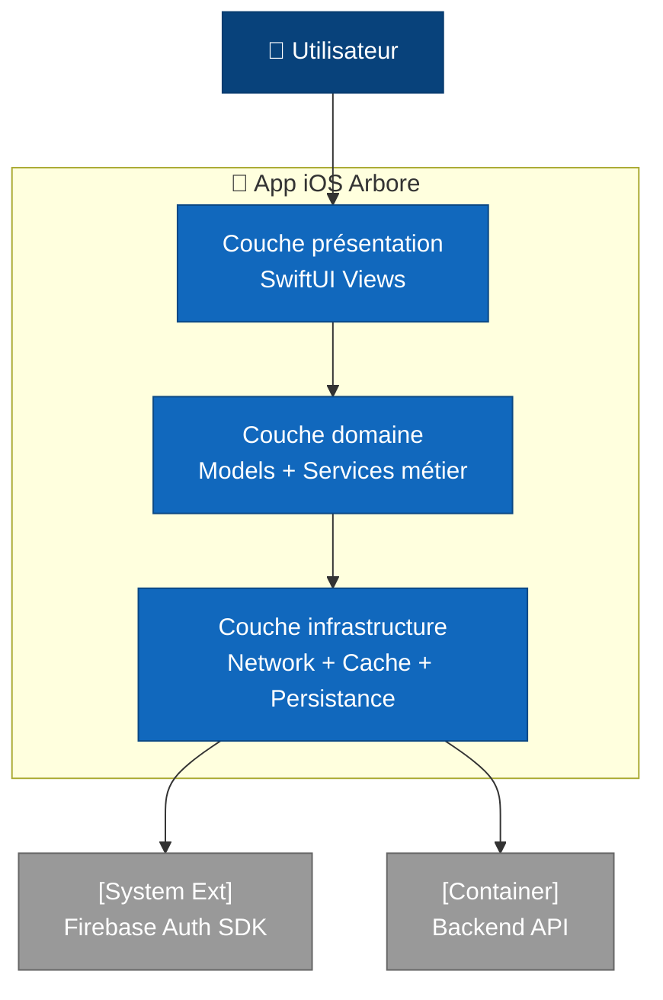
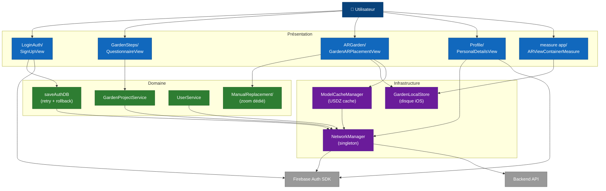
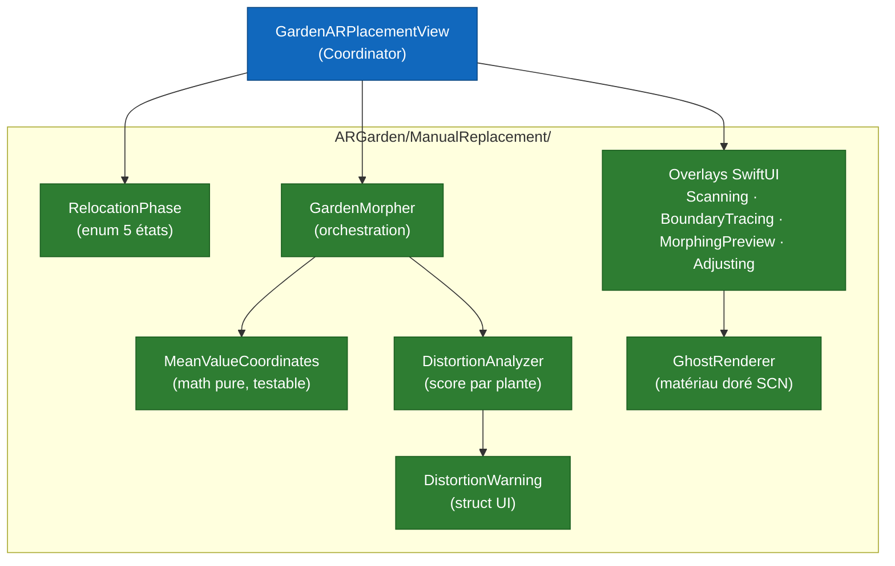

# C4 — Niveau 3 : Composants iOS

Cette vue ouvre le container **App iOS Arbore** et expose ses modules principaux. Le code source SwiftUI est organisé en dossiers fonctionnels regroupés en trois couches : présentation, domaine et infrastructure.

Pour la vue d'ensemble des containers, consulter [`02-containers.md`](02-containers.md). Pour les composants côté backend, consulter [`03-components-backend.md`](03-components-backend.md).

## Topologie en couches

Les flèches reflètent la **règle de dépendance** : la présentation peut appeler le domaine, le domaine peut appeler l'infrastructure ; jamais l'inverse. Cette règle est appliquée par convention de dossiers et revue lors des PRs (pas de framework qui l'enforce).

## Modules par couche

### Couche présentation — SwiftUI Views

| Dossier / fichier | Rôle |
|---|---|
| `LoginAuth/` | Signup, login, vérification email, reset mot de passe (`SignUpView`, `LoginView`, `VerifyEmailView`, `ReAuthView`). |
| `Views/GardenSteps/` | Wizard de création de jardin en 10 étapes (`QuestionnaireView`, `ScanMethodSelectionView`, `WizardSummaryStepView`, `LiDARScanWizardView`). |
| `ARGarden/` | Placement et visualisation des plantes en AR (`GardenARPlacementView` ~3 300 LOC, `PlantCatalogView`). |
| `ARGarden/ManualReplacement/` | Sous-module dédié au flow de re-placement manuel (#111). Voir [zoom dédié](#zoom-manual-replacement) plus bas. |
| `Views/Profile/` | Gestion du compte (`PersonalDetailsView`, `DataExportView`, `PrivacySettingsView`, `CloseAccountView`). |
| `measure app/` | Tracé du périmètre du jardin au sol via raycasts ARKit (`ARViewContainerMeasure`), utilisé en non-LiDAR. |

### Couche domaine — Models et Services métier

| Fichier | Rôle |
|---|---|
| `Models/User.swift` | Struct utilisateur, miroir du document MongoDB côté serveur. |
| `Models/Plant.swift` | Struct catalogue plante avec traductions multilingues et URL USDZ. |
| `Models/GardenProject.swift` | Représentation locale d'un jardin (boundary, plants placées, métadonnées). |
| `Models/WizardPlantFilter.swift` | Filtre les plantes du catalogue selon les choix du wizard (luminosité, entretien, etc.). |
| `Models/WateringRoutine.swift` | Routine d'arrosage attachée à une plante. |
| `Models/PotMeasurement.swift` | Mesure du diamètre d'un pot via ARKit (feature secondaire). |
| `UserService.swift` | Récupère l'utilisateur courant via `GET /users/:uid`. |
| `Models/GardenProjectService.swift` | CRUD des jardins via le backend. |
| `Services/GardenSuggestionEngine.swift` | Filtre et propose les plantes adaptées au profil. |
| `Services/CalendarService.swift` | Génère le calendrier d'arrosage à partir des `WateringRoutine`. |
| `LoginAuth/saveAuthDB.swift` | Pont entre Firebase Auth et `POST /users` — implémente retry exponentiel et rollback Firebase (issue #137). |

### Couche infrastructure

| Fichier | Rôle |
|---|---|
| `Services/NetworkManager.swift` | Singleton HTTP. Injecte automatiquement `X-API-Key` (depuis `AppConfig`) et `Bearer` token Firebase. Retry unique sur erreurs réseau transitoires (issue #90). |
| `Services/ModelCacheManager.swift` | Télécharge et cache les modèles USDZ depuis `GET /models/:filename` (issue #91). |
| `Views/GardenLocalStore.swift` | Persistance disque iOS — `worldmap_{id}.arworldmap` (binaire ARKit) et `scene_{id}.json` (positions des plantes). Local-only à ce jour (origine de l'issue #114). |
| `DatabaseFireBaseStore/` | Wrappers historiques autour de Firestore. **En cours de dépréciation** : les nouveaux écrans passent par le backend Go via `NetworkManager`. |
| `Config/AppConfig.swift` | Lit `baseURL` et `apiKey` depuis `Secrets.xcconfig` non versionné (cf. issue #117 résolue : rotation + purge historique). |
| `ARGarden/ArboreLog.swift` | Wrapper `os_log` catégorisé (`plants`, `network`, `AR`). Utilisé par tous les modules. |

## Câblage inter-modules

Le diagramme ci-dessous restaure les **dépendances réelles** entre modules à travers les trois couches. Il complète la topologie générale et les tableaux : chaque flèche correspond à un appel direct identifié dans le code.

Lectures recommandées de ce diagramme :

- **Signup** : `SignUpView` → `saveAuthDB` (retry + rollback, issue #137) → `NetworkManager` → Backend ; en parallèle, `SignUpView` → Firebase Auth SDK pour la création de compte.
- **Wizard de jardin** : `QuestionnaireView` → `GardenProjectService` → `NetworkManager` → Backend.
- **Placement AR** : `GardenARPlacementView` ramifie vers trois dépendances — `ManualReplacement/` (UI overlays + math morphing), `GardenLocalStore` (persistance WorldMap), `ModelCacheManager` (USDZ via le réseau).
- **Profil** : `PersonalDetailsView` → `NetworkManager` (PATCH /users/me, issue #138) **et** Firebase Auth SDK (mise à jour `displayName`).
- **Tracé périmètre non-LiDAR** : `ARViewContainerMeasure` écrit la boundary dans `GardenLocalStore` sans passer par le réseau.

## Zoom Manual Replacement

Le sous-dossier `ARGarden/ManualReplacement/` regroupe la machine d'états du **Manual Replace** introduite par l'issue #111. La granularité fine permet de tester la couche mathématique indépendamment de l'UI.

`MeanValueCoordinates` reste **pure math** (algorithme Floater 2003), sans dépendance UIKit ni ARKit. Elle est testable en isolation — c'est la pièce qu'il convient de couvrir en priorité par des tests unitaires (issue #123).

La machine d'états correspondante sera diagrammée dans `state-machines/relocation-phase.md` (Phase 3).

## Points clés

- **Trois couches sont clairement séparées** par convention de dossiers : présentation, domaine, infrastructure. Aucun framework MVVM n'est imposé ; la discipline tient à la review des PRs.
- **`GardenARPlacementView` est le seul god object** du codebase (≈ 3 300 lignes). Sa refactorisation est suivie par l'issue #124.
- **`NetworkManager` est le point d'entrée unique** des appels HTTP. Toute requête sortante passe par ce singleton afin de garantir l'injection des credentials et le retry réseau.
- **`saveAuthDB.swift` est le seul appelant** à implémenter un retry métier avec backoff exponentiel et un rollback Firebase Auth. Cette logique est dédiée à la signup (issue #137).
- **`DatabaseFireBaseStore/` est en cours de dépréciation** au profit du backend Go pour toutes les opérations métier hors authentification.
- **`GardenLocalStore` est local-only** : aucune donnée n'est partagée entre appareils, ce qui motive l'issue #114 (récupération cross-install).

## Frameworks Apple utilisés

- **SwiftUI** pour l'ensemble de la couche UI (sauf SCNView/ARSCNView intégrés via `UIViewRepresentable`).
- **ARKit** pour le tracking AR et la sérialisation `ARWorldMap`.
- **SceneKit** pour le rendu 3D des plantes — migration vers RealityKit suivie par l'issue #83.
- **RealityKit** pour les previews de thumbnails et la mesure de pots.
- **RoomPlan** (LiDAR uniquement) pour le scan structuré de pièces.
- **FirebaseAuth** pour l'auth utilisateur ; **GoogleSignIn** pour Google.

## Hors-scope de cette vue

- Le détail interne de `GardenARPlacementView` (gestures, raycasts, cycle de vie ARKit) relève d'une per-screen spec (Phase 4).
- Les champs et invariants des modèles côté backend sont documentés dans [`04-data-model.md`](04-data-model.md).
