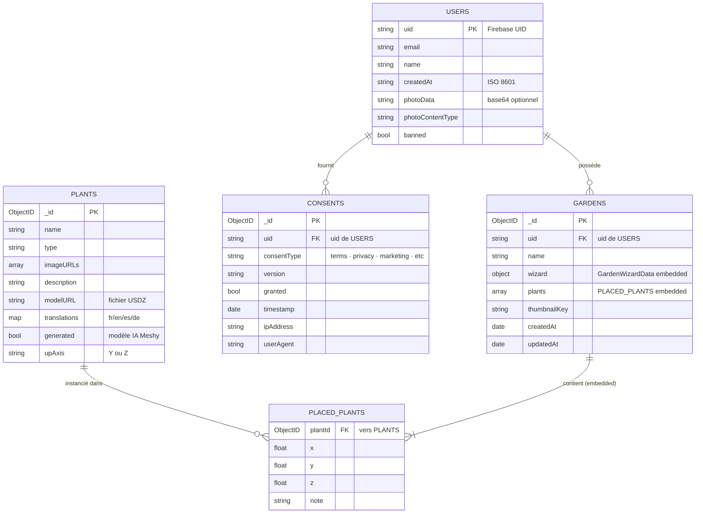

# Modèle de données — MongoDB

Cette vue décrit le schéma des collections MongoDB utilisées par Arbore. Le backend Go est le **seul** consommateur direct de cette base ; l'application iOS et le futur front web passent obligatoirement par l'API REST.

Le schéma est volontairement **dénormalisé** sur certains aspects (traductions plantes embarquées, plantes placées embarquées dans le jardin) afin de réduire le nombre d'aller-retours Mongo lors des appels API. Aucune contrainte d'intégrité référentielle n'est appliquée par Mongo : la cohérence est assurée applicativement par le backend.

## Diagramme ER



## Collections

### `users`

Document représentant un utilisateur authentifié. La clé fonctionnelle est `uid` (UID Firebase), pas l'`_id` Mongo, ce qui permet de retrouver un user via son token sans index secondaire.

| Champ | Type | Notes |
|---|---|---|
| `uid` | string | UID Firebase. Sert de clé fonctionnelle dans tous les filtres `bson.M{"uid": ...}`. |
| `email` | string | Email tel que fourni par Firebase Auth. |
| `name` | string | Nom complet affiché. Modifiable via `PATCH /users/me` (issue #138). |
| `createdAt` | string | Date d'inscription au format ISO 8601. |
| `photoData` | string (optionnel) | Photo de profil encodée en base64. Source de vérité pour la photo. |
| `photoContentType` | string (optionnel) | MIME type associé. |
| `banned` | bool | Hook de modération vérifié par le middleware Firebase à chaque requête. |

### `plants`

Document du catalogue de plantes. Chaque plante embarque ses traductions multilingues afin qu'un seul `findOne` rapatrie toutes les informations nécessaires.

| Champ | Type | Notes |
|---|---|---|
| `_id` | ObjectID | Clé primaire Mongo. Référencée par `PlacedPlant.plantId`. |
| `name` | string | Nom canonique. |
| `type` | string | Famille / type botanique. |
| `imageURLs` | array<string> | Photos Unsplash récupérées via `fetchUnsplashImageURLs`. |
| `description` | string | Description en français (rapide à servir au client iOS par défaut). |
| `modelURL` | string | Nom de fichier USDZ servi par `GET /models/:filename`. |
| `translations` | map<lang, LanguageData> | Sous-document par langue (`fr`, `en`, `es`, `de`) avec sun/water/soilAndPot/health/lifeCycle/care. |
| `generated` | bool (optionnel) | `true` si le modèle 3D vient de Meshy (cf. badge BETA, issue #84). |
| `upAxis` | string (optionnel) | `"Y"` ou `"Z"`. Permet l'application d'une rotation au chargement du modèle (issue #89). |

Le sous-document `translations[lang]` (type `LanguageData`) regroupe :

```
LanguageData {
  description, plantType,
  sun: {lightType, durationPerDay, orientation, windowDistance, recommendedRooms, tips},
  water: {frequency, amount, method, humidity, signsLack, signsExcess, recommendedWater},
  soilAndPot: {substrate, drainage, potSize, repotFrequency, repotSigns},
  health: {commonProblems, symptomsAndCauses, pests, treatments, prevention},
  lifeCycle: {growth, flowering, dormancy, fertilizer, pruning},
  care: {weekly, monthly, yearly, extraTips}
}
```

### `gardens`

Document représentant un jardin créé par un utilisateur. Les plantes placées sont **embedded** dans le document plutôt que stockées dans une collection séparée — la lecture d'un jardin entier ne coûte qu'un `findOne`.

| Champ | Type | Notes |
|---|---|---|
| `_id` | ObjectID | Clé primaire Mongo. |
| `uid` | string | UID du propriétaire (FK logique vers `users.uid`). Filtré dans tous les CRUD. |
| `name` | string | Nom affiché à l'utilisateur. |
| `wizard` | `GardenWizardData` | Choix du wizard de création (style, spaceType, exposure, maintenance, safety, soil, scanMethod). |
| `plants` | array<`PlacedPlant`> | Plantes placées dans le jardin (voir ci-dessous). |
| `thumbnailKey` | string (optionnel) | Clé d'image utilisée par la home pour la vignette du jardin. |
| `createdAt`, `updatedAt` | date | Timestamps gérés par le backend (`updateGarden` met à jour `updatedAt`). |

Sous-document `PlacedPlant` :

| Champ | Type | Notes |
|---|---|---|
| `plantId` | ObjectID | FK vers `plants._id`. |
| `x`, `y`, `z` | float | Position 3D **dans le repère du jardin** (pas dans le repère monde ARKit, qui est local-only iOS). |
| `note` | string (optionnel) | Note libre attachée à la plante. |

⚠️ **Limite actuelle** : la position 3D persistée côté serveur n'inclut pas la rotation ni l'échelle. Les transformations 4×4 réelles vivent uniquement dans le `scene_{id}.json` local côté iOS (cf. issue #114 sur la perte de données après réinstallation).

### `consents` — RGPD

Trace d'audit des consentements donnés ou retirés par l'utilisateur. Une entrée est créée à chaque action (accept/decline), jamais modifiée — l'historique complet est ainsi préservé pour les obligations RGPD.

| Champ | Type | Notes |
|---|---|---|
| `_id` | ObjectID | Clé primaire. |
| `uid` | string | UID utilisateur (FK logique vers `users.uid`). |
| `consentType` | string | `"terms"`, `"privacy"`, `"marketing"`, etc. Issue #67 prévoit d'étendre la liste. |
| `version` | string | Version du document de consentement présenté (pour traçabilité d'évolution des CGU). |
| `granted` | bool | `true` si accepté, `false` si refusé/retiré. |
| `timestamp` | date | Date de l'action. Auto-set à `time.Now()` si absent. |
| `ipAddress` | string | IP du client. Auto-set à `c.ClientIP()` si absent. |
| `userAgent` | string | User-Agent HTTP. Auto-set si absent. |

## Index recommandés

Aucun index custom n'est défini explicitement à ce jour ; Mongo crée automatiquement l'index sur `_id`. Les filtres les plus fréquents et qui devraient bénéficier d'index sont :

| Collection | Filtre fréquent | Index suggéré |
|---|---|---|
| `users` | `bson.M{"uid": uid}` | `{uid: 1}` unique |
| `gardens` | `bson.M{"uid": uid}` | `{uid: 1, updatedAt: -1}` composite (tri Home) |
| `gardens` | `bson.M{"_id": id, "uid": uid}` | `{uid: 1, _id: 1}` |
| `consents` | `bson.M{"uid": uid}` avec sort timestamp | `{uid: 1, timestamp: -1}` |

À évaluer une fois le volume réel des collections connu en production.

## Relations entre collections

Toutes les relations sont **logiques** (par `uid` ou `ObjectID`), aucune n'est imposée par Mongo. La cohérence repose sur :

- `deleteUser` qui supprime en cascade : gardens puis consents puis le user lui-même (cf. main.go).
- Les filtres `bson.M{"_id": id, "uid": uid}` qui garantissent l'ownership sur update et delete des jardins.
- Les middlewares qui injectent l'`uid` issu du token, jamais accepté du body.

## Hors-scope de cette vue

- Le détail des fonctions de génération de plantes (`generateAndInsertPlant` et son pipeline IA + Unsplash) relève de [`03-components-backend.md`](03-components-backend.md).
- Les flows de sauvegarde côté iOS (`GardenLocalStore` qui produit `scene_{id}.json` et `worldmap_{id}.arworldmap`) sont propres au client et n'apparaissent pas dans Mongo. Ils sont décrits dans [`03-components-ios.md`](03-components-ios.md).
- Les sequences de signup et de save jardin seront documentées dans `flows/*.md` (Phase 3).
