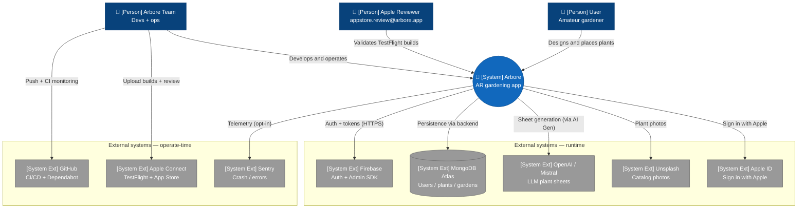

# C4 — Level 1: Context

This view describes, at the highest level of abstraction, the **actors using Arbore and the external systems the application interacts with**. Arbore's internal structure is not represented at this level: only the system boundaries and its interfaces are visible.

## Diagram

> **Rendering note**: the C4 semantics (Person, System, External) are preserved in the labels. The syntax used is `flowchart` rather than native `C4Context`, because the C4 Mermaid layout is still experimental and produces edge overlaps on dense graphs. See [README](../README.md).

## Key points

- **Arbore viewed from the outside** is a single box that communicates with several external systems at runtime (Firebase, Apple ID, MongoDB Atlas, OpenAI/Mistral, Unsplash, Sentry) and systems used at operate-time (GitHub Actions, Apple Connect).
- **Three categories of human actors** are distinguished: end users (gardeners), the Apple reviewer (dedicated account `appstore.review@arbore.app`) and the internal team. The Apple review is represented as a separate actor because its usage journey is the subject of dedicated documentation (TestFlight notes).
- **Sign in with Apple** is integrated (Guideline 5.1.1): upon account deletion, the backend revokes the associated Apple token (see [`03-components-backend.md`](03-components-backend.md)).
- **Sentry is opt-in**: telemetry is only enabled if the user accepts diagnostics sharing (off by default), in compliance with the GDPR. Details in [`../operations/observability.md`](../operations/observability.md).
- **No external payment system** is integrated to date: Arbore is free and offers no in-app purchases. Any change in this direction will require updating this diagram (Apple In-App Purchase and possibly a PSP).
- **iCloud Private Relay is not represented** because it is not an integration but a transparent proxy that may disrupt outbound HTTP calls (see resolved issue #90; public access is now over HTTPS via Cloudflare, see [`../operations/vps-bootstrap.md`](../operations/vps-bootstrap.md)).

## Next view

[Level 2 — Container](02-containers.md) opens the "Arbore" box and exposes the applications and services that make it up: the iOS application, the Next.js web front end, the Go backend and the Python AI Generator.
