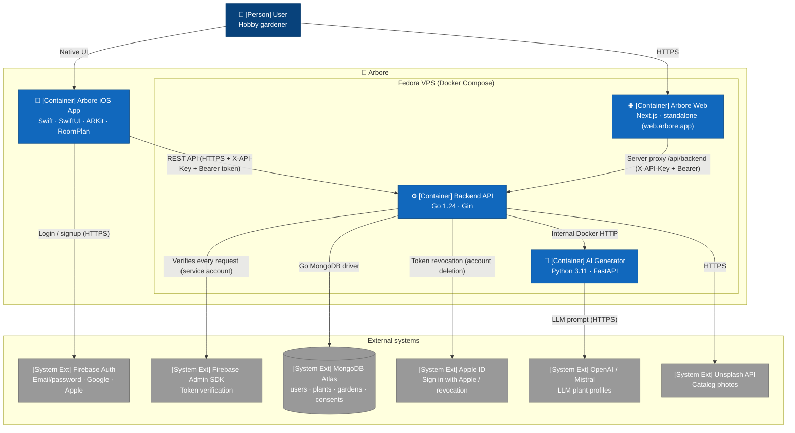

# C4 — Level 2: Containers

This view opens up the "Arbore" box and represents the **deployable applications and services**. A container corresponds to an independently deployable runtime unit: an iOS process, a Docker container, or a managed Apple/cloud service.

For the higher level (actors and external systems), see [`01-context.md`](01-context.md).

## Diagram

> **Rendering note**: the C4 semantics (Person, Container, System Ext) are preserved in the labels. The syntax used is `flowchart` rather than the native `C4Container`, because the C4 Mermaid layout is still experimental and produces edge overlaps on dense graphs.

## Key points

- **Four Arbore containers are in production**: the iOS application, the Next.js web frontend, the Go backend, and the Python AI Generator. The last three run in Docker containers on a single Fedora VPS, orchestrated by `docker-compose.yml`.
- **The web frontend is deployed** at `web.arbore.app` (Cloudflare → nginx → `arbore-web` container on port 3000). It serves as a companion to the iOS app: browsing the catalog, the gardens, the watering calendar, and account management (GDPR export/deletion). Gardens are **created on iOS** (AR placement).
- **The web never exposes the API key or the backend URL to the browser**: all calls go through a **same-origin server proxy** (`/api/backend`) that injects `X-API-Key` on the server side and relays the user's Firebase token. As a result: no CORS on the browser side, and the API key is never exposed.
- **Two security barriers protect data access**:
  1. **X-API-Key** validated by a dedicated backend middleware (constant-time comparison) — limits exposure to unauthorized automated requests coming from outside.
  2. **Bearer Firebase token** validated by the Firebase Admin SDK on the backend side — guarantees that the request comes from an authenticated, verified, and non-banned user, and provides their `uid`.
- **The AI Generator is isolated from the client**: only the backend calls it (internal Docker network), never the iOS or web application directly. This choice hides the OpenAI/Mistral key and enables caching and throttling on the backend side.
- **MongoDB Atlas is external to the Arbore system** but driven exclusively by the backend. Clients (iOS, web) **never** open a direct MongoDB connection.
- **Backend, AI Generator, and Web share the same VPS** and communicate over the internal Docker network (`http://ai-generator:8000`, `http://backend:8080`) rather than via the public IP.
- **HTTPS at the edge**: public access is over HTTPS via Cloudflare (Full strict), with nginx restricted to Cloudflare IPs; the Cloudflare → origin TLS hardening is tracked on the operations side (see [`../operations/vps-bootstrap.md`](../operations/vps-bootstrap.md)).

## Infrastructure choices

- **Single Fedora VPS**: one server hosts the backend, AI generator, web, and the storage of plant models/thumbnails. This simple topology fits the current scale (student beta). A split into independent services will be considered if the application scales up.
- **Docker Compose** orchestrates the three server containers via `docker-compose.yml` at the repository root. Kubernetes is deliberately ruled out at this stage to limit operational complexity.
- **Firebase is a managed service**: the project consumes authentication without taking on its operation. The vendor lock-in / delivery-speed trade-off is recorded in [ADR 0004](../decisions/0004-firebase-auth.md).

## Out of scope for this view

- The detail of the **modules inside** a container belongs to level 3 (Component), covered in [`03-components-ios.md`](03-components-ios.md), [`03-components-backend.md`](03-components-backend.md), and [`03-components-web.md`](03-components-web.md).
- The **MongoDB data schema** is documented in [`04-data-model.md`](04-data-model.md).
- The **user journeys** (signup, AR placement, garden saving) are described in [`../flows/`](../flows/).
- **Deployment** (VPS, Docker, TestFlight) is documented in [`../operations/`](../operations/).
