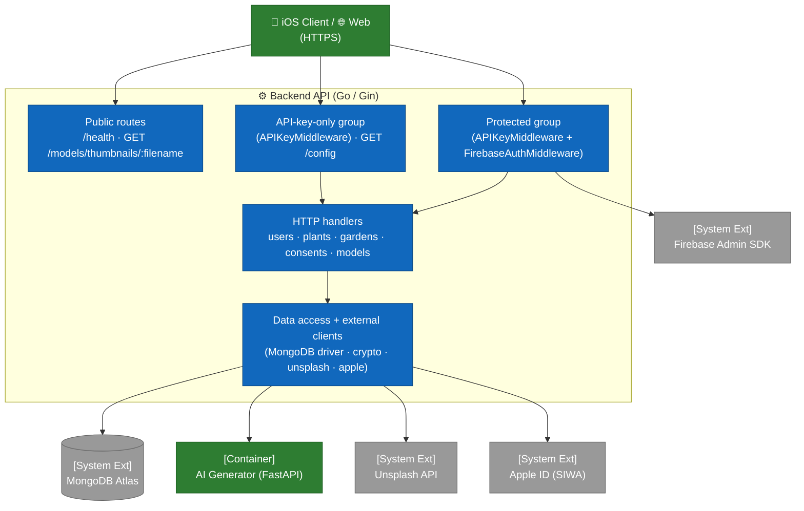

# C4 — Level 3: Backend Components

This view opens up the **Backend API** container (Go 1.24 + Gin) and exposes its main modules. The code is organized around a `main.go` file (~1,680 lines) bundling type declarations, handlers, and bootstrap, supplemented by a `middleware/` subfolder for authentication and a few specialized files (`config.go`, `crypto.go`, `apple_revocation.go`, `unsplash.go`, `setdefault.go`).

For the container overview, see [`02-containers.md`](02-containers.md). For the iOS and web components, see [`03-components-ios.md`](03-components-ios.md) and [`03-components-web.md`](03-components-web.md).

## Layered topology

The backend exposes **three distinct access levels**, defined in `main()`: **public** routes (no middleware), an **API-key-only** group, and a **protected** group (API key *then* Firebase token). This discipline is enforced by how the `router.Group(...)` calls are composed in `main.go`.

## Middleware

The `middleware/` subfolder exposes two chained middlewares, in this order for the protected group.

| File | Function | Role |
|---|---|---|
| `middleware/api_key.go` | `APIKeyMiddleware()` | Reads the `X-API-Key` header and compares it in **constant time** (`crypto/subtle.ConstantTimeCompare`) against `ARBORE_API_KEY`. Missing header → `401 MISSING_API_KEY`; invalid key → `401 INVALID_API_KEY`. If the key matches `ARBORE_API_KEY_TEST`, the **database selector** (`DBSelectorKey`) is set to `test`, otherwise `prod` — this is the prod/test routing mechanism (#159). |
| `middleware/firebase_auth.go` | `InitFirebase()` | Initializes the Firebase Admin SDK at startup from `FIREBASE_SERVICE_ACCOUNT_PATH`. In `GIN_MODE=release`, any missing/unreadable credential is **fatal**; in dev, auth is disabled (fail-open). |
| `middleware/firebase_auth.go` | `FirebaseAuthMiddleware()` | Requires `Authorization: Bearer <token>` (`401 MISSING_AUTH_HEADER` / `INVALID_AUTH_FORMAT`), verifies the token (`401 INVALID_TOKEN`), applies the **ban check** (`403 ACCOUNT_BANNED`) and the **email verification** check (`403 EMAIL_NOT_VERIFIED` for all routes except `POST /users`, #110), then sets `uid` and `email` in the Gin context. SDK unavailable → `503 AUTH_UNAVAILABLE` in release (fail-closed). |
| `middleware/firebase_auth.go` | `CheckUserBannedFunc` | Configurable hook injected from `main.go` (`checkUserBannedFromDB`); queries Mongo to reject UIDs with `banned: true`. |

**Critical ordering**: `APIKeyMiddleware` precedes `FirebaseAuthMiddleware` — there is no point spending a Firebase verification on a request that lacks a valid application key.

## HTTP handlers (main.go)

### Public routes (no middleware)

| Endpoint | Handler | Notes |
|---|---|---|
| `GET /health` | inline | Docker healthcheck. Returns `{status, service, version}`. |
| `GET /models/thumbnails/:filename` | inline (**public**) | Serves catalog PNGs from `THUMBNAILS_DIR`. Rejects `..` / `/`, requires `.png`. |

### API-key-only group (`APIKeyMiddleware` only)

| Endpoint | Handler | Notes |
|---|---|---|
| `GET /config` | `getConfig` (`config.go`) | Non-sensitive reference data needed **before** authentication: config version, wizard options (styles, exposures, soils, etc.), care scales, suggestion engine weights. Requires `X-API-Key` but **not** a token (#236). |

### Protected group (`APIKeyMiddleware` + `FirebaseAuthMiddleware`)

All of these handlers receive the `uid` via `c.Get("uid")` after passing through both middlewares.

#### Users domain (`/users`)

| Endpoint | Handler | Authz |
|---|---|---|
| `POST /users` | `createUser` | uid taken from the token, ignores any `uid` in the body. **The only route exempted** from email verification. |
| `GET /users/:uid` | inline | self-only: `tokenUID == :uid`, otherwise `403`. |
| `POST /users/:uid/photo` | `uploadUserPhoto` | self-only; multipart `photo`, stored as base64 in Mongo. |
| `GET /users/:uid/photo` | `getUserPhoto` | self-only; returns the raw bytes or `204`. |
| `GET /users/export` | `exportUserData` | GDPR art. 20 — user + gardens + consents in JSON format. |
| `PATCH /users/me` | `updateUserSelf` | self; only `name` is editable, trimmed, max 100 runes (#138). |
| `POST /users/me/apple-link` | `linkAppleAccount` | self; exchanges the Apple `authorizationCode` for a refresh token, **encrypted** then stored (#210). |
| `DELETE /users` | `deleteUser` | self; cascades gardens + consents, best-effort Apple revocation, then the user. |

#### Plants domain (`/plants`)

| Endpoint | Handler | Notes |
|---|---|---|
| `POST /plants` | `createPlant` | Insertion (standard auth, no additional authz). |
| `GET /plants` | `getPlants` | Full catalog. |
| `GET /plants/:id` | `getPlantByID` | `ObjectIDFromHex` validation. |
| `POST /plants/generate` | `generatePlantWithAI` | Generates a multilingual record via the AI Generator; `409` if the plant already exists. |
| `POST /plants/generate-multiple` | `generateMultiplePlantsHandler` | Batch variant; returns created/skipped. |

#### Gardens domain (`/gardens`)

| Endpoint | Handler | Authz |
|---|---|---|
| `POST /gardens` | `createGarden` | uid forced from the token. |
| `GET /gardens` | `listGardens` | Filters by `uid`, sorts `updatedAt` desc. |
| `GET /gardens/:id` | `getGardenByID` | Filters `_id AND uid` (ownership, #222). |
| `PUT /gardens/:id` | `updateGarden` | Filters `_id AND uid`; partial update (optional fields). |
| `DELETE /gardens/:id` | `deleteGarden` | Filters `_id AND uid`. |

#### Consents domain (`/consents`) — GDPR

| Endpoint | Handler | Notes |
|---|---|---|
| `POST /consents` | `recordConsent` | Captures IP and User-Agent automatically if absent. |
| `GET /consents` | `getUserConsents` | Sorted by descending timestamp. |
| `GET /consents/latest` | `getLatestUserConsents` | Latest entry per `consentType`. |

#### 3D Models domain (`/models`)

| Endpoint | Handler | Notes |
|---|---|---|
| `GET /models/:filename` | inline (**protected**) | Serves the USDZ model. Rejects `..` / `/` / `\`, requires `.usdz`, `Content-Type: model/vnd.usdz+zip`. The `?lod=heavy` parameter serves the high-definition variant from `./models/heavy/` (see [`../3d-lod-architecture.md`](../3d-lod-architecture.md)). |
| `POST /models/thumbnails/:plantId` | `uploadPlantThumbnail` | Restricted to `THUMBNAIL_UPLOAD_ALLOWED_UIDS`; PNG, max 100 MB, `plantId` validated. |

> Unlike the thumbnail PNG (public), `GET /models/:filename` is in the **protected** group: viewing a 3D model requires both an API key **and** a Firebase token.

## Support modules and external clients

| File / function | Role |
|---|---|
| `config.go` — `getConfig` | Wizard and care reference data served at `GET /config` (mirror of the iOS `GardenSuggestionEngine`). |
| `crypto.go` — `encrypt` / `decrypt` | **AES-256-GCM** encryption at rest. 32-byte master key read from `MASTER_ENCRYPTION_KEY` (64 hex), cached via `sync.Once`. Format `nonce || ciphertext`. Only caller: the Apple refresh token (#210). |
| `apple_revocation.go` | **Sign in with Apple** revocation (Guideline 5.1.1(v)): `generateClientSecret()` (JWT ES256), `exchangeAuthorizationCode()` → refresh token, `revokeRefreshToken()` on account deletion. `revokeAppleBestEffort` never fails the deletion. |
| `unsplash.go` — `fetchUnsplashImageURLs(query, count)` | Fetches photos via `UNSPLASH_ACCESS_KEY`; built-in fallback if missing/failing. Feeds `Plant.imageURLs`. |
| `setdefault.go` — `(*Plant).SetDefaults()` | Fills in defensive default values (name, type, image, description, guarantees all 4 languages) without ever fabricating care data. |
| `generateAndInsertPlant` (main.go) | Pipeline: dedup by name → HTTP call `AI_GENERATOR_URL/generate` → Unsplash enrichment → resolution of the local USDZ file → Mongo insertion. |
| `client` / `testClient` (`*mongo.Client`, main.go) | Mongo connections (`arbore`, plus an optional `arbore_test`). `getDatabaseForRequest` chooses the database based on the selector set by the API key; fail-safe to prod. |
| `loadDotEnv` (main.go) | Loads a local `.env` at startup (never overrides the already-defined environment). |
| CORS (`cors.New`, main.go) | `AllowOrigins: http://localhost:3000`, methods GET/POST/PUT/PATCH/DELETE/OPTIONS, headers `Authorization` / `Content-Type` / `X-API-Key`, `AllowCredentials: true`. |

## Environment variables

| Variable | Role | Sensitivity |
|---|---|---|
| `MONGODB_URI` | Mongo Atlas URI (prod). **Fatal if absent** (`log.Fatal`). | 🔒 secret |
| `MONGODB_URI_TEST` | Mongo URI for `arbore_test` (test mode). Optional. | 🔒 secret |
| `ARBORE_API_KEY` | Application key expected in `X-API-Key` (prod). | 🔒 secret |
| `ARBORE_API_KEY_TEST` | Alternate key routing to `arbore_test`. Optional. | 🔒 secret |
| `FIREBASE_SERVICE_ACCOUNT_PATH` | Path to the Firebase service account JSON. | 🔒 secret |
| `MASTER_ENCRYPTION_KEY` | AES-256 key (64 hex) for encryption at rest (#210). | 🔒 secret |
| `APPLE_TEAM_ID` / `APPLE_KEY_ID` | Apple Developer identifiers (SIWA revocation). | configuration |
| `APPLE_SIWA_CLIENT_ID` | Apple OAuth `client_id`. Native iOS flow = bundle ID `com.arboreteam.arbore`. | configuration |
| `APPLE_SIWA_KEY_PATH` | Internal path to the SIWA `.p8` private key, mounted read-only from outside the repository. | 🔒 secret |
| `UNSPLASH_ACCESS_KEY` | Unsplash API key (catalog photos). | 🔒 secret |
| `AI_GENERATOR_URL` | AI Generator URL. Code default: `http://localhost:8001`; in prod: internal Docker URL. Endpoint `/generate`. | configuration |
| `THUMBNAILS_DIR` | PNG thumbnails directory. | configuration |
| `ARBORE_ADMIN_UIDS` | Bootstrap administrator UID allow-list; prefer Firebase custom claims afterwards. | 🔒 secret |
| `GIN_MODE` | `release` in prod, `debug` locally. | configuration |

> **Note on `OPENAI_API_KEY`**: consumed only by the AI Generator when that provider is selected, never by the Go backend. **Note on `PORT`**: sets the Go server's listening port; Docker maps the host to the same port by default.

## Key points

- **Contained Go monolith**: `main.go` + `middleware/` + a few specialized files. Splitting into packages will be considered if the code exceeds ~2,500 lines.
- **No ORM**: the official MongoDB driver is used directly with `bson.M{...}`. Maximum readability, no structural protection against field-name typos.
- **Self-only authz everywhere**: the `users`/`gardens` handlers filter by the `uid` extracted from the token, never by the `uid` from the body or URL (see [ADR 0005](../decisions/0005-self-authz-pattern.md)).
- **Defense in depth**: API key (constant time) **and** Firebase token (verified, email-verified, not banned) on all business traffic.
- **Secrets encrypted at rest**: the Apple refresh token is AES-256-GCM encrypted (`crypto.go`) before being written to the database.
- **Configuration via the environment only**: `MONGODB_URI` is mandatory (`log.Fatal` if absent) — no Mongo credential is hard-coded.
- **HTTPS**: public access is over HTTPS via Cloudflare (see [`../operations/vps-bootstrap.md`](../operations/vps-bootstrap.md)); Cloudflare → origin TLS hardening is tracked on the operations side.

## Out of scope for this view

- The sequences (signup with rollback, garden save) are covered in [`../flows/`](../flows/).
- The collection schema is documented in [`04-data-model.md`](04-data-model.md).
- Architectural decisions (Firebase, self-authz, AR quality) are tracked in [`../decisions/`](../decisions/).
