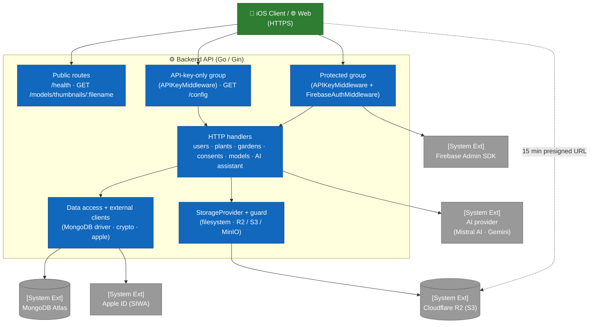

# C4 — Level 3: Backend Components

This view opens up the **Backend API** container (Go 1.25 + Gin) and exposes its main modules.

The code is organized around a `main.go` file (~2,500 lines) bundling type declarations, handlers and bootstrap, supplemented by:

- `middleware/` for authentication and authorization — `api_key.go`, `firebase_auth.go`, `roles.go`, `security.go`;
- specialised files — `config.go`, `secrets.go`, `crypto.go`, `apple_revocation.go`, `setdefault.go`, `indexes.go`, `httplogging.go`, `observability.go`, `account_cleanup.go`, `climate.go`;
- the **AI layer** — `llmprovider.go`, `gemini_provider.go`, `mistral_provider.go`, `llm_throttle.go`, `catalog_context.go`, `httphardening.go`, `promptsafety.go`, `diagnose_normalize.go`;
- **asset storage** — `storageprovider.go`, `storage_s3.go`, `storage_guard.go`.

For the container overview, see [`02-containers.md`](02-containers.md). For the iOS and web components, see [`03-components-ios.md`](03-components-ios.md) and [`03-components-web.md`](03-components-web.md).

## Layered topology

The backend exposes **five distinct access levels**, defined in `buildRouter()`: **public** routes (no middleware), an **API-key-only** group, a **protected** group (API key *then* Firebase token), an **`account`** subgroup closed to guests, and an **`admin`** subgroup. This discipline is enforced by how the `router.Group(...)` calls are composed.

`buildRouter()` is extracted from `main()` precisely so it is reachable from tests: how each route is classified across these groups is locked by an inventory test (#381), which fails until a newly added route is explicitly classified.

## Middleware

The `middleware/` subfolder exposes two chained middlewares, in this order for the protected group.

| File | Function | Role |
|---|---|---|
| `middleware/api_key.go` | `APIKeyMiddleware()` | Reads the `X-API-Key` header and compares it in **constant time** (`crypto/subtle.ConstantTimeCompare`) against `ARBORE_API_KEY`. Missing header → `401 MISSING_API_KEY`; invalid key → `401 INVALID_API_KEY`. If the key matches `ARBORE_API_KEY_TEST`, the **database selector** (`DBSelectorKey`) is set to `test`, otherwise `prod` — this is the prod/test routing mechanism (#159). |
| `middleware/firebase_auth.go` | `InitFirebase()` | Initializes the Firebase Admin SDK at startup from `FIREBASE_SERVICE_ACCOUNT_PATH`. In `GIN_MODE=release`, any missing/unreadable credential is **fatal**; in dev, auth is disabled (fail-open). |
| `middleware/firebase_auth.go` | `FirebaseAuthMiddleware()` | Requires `Authorization: Bearer <token>` (`401 MISSING_AUTH_HEADER` / `INVALID_AUTH_FORMAT`), verifies the token (`401 INVALID_TOKEN`), loads the **access profile** (role + subscription tier + ban status), applies the **ban check** (`403 ACCOUNT_BANNED`) and the **email verification** check (`403 EMAIL_NOT_VERIFIED` for all routes except `POST /users`, #110 — **and except guests**, who have no email), then sets `uid`, `email` and the access profile in the Gin context. The `guest` role is derived from `sign_in_provider == "anonymous"` and applied **after** the database read, so that `banned` remains enforceable against an anonymous session (#381). SDK unavailable → `503 AUTH_UNAVAILABLE` in release (fail-closed). |
| `middleware/firebase_auth.go` | `LoadAccessProfileFunc` | Configurable hook injected from `main.go` (`loadAccessProfileFromDB`); reads ban status, role and subscription tier in a **single query**. A user missing from the database is not an error: default `member`/`free` profile — that is the nominal case of `POST /users`, which runs before its own creation. |
| `middleware/roles.go` | `RequireAccount()` / `RequireRole()` | Authorization guards. `RequireAccount` closes the route to guests (`403 ACCOUNT_REQUIRED`); expressed as "anything but `guest`" so a role added later is not excluded by oversight. Both **fail closed** (`500 AUTHZ_CONTEXT_MISSING`) when the access profile is missing from the context, i.e. when the guard was mounted without `FirebaseAuthMiddleware` upstream. |
| `middleware/roles.go` | `NormalizeRole()` / `NormalizeTier()` | Read-time normalization. Any empty or unknown value falls back to `member`/`free` — **never** `guest` or `admin` — which makes any backfill unnecessary and prevents a degraded read from opening or closing access by accident. `NormalizeTier` also applies subscription expiry, without depending on an external job. |

**Critical ordering**: `APIKeyMiddleware` precedes `FirebaseAuthMiddleware` — there is no point spending a Firebase verification on a request that lacks a valid application key.

## HTTP handlers (main.go)

### Public routes (no middleware)

| Endpoint | Handler | Notes |
|---|---|---|
| `GET /health` | `healthHandler` | Docker healthcheck. Returns `{status, service, commit}`. `commit` is the git SHA injected at build time (`-ldflags -X main.buildCommit`), and is `unknown` for a hand-built binary. This is how you check what actually runs in production: `curl -s https://api.arbore.app/health \| jq -r .commit`. Replaces a hardcoded `version` that was never updated (see #341). |
| `GET /models/thumbnails/:filename` | inline (**public**) | Serves catalog PNGs from `THUMBNAILS_DIR`. Rejects `..` / `/`, requires `.png`. |

### API-key-only group (`APIKeyMiddleware` only)

| Endpoint | Handler | Notes |
|---|---|---|
| `GET /config` | `getConfig` (`config.go`) | Non-sensitive reference data needed **before** authentication: config version, wizard options (styles, exposures, soils, etc.), care scales, suggestion engine weights. Requires `X-API-Key` but **not** a token (#236). |

### Protected group (`APIKeyMiddleware` + `FirebaseAuthMiddleware`)

All of these handlers receive the `uid` via `c.Get("uid")` after passing through both middlewares.

The `account` subgroup (`RequireAccount`) now only holds what requires a **user
document**: profile, consents, Apple linking. Gardens left it with #393 — they
were there because nothing guaranteed what became of their data when Firebase
deletes an inactive anonymous account after 30 days, and the reconciliation job
provides that guarantee.

`GET /users/export` and `DELETE /users` left with them, without which the
storage would be indefensible: a guest would hold data on the server with no way
to access it (art. 15) or erase it (art. 17). Their current session is the only
moment they can exercise those rights — afterwards they have no identity left to
prove.

#### Users domain (`/users`)

| Endpoint | Handler | Authz |
|---|---|---|
| `POST /users` | `createUser` | uid taken from the token, ignores any `uid` in the body. **The only route exempted** from email verification. |
| `GET /users/:uid` | inline | self-only: `tokenUID == :uid`, otherwise `403`. |
| `POST /users/:uid/photo` | `uploadUserPhoto` | self-only; multipart `photo`, stored as base64 in Mongo. |
| `GET /users/:uid/photo` | `getUserPhoto` | self-only; returns the raw bytes or `204`. |
| `GET /users/export` | `exportUserData` | GDPR art. 15 and 20 — user + gardens + consents in JSON format. **Reachable in a guest session**: a missing `users` document is not an error, the profile comes back empty and `metadata.hasProfile` is `false`. |
| `PATCH /users/me` | `updateUserSelf` | self; only `name` is editable, trimmed, max 100 runes (#138). |
| `POST /users/me/apple-link` | `linkAppleAccount` | self; exchanges the Apple `authorizationCode` for a refresh token, **encrypted** then stored (#210). |
| `DELETE /users` | `deleteUser` | self; cascades gardens + consents, best-effort Apple revocation, then the user. **Reachable in a guest session** (art. 17). The Mongo cascade is `purgeUserData`, shared with the reconciliation job so the two paths cannot diverge. |

#### Plants domain (`/plants`)

| Endpoint | Handler | Notes |
|---|---|---|
| `POST /plants` | `createPlant` | Insertion (standard auth, no additional authz). |
| `GET /plants` | `getPlants` | Full catalog. |
| `GET /plants/:id` | `getPlantByID` | `ObjectIDFromHex` validation. |

#### Gardens domain (`/gardens`) — open to guests since #393

| Endpoint | Handler | Authz |
|---|---|---|
| `POST /gardens` | `createGarden` | uid forced from the token. |
| `GET /gardens` | `listGardens` | Filters by `uid`, sorts `updatedAt` desc. |
| `GET /gardens/:id` | `getGardenByID` | Filters `_id AND uid` (ownership, #222). |
| `PUT /gardens/:id` | `updateGarden` | Filters `_id AND uid`; partial update (optional fields). |
| `DELETE /gardens/:id` | `deleteGarden` | Filters `_id AND uid`. |

#### Consents domain (`/consents`) — GDPR

| Endpoint | Handler | Notes |
|---|---|---|
| `POST /consents` | `recordConsent` | Captures IP and User-Agent automatically if absent. |
| `GET /consents` | `getUserConsents` | Sorted by descending timestamp. |
| `GET /consents/latest` | `getLatestUserConsents` | Latest entry per `consentType`. |

#### 3D Models domain (`/models`)

| Endpoint | Handler | Notes |
|---|---|---|
| `GET /models/:filename` | inline (**protected**) | Serves the USDZ model. Rejects `..` / `/` / `\`, requires `.usdz`, `Content-Type: model/vnd.usdz+zip`. The `?lod=heavy` parameter serves the high-definition variant from `./models/heavy/` (see [`../3d-lod-architecture.md`](../3d-lod-architecture.md)). |
| `POST /models/thumbnails/:plantId` | `uploadPlantThumbnail` | Restricted to `THUMBNAIL_UPLOAD_ALLOWED_UIDS`; PNG, max 100 MB, `plantId` validated. |

> Unlike the thumbnail PNG (public), `GET /models/:filename` is in the **protected** group: viewing a 3D model requires both an API key **and** a Firebase token.

#### AI Assistant domain (`/chat`, `/diagnose`)

These two routes are **proxies** to the configured AI provider — **Mistral AI since 2026-09-20** (#555), with Gemini still implemented: the backend relays the call server-side so the key is **never** exposed to the client. The system prompt is sent via the `systemInstruction` field (separate from user content).

| Endpoint | Handler | Notes |
|---|---|---|
| `POST /chat` | `handleChat` | Conversational gardening assistant (history + message + optional image). Plain-text reply (markdown stripped). |
| `POST /diagnose` | `handleDiagnose` | Phytopathological diagnosis from a photo + colorimetric data. **Normalized JSON** reply (see below). |

The handlers build a **neutral** request (`LLMRequest`) and send it through the `LLMProvider` interface: they know nothing about the provider. Before sending, they **ground** the request on the catalogue (see `catalog_context.go` below). The `GeminiProvider` implementation (`gemini_provider.go`) carries the key in the `x-goog-api-key` header (never in the URL, which would leak into `*url.Error`), with backoff retries and **request `context` propagation**: a disconnected client cancels the in-flight call (`http.NewRequestWithContext`). The raw error is never returned to the client (server log + generic `502`). Swapping providers (Gemini, Mistral, …) = adding an `LLMProvider` implementation, without touching the handlers.

### AI provider & hardening (#303, #312, #319)

The `/chat` and `/diagnose` proxies are decoupled from the concrete provider via `LLMProvider`; rate limiting and body cap are shared with the rest of the protected group (`middleware/security.go`):

| File | Role |
|---|---|
| `llmprovider.go` — `LLMProvider` | **Provider abstraction**: interface + neutral types (`LLMRequest`/`LLMResult`) + selection via `AI_PROVIDER` (default `gemini`). Handlers know nothing about the concrete provider (weak coupling). |
| `gemini_provider.go` — `GeminiProvider` | Gemini implementation: payload translation (`systemInstruction`/`contents`/`inlineData`), HTTP call (`x-goog-api-key`, retries), candidate extraction. |
| `middleware/security.go` — `WindowLimiter` | **Per-`uid` rate limiting** (fixed window, minute + daily quotas): `/chat` 20/min, `/diagnose` 6/min (also covers generate/uploads/thumbnails). **Daily** quotas are tiered through `TieredWindowLimiter` — `/chat` 10 (guest) / 100 (free) / 500 (premium), `/diagnose` 3 / 20 / 100: the daily quota is what bounds Gemini spend, hence the place where the subscription tier is meaningful. The per-minute quota stays uniform, protecting the service against bursts. Exceeded → `429` + `X-RateLimit-*` headers. Bucket key via `rateLimitKey`: authenticated `uid` first, otherwise the real IP returned by `TrustedClientIP` (`CF-Connecting-IP` then `X-Real-IP`, both validated as IPs). **`X-Forwarded-For` is never read** — nginx builds it with `$proxy_add_x_forwarded_for`, so its left-hand entries come from the client and made the quota bypassable (audit #338, finding 2). Bounded memory (finding 10): expired entries are purged every minute regardless of the window (previously a 24 h window kept an expired entry for up to 48 h), plus a cap of `limiterMaxEntries` counters — beyond it the oldest are evicted and the event is logged. Accepted trade-off: evicting hands back free quota, still preferable to unbounded memory growth. |
| `middleware/security.go` — `MaxBodyBytes` | **Body cap** (10 MB) applied globally on the protected group: early `413` on `Content-Length` + `http.MaxBytesReader` (handles chunked). |
| `httphardening.go` — `newServer` | **Explicit server timeouts** (`ReadHeaderTimeout` 15s anti-Slowloris, `ReadTimeout` 60s, `WriteTimeout` 300s, `IdleTimeout` 120s) instead of `router.Run`. |
| `httphardening.go` — `backoffOrCancel` | Retry backoff **interruptible** by the `context` (no waiting or re-calling the provider for an abandoned request). |
| `main.go` — `hardenClientIPResolution` | **Non-spoofable client IP resolution**: `SetTrustedProxies(nil)` disables reading `X-Forwarded-For` (gin trusts all proxies by default), and `TrustedPlatform = "X-Real-IP"` relies on the header nginx always overwrites. Fatal error at startup. |
| `indexes.go` — `ensureIndexesAtStartup` | **Mongo indexes on `uid` fields** created at startup (idempotent, non-blocking). Avoids a full collection scan of `users` on every authenticated request. See [data model](04-data-model.md#indexes). |
| `observability.go` — `initSentry` | **Sentry reporting** (#388): intercepted panics and 5xx responses, plus startup failures. **No-op without a DSN**. Details in [`../operations/observability.md`](../operations/observability.md). |
| `promptsafety.go` | **Anti-prompt-injection**: a priority safety clause added to the system prompts (user content is data, never an instruction); bounded inputs (message, history); `plantName` sanitized (single line, no control characters) and framed as untrusted data instead of being interpolated raw. |
| `mistral_provider.go` — `MistralProvider` | Mistral implementation, **the provider in service since 2026-09-20** (#555). Chat Completions shape: system prompt as a `system` turn, role `assistant` (not `model`), image as an `image_url` object carrying a data URI. All three differ from Gemini and are locked by tests. Default model `ministral-8b-2512` — only the Ministral family receives quota on the current plan. |
| `llm_throttle.go` — `throttledProvider` | **Global gate** in front of the provider (#553). The `middleware` limiters are PER USER and answer fairness; they cannot protect the provider's quota, since ten clients each within their own limit together exceed the allowed rate. A decorator rather than an addition inside `Generate`: each provider keeps one reason to change, and a provider added tomorrow inherits the gate. Bounded wait, then `ErrLLMSurcharge` → **429 + `Retry-After`**, never 502. ⚠️ The gate is global **per instance**. |
| `catalog_context.go` | **Catalogue grounding** (#554). Plant names mentioned are matched against the 123 entries, whose care data, pests and watering signs are attached to the prompt as **reference data** — never as instructions, and sanitised through `sanitizeLine`. No vector index: matching works on word prefixes of the name, with no edit distance, because finding the WRONG entry would inject another plant's care presented as verified fact. Afterwards the returned species is reconciled and the response carries `catalogPlantId`. |
| `diagnose_normalize.go` — `normalizeDiagnose` | **Output schema validation** for the diagnosis: typed decoding, numeric values clamped to `[0,1]`, bounded arrays never `null`, nameless diseases dropped, safe defaults. Honors the iOS decoder contract (`diseases[].name` always emitted, camelCase keys). |

## Support modules and external clients

| File / function | Role |
|---|---|
| `reconcile_guests.go` — `reconcileGuests` | **Out-of-server job** (#393), invoked with `./main -reconcile-guests`: deletes Mongo data whose `uid` has disappeared from Firebase Auth, since automatic cleanup of inactive anonymous accounts erases them after 30 days. Four guards, each exiting with an error **without deleting anything** — fail-closed on any Firebase error, refusal of an empty enumeration, 7-day grace read from the `ObjectId` timestamp, simulation by default (`-apply` to delete). The purge is `purgeUserData`, shared with `deleteUser`. Runbook: [`operations/vps-bootstrap.md`](../operations/vps-bootstrap.md). |
| `storageprovider.go` — `StorageProvider` | Abstraction over 3D asset storage (#401 step 5), modelled on `llmprovider.go`: handlers manipulate neutral types (`StorageObject`, `ObjectInfo`) and know nothing of the concrete backing store. `STORAGE_PROVIDER` selects the implementation, `filesystem` by default — with no configuration, behaviour is exactly what it was before the abstraction. Two properties shaped the interface: `Open` returns an `io.ReadSeekCloser` so `http.ServeContent` honours `Range` headers (a `heavy` model reaches 121 MB; an interrupted download must be resumable), and `PresignedURL` lets an object store serve its own files rather than having the backend relay them. `ErrObjectNotFound` separates absence (404) from backing-store failure (500) — conflating them would hide an outage behind a "model not found". |
| `config.go` — `getConfig` | Wizard and care reference data served at `GET /config` (mirror of the iOS `GardenSuggestionEngine`). |
| `crypto.go` — `encrypt` / `decrypt` | **AES-256-GCM** encryption at rest. 32-byte master key (64 hex) resolved by `resolveMasterEncryptionKey`: **file `MASTER_ENCRYPTION_KEY_PATH` first**, otherwise falling back to the `MASTER_ENCRYPTION_KEY` variable. The file is preferred because a variable is readable through `docker inspect` and `/proc/<pid>/environ` — yet this key decrypts the Apple refresh tokens, so it was less protected than what it protects (#338 finding 4). A path that is set but unreadable is an **error**, never a silent fallback. Cached via `sync.Once`, format `nonce \|\| ciphertext`. Only caller: the Apple refresh token (#210). |
| `apple_revocation.go` | **Sign in with Apple** revocation (Guideline 5.1.1(v)): `generateClientSecret()` (JWT ES256), `exchangeAuthorizationCode()` → refresh token, `revokeRefreshToken()` on account deletion. `revokeAppleBestEffort` never fails the deletion. |
| `setdefault.go` — `(*Plant).SetDefaults()` | Fills in defensive default values (name, type, image, description, guarantees all 4 languages) without ever fabricating care data. |
| `client` / `testClient` (`*mongo.Client`, main.go) | Mongo connections (`arbore`, plus an optional `arbore_test`). `getDatabaseForRequest` chooses the database based on the selector set by the API key; fail-safe to prod. |
| `loadDotEnv` (main.go) | Loads a local `.env` at startup (never overrides the already-defined environment). |
| CORS (`configureCORS`, main.go) | **Disabled by default**: the middleware is only installed when `CORS_ALLOWED_ORIGINS` lists origins (comma-separated). Without it no CORS header is emitted and the browser blocks every cross-origin request — the intended behaviour, since the web app calls the API through its Next.js proxy **server-side**, where CORS does not apply. When origins are configured: methods GET/POST/PUT/PATCH/DELETE/OPTIONS, headers `Authorization` / `Content-Type` / `X-API-Key`, `AllowCredentials: true`. The former config allowed `http://localhost:3000` **hardcoded, including in production** (#338 finding 5). |

## Environment variables

| Variable | Role | Sensitivity |
|---|---|---|
| `MONGODB_URI` | Mongo Atlas URI (prod). **Fatal if absent** (`log.Fatal`). | 🔒 secret |
| `MONGODB_URI_TEST` | Mongo URI for `arbore_test` (test mode). Optional. | 🔒 secret |
| `ARBORE_API_KEY` | Application key expected in `X-API-Key` (prod). | 🔒 secret |
| `ARBORE_API_KEY_TEST` | Alternate key routing to `arbore_test`. Optional. | 🔒 secret |
| `FIREBASE_SERVICE_ACCOUNT_PATH` | Path to the Firebase service account JSON. | 🔒 secret |
| `MASTER_ENCRYPTION_KEY` | AES-256 key (64 hex) for encryption at rest (#210). | 🔒 secret |
| `APPLE_TEAM_ID` / `APPLE_KEY_ID` | Apple Developer identifiers (SIWA revocation). | configuration |
| `APPLE_SIWA_CLIENT_ID` | Apple OAuth `client_id`. Native iOS flow = bundle ID `com.arboreteam.arbore`. | configuration |
| `APPLE_SIWA_KEY_PATH` | Internal path to the SIWA `.p8` private key, mounted read-only from outside the repository. | 🔒 secret |
| `GEMINI_API_KEY` | Google Gemini API key for the `/chat` and `/diagnose` proxies. Carried in the `x-goog-api-key` header. | 🔒 secret |
| `GEMINI_MODEL` | Gemini model used. Code default: `gemini-2.5-flash`. | configuration |
| `AI_PROVIDER` | Selected provider: `gemini` or `mistral`. **CODE default: `gemini`; DEPLOYMENT default: `mistral`**, set in `docker-compose.yml`. Conflating the two produced an accidental switch (#555). | configuration |
| `MISTRAL_API_KEY` | Mistral key, carried in the `Authorization` header — never in the URL, which would leak into `*url.Error`. | 🔒 secret |
| `MISTRAL_MODEL` | Mistral model. Code default: `ministral-8b-2512`. ⚠️ Only the Ministral family receives quota; `mistral-small` and `medium` answer 429 with a zero limit. | configuration |
| `MISTRAL_RPS` / `GEMINI_RPS` | Rate declared by the provider, in requests per second. Mistral: 3 by default, measured. Gemini: 0, meaning **no throttling** — its behaviour is unchanged. | configuration |
| `AI_THROTTLE_MAX_WAIT` | Maximum wait in front of the throttle gate. Default 5 s: acceptable because an LLM call already takes several. | configuration |
| `MISTRAL_BASE_URL` | API URL override. **Test-only**: lets a local server be targeted. | configuration |
| `MONGODB_URI_PATH`, `ARBORE_API_KEY_PATH`, `GEMINI_API_KEY_PATH`, `MISTRAL_API_KEY_PATH`, `MASTER_ENCRYPTION_KEY_PATH` | **File** variants of the secrets (#338 finding 4, #543). An environment variable is readable through `docker inspect` and in `/proc/<pid>/environ`. Empty by default: a forgotten mount falls back to the variable rather than blocking startup. | configuration |
| `STORAGE_PROVIDER` | `filesystem` (default) or `s3`. In production: R2 over the S3 API. | configuration |
| `STORAGE_S3_ENDPOINT`, `_BUCKET`, `_REGION`, `_ACCESS_KEY`, `_SECRET_KEY`, `_USE_SSL` | Object storage configuration. Both keys are secrets. | 🔒 secret / configuration |
| `CORS_ALLOWED_ORIGINS` | Allowed browser origins. **Empty = CORS disabled** (#338 finding 5): the web app goes through its server-side Next.js proxy. | configuration |
| `SENTRY_DSN` | Backend project DSN. Sourced from `SENTRY_DSN_BACKEND` in compose — a shared name would send the web app's errors into the backend's project (#388). Without a DSN the SDK does not start and behaviour is identical. | 🔒 secret |
| `METEOFRANCE_API_KEY` / `_TOKEN`, `METEOFRANCE_CLIMATE_BASE_URL`, `GEOGOUV_API_BASE_URL` | Local climate profile (`/climate/profile`). | 🔒 secret / configuration |
| `THUMBNAILS_DIR` | PNG thumbnails directory. | configuration |
| `ARBORE_ADMIN_UIDS` | Bootstrap administrator UID allow-list; prefer Firebase custom claims afterwards. | 🔒 secret |
| `GIN_MODE` | `release` in prod, `debug` locally. | configuration |

> **Note on `PORT`**: sets the Go server's listening port when running locally; in a container, the port publication in `docker-compose.yml` decides.

## Key points

- **Contained Go monolith**: `main.go` + `middleware/` + a few specialized files. Splitting into packages will be considered if the code exceeds ~2,500 lines.
- **No ORM**: the official MongoDB driver is used directly with `bson.M{...}`. Maximum readability, no structural protection against field-name typos.
- **Self-only authz everywhere**: the `users`/`gardens` handlers filter by the `uid` extracted from the token, never by the `uid` from the body or URL (see [ADR 0005](../decisions/0005-self-authz-pattern.md)).
- **Defense in depth**: API key (constant time) **and** Firebase token (verified, email-verified, not banned) on all business traffic.
- **Hardened AI proxies**: the `/chat` and `/diagnose` routes never relay the key to the client, are rate-limited per `uid`, bounded in body size and time, protected against prompt injection, and their diagnosis output is validated/normalized before return (#303, #312).
- **Secrets encrypted at rest**: the Apple refresh token is AES-256-GCM encrypted (`crypto.go`) before being written to the database.
- **Configuration via the environment only**: `MONGODB_URI` is mandatory (`log.Fatal` if absent) — no Mongo credential is hard-coded.
- **HTTPS**: public access is over HTTPS via Cloudflare (see [`../operations/vps-bootstrap.md`](../operations/vps-bootstrap.md)); Cloudflare → origin TLS hardening is tracked on the operations side.

## Out of scope for this view

- The sequences (signup with rollback, garden save) are covered in [`../flows/`](../flows/).
- The collection schema is documented in [`04-data-model.md`](04-data-model.md).
- Architectural decisions (Firebase, self-authz, AR quality) are tracked in [`../decisions/`](../decisions/).
