# C4 — Level 3: iOS Components

This view opens up the **Arbore iOS App** container and exposes its main modules. The SwiftUI source code is organized into functional folders grouped into three layers: presentation, domain, and infrastructure.

For the container overview, see [`02-containers.md`](02-containers.md). For the backend-side components, see [`03-components-backend.md`](03-components-backend.md).

## Diagram

The diagram below exposes **all the modules and their dependencies**. The arrows reflect the actual calls identified in the code.

**Color convention**: each module is colored according to the layer it belongs to.

- 🔵 **Blue** — Presentation layer (SwiftUI Views)
- 🟢 **Green** — Domain layer (Models and business Services)
- 🟣 **Purple** — Infrastructure layer (Network, persistence, config)
- ⚪ **Gray** — External systems (Firebase Auth SDK, Backend API)
- 🟦 **Navy blue** — Human actors

Representing this by classes rather than by nested subgraphs is a deliberate choice: the codebase contains calls that bypass the domain layer (`GardenARPlacementView` writing directly to `GardenLocalStore`, for example), which nested subgraphs struggle to render legibly. The color-coding approach is used by Shopify Polaris, Material Design 3, and IBM Carbon for the same reasons, and it remains consistent with C4 semantics (the layer is carried by the node's label and color).

```mermaid
flowchart TB
    user["👤 User"]

    login["📱 LoginAuth/<br/>SignUpView · LoginView · VerifyEmailView · ReAuthView"]
    wizard["📱 Views/GardenSteps/<br/>QuestionnaireView · GardenAnalysisAuthorizationFlowView<br/>GardenExposureCaptureOverlay · GardenLocationCaptureView<br/>SpaceTypeStepView · EssentialQuestionsStepView<br/>AISuggestionStepView · LiDARScanWizardView"]
    ar_view["📱 ARGarden/<br/>GardenARPlacementView · PlantCatalogView"]
    manual_rep["📱 ARGarden/ManualReplacement/<br/>RelocationPhase · GardenMorpher · MVC · DistortionAnalyzer · Overlays"]
    profile["📱 Views/Profile/<br/>PersonalDetailsView · DataExportView · PrivacySettingsView · CloseAccountView"]
    measure["📱 measure app/<br/>ARViewContainerMeasure"]

    models["🌿 Models/<br/>User · Plant · GardenProject · WizardPlantFilter · WateringRoutine · PotMeasurement"]
    user_svc["🌿 UserService.swift"]
    garden_svc["🌿 GardenProjectService.swift"]
    suggest["🌿 Services/GardenSuggestionEngine.swift"]
    calendar["🌿 Services/CalendarService.swift"]
    save_auth["🌿 LoginAuth/saveAuthDB.swift<br/>(exponential retry + Firebase rollback)"]

    network["⚙️ Services/NetworkManager.swift<br/>(HTTP singleton)"]
    model_cache["⚙️ Services/ModelCacheManager.swift<br/>(USDZ cache)"]
    local_store["⚙️ Views/GardenLocalStore.swift<br/>(WorldMap + scene JSON)"]
    firestore["⚙️ DatabaseFireBaseStore/<br/>(deprecated)"]
    config["⚙️ Config/AppConfig.swift<br/>(Secrets.xcconfig)"]
    logger["⚙️ ARGarden/ArboreLog.swift<br/>(categorized os_log)"]
    quality["⚙️ ARGarden/Quality/<br/>ARQuality · DeviceCapabilities · ARQualityObserver · ThermalStateBanner"]

    fb_auth_ext["[System Ext] Firebase Auth SDK"]
    backend_ext["[Container] Backend API"]

    user --> login
    user --> wizard
    user --> ar_view
    user --> profile
    user --> measure

    login --> save_auth
    login --> fb_auth_ext
    save_auth --> network

    wizard --> garden_svc
    wizard --> models
    garden_svc --> models
    garden_svc --> network

    ar_view --> manual_rep
    ar_view --> local_store
    ar_view --> model_cache
    ar_view --> models
    ar_view --> quality
    model_cache --> network

    profile --> network
    profile --> fb_auth_ext

    measure --> local_store
    suggest --> models
    calendar --> models
    user_svc --> network

    network --> config
    network --> fb_auth_ext
    network --> backend_ext

    classDef person fill:#08427B,stroke:#073B6F,color:#fff
    classDef ui     fill:#1168BD,stroke:#0B4884,color:#fff
    classDef domain fill:#2E7D32,stroke:#1B5E20,color:#fff
    classDef infra  fill:#6A1B9A,stroke:#4A148C,color:#fff
    classDef ext    fill:#999,stroke:#666,color:#fff
    class user person
    class login,wizard,ar_view,manual_rep,profile,measure ui
    class models,user_svc,garden_svc,suggest,calendar,save_auth domain
    class network,model_cache,local_store,firestore,config,logger,quality infra
    class fb_auth_ext,backend_ext ext
```

## Modules by layer

### Presentation layer — SwiftUI Views

| Folder / file | Role |
|---|---|
| `LoginAuth/` | Signup, login, email verification, password reset (`SignUpView`, `LoginView`, `VerifyEmailView`, `ReAuthView`). |
| `Views/GardenSteps/` | Wizard driven by `QuestionnaireView` with three visible screens: space choice, three conditional questions in `EssentialQuestionsStepView`, then final suggestion. The method is selected automatically and the system camera prompt directly precedes the scan; `GardenAnalysisAuthorizationFlowView` is only used after denial. `GardenExposureCaptureOverlay` collects the light direction without leaving the camera for a room, balcony, or terrace; `GardenLocationCaptureView` requests a new location after every scan. `LiDARScanWizardView` handles RoomPlan. |
| `ARGarden/` | Placement and visualization of plants in AR (`GardenARPlacementView`, a god object ~4,700 LOC, `PlantCatalogView`). |
| `ARGarden/SceneUnderstanding/` | Scene understanding (depth, semantic segmentation, fusion): `SceneUnderstandingController`, `VoxelGrid`/`TSDFGrid` grids, `MarchingCubes`, `SurfaceClassifier` classifier. |
| `ARGarden/ManualReplacement/` | Sub-module dedicated to the manual re-placement flow (#111). Components: `RelocationPhase`, `MeanValueCoordinates`, `GardenMorpher`, `DistortionAnalyzer`, `DistortionWarning`, `GhostRenderer`, plus four SwiftUI overlays (`Scanning`, `BoundaryTracing`, `MorphingPreview`, `Adjusting`). The state machine will be diagrammed in `state-machines/relocation-phase.md` (Phase 3). |
| `Views/Profile/` | Account management (`PersonalDetailsView`, `DataExportView`, `PrivacySettingsView`, `CloseAccountView`). |
| `measure app/` | Guided ground-boundary tracing with a centered reticle and ARKit raycasts (`ARViewContainerMeasure`). The outline is rendered in AR, automatically reordered, and uncrossed; used outside RoomPlan. It also exposes camera direction and ambient light to the exposure capture. |

### Domain layer — Models and business Services

| File | Role |
|---|---|
| `Models/User.swift` | User struct, mirroring the server-side MongoDB document. |
| `Models/Plant.swift` | Plant catalog struct with multilingual translations and USDZ URL. |
| `Models/GardenProject.swift` | Local representation of a garden (boundary, placed plants, metadata). |
| `Models/WizardPlantFilter.swift` | Filters catalog plants according to the wizard choices (brightness, maintenance, etc.). |
| `Models/WateringRoutine.swift` | Watering routine attached to a plant. |
| `Models/PotMeasurement.swift` | Pot diameter measurement via ARKit (secondary feature). |
| `UserService.swift` | Fetches the current user via `GET /users/:uid`. |
| `Models/GardenProjectService.swift` | Garden CRUD via the backend. |
| `Services/GardenSuggestionEngine.swift` | Filters and suggests plants suited to the profile. |
| `Services/CalendarService.swift` | Generates the watering calendar from the `WateringRoutine` entries. |
| `LoginAuth/saveAuthDB.swift` | Bridge between Firebase Auth and `POST /users` — implements exponential retry and Firebase rollback (issue #137). |

### Infrastructure layer

| File | Role |
|---|---|
| `Services/NetworkManager.swift` | HTTP singleton. Automatically injects `X-API-Key` (from `AppConfig`) and the Firebase `Bearer` token. Single retry on transient network errors (issue #90). |
| `Services/ModelCacheManager.swift` | Downloads and caches USDZ models from `GET /models/:filename` (issue #91). |
| `Views/GardenLocalStore.swift` | iOS disk persistence — `worldmap_{id}.arworldmap` (ARKit binary) and `scene_{id}.json` (plant positions). Local-only to date (origin of issue #114). |
| `DatabaseFireBaseStore/` | Legacy wrappers around Firestore. **Being deprecated**: new screens go through the Go backend via `NetworkManager`. |
| `Config/AppConfig.swift` | Reads `baseURL` and `apiKey` from the unversioned `Secrets.xcconfig` (see resolved issue #117: rotation + history purge). |
| `ARGarden/ArboreLog.swift` | Categorized `os_log` wrapper (`plants`, `network`, `AR`). Used by all modules. |
| `ARGarden/Quality/` | Adaptive AR module. `ARQuality` decides `environmentTexturing` at startup based on `DeviceCapabilities` (physical RAM) + `ProcessInfo.thermalState`. `ARQualityObserver` (singleton) listens to the thermal state throughout the app's lifetime and republishes `.arboreThermalCritical`/`.arboreThermalRecovered`. `ThermalStateBanner` (SwiftUI) attaches as an overlay on AR views. `PlantLODPolicy` drives the adaptive 3D LOD (thermal/budget/distance) — see [`../3d-lod-architecture.md`](../3d-lod-architecture.md). Issue #80 + #82 closes. |
| `Observability/` | `SentryManager` — crash/error reporting, **GDPR opt-in** (off by default). Details in [`../operations/observability.md`](../operations/observability.md). |

## Key points

- **The three layers are clearly separated** by folder convention: presentation, domain, infrastructure. No MVVM framework is imposed; the discipline relies on PR review.
- **`GardenARPlacementView` is the only god object** in the codebase (≈ 4,700 lines, including extensions). Its refactoring is tracked by issue #124.
- **`NetworkManager` is the single entry point** for HTTP calls. Every outgoing request goes through this singleton to guarantee credential injection and network retry.
- **`saveAuthDB.swift` is the only caller** to implement a business-level retry with exponential backoff and a Firebase Auth rollback. This logic is dedicated to signup (issue #137).
- **`DatabaseFireBaseStore/` is being deprecated** in favor of the Go backend for all business operations outside of authentication.
- **`GardenLocalStore` is local-only**: no data is shared between devices, which motivates issue #114 (cross-install recovery).

## Apple frameworks used

- **SwiftUI** for the entire UI layer (except SCNView/ARSCNView embedded via `UIViewRepresentable`).
- **ARKit** for AR tracking and `ARWorldMap` serialization.
- **SceneKit** for 3D rendering of plants — migration to RealityKit tracked by issue #83.
- **RealityKit** for admin thumbnail generation and pot measurement; the customer-facing catalog only consumes pre-generated PNGs.
- **RoomPlan** (LiDAR only) for structured room scanning.
- **FirebaseAuth** for user auth; **GoogleSignIn** for Google; **AuthenticationServices** for Sign in with Apple.

## Out of scope for this view

- The internal detail of `GardenARPlacementView` (gestures, raycasts, ARKit lifecycle) belongs to a per-screen spec (Phase 4).
- The state machine of `ManualReplacement/` (`RelocationPhase`) will be diagrammed in `state-machines/relocation-phase.md` (Phase 3).
- The fields and invariants of the backend-side models are documented in [`04-data-model.md`](04-data-model.md).
