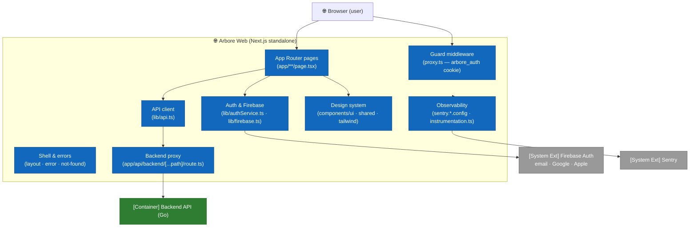

# C4 — Level 3: Web Components

This view opens the **Arbore Web** container (Next.js 13, App Router, React 18, TypeScript) deployed on `web.arbore.app`. The web app is a **companion** to the iOS app: gardens are **created on iOS** (AR placement); the web lets you browse the catalog, your gardens and their plants, a watering calendar, a seasonal guide, and manage your account (GDPR export / deletion).

For the container-level overview, see [`02-containers.md`](02-containers.md). For the backend it consumes, see [`03-components-backend.md`](03-components-backend.md).

## Component topology

## Components

### 1. Pages (App Router)

Routing follows the App Router convention (`web/app/`). The root layout `web/app/layout.tsx` sets `<html lang="fr">`, loads the display font, the "skip to content" link, and the offline banner.

| Area | Pages | Role |
|---|---|---|
| Marketing | `web/app/page.tsx`, `web/app/features/page.tsx`, `web/app/pricing/page.tsx`, `web/app/about/page.tsx` | Landing, features, pricing (free during the beta), about. |
| Auth | `web/app/login/page.tsx`, `web/app/signup/page.tsx` | Sign in / sign up (email + Google & Apple buttons). |
| App | `web/app/welcome/page.tsx`, `web/app/garden/page.tsx`, `web/app/garden/catalogue/page.tsx`, `web/app/garden/plant/[id]/page.tsx`, `web/app/garden/seasons/page.tsx`, `web/app/garden/calendar/page.tsx`, `web/app/garden/history/page.tsx`, `web/app/profile/page.tsx` | Dashboard, gardens, catalog, plant detail, seasons guide, watering calendar and history, profile/GDPR. |

The app pages are client components (`'use client'`): they check the authentication state via `onAuthStateChange` and redirect to `/login` if the user is not signed in.

### 2. Shell & error boundaries

`web/app/error.tsx` (route error, captured to Sentry), `web/app/global-error.tsx` (root layout fallback), and `web/app/not-found.tsx` (404). The shell also exposes `OfflineBanner` and the accessibility link.

### 3. Guard middleware

`web/proxy.ts` runs before rendering and guards the protected prefixes (`/garden`, `/profile`, `/welcome`) based on an `arbore_auth` cookie; it redirects `/login` and `/signup` to `/garden` when the user is already signed in. **It is a UX guard only** — real security is the backend's verification of the Firebase token on every call.

### 4. Backend proxy (key security component)

`web/app/api/backend/[...path]/route.ts` (`runtime = 'nodejs'`) is a **same-origin reverse proxy** to the Go backend:

- reads the **server** environment `BACKEND_API_URL` (default `http://localhost:8080`) and `ARBORE_API_KEY`;
- enforces an **allowlist** of first segments (`users`, `plants`, `gardens`, `consents`, `models`, `config`) and blocks path traversal (`404`);
- explicitly blocks `plants/generate` / `plants/generate-multiple` (AI generation not exposed to the web);
- relays method/body/query, adds `X-API-Key` **server-side**, and forwards the client's `Authorization` header; returns `502` if the backend is unreachable.

The browser therefore only ever calls **its own origin**: no CORS, and the API key never reaches the client.

### 5. API client

`web/lib/api.ts`: `API_URL = '/api/backend'`. `fetchWithAuth` attaches `Content-Type: application/json` and, if a user is signed in, `Authorization: Bearer <Firebase ID token>` (via `getFirebaseToken()`). Typed helpers `apiGet` / `apiSend`; non-2xx errors thrown as `ApiError(status, message)`. The module exports the domain types `Plant`, `PlantFlags`, `Garden`.

### 6. Authentication & Firebase

`web/lib/firebase.ts` initializes the client SDK from the `NEXT_PUBLIC_FIREBASE_*` variables. `web/lib/authService.ts` provides `signUp` / `login` / `logout` / `getFirebaseToken` / `onAuthStateChange`, as well as `signInWithGoogle` / `signInWithApple` (`signInWithPopup`); after each successful sign-in it **upserts the backend user** (`POST /api/backend/users`). An `onIdTokenChanged` handler writes/clears the `arbore_auth` UX cookie consumed by the middleware.

> In production, `NEXT_PUBLIC_FIREBASE_AUTH_DOMAIN` is set to `web.arbore.app` (same-origin auth, `/__/auth/` relayed by nginx) to avoid the OAuth popup's "missing initial state" bug.

### 7. Design system

- **shadcn/ui** (`web/components.json`): ~50 primitives under `web/components/ui/` wrapping **Radix UI** (dialog, dropdown, select, tabs, toast, tooltip…), variants via `class-variance-authority`, `cn()` in `web/lib/utils.ts`.
- **Arbore brand**: palette and radii mirroring the iOS design system in `web/tailwind.config.ts`; `arbore-*` utility classes in `web/app/globals.css`.
- **Shared components**: `web/components/shared/` (`Navbar`, `Footer`, `OfflineBanner`, `AuthLoadingOverlay`, `SectionTitle`…) and home sections `web/components/home/` (`HeroSection`, `QuestionnaireModal`…). Icons via `lucide-react`, animations via `framer-motion`.

### 8. Observability

`@sentry/nextjs` via `web/sentry.client.config.ts`, `web/sentry.server.config.ts`, `web/sentry.edge.config.ts`, loaded (server/edge) by `web/instrumentation.ts`. Everything is **no-op without a DSN**; `tracesSampleRate 0.1`, `sendDefaultPii: false`, no Session Replay. See [`../operations/observability.md`](../operations/observability.md).

## Configuration & build

| Aspect | Detail |
|---|---|
| Framework | Next.js 13 (App Router), React 18, TypeScript, Tailwind. `web/next.config.js`: `output: 'standalone'`, global security headers, no CSP (deferred). |
| Public variables | `NEXT_PUBLIC_FIREBASE_*`, `NEXT_PUBLIC_SENTRY_DSN`, `NEXT_PUBLIC_APP_VERSION` (inlined at build time). |
| Server variables | `BACKEND_API_URL`, `ARBORE_API_KEY` (never prefixed `NEXT_PUBLIC_`). Source of truth: `web/.env.example`. |
| i18n | No i18n framework: **French-only** interface (`<html lang="fr">`); care content is read from the backend's `translations.fr.*`. |
| Docker | `web/Dockerfile` multi-stage `node:20-alpine` → `standalone` image (non-root, `:3000`). |

## Key points

- **Security via the server proxy**: the API key and backend URL stay server-side; the browser only sees `/api/backend`.
- **The web does not create gardens**: creation goes through iOS AR; the web reads/edits existing gardens and watering state (local `localStorage` persistence for the calendar/history).
- **iOS/web brand parity**: same palette, same radii and shadows for a consistent experience.

## Out of scope for this view

- The backend it consumes is documented in [`03-components-backend.md`](03-components-backend.md).
- Web tests (Vitest) are described in [`../testing/web.md`](../testing/web.md).
- Deployment (Docker Compose, nginx, Cloudflare) is documented in [`../operations/vps-bootstrap.md`](../operations/vps-bootstrap.md).
