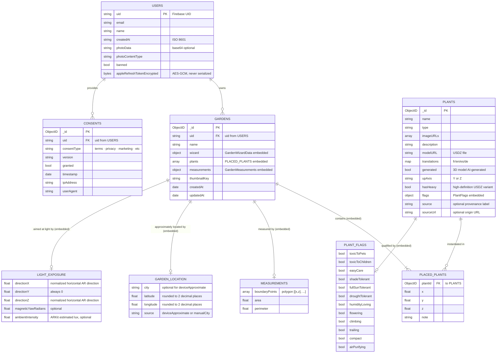

# Data Model — MongoDB

This view describes the schema of the MongoDB collections used by Arbore. The Go backend is the **only** direct consumer of this database; the iOS app and the web front necessarily go through the REST API.

The schema is deliberately **denormalized** in certain respects (embedded plant translations, placed plants embedded in the garden) in order to reduce the number of Mongo round-trips during API calls. No referential integrity constraint is enforced by Mongo: consistency is ensured at the application level by the backend.

There are **four collections**: `users`, `plants`, `gardens`, `consents`. Two physical databases are selected per request (`arbore` in prod, `arbore_test` in test) according to the selector set by the API key.

## ER Diagram



## Collections

### `users`

Document representing an authenticated user. The functional key is `uid` (Firebase UID), not the Mongo `_id`.

| Field | Type | Notes |
|---|---|---|
| `uid` | string | Firebase UID. Functional key for all `bson.M{"uid": ...}` filters. |
| `email` | string | Email provided by Firebase Auth. |
| `name` | string | Display name. Editable via `PATCH /users/me` (#138). |
| `createdAt` | string | Signup date in ISO 8601 format (stored as a **string**, not a BSON date). |
| `photoData` | string (optional) | Profile photo as base64. Source of truth. |
| `photoContentType` | string (optional) | Associated MIME type. |
| `banned` | bool | Moderation flag checked by the Firebase middleware on every request. |
| `appleRefreshTokenEncrypted` | bytes (optional) | Apple refresh token encrypted with **AES-256-GCM**. `json:"-"` — **never** serialized to clients; `nil` if the user has never used Sign in with Apple. Written by `linkAppleAccount`, read by `deleteUser` for revocation (#210). |

### `plants`

Plant catalog document. Each plant embeds its multilingual translations so that a single `findOne` retrieves all the information.

| Field | Type | Notes |
|---|---|---|
| `_id` | ObjectID | Primary key. Referenced by `PlacedPlant.plantId`. |
| `name` | string | Canonical name. |
| `type` | string | Plant family / type. |
| `imageURLs` | array<string> | Photos (Unsplash) via `fetchUnsplashImageURLs`. |
| `description` | string | Description in French (served by default). |
| `modelURL` | string | USDZ file name served by `GET /models/:filename`. |
| `translations` | map<lang, LanguageData> | Sub-document per language (`fr`, `en`, `es`, `de`). |
| `generated` | bool (optional) | `true` if the 3D model is AI-generated (BETA badge, #84). |
| `upAxis` | string (optional) | `"Y"` or `"Z"` — rotation applied at load time (#89). |
| `hasHeavy` | bool (optional) | `true` if a **high-definition** USDZ variant exists (served via `?lod=heavy`). Drives the LOD swap in AR — see [`../3d-lod-architecture.md`](../3d-lod-architecture.md). |
| `flags` | `PlantFlags` (optional) | Structured recommendation flags (see below). `nil` on legacy plants. |
| `source` | string (optional) | Optional provenance label (curated catalog vs legacy/beta entries). |
| `sourceUrl` | string (optional) | Optional origin URL, kept for later updates. |

The `translations[lang]` sub-document (type `LanguageData`) groups:

```
LanguageData {
  description, plantType,
  sun: {lightType, durationPerDay, orientation, windowDistance, recommendedRooms, tips},
  water: {frequency, amount, method, humidity, signsLack, signsExcess, recommendedWater},
  soilAndPot: {substrate, drainage, potSize, repotFrequency, repotSigns},
  health: {commonProblems, symptomsAndCauses, pests, treatments, prevention},
  lifeCycle: {growth, flowering, dormancy, fertilizer, pruning},
  care: {weekly, monthly, yearly, extraTips}
}
```

#### `PlantFlags` sub-document

Twelve booleans that drive the **wizard recommendation** (filtering + scoring). This is where the **toxicity** data lives: there is no separate "toxicity" field, it is represented by `toxicToPets` and `toxicToChildren`. The `flags` object is optional (`nil` on legacy plants; the client then falls back on keyword heuristics).

| Flag | Meaning |
|---|---|
| `toxicToPets` | Toxic to pets. |
| `toxicToChildren` | Toxic to children. |
| `easyCare` | Easy to care for. |
| `shadeTolerant` | Tolerates shade. |
| `fullSunTolerant` | Tolerates full sun. |
| `droughtTolerant` | Tolerates drought. |
| `humidityLoving` | Loves humidity. |
| `flowering` | Flowering plant. |
| `climbing` | Climbing. |
| `trailing` | Trailing. |
| `compact` | Compact size. |
| `airPurifying` | Air-purifying. |

### `gardens`

Document representing a garden created by a user. Placed plants are **embedded** — reading an entire garden costs only one `findOne`.

| Field | Type | Notes |
|---|---|---|
| `_id` | ObjectID | Primary key. |
| `uid` | string | Owner UID (logical FK to `users.uid`). Set server-side from the token, filtered in all CRUD operations. |
| `name` | string | Display name. |
| `wizard` | `GardenWizardData` | Wizard choices, scan method, optional exposure capture, approximate location, conditional answers, and optional space profile. |
| `plants` | array<`PlacedPlant`> | Placed plants (see below). |
| `measurements` | `GardenMeasurements` (optional) | Geometry of the room/garden traced in AR: `boundaryPoints` (polygon), `area`, `perimeter`. Accepted on creation and on update. |
| `thumbnailKey` | string (optional) | Image key for the garden thumbnail on the home screen. |
| `createdAt`, `updatedAt` | date | Timestamps managed by the backend (`updateGarden` updates `updatedAt`). |

Optional `wizard.location` sub-document (`GardenLocationData`):

| Field | Type | Notes |
|---|---|---|
| `city` | string (optional) | City from approximate reverse geocoding or manual input. |
| `latitude`, `longitude` | float (optional) | Device coordinates rounded to two decimal places on iOS before transmission; absent for manual input. |
| `source` | string | `deviceApproximate` or `manualCity`. |

The model deliberately has no exact-address field. The backend only persists the already-minimized DTO sent by the client.

`state.location` is reset whenever a new garden starts. After the scan, the app performs a new one-shot measurement or asks for a new city; it never copies the location of another garden.

Optional `wizard.lightExposure` sub-document (`GardenLightExposureData`), collected only for a room, balcony, or terrace:

| Field | Type | Notes |
|---|---|---|
| `directionX`, `directionY`, `directionZ` | float | Direction aimed at by the camera in the scan's AR frame, projected and normalized horizontally (`directionY = 0`). |
| `magneticYawRadians` | float (optional) | Yaw relative to magnetic north when Core Motion provides that reference frame. |
| `ambientIntensity` | float (optional) | Instantaneous ambient-light estimate supplied by `ARLightEstimate`, in lux. |

The AR direction and magnetic yaw connect the measured geometry to a real-world orientation. The light value is a point-in-time signal, not a lasting sunlight measurement.

Optional `wizard.conditionalAnswers` sub-document (`GardenConditionalAnswersData`), declared after location:

| Field | Values | Context |
|---|---|---|
| `plantingMode` | `inGround`, `containers`, `both` | Garden. |
| `drainage` | `fast`, `normal`, `slow` | Garden, water behaviour after heavy rain. |
| `windExposure` | `sheltered`, `sometimesWindy`, `veryExposed` | Balcony or terrace. |
| `containerProject` | `existingPots`, `newComposition`, `both` | Balcony or terrace. |
| `indoorHumidity` | `dry`, `normal`, `humid` | Room. |
| `nearbyHeat` | `none`, `radiator`, `underfloorHeating` | Room. |

Pets and young children remain in the historical `wizard.safety` field to preserve existing toxicity filtering. A skipped question or “I don't know” is never encoded; the complete sub-document stays absent when no answer is known.

Optional `wizard.siteProfile` sub-document (`GardenSiteProfileData`), edited from the 2D plan:

| Field | Type | Notes |
|---|---|---|
| `orientation` | `GardenOrientationData` (optional) | 0–360° direction, with 0° = north. |
| `sunlight` | `GardenSunlightData` (optional) | `minimumHours` / `maximumHours` range. |
| `wind` | `GardenWindData` (optional) | `sheltered`, `light`, `moderate`, or `strong`. |
| `availableHeight` | `GardenAvailableHeightData` (optional) | Height in metres, declared until it can be measured. |
| `plantingZones` | array<`GardenPlantingZoneData`> | Named and excludable X/Y/Z polygons in the outline's coordinate frame. |

Every value has `metadata` with a `source` (`measured`, `inferred`, `declared`, `regionalEstimate`) and `confidence` (`high`, `medium`, `low`). Fields remain absent until real data is available; the interface does not fabricate replacement values.

`PlacedPlant` sub-document:

| Field | Type | Notes |
|---|---|---|
| `plantId` | ObjectID | FK to `plants._id`. |
| `x`, `y`, `z` | float | 3D position **in the garden's coordinate frame** (not the ARKit world frame, local-only iOS). |
| `note` | string (optional) | Free-form note. |

⚠️ **Current limitation**: the 3D position persisted server-side includes neither rotation nor scale. The real 4×4 transforms live only in the local `scene_{id}.json` on the iOS side (#114).

### `consents` — GDPR

Append-only audit trail. An entry is created on every action (accept/decline), never modified.

| Field | Type | Notes |
|---|---|---|
| `_id` | ObjectID | Primary key. |
| `uid` | string | User UID (logical FK to `users.uid`). |
| `consentType` | string | `"terms"`, `"privacy"`, `"marketing"`, etc. (#67). |
| `version` | string | Version of the consent document presented. |
| `granted` | bool | `true` if accepted, `false` if declined/withdrawn. |
| `timestamp` | date | Auto-set to `time.Now()` if absent. |
| `ipAddress` | string | **Always cleared** by `recordConsent`: the IP is not needed to prove consent and would add personal data to the database. The field remains in the schema for historical documents. |
| `userAgent` | string | Auto-set to the User-Agent if absent. |

## Indexes

Declared in `indexes.go` (`requiredIndexes`) and created at startup by `ensureIndexesAtStartup()`, on the production database **and** on `arbore_test`. The operation is idempotent, and a failure is logged without blocking startup (without indexes the API still works, only slower).

| Collection | Index | Used for |
|---|---|---|
| `users` | `{uid: 1}` **unique** | Ban check on **every authenticated request** (`checkUserBannedFromDB`) + profile reads/writes, and the **structural guarantee of account uniqueness** |
| `gardens` | `{uid: 1, updatedAt: -1}` | `listGardens` (filter `uid` + sort `updatedAt`); also acts as a prefix for queries on `uid` alone |
| `consents` | `{uid: 1, timestamp: -1}` | `getUserConsents` / `getLatestUserConsents` (filter `uid` + sort `timestamp`) |

Before these indexes, the only indexed collection was indexed on `_id`: every authenticated request triggered a **full collection scan** of `users` (audit #338, finding 7).

> ✅ **`users.uid` is unique.** Two complementary protections, and both are needed: `createUser` as an **upsert** avoids creating duplicates, but only the **unique index** makes duplication impossible — including for a script, a manual write, or a future code path that forgets the rule (audit #338, finding 1).
>
> **History.** `createUser` performed an unconditional `InsertOne` and `deleteUser` a `DeleteOne`: production held 30 documents for 7 uids, and deleting an account left personal data behind while the Firebase identity was removed. Migration applied on 2026-07-26 via `ArboreBackend/scripts/dedupe-users.js`: **48 → 25 documents, 0 duplicates, no user lost**.
>
> **Merge rule**: field missing/empty → the non-empty value wins; two differing non-empty values → the most recent wins; `createdAt` → the oldest; `banned` → `true` if any copy is. The survivor is the document with the oldest `_id`.
>
> This rule is deliberately not "keep the most recent copy", and that is not a detail: measured in production, **2 of the 7 duplicated accounts carried their `appleRefreshTokenEncrypted` only on their oldest copy**. Losing it would have made Apple account revocation impossible on deletion (Guideline 5.1.1(v), see #210).
>
> ⚠️ **Changing the options of an existing index is not possible in place.** MongoDB returns `IndexOptionsConflict` (code 85). `ensureIndexes` therefore does **not** attempt to replace the index automatically: a `drop` followed by a failing `create` would leave the collection with no index at all, hence a full scan on every authenticated request. The log prints the `dropIndex`/`createIndex` command to run instead, once duplicates are gone.

`plants` is not indexed: its only lookup by name (`generateAndInsertPlant`) is a case-insensitive regex, which a classic index cannot use efficiently. If that path becomes hot, the right answer is an indexed `nameNormalized` field.

## Relations between collections

All relations are **logical** (by `uid` or `ObjectID`), none is enforced by Mongo. Consistency relies on:

- `deleteUser`, which deletes **in cascade**: gardens → consents → (best-effort Apple revocation if `appleRefreshTokenEncrypted` present) → user.
- The `bson.M{"_id": id, "uid": uid}` filters, which guarantee ownership on garden update/delete.
- The `uid` always injected from the token, never accepted from the body.
- `exportUserData` (GDPR art. 20), which aggregates user + gardens + consents, but **excludes** `appleRefreshTokenEncrypted`.

## Note — documents in test mode

Insertions through the **test** database selector are tagged by `maybeLabelTestDoc` with two out-of-schema fields: `_test: true` and `_createdAtUTC`. These fields **never** appear in production documents and are not part of any Go struct; they enable safe cleanup of the test database.

## Out of scope for this view

- The plant generation pipeline (`generateAndInsertPlant`) belongs to [`03-components-backend.md`](03-components-backend.md).
- The local iOS files (`scene_{id}.json`, `worldmap_{id}.arworldmap`) are client-specific and do not appear in Mongo — see [`03-components-ios.md`](03-components-ios.md).
- The signup and garden save sequences are documented in [`../flows/`](../flows/).
