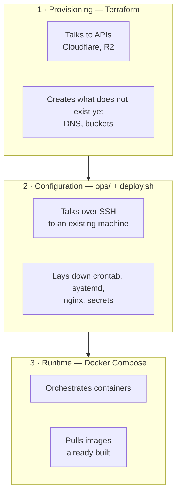
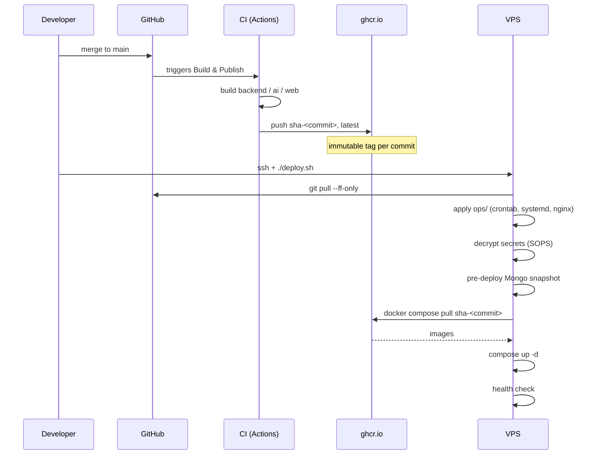
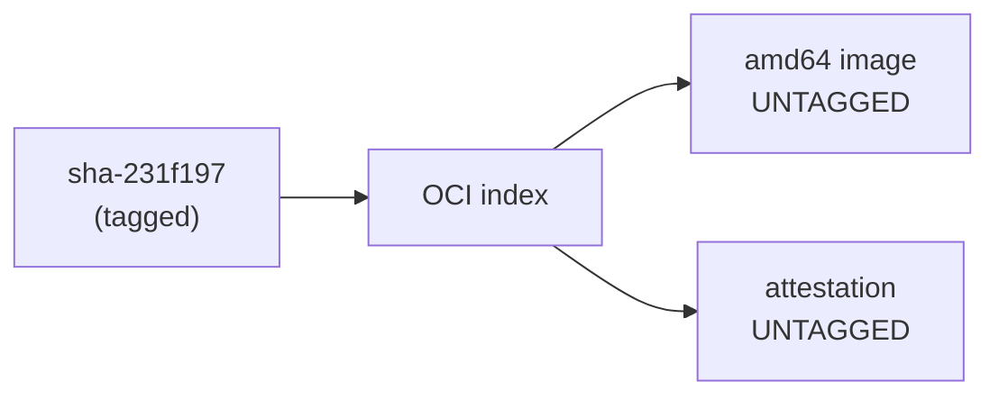
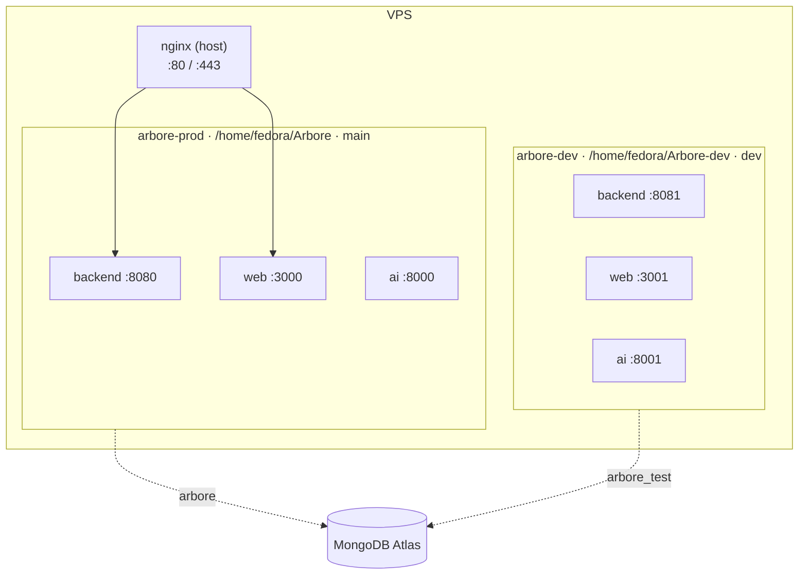
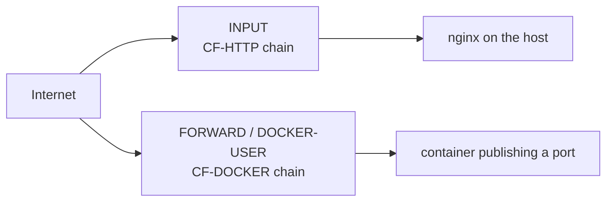

# C4 — Deployment view: infrastructure and operations

This view describes **how code becomes a running service**, and what guarantees
we know which one is running.

For the containers themselves, see [`02-containers.md`](02-containers.md).

## The principle

> **The repository is the complete definition of a deployment.**
>
> `git clone`, supply the secrets, run the deployment with an environment type —
> everything comes up, with no command typed by hand afterwards.

This principle has one consequence that governs everything else: **no
configuration may exist only on a machine**. What lives only there drifts with
nothing to signal it, and the documentation describing it drifts along.

The historical proof: `vps-bootstrap.md` documented *one* cron when the VPS had
*two*. The drift survived for months, discovered by accident while running
`crontab -l` to install a third.

---

## The three layers

They differ by **the channel they use**, and that distinction is why they cannot
be merged.



| Layer | Channel | Creates / changes |
|---|---|---|
| **Terraform** | provider API | the machine, DNS, the bucket |
| **`ops/` + `deploy.sh`** | SSH to a machine that exists | packages, crontab, systemd, nginx, secrets |
| **Docker Compose** | local Docker daemon | application containers |

> **Terraform never connects to a machine.** It clicks the dashboard buttons for
> you, through the same API. SSH access is of no use to it — it is the wrong
> kind of access.

Wiring one into the other through a `provisioner "remote-exec"` is an
anti-pattern: a provisioner only runs at creation, never replays, and detects no
drift.

---

## A commit's journey to production



**The VPS no longer compiles anything.** It previously ran three builds on every
deployment — ten minutes of CPU and several GB of intermediate layers on an
already tight disk — to redo what CI had just produced.

### The fallback is deliberate, and loud

If ghcr is unreachable or the image missing, `deploy.sh` **builds locally** and
says so. A deployment must not depend on a registry's availability; but it must
never drift in silence.

---

## Image tagging

| Tag | Scope | Lifetime |
|---|---|---|
| `sha-<full commit>` | every push to `main` or `dev` | last 10 per package |
| `1.2.3`, `1.2` | git tag `v*` | **indefinite** |
| `latest` | default branch only | moving |
| `main`, `dev`, `pr-42` | branch or PR | moving |

The **full SHA** is required: `deploy.sh` pulls `sha-$(git rev-parse HEAD)`. A
short SHA would match nothing and the deployment would silently fall back to a
local build.

`latest` is restricted to the default branch. Without that guard, publishing
from `dev` would move the tag and the manual fallback `docker pull …:latest`
would serve something other than production.

### Purge and retention

One trap is worth knowing, because it costs production:

> **"Untagged" does not mean "deletable".**
>
> A tag does not carry the image: it carries an **index** that references the
> image and its provenance attestation, **both untagged**.



The `delete-only-untagged-versions: true` option — the one every example
suggests — would delete the image serving production and leave an index pointing
at nothing.

`scripts/purge-package-versions.py` therefore walks into every **tagged**
manifest to build the protected set. Four guards, taken from the reconciliation
job: dry-run by default, fail-closed, refusal if no tagged version is found, and
exclusion of the commit read from `GET /health`.

---

## Environments

Two independent stacks on one machine. They share the kernel, the disk and the
Firebase project; they share **neither the version, nor the ports, nor the
environment file**.



**One git checkout per environment is required, not a convenience.**
`deploy.sh` derives the image tag from `git rev-parse HEAD`: a shared checkout
would deploy the same commit on both sides, defeating the point of having two
environments.

**A non-primary environment does not touch host configuration.** The crontab is
rendered with the current checkout path: applied from `Arbore-dev`, it would
point production's jobs at that directory, the reconciliation job included.

Operational detail in [`../operations/vps-bootstrap.md`](../operations/vps-bootstrap.md).

---

## Secrets

Encrypted in the repository with **SOPS + age**. SOPS encrypts **values** and
leaves **keys** readable: the inventory is versioned and reviewable in a PR, the
values are not.

```
GHCR_TOKEN=ENC[AES256_GCM,data:rcfZ…]
```

One age key per environment. `apply_secrets` decrypts at deployment time into
the environment file and `arbore-data/secrets/`.

**Without a private key the deployment continues** with the configuration in
place. A machine without a key must deploy as before, not fail.

### Secret zero

One secret cannot live in the repository: **the age key**, since it is what
decrypts the others.

> Automation does not create trust, it propagates it. The manual step never
> disappears: it moves up one level and amortises.

| | Manual steps |
|---|---|
| Machine without identity, N machines | **N** — one key placement per machine |
| Cloud with instance identity | **1, once** — the account credentials |

On a cloud the instance reads its secrets through its identity, and SOPS accepts
**AWS KMS** as an additional recipient — `.sops.yaml` gains one line, nothing is
rewritten.

⚠️ **Terraform must never carry the age key.** The value would land in the state
in plaintext. It declares *"this instance may read this secret"*, never the
secret.

---

## Network and origin firewall

The origin accepts `:80` and `:443` only from Cloudflare ranges. That lock
covers **two distinct paths**, and this is the easiest point to miss:



> Traffic destined for a **container** does not traverse `INPUT`. Protecting
> only `INPUT` would leave the origin open as soon as a service moved into a
> container — with no error, the site continuing to work.

In `DOCKER-USER` you need **`RETURN`**, not `ACCEPT`: an `ACCEPT` is terminal
for the whole `FORWARD` hook and would short-circuit Docker's own rules.

---

## What is guaranteed, and how to verify it

| Guarantee | Verification |
|---|---|
| Production serves the expected commit | `curl -s https://api.arbore.app/health \| jq -r .commit` |
| DNS and the R2 bucket match the declaration | `terraform plan` — exit code 0 |
| The origin stays closed to direct access | TCP connection to the IP on `:443` from outside |
| The two environments are independent | `/health` on `:8080` and `:8081` — distinct commits |
| Nothing was built on the VPS | "Images tirées depuis ghcr" in the log |

---

## What is deliberately not automated

| | Why |
|---|---|
| **The deployment itself** | it remains a decided act. Making it automatic is tracked in #430, and requires alerting first |
| **Placing the age key** | secret zero — irreducible without machine identity |
| **Creating Firebase projects** | the §1 criterion targets deployment, not the initial creation of a provider account |
| **Deleting an entire package** | a one-off, irreversible operation; giving a weekly script that capability would be a bad trade |

---

## References

- [#401](https://github.com/ArboreTeam/Arbore/issues/401) — parent issue: make the repository deployable to N environments
- [#341](https://github.com/ArboreTeam/Arbore/issues/341) — the undetected drift that started this
- [#425](https://github.com/ArboreTeam/Arbore/issues/425) — image pulling
- [#427](https://github.com/ArboreTeam/Arbore/pull/427) — Terraform declaration
- [#434](https://github.com/ArboreTeam/Arbore/issues/434) — second stack
- [#442](https://github.com/ArboreTeam/Arbore/issues/442) — purge and retention
- [`../operations/vps-bootstrap.md`](../operations/vps-bootstrap.md) — procedures
- [`../operations/asset-storage.md`](../operations/asset-storage.md) — R2 and MinIO
