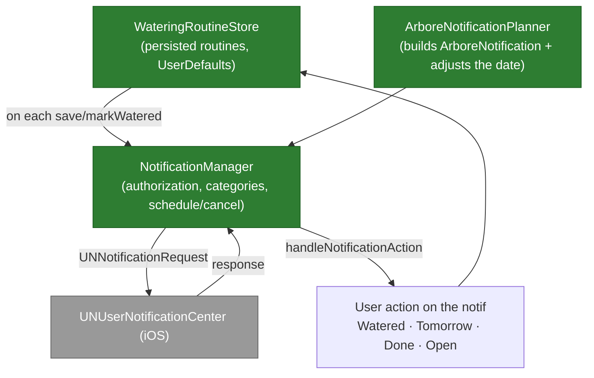

# Component — Local notifications

Arbore schedules **local notifications** (`UNUserNotificationCenter`) to remind the user to **water** their plants, perform a **care task** (repot, prune, fertilize…), and for a few nudges (unfinished garden, climate alert). **No remote notifications (push/APNs)**: the push infrastructure was removed, everything is scheduled on-device.

Files: `NotificationManager.swift` (system access + scheduling), `ArboreNotificationPlanner.swift` (notification building + adjustments), `ArboreNotification.swift` (model + trigger + deep-link), `WateringRoutine.swift` (routines + `WateringRoutineStore`).

## Overview

## Components

| File / type | Role |
|---|---|
| `NotificationManager` | Requests authorization (`requestAuthorization`, alert/badge/sound, provisional supported), exposes state (`currentAuthorizationState`), registers the **categories** (watering, care, climate emergency) with their actions, and schedules/cancels `UNNotificationRequest`. `handleNotificationAction` routes actions to `WateringRoutineStore`. |
| `ArboreNotificationPlanner` | Builds an `ArboreNotification` from a `WateringRoutine`/`PlantCareRoutine` (title, contextual body, category, schedule, deep-link, metadata). Computes the **adjusted watering date**. Provides stable identifiers (`watering.<id>`, `care.<id>`, `project-completion.<id>`). |
| `ArboreNotification` + `ArboreNotificationSchedule` | Neutral model → `UNNotificationTrigger`: `.date` / `.timeInterval` / `.calendar`. Carries a `NotificationRoute` (deep-link to the garden/task) and `metadata` (routineId, plantId, gardenId). |
| `WateringRoutine` / `PlantCareRoutine` / `WateringRoutineStore` | Watering and care routines, persisted in `UserDefaults`. On each create/`markWatered`/`defer`, the store **re-syncs** the matching notification. |

## Smart watering-date adjustment

`adjustedWateringDate` shifts the next date based on context (within a bounded window):
- **Care profile**: high water need → −1 day; low → +1 day; preferred-interval gap clamped to ±2 days.
- **Weather** (if available): heat ≥ 30 °C → −1 day; dry air (humidity < 35%) → −1 day; outdoors with likely rain (≥ 65%) → +1 day; frost risk + sensitive species → +1 day.
- Guard: never before `now + 60 s`.

The notification body is contextualized too (water amount, heat/dry-air alert, routine notes).

## Quick actions

From a notification, without opening the app:
- **Watered** (`markWatered`) → marks the routine watered, reschedules the next one.
- **Done** (`markCareDone`) → completes the care task.
- **Tomorrow** (`deferTomorrow`) → defers by one day.
- **Open** → deep-link to the garden/task.

`rescheduleAllRoutineNotifications` (on launch/refresh) reschedules all active routines, and `cancelObsoleteRoutineNotifications` purges those whose routine no longer exists.

## Key points

- **100% local**: no network or server dependency; works offline. The `remote-notification` background mode was removed from `Info.plist` (no more push).
- **Idempotent**: each routine has a stable identifier → rescheduling replaces the existing notification (no duplicates).
- **Persistence**: routines live in `UserDefaults` (not yet synced cross-device — see backlog).
- **Tests**: the planner's pure logic (identifiers, `adjustedWateringDate`, notification building) is covered by `ArboreNotificationPlannerTests.swift` (see [`../testing/ios.md`](../testing/ios.md)).
