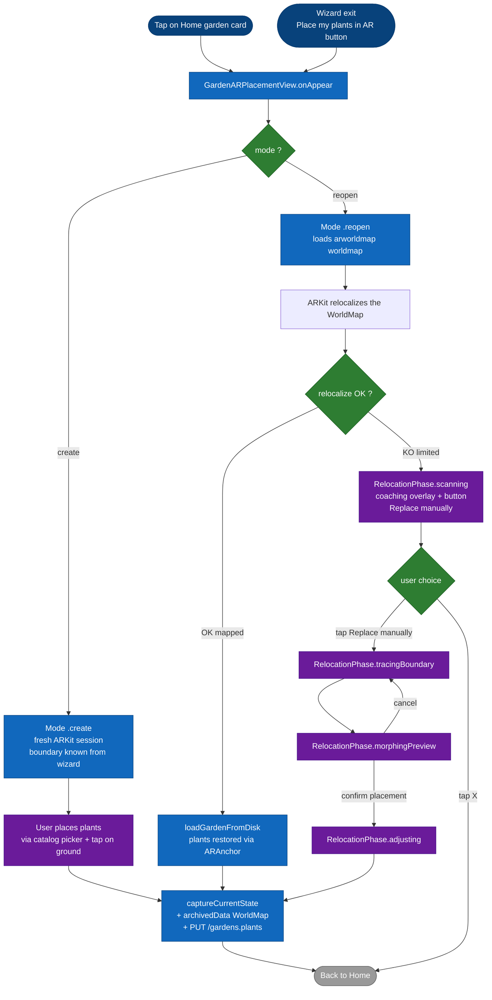

# Flow — AR placement (creation and reopening)

This document describes the **complete flow for opening the AR view** that lets the user place plants in augmented reality. There are two main entry points: creating a brand-new garden (from the wizard) and reopening an existing garden (from the Home). The reference code is `ARGarden/GardenARPlacementView.swift`.

## Overview

| Mode | Entry point | Behavior |
|---|---|---|
| `.create` | Wizard exit → `ARViewContainerMeasure` (perimeter) **or** `LiDARScanWizardView` (LiDAR) | Starts a fresh ARKit session, the user places plants manually, final save via `Valider`. |
| `.reopen` | Tap on a garden card on the Home | Attempts to relocalize the saved `ARWorldMap`. On failure, manual replace (#111) takes over. |

The switch between these two modes is driven by the [`RelocationPhase`](../state-machines/relocation-phase.md) state machine, documented separately.

## Diagram

## Mode `.create` — new session creation

Entry happens from the wizard exit (see [`garden-creation.md`](garden-creation.md)). The AR view already receives:

- `selectedPlants: [Plant]` — the set of plants chosen by the user.
- `boundaryPoints: [SIMD3<Float>]` — the ground polygon traced in non-LiDAR mode.
- `measurementWorldMapId: String?` — UUID populated if the scan was done in LiDAR (the WorldMap has already been saved by `LiDARScanWizardView` at the path `worldmap_{measurementWorldMapId}.arworldmap`).
- `mode: .create`.

**Behavior**:

1. `ARSession` started fresh (no relocalization to attempt).
2. The boundary is drawn on the ground as blue cylinders.
3. The user opens the **catalog picker** via the **+** button, taps on the ground to place a plant, and can drag/scale/rotate it.
4. **Valider** button: the current WorldMap is archived, the `scene_{id}.json` is written, and `PUT /gardens/:id` sends the plant state to the backend.
5. Back to Home with success feedback.

At this stage, `RelocationPhase` stays at its initial value `.scanning`, but no manual-replace overlay appears — the machine is not relevant in `.create` mode.

## Mode `.reopen` — reopening an existing garden

Entry happens from the Home, tapping on a garden card. The AR view receives:

- `existingGardenId: String` — the Mongo garden ID.
- `mode: .reopen`.

**Behavior**:

1. `onAppear` loads in parallel:
   - The WorldMap from disk (`GardenLocalStore.worldMapURL(for: id)`).
   - The scene JSON (plant positions) from disk.
2. `ARSession` is started with `initialWorldMap` set to the loaded WorldMap → ARKit enters **relocalization** mode.
3. The coaching overlay (`ScanningCoachingOverlay` component) is shown at the bottom of the screen, **non-blocking**: the user sees the camera and can move their phone.
4. ARKit launches a relocalization thread that runs as long as `frame.camera.trackingState != .normal`.

From here, two paths are possible.

### Nominal path: relocalization succeeds

`session(_:didUpdate:)` detects that the WorldMap has switched to the `.mapped` state:

1. `loadGardenFromDisk` is called. It restores:
   - Each plant via its `ARAnchor` read from the WorldMap (the anchors resume their exact position).
   - The USDZ models from `ModelCacheManager` (already cached on disk, no re-download).
2. The view switches to edit mode: the user can modify positions and add/remove plants via the picker.
3. On validation, the same save flow as `.create`.

This path is the fastest in UX (a few seconds for relocalization if the lighting is similar).

### Degraded path: relocalization fails

If after a few seconds the WorldMap stays in `.limited` (lighting change between sessions, modified environment — see issue #96), the coaching overlay remains displayed with the **"Replace manually"** button accessible.

At that point, two options for the user:

| Action | Effect |
|---|---|
| Keep waiting / moving the phone | ARKit `relocalize` may still succeed if the lighting becomes compatible. If it never does, the machine stays at `.scanning`. |
| Tap **"Replace manually"** | `enterManualReplacement()` → the [`RelocationPhase`](../state-machines/relocation-phase.md) machine switches to `.tracingBoundary` and the manual flow takes over. |
| Tap X | Full dismiss, back to Home with no changes to the garden. |

Once manual replace is launched (`tracingBoundary` → `morphingPreview` → `adjusting`), the end of the flow rejoins the common save path.

## Final save

Whatever the origin of the flow (`create`, nominal `reopen`, `reopen` manual replace), the final validation calls `captureCurrentState`, which:

1. Iterates over the plant nodes and reads their 4×4 transform. For each plant:
   - If a drag/teleport override is present in `pendingDragTransform[uuid]`, it is used (issue #138 — guarantees that the user's last gesture is persisted even if `rebaseAnchorAtCurrentPosition` fails silently).
   - Otherwise, it reads the transform of the associated `ARAnchor`.
   - As a last resort, it reads `node.simdWorldTransform` directly.
2. Archives the current `ARWorldMap` via `NSKeyedArchiver` and writes it to disk (`worldmap_{id}.arworldmap`).
3. Serializes the scene JSON (positions, models, scales) and writes it to disk (`scene_{id}.json`).
4. Emits a `PUT /gardens/:id` with the updated positions (the `plants[]` field of the `gardens` document).

After the save, `pendingDragTransform` is purged and the view closes.

## Edge cases

| Situation | Behavior |
|---|---|
| **First launch, freshly installed app, garden created on an old device** | No `worldmap_{id}.arworldmap` file exists on the new device. Relocalization is impossible. → Issue #114: reconstruction from the backend, planned for Sprint 3+. |
| **Plant whose USDZ model is not downloaded** | `ModelCacheManager` downloads in the background. The plant appears as a placeholder (gray sphere), then is replaced by the real model when available. |
| **Camera permission denied** | iOS blocks the opening of `ARSession`. The view shows an error state with a button to open Settings. |
| **Device without LiDAR opening a garden created with LiDAR** | The LiDAR WorldMap contains highly densified planes. Relocalization is still possible but with degraded quality. No special support as of today. |
| **App backgrounded for 30+ seconds** | ARKit loses tracking. On return, `session(_:didUpdate:)` detects `.limited` and the coaching overlay may reappear if in `.reopen` mode. |

## Available gestures

| Gesture | Effect |
|---|---|
| Tap on a plant (`.adjusting` mode or normal editing) | Selects the plant, shows the pulsing green ring. |
| Tap on the ground with a plant selected | Teleports the plant to the raycast position. |
| Long-press + drag | Moves the plant continuously. |
| Pinch | Scales (if allowed for the plant). |
| Two-finger rotate | Rotation around the Y axis. |

## Out of scope for this flow

- The details of the `RelocationPhase` state machine (transitions, guards, cancel behavior) are documented in [`../state-machines/relocation-phase.md`](../state-machines/relocation-phase.md).
- The mathematical details of MVC morphing are in `ManualReplacement/MeanValueCoordinates.swift` (pure math, testable in isolation).
- The complete **per-screen spec** of `GardenARPlacementView` (including the inventory of its internal widgets and overlays) will be added in Phase 4 under `docs/screens/garden-ar-placement.md`.
- The backend spec for the save (`PUT /gardens/:id`) is in [`../architecture/03-components-backend.md`](../architecture/03-components-backend.md).
