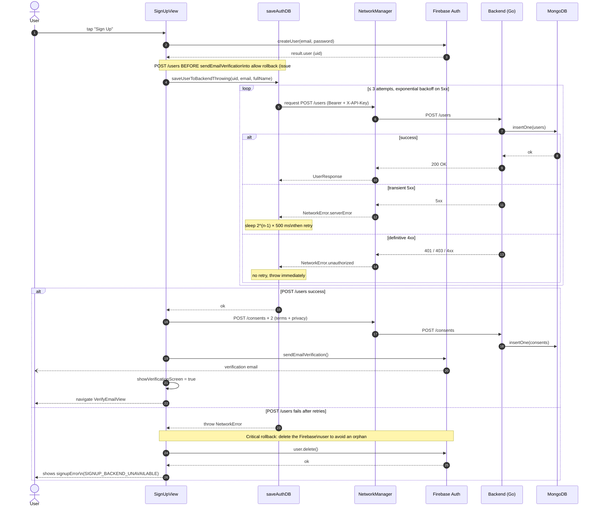

# Flow — User signup

This document describes the **complete signup flow** for a user, from the form in `SignUpView` through to the email verification screen. The critical contract carried by this flow: no Firebase user must exist without its associated MongoDB document. Consistency is ensured by an **explicit rollback** on the iOS side if the backend registration fails (issue #137).

## Overview

| Step | Actor | System |
|---|---|---|
| Enter email / password / name | User | iOS — `SignUpView` |
| Create Firebase account | iOS | Firebase Auth |
| Register user document | iOS | Go Backend → MongoDB Atlas |
| Register initial GDPR consents | iOS | Go Backend → MongoDB Atlas |
| Send verification email | Firebase | Firebase Auth (asynchronous) |
| Navigate to `VerifyEmailView` | iOS | — |

## Sequence diagram

The diagram covers both the nominal path **and** the rollback if `POST /users` fails. The message labels reflect the relevant Swift functions and Go endpoints.



## Step-by-step details

### 1. Firebase Auth account creation

`Auth.auth().createUser(withEmail:password:)` creates the Firebase account. The returned `uid` becomes the functional identifier used everywhere in the backend (never the Mongo `_id`).

**Errors handled specifically**:

- `emailAlreadyInUse` → `resendVerificationForExistingAccount` is called. If the account exists but is not verified, a new verification email is sent. Otherwise, the error message "This email is already verified. Please log in." is shown.
- Any other Firebase error → `signUpError` is set with `error.localizedDescription`, and the flow stops.

### 2. `POST /users` with exponential retry and rollback

Implemented in `saveUserToBackendThrowing` (file `LoginAuth/saveAuthDB.swift`).

| HTTP code | Behavior |
|---|---|
| `200` | Success, the flow continues. |
| `5xx` | Retry with exponential backoff: 500 ms, 1 s, 2 s. Maximum 3 attempts. |
| `401` / `403` | Definitive failure, throw immediately (likely an invalid API key or corrupted token — a retry would not help). |
| Other `4xx` | Definitive failure, throw immediately. |

**Transient classification heuristic**: `isTransient(error)` returns `true` if the error message contains `"Status code: 5"`. This logic is fragile and will be revisited once the backend returns structured error codes (issue to be created if needed).

### 3. Firebase rollback on definitive failure

This is the **critical point** introduced by issue #137. Without this rollback, the `apple-review@arbore.app` account created during the API key rotation had remained orphaned (Firebase OK, Mongo KO). From now on:

```swift
do {
    try await user.delete()
    print("🧹 Firebase user deleted (rollback)")
} catch {
    print("⚠️ Firebase rollback failed — the user will need to try again later")
}
```

The user then sees a localized message (`SIGNUP_BACKEND_UNAVAILABLE`, `SIGNUP_BACKEND_UNAUTHORIZED` or `SIGNUP_BACKEND_AUTH_ISSUE` depending on the error type) and can retry their signup with the same email — since the Firebase account has been deleted, there is no longer any collision.

### 4. Initial consents (GDPR)

`recordInitialConsents(uid:acceptedTerms:acceptedPrivacy:)` sends two `POST /consents` (one per type). This is **best-effort**: a failure does not cancel the signup, but is logged. GDPR traceability relies on the guarantee that these calls are made; a reconciliation mechanism may be added if logs show recurring failures.

### 5. Asynchronous email verification

`user.sendEmailVerification` is called after the successful `POST /users` (and not before — this is intentional). This guarantees that the user is never prompted to verify their email before their Mongo document exists.

The verification email is asynchronous on the Firebase side. The user lands on `VerifyEmailView`, which offers a **"Resend"** button wired directly to `sendEmailVerification()`.

## Edge cases and errors

| Situation | Behavior |
|---|---|
| Backend fully down (network timeout) | 3 retries with backoff, then Firebase rollback. The user sees `SIGNUP_BACKEND_UNAVAILABLE`. |
| API key stale after a server-side rotation | Backend returns `401 INVALID_API_KEY`. Immediate Firebase rollback, message `SIGNUP_BACKEND_UNAUTHORIZED`. |
| Invalid Firebase email (`tooManyRequests`) | The verification email is not sent, but the account is properly created in the database. The user sees an inline message and can retry via the "Resend" button on `VerifyEmailView`. |
| Network connection dropped during the call | Retry once (see `performWithRetry` in `NetworkManager`) then failure → rollback. |

## Backend-side checks

The `createUser` handler in `main.go` enforces strict discipline:

1. The `uid` from the body is **ignored** and overwritten by `tokenUID` extracted from the Firebase middleware. Prevents a user from registering a document with another user's uid.
2. No application-level uniqueness check — the iOS side already handles this case upstream via Firebase.

No unique index on `uid` on the Mongo side as of today. To be added (issue to be created if necessary) in order to protect against an overwrite if two concurrent signups reach the backend simultaneously.

## Metrics and observability

At this stage, no structured metrics are emitted from the iOS client for this flow. The only traces are the `print` statements in `saveAuthDB.swift`, viewable via the Xcode debugger and Console.app on the device. Firebase Crashlytics + Performance instrumentation will be added in Sprint 4 (issue to be created).

## Out of scope for this flow

- The existing **login** (returning user) does not go through this flow. See `LoginView` → `Auth.auth().signIn(...)`.
- **Google Sign-In** also creates an account if the user is new, via `saveUserToBackendIfNeeded`, which checks for the existence of the Mongo document before insertion. The rollback is not implemented there because the cost of an orphan is lower (no password to forget). A review of this flow is tracked in the subtasks of issue #137.
- The post-signup **name editing flow** is documented in the per-screen spec of `PersonalDetailsView` (Phase 4) and goes through `PATCH /users/me` introduced in #138.
