# Flow — Creating a garden (wizard)

This document describes the **flow for creating a new garden** by the user, from the wizard intro all the way to the final save of the placement. The reference code is `Views/GardenSteps/QuestionnaireView.swift`, which drives the wizard's `TabView`.

## Overview

The wizard is made up of a variable number of steps (between 8 and 9 depending on user choices), implemented as a non-pageable SwiftUI `TabView` whose selection is governed by the `GardenWizardStep` enum. The list of steps actually displayed is computed by the `visibleSteps` computed property.

The **garden scan** happens at the `scanMethod` step (before the AI suggestion): tapping the primary CTA directly opens the AR tracing view, which calls `POST /gardens` at the end of the trace to create the garden in the database along with its boundary. The wizard then takes over again and presents the `aiSuggestion` step (which can now consume the real `state.measuredArea` / `state.measuredPerimeter` measurements for its ranking). The final CTA of the `aiSuggestion` step opens `GardenARPlacementView` on the brand-new garden in `.create` mode and triggers auto-placement of the selected plants.

## Diagram

```mermaid
flowchart TB
    start_node([Tap Create a garden<br/>from Home])

    intro["Step 1 — Intro"]
    style_step["Step 2 — Style"]
    spaceType["Step 3 — Space type"]
    exposure["Step 4 — Exposure"]
    maintenance["Step 5 — Maintenance"]
    safety["Step 6 — Safety"]
    soil["Step 7 — Soil<br/>(spaceType garden only)"]
    scan["Step 8 — Scan method<br/>perimeter vs roomScan"]

    trace_ar["fullScreenCover AR<br/>ARViewContainerMesure or LiDARScanWizardView<br/>user traces + validates"]
    post_garden["POST /gardens<br/>boundary + wizard + plants: []"]

    ai["Step 9 — AI Suggestion<br/>plant selection (area-aware)"]
    placement["fullScreenCover<br/>GardenARPlacementView (.create + existingGardenId)"]
    auto_place["AI auto-placement<br/>+ manual adjustment"]
    put_garden["PUT /gardens/:id<br/>plants positions"]

    home([Back to Home])

    start_node --> intro --> style_step --> spaceType
    spaceType -->|indoor or balcony| exposure
    spaceType -->|garden| exposure
    exposure --> maintenance --> safety
    safety -->|garden| soil --> scan
    safety -->|otherwise| scan

    scan -->|tap Start scan| trace_ar
    trace_ar --> post_garden
    post_garden -->|back to wizard| ai
    ai -->|tap Place my plants in AR| placement
    placement --> auto_place
    auto_place -->|tap Validate and save| put_garden
    put_garden --> home

    classDef step  fill:#1168BD,stroke:#0B4884,color:#fff
    classDef cond  fill:#2E7D32,stroke:#1B5E20,color:#fff
    classDef ar    fill:#6A1B9A,stroke:#4A148C,color:#fff
    classDef io    fill:#999,stroke:#666,color:#fff
    class intro,style_step,spaceType,exposure,maintenance,safety,soil,scan,ai step
    class post_garden,put_garden cond
    class trace_ar,placement,auto_place ar
    class start_node,home io
```



## Skip rules and conditions

The `visibleSteps` computed property in `QuestionnaireView.swift` implements the logic:

```swift
private var visibleSteps: [GardenWizardStep] {
    var steps: [GardenWizardStep] = [.intro, .style, .spaceType, .exposure, .maintenance, .safety]
    if state.spaceType == .garden {
        steps.append(.soil)
    }
    steps.append(contentsOf: [.scanMethod, .aiSuggestion])
    return steps
}
```

Consequence:

| User choice | Steps displayed |
|---|---|
| `spaceType == .indoor` or `.balcony` | intro · style · spaceType · exposure · maintenance · safety · scanMethod · aiSuggestion (8 steps) |
| `spaceType == .garden` | intro · style · spaceType · exposure · maintenance · safety · **soil** · scanMethod · aiSuggestion (9 steps) |

The `soil` step only makes sense in open ground — it is the only skip rule to date.

## Step-by-step details

### Step 1 — Intro

Welcome screen. Describes in two sentences what the wizard will offer and invites the user to get started. No user input. The `GardenWizardState` remains blank.

### Step 2 — Style

Choice among several aesthetic styles (modern, zen, wild, Mediterranean, etc.). Sets `state.style`.

### Step 3 — Space type

Three options: `indoor`, `balcony`, `garden`. Sets `state.spaceType`. **This is the step that determines whether `soil` will be displayed later on.**

### Step 4 — Exposure

Full sun, partial shade, shade. Sets `state.exposure`.

### Step 5 — Maintenance

Low, medium, high. Sets `state.maintenance`.

### Step 6 — Safety

Multiple selection: children, animals, allergies. Sets `state.safetySelections`.

### Step 7 — Soil *(conditional)*

Appears only if `state.spaceType == .garden`. Soil type that will feed into the later AI ranking.

### Step 8 — Scan method

`ScanMethodStepView` component. Two cards:

- **Trace my garden on the ground** (`gardenPerimeter`) — available on all iPhones.
- **Scan the room in 3D** (`roomScan`) — grayed out if `RoomCaptureSession.isSupported == false`.

Sets `state.scanMethod`. The primary CTA **"Start scan"** directly opens the corresponding AR view (not just a plain `Continue`).

#### Sub-flow AR trace (perimeter)

When the user lands in `ARViewContainerMesure`:

1. The ARSession starts, the user taps the ground to add boundary corners.
2. The surface in m² is displayed live (Shoelace).
3. On tapping **CONTINUE**:
   1. The current ARKit WorldMap is saved to disk under `tempGardenId`.
   2. A `scene_{tempGardenId}.json` file is written with `plants: []`, the boundary, the area, and the perimeter.
   3. `POST /gardens` is called with `name`, `wizard`, `plants: []`, `thumbnailKey`.
   4. If the server returns an `id` different from `tempGardenId`, both local files are migrated (renamed) to the new id.
   5. `state.createdGardenId`, `state.measuredBoundaryPoints`, `state.measuredArea`, `state.measuredPerimeter` are set by the `onTraceValidated` callback.
   6. The fullScreenCover closes and the wizard calls `goToNext()` → `aiSuggestion` step.

#### Sub-flow LiDAR scan (roomScan)

Symmetrical to the perimeter flow, in `LiDARScanWizardView`:

1. RoomPlan captures the room in 3D.
2. On tapping **Scan complete**, the WorldMap is saved and the area / perimeter are extracted from the `CapturedRoom`.
3. `POST /gardens` then file migration, identically.
4. `state.createdGardenId` is set (the 2D boundary stays empty for LiDAR), back to the wizard.

### Step 9 — AI Suggestion

`AISuggestionStepView` component. The **final** step of the wizard. Uses `GardenSuggestionEngine` to propose a plant selection tailored to the profile built up (and potentially to the measured surface — enrichment in progress, see issue #125). The user can:

- Accept the suggestion as is.
- Add / remove plants manually from the catalog.

The primary CTA **"Place X plants in AR"**:

1. Updates `aiSelectedPlants` from the accepted cards.
2. Calls `startFinalPlacement()`, which opens `GardenARPlacementView` in `.create` mode with `existingGardenId = state.createdGardenId`, `measurementWorldMapId = state.createdGardenId`, and the measured boundary.
3. The AR view loads the WorldMap from disk, starts a session, and auto-places the plants the moment tracking becomes stable.
4. On final validation, **`PUT /gardens/:id`** updates the existing garden with the plant positions (`POST` is avoided because the garden already exists).

## Creating the garden in the database — recap

The historical `POST /gardens` happened **at the very end** of placement (in `GardenARPlacementView.handleValidateNotif`). The new flow triggers it **at the end of the trace** (`scanMethod` step), with `plants: []`. Consequences:

- The garden exists in the database as early as the `aiSuggestion` step, which would eventually enable an area-aware `aiSuggestion` step (issue #125).
- A user who dismisses after the trace but before placing plants leaves an orphan garden with `plants: []`. It will be visible from the Home and can be deleted manually.
- The save logic in `GardenARPlacementView.handleValidateNotif` picks `PUT` vs `POST` based on `existingGardenId` (and no longer based on `mode == .reopen`).

## Persistence during the wizard

`GardenWizardState` is a `@StateObject` that lives for the entire wizard session. **No disk persistence** of the preference fields (style, spaceType, etc.) until the trace is validated. If the user dismisses before the trace, the choices are lost.

**Starting from the validated trace** (`scanMethod` step completed), the garden exists in the database. The preference choices are copied into `garden.wizard` and persisted via `POST /gardens`.

## Error cases

| Situation | Behavior |
|---|---|
| `POST /gardens` fails at the end of the trace (`scanMethod` step) | Inline error message in the trace fullScreenCover. The CONTINUE button stays available for retry. No garden is created until the POST has succeeded. |
| LiDAR selected on a device without LiDAR | Should not happen — the LiDAR card is grayed out. If a corrupted state nonetheless lets it through, `LiDARScanWizardView` shows a "3D scan unavailable" alert and stays on the screen. |
| Network connection dropped when tapping CONTINUE at the `scanMethod` step | The `POST /gardens` fails, inline message, retry possible. |
| Camera permission denied | Branching into AR is impossible. An iOS system modal appears when the AR view is opened. |
| User dismisses after the trace but before placement | Orphan garden in the database with `plants: []`. Visible and deletable from the Home. |
| `PUT /gardens/:id` fails at the end of placement | Local files kept under the tempID. Error message. To retry. |

## Out of scope for this flow

- The **internal detail of AR placement** (raycasts, anchors, gestures, RelocationPhase state) is documented in [`ar-placement.md`](ar-placement.md).
- The **filtering and ranking** logic of `GardenSuggestionEngine` at the AI Suggestion step will be documented in a per-screen spec if the screen becomes a hero screen.
- The **exact schema** of the `gardens` document on the Mongo side is in [`../architecture/04-data-model.md`](../architecture/04-data-model.md).
