# Flow — Creating a garden (wizard)

This document describes the **flow for creating a new garden** by the user, from choosing the space all the way to the final save of the placement. The reference code is `Views/GardenSteps/QuestionnaireView.swift`, which drives the wizard's `TabView`.

## Overview

The wizard now has three visible screens: choose the space, answer essential conditional questions, then see plant suggestions. Arbore selects the analysis method automatically and opens the scan directly, with no intermediate page. The previous generic exposure, maintenance, safety, and soil questionnaires have been removed. Exposure is now a very short in-camera capture, only for a room, balcony, or terrace.

The **garden scan** happens after the first screen: the “Choose the space” CTA determines the method, directly requests system camera permission when necessary, then opens the AR view. Once dimensions are confirmed, Arbore does not show a recap screen. For a room, balcony, or terrace, the user stays in the same camera and indicates the main light source; a garden goes directly to creation. After `POST /gardens`, the camera closes and a screen requests a new location for this specific garden. The wizard then asks three space-specific questions before presenting `aiSuggestion`.

## Diagram

```mermaid
flowchart TB
    start_node([Tap Create a garden<br/>from Home])

    spaceType["Step 1 — Choose the space<br/>room, balcony, terrace, garden"]
    permissions["System camera prompt if needed<br/>method selected automatically"]
    trace_ar["fullScreenCover AR<br/>ARViewContainerMesure or LiDARScanWizardView<br/>dimension measurement"]
    exposure["Exposure in the same camera<br/>room, balcony, or terrace"]
    post_garden["POST /gardens<br/>boundary + wizard + plants: []"]
    location["Camera closed — new location<br/>approximate position, city, or skip"]
    update_garden["PUT /gardens/:id<br/>wizard.location"]
    questions["Step 2 — 3 essential questions<br/>space-specific and optional"]
    update_constraints["PUT /gardens/:id<br/>wizard.conditionalAnswers + safety"]

    ai["Step 3 — AI Suggestion<br/>refined plant selection"]
    placement["fullScreenCover<br/>GardenARPlacementView (.create + existingGardenId)"]
    auto_place["AI auto-placement<br/>+ manual adjustment"]
    put_garden["PUT /gardens/:id<br/>plants positions"]

    plan2d([Garden tab — 2D plan<br/>editable space profile])

    start_node --> spaceType
    spaceType -->|tap Continue| permissions
    permissions --> trace_ar
    trace_ar -->|room, balcony, terrace| exposure
    trace_ar -->|garden| post_garden
    exposure --> post_garden
    post_garden --> location
    location --> update_garden
    update_garden -->|back to wizard| questions
    questions --> update_constraints --> ai
    ai -->|tap Place my plants in AR| placement
    placement --> auto_place
    auto_place -->|tap Validate and save| put_garden
    put_garden --> plan2d

    classDef step  fill:#1168BD,stroke:#0B4884,color:#fff
    classDef cond  fill:#2E7D32,stroke:#1B5E20,color:#fff
    classDef ar    fill:#6A1B9A,stroke:#4A148C,color:#fff
    classDef io    fill:#999,stroke:#666,color:#fff
    class spaceType,permissions,location,questions,ai step
    class post_garden,update_garden,update_constraints,put_garden cond
    class trace_ar,exposure,placement,auto_place ar
    class start_node,plan2d io
```



## Automatic method selection

The `visibleSteps` computed property in `QuestionnaireView.swift` implements the logic:

```swift
private var visibleSteps: [GardenWizardStep] {
    [.spaceType, .essentialQuestions, .aiSuggestion]
}
```

When **Continue** is tapped in `SpaceTypeStepView`, `QuestionnaireView` applies the following rule:

| Context | Method |
|---|---|
| Room and `RoomCaptureSession.isSupported == true` | `roomScan` with RoomPlan |
| Room without LiDAR | `gardenPerimeter`, presented as guided corner tracing |
| Balcony or terrace | `gardenPerimeter`, presented as outline tracing |
| Garden | `gardenPerimeter`, presented as perimeter tracing |

There is no longer a method-selection page. The “Change method” link is shown directly in the camera only when two engines are actually usable: for a room on a RoomPlan-compatible device. It is absent for rooms without LiDAR, balconies, terraces, and gardens.

## Step-by-step details

### Step 1 — Choose the space

The first screen shown after tapping "Create a garden." Four illustrated cards in a 2 × 2 grid: `interior` (Room), `balcony` (Balcony), `terrace` (Terrace), and `garden` (Garden). Sets `state.spaceType`.

### Opening the scan directly

The **Continue** CTA in `SpaceTypeStepView` selects the method from `state.spaceType` and RoomPlan availability. It displays no recap and proceeds directly through camera authorization to the corresponding AR view.

#### Contextual camera-permission sub-flow

The normal flow no longer shows an Arbore screen before the prompt:

1. On tapping **Continue**, when status is `.notDetermined`, the iOS system prompt is triggered directly over the space-selection screen.
2. Once access is granted, the recommended scan starts immediately.
3. If permission was already granted, the scan opens without another transition.
4. `GardenAnalysisAuthorizationFlowView` is presented only after denial or restriction, to explain the block and offer iOS Settings.

Location is not requested before the scan because it is not required for measurement. It is presented on a separate screen after the camera closes. `state.location` is reset to `nil` at the start of every creation, and Arbore triggers a new one-shot measurement even when iOS permission has already been granted. A previous garden's location is therefore never reused. The user may also enter a city or continue without a location.

#### Sub-flow AR trace (perimeter)

When the user lands in `ARViewContainerMesure`:

1. The ARSession starts and a centered reticle shows whether a horizontal floor is available.
2. The user aims at each edge of the space and taps **Add a point**. The point is placed with a raycast at the center of the screen; duplicate placements within 12 cm are rejected.
3. Points and segments are visible directly in the camera. From three vertices onward, their cyclic order is recalculated and crossing edges are removed automatically, including when rectangle corners were placed in diagonal order.
4. The panel shows the live point count, area, and perimeter. **Undo** removes the point that was actually placed last, **Start over** clears the outline, and **Plan** opens the top view.
5. On tapping **Confirm boundary**:
   1. For a room, balcony, or terrace, tracing controls disappear while the camera stays open. The user aims at the main window, outside, or the most open side, then taps **Set this exposure**. Arbore records the horizontal direction in the AR frame, the available magnetic heading, and the instantaneous ambient light.
   2. For a garden, this capture is skipped: exposure can later be estimated from its location and geometry.
   3. The current ARKit WorldMap is saved to disk under `tempGardenId`.
   4. A `scene_{tempGardenId}.json` file is written with `plants: []`, the boundary, the area, and the perimeter.
   5. `POST /gardens` is called with `name`, `wizard` (including `lightExposure` when available), `plants: []`, and `thumbnailKey`.
   6. If the server returns an `id` different from `tempGardenId`, both local files are migrated to the new id.
   7. The camera closes. `GardenLocationCaptureView` requests a new approximate position, a manually entered city, or allows skipping. The result is copied to `state.location` and sent with `PUT /gardens/:id`.
   8. The wizard calls `goToNext()` → `essentialQuestions` step.

#### Sub-flow LiDAR scan (roomScan)

Symmetrical to the perimeter flow, in `LiDARScanWizardView`:

1. RoomPlan captures the room in 3D.
2. On tapping **Scan complete**, Arbore keeps the camera session alive and presents the same exposure capture. Once the light source is indicated, RoomPlan stops and area / perimeter are extracted from the `CapturedRoom`.
3. The WorldMap is saved, followed by the same `POST /gardens` and file migration.
4. The camera closes and the same fresh-location screen is shown before returning to the wizard.

### Step 2 — Essential conditional questions

`EssentialQuestionsStepView` shows exactly three compact questions tailored to `state.spaceType`:

- Garden: in-ground / containers, drainage speed after heavy rain, pets or young children.
- Balcony or terrace: wind exposure, existing pots or a new composition, pets or young children.
- Room: dry / normal / humid air, nearby heat source, pets or young children.

Every question offers “I don’t know” and may also remain unanswered. Neither case creates a fabricated value in `wizard.conditionalAnswers`. “Answer later” clears this step's answers and continues. Known answers are persisted through `PUT /gardens/:id`; safety continues to use `wizard.safety`. `GardenSuggestionEngine` then uses structured catalog flags to refine ranking without blocking the flow.

### Step 3 — AI Suggestion

`AISuggestionStepView` component. The **final** step of the wizard. Uses `GardenSuggestionEngine` to propose a plant selection tailored to the profile built up (and potentially to the measured surface — enrichment in progress, see issue #125). The user can:

- Accept the suggestion as is.
- Add / remove plants manually from the catalog.

The primary CTA **"Place X plants in AR"**:

1. Updates `aiSelectedPlants` from the accepted cards.
2. Calls `startFinalPlacement()`, which opens `GardenARPlacementView` in `.create` mode with `existingGardenId = state.createdGardenId`, `measurementWorldMapId = state.createdGardenId`, and the measured boundary.
3. The AR view loads the WorldMap from disk, starts a session, and auto-places the plants the moment tracking becomes stable.
4. On final validation, **`PUT /gardens/:id`** updates the existing garden with the plant positions (`POST` is avoided because the garden already exists).
5. `TabRouter` stores the created identifier, selects the Garden tab, and opens its 2D plan directly.

### Space profile in the 2D plan

The recap is not a blocking wizard step. It lives permanently below the plan in `GardenSpaceProfileView` and always identifies the source (`measured`, `inferred`, `declared`, `regional estimate`) and confidence.

- Space type, area, perimeter, orientation, sunlight, soil type, location, wind, height, and plantable zones are shown.
- Missing data stays “Measurement unavailable”; no default is presented as real data.
- Area and perimeter are corrected with “Measure the space again.” The scan replaces the local outline and persists `measurements.boundaryPoints`, `area`, and `perimeter` through `PUT /gardens/:id` so the plan stays consistent.
- Other values are corrected in a sheet persisted through `PUT /gardens/:id`.
- Plantable zones are polygons in the outline's coordinate frame. They can be drawn, renamed, excluded, or deleted and are overlaid on the 2D plan.

## Creating the garden in the database — recap

The historical `POST /gardens` happened **at the very end** of placement (in `GardenARPlacementView.handleValidateNotif`). The new flow triggers it **at the end of the trace**, with `plants: []`. Consequences:

- The garden exists in the database as early as the `aiSuggestion` step, which would eventually enable an area-aware `aiSuggestion` step (issue #125).
- A user who dismisses after the trace but before placing plants leaves an orphan garden with `plants: []`. It will be visible from the Home and can be deleted manually.
- The save logic in `GardenARPlacementView.handleValidateNotif` picks `PUT` vs `POST` based on `existingGardenId` (and no longer based on `mode == .reopen`).

## Persistence during the wizard

`GardenWizardState` is a `@StateObject` that lives for the entire wizard session. **No disk persistence** of the space type or selected method until the trace is validated. If the user dismisses before the trace, the choices are lost.

**Starting from the validated trace**, the garden exists in the database. Dimensions and optional exposure are persisted through `POST /gardens`. After the camera closes, the location specific to this creation is added to the same `garden.wizard` through `PUT /gardens/:id`, then known conditional answers are saved through a second `PUT`. The final placement update also sends the complete wizard, allowing these writes to be retried if an earlier network `PUT` failed.

After creation, corrections made in the 2D profile are persisted in `wizard.siteProfile` through `PUT /gardens/:id`.

## Error cases

| Situation | Behavior |
|---|---|
| `POST /gardens` fails at the end of the trace | Inline error message in the trace fullScreenCover. The validation button stays available for retry. No garden is created until the POST has succeeded. |
| LiDAR selected on a device without LiDAR | Should not happen — the LiDAR card is grayed out. If a corrupted state nonetheless lets it through, `LiDARScanWizardView` shows a "3D scan unavailable" alert and stays on the screen. |
| Network connection dropped when tapping validation | The `POST /gardens` fails, inline message, retry possible. |
| Camera permission denied | Branching into AR is impossible. The contextual screen offers to open iOS Settings. |
| Location denied or unavailable | The screen offers manual city entry or continuing without location. No previous location is reused. |
| Location `PUT /gardens/:id` fails | The flow continues with the value kept in `GardenWizardState`; the final placement `PUT` retries persisting the complete wizard. |
| Questions `PUT /gardens/:id` fails | The flow continues and answers remain in `GardenWizardState`; the final placement `PUT` sends them again. |
| User dismisses after the trace but before placement | Orphan garden in the database with `plants: []`. Visible and deletable from the Home. |
| `PUT /gardens/:id` fails at the end of placement | Local files kept under the tempID. Error message. To retry. |

## Out of scope for this flow

- The **internal detail of AR placement** (raycasts, anchors, gestures, RelocationPhase state) is documented in [`ar-placement.md`](ar-placement.md).
- The **filtering and ranking** logic of `GardenSuggestionEngine` at the AI Suggestion step will be documented in a per-screen spec if the screen becomes a hero screen.
- The **exact schema** of the `gardens` document on the Mongo side is in [`../architecture/04-data-model.md`](../architecture/04-data-model.md).
