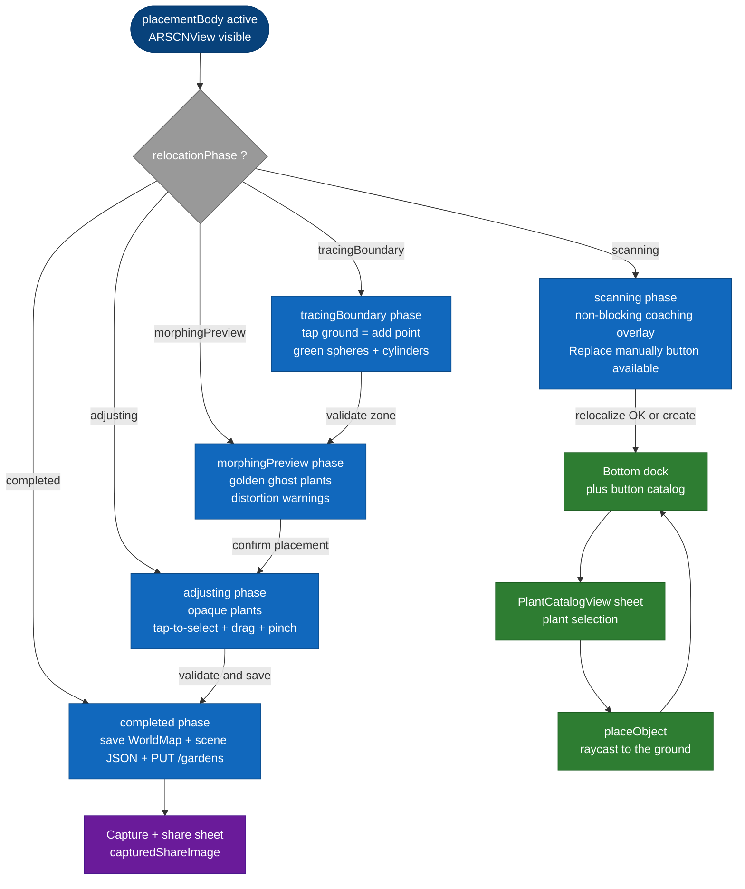

# Per-screen spec — `GardenARPlacementView`

## Purpose

This screen is the **AR core of the application**: it lets the user place, move, and save 3D plants in their garden via the phone's AR camera. It works equally well when creating a new garden and when reopening an existing one, with or without LiDAR.

The file is also the codebase's only **god object** (≈ 3,300 lines, tracked by issue #124).

## Entry points

| Source | Mode | Key parameters |
|---|---|---|
| Exit from the creation wizard (non-LiDAR perimeter path) | `.create` | `selectedPlants`, `boundaryPoints`, `wizard`, `gardenName`, `existingGardenId == nil`, `measurementWorldMapId == nil` |
| Exit from the creation wizard (LiDAR path) | `.create` | `selectedPlants`, `boundaryPoints == []`, `wizard`, `gardenName`, `existingGardenId == nil`, `measurementWorldMapId == UUID` (WorldMap pre-saved by `LiDARScanWizardView`) |
| Tap on a garden card on the Home | `.reopen` | `existingGardenId: String` (Mongo ID), everything else read from disk (`worldmap_{id}.arworldmap` and `scene_{id}.json`) |
| Tap "Re-measure" from `ManageGardenView` | `.create` with `measurementOnly` flag | Special case tracked by issue #136 |

## Exit points

| User action | Destination |
|---|---|
| Tap **"Validate and save"** | Saves then dismisses → `onValidated()` callback that returns to the Home and refreshes the garden list. |
| Tap **X (back button)** at the top left | Dismiss without saving. A confirmation modal appears if the user is in the middle of a manual replace (a phase other than `.scanning`). |
| Tap **share** after saving | Opens an iOS share sheet with an annotated screen capture. |
| Garden-unavailable detection (see issue #114) | Displays `gardenUnavailableView` instead of `placementBody` — error message and a back button. |

## Screen-level flow

The overall opening flow is documented in [`../flows/ar-placement.md`](../flows/ar-placement.md). The diagram below focuses on the **intra-screen flow** once the user is in the active AR session.

## Widgets

### `ARSCNView` (the AR canvas)

Full-page ARKit + SceneKit view. Delegates:

- `ARSCNViewDelegate` for `ARAnchor` additions/updates.
- `ARSessionDelegate` for tracking-state changes and detection of a successful relocalization.
- `UIGestureRecognizerDelegate` to handle conflicts between long-press, pan, and pinch.

**Attached gestures**: tap, long-press, pan, pinch, two-finger rotation. All routed through the **Coordinator**, which dispatches based on `relocationPhase` and on whether a plant is selected.

### Bottom dock (catalog **+** button)

Visible only when `relocationPhase == .scanning || relocationPhase == .completed` (see the `isManualReplacement` helper). Opens the `PlantCatalogView` sheet, which presents the list of plants filtered by the garden's profile.

**Why this restriction**: the catalog picker makes no sense while you are re-tracing a zone or previewing a morphing. Decision tracked in #111.

### `PlantCatalogView` (sheet)

Modal sheet (presented via `.sheet(isPresented: $showPicker)`). Filtered list of catalog plants. On selection:

1. The USDZ model is downloaded via `ModelCacheManager` if not already cached.
2. During the download, `isDownloadingModel = true` → a loader appears in the dock bar.
3. Once the download completes, the next tap on the ground invokes `placeObject` to instantiate the plant.

### Selection indicator (pulsing ring)

When a plant is selected via tap, a pulsing green `SCNTorus` (`selection_indicator`) is added as a child of the plant node (see issue #111). The animation oscillates the opacity between 0.45 and 0.95 every 0.6 s.

### Manual Replacement overlays

Four SwiftUI overlays exclusive to the #111 flow, displayed alternately depending on `relocationPhase`:

| Overlay | Phase | Component |
|---|---|---|
| Coaching | `.scanning` | `ScanningCoachingOverlay` — bottom-anchored, "Replace manually" button. |
| Boundary tracing | `.tracingBoundary` | `BoundaryTracingOverlay` — point counter, live surface area, three buttons (clear last, cancel, validate). |
| Morphing preview | `.morphingPreview` | `MorphingPreviewOverlay` — summary of the `distortionWarnings`, "Confirm" or "Cancel" button. |
| Adjusting | `.adjusting` | `AdjustingOverlay` — discreet hint, two buttons (cancel adjustments, validate and save). |

### Share sheet (capture)

After a successful save, the user can tap a share button. A capture of the AR screen is taken (`shouldCaptureSharePhoto = true` triggers the `ARSCNView`'s `snapshot()`), then presented in a preview sheet, then in the native iOS `UIActivityViewController`.

### Lux widget

A small overlay widget that displays the brightness (lux) measured by `LuxAnalyzer`. Helps the user understand whether the lighting conditions are compatible with reliable AR relocalization.

### Auto-placement (AI, in progress, #125)

`isAutoPlacing` and `autoPlaceToast` are the states dedicated to automatic plant placement by an AI still being specified (issue #125, Sprint 3). The widget is hidden as long as the feature is not enabled.

## Edge cases

| Situation | Behavior |
|---|---|
| Camera permission denied | iOS blocks the start of the `ARSession`. `gardenUnavailable = true` and the user sees a "Enable camera access in Settings" message with a button to the Settings app. |
| No AR tracking (incompatible device) | `ARWorldTrackingConfiguration.isSupported == false`. The screen falls back to `gardenUnavailableView`. |
| Reopening a garden with a missing WorldMap (issue #114) | `gardenUnavailable = true`, dedicated message. Eventually, reconstruction from the backend. |
| USDZ model inaccessible (backend 404) | Logs the error, falls back to a gray placeholder for the affected plant. The save button stays active. |
| Relocalization takes > 30 s without success | No hard timeout — the user can keep waiting or switch to manual replace. |
| Backgrounding > 30 s | ARKit loses tracking. On return, `session(_:cameraDidChangeTrackingState:)` detects `.limited`. In `.reopen` mode, the coaching overlay may reappear. |
| Backend save fails after a successful local save | The local files (`worldmap_{id}.arworldmap` and `scene_{id}.json`) are written before the `PUT /gardens`. If the `PUT` fails, a network retry is attempted; on definitive failure, the screen stays open with an error message and a "Retry" button. |
| Coordinator deinit during a model download | `ModelCacheManager` cancels the network task (signaled via the Combine cancellable's context). |

## Dependencies

### Backend endpoints

- `GET /models/:filename` (via `ModelCacheManager`) — USDZ download.
- `POST /gardens` (in `.create` mode) — initial creation of the garden document if not already present.
- `PUT /gardens/:id` — saving the updated positions at the end of the session.
- `GET /plants/:id` (occasionally, via the picker) — details of a plant absent from the local catalog.

### Shared states and services

- `ModelCacheManager.shared` — disk cache + LRU of USDZ files.
- `GardenLocalStore` — reading/writing of `worldmap_{id}.arworldmap` and `scene_{id}.json`.
- `NetworkManager.shared` — all HTTP requests go through this singleton.
- `LuxAnalyzer` — one instance per AR session, reads brightness from the ARKit environment.

### iOS permissions

- **Camera** — mandatory (`NSCameraUsageDescription` in `Info.plist`).
- **Photo Library** (Add Only) — only if the user enables saving the share capture to their photo library.

### Apple frameworks used

- **ARKit** (`ARWorldTrackingConfiguration`, `ARSCNView`, `ARWorldMap`, `ARAnchor`).
- **SceneKit** (`SCNNode`, `SCNScene`, `SCNTorus` for the selection ring, `SCNAction` for the pulses).
- **SwiftUI** for all overlays and the dock.
- **Combine** for the download Cancellables and the reactive pipelines.

## Debt and related issues

| # | Topic |
|---|---|
| #124 | Refactor the god object — split the coordinator into themed sub-coordinators. |
| #123 | Race conditions identified in the coordinator and missing tests for the morphing. |
| #114 | Garden recovery after uninstall/reinstall. |
| #113 | Elevated plants mispositioned on reload. |
| #138 | Recently wired — `pendingDragTransform` that guarantees persistence of the last drag. |
| #111 | Manual replacement — merged but still to be enriched. |
| #97 | Neural depth-anything pipeline to improve non-LiDAR relocalization. |
| #96 | Relocalization fails when the lighting changes — the root of all manual flows. |

## Out of scope for this spec

- The mathematical detail of the MVC morphing (Floater 2003 method) stays in `ManualReplacement/MeanValueCoordinates.swift`.
- The precise `RelocationPhase` transitions are in [`../state-machines/relocation-phase.md`](../state-machines/relocation-phase.md).
- The graphical rendering of the plants (materials, shadows, sky-light) is not covered here — it is a SceneKit/RealityKit detail that an AR developer will access through the code.
