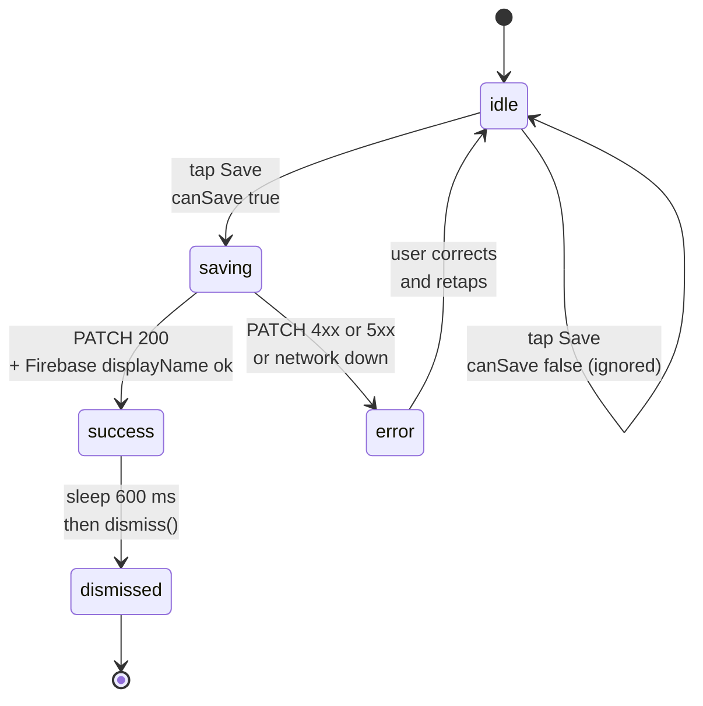

# Per-screen spec — `PersonalDetailsView`

## Purpose

This screen lets the user **edit their profile name** and view their email. It used to be a *visual no-op* (the "Save" button only called `dismiss()`, giving the illusion of a save without persisting anything — issue #138). Since it was rewired, it calls `PATCH /users/me` on the backend and then updates the Firebase Auth `displayName`, ensuring consistency between the two sources of truth.

Implemented in `Views/Profile/PersonalDetailsView.swift`.

## Entry points

| Source | Key parameters |
|---|---|
| **"Personal information"** section from `ProfileView` | No parameters — the current user is read via `Auth.auth().currentUser`. |

## Exit points

| User action | Destination |
|---|---|
| Tap **"Save changes"** (success) | Shows the inline toast "Changes saved ✓" for 600 ms, then automatic `dismiss()`. |
| Tap **"Save changes"** (backend error) | The screen stays open, inline error message in red (`PERSONAL_DETAILS_SAVE_ERROR`), `isSaving = false`, the user can retry. |
| Tap **system back** (swipe or back nav) | Immediate `dismiss()` without saving. Blocked while `isSaving == true` via `.interactiveDismissDisabled(isSaving)`. |

## Screen-level flow

The "Save" button carries a **mini state machine** across four statuses derived from three `@State` values: `isSaving`, `errorMessage`, `didSave`. This machine is implicit in the Swift code but made explicit below to ease review and maintenance.

The `idle` state is the default state at mount. `canSave` is a computed value that returns `true` only if:

- The screen is not currently saving (`isSaving == false`).
- The trimmed name is not empty (`!trimmedName.isEmpty`).
- The name has been changed since mount (`trimmedName != initialName`).

This last condition prevents the user from tapping "Save" when nothing has changed.

## Widgets

### `inputField` (full name)

Internal component based on `AppTextField` with a system icon and a localized placeholder. Bound to `$fullName: String`. Disabled while `isSaving == true`.

### `readOnlyField` (email)

Read-only internal component. Displays the Firebase account's current email (`Auth.auth().currentUser?.email`). The `envelope` icon and the dimmed style (opacity 0.5 on the card background) visually signal that the field is not editable.

**Why read-only**: Firebase Auth is the source of truth for the email. Changing it implies a verification flow (confirmation email, re-authentication), which is out of scope for this screen. If the feature is requested, it will be handled by a dedicated `ChangeEmailView` screen.

### Primary "Save" button

Full-width button styled via `.buttonStyle(.arborePrimary)`. Visual behavior by state:

| State | Appearance |
|---|---|
| `idle` and `canSave == false` | Opacity 0.5, disabled. |
| `idle` and `canSave == true` | Full opacity, responsive tap. |
| `saving == true` | Full opacity, `ProgressView()` to the left of the label. Disabled. |

### Toast feedback (success)

Shown below the form, above the button, in green (`ArboreDesign.Colors.success`). Appears briefly before the automatic `dismiss()`.

### Toast feedback (error)

Shown below the form, in red (`ArboreDesign.Colors.danger`). The message comes either from `NetworkError.errorDescription` or from the localized fallback `PERSONAL_DETAILS_SAVE_ERROR`.

## Edge cases

| Situation | Behavior |
|---|---|
| Backend returns 401 / 403 | `NetworkError.unauthorized` or `.forbidden`. The error message is displayed as-is by `errorDescription`. The user can retry, but in practice this means the app must be restarted (expired token) or the device is banned. |
| Backend returns 422 (name too long, > 100 characters) | Backend message passed through via `NetworkError.serverError(message)`. The user sees "The name is too long (max 100 characters)" and can shorten it. |
| Backend returns 400 (name empty after trim) | Should not happen since the iOS-side `canSave` already prevents the tap if the trim is empty. If it does get through anyway (a race condition, for example), the backend message is displayed. |
| Network connection dropped | `NetworkManager` attempts a transparent retry (see `performWithRetry`). If it still fails, `NetworkError.serverError` is raised. Fallback message `PERSONAL_DETAILS_SAVE_ERROR`. |
| Backend down (5xx) | Same: internal `NetworkManager` retry, then fallback. No explicit backoff specific to this screen — the request is small and the user can retry manually. |
| Firebase `commitChanges()` fails while `PATCH` succeeded | The backend holds the new source of truth. Firebase stays out of sync until the next session (the error is silently logged — `try? await`). Worth monitoring in case of user reports; a more robust retry could be added. |
| User dismisses while `isSaving == true` | `.interactiveDismissDisabled(isSaving)` prevents the iOS swipe-to-dismiss. The back button stays accessible but the dismiss is blocked for the duration of the request. |
| Firebase email is nil (unverified account) | `email` displayed read-only with the dash "—". The user can edit their name without being blocked. |

## Dependencies

### Backend endpoints

- **`PATCH /users/me`** — endpoint introduced by issue #138. Payload: `{ "name": "..." }`. Self-only authz via the Firebase token. Backend validation: trim + max 100 characters.

### Shared state and services

- `NetworkManager.shared` — calls `PATCH /users/me`.
- `Auth.auth().currentUser` — initial read of the `displayName` and `email`, then a call to `createProfileChangeRequest()` to update the `displayName` on the Firebase side after backend success.
- `ThemeManager` (`@EnvironmentObject`) — for the `colorScheme` and adaptive colors.

### Localization

Three keys added in fr/en/de/es by issue #138:

- `PERSONAL_DETAILS_SAVE_BUTTON` — already existing.
- `PERSONAL_DETAILS_SAVE_SUCCESS` — green toast after success.
- `PERSONAL_DETAILS_SAVE_ERROR` — fallback if the `NetworkError` has no localized message.

### iOS permissions

No iOS permission is required to edit the name. For the profile photo (parent screen, see below), `PHPickerViewController` runs **out-of-process** and therefore requires **no photo-library access authorization**.

### Apple frameworks used

- **SwiftUI** for the entire view.
- **FirebaseAuth** for reading the current profile and updating the `displayName`.
- **PhotosUI** (`PHPickerViewController`) for picking the profile photo from the parent screen.

## Profile photo (parent screen `ProfileView`)

The profile photo is not edited from `PersonalDetailsView` but from its **parent screen** `ProfileView` (button on the header avatar). It is documented here because it is part of the identity data.

| Step | Detail |
|---|---|
| Picking | `PhotoPicker` (`ProfileComponents.swift`) wraps `PHPickerViewController` (`filter = .images`, `selectionLimit = 1`). No permission required. |
| Normalization | `normalizedProfileImage()` then **JPEG quality 0.86** encoding. |
| Storage | ⚠️ **Local only**: `Documents/ProfileImages/<uid>.jpg` (atomic write). The photo is reloaded when the screen appears (`fetchProfileImage`). |
| Network | **No upload.** The backend endpoint `POST /users/:uid/photo` still exists server-side but is **no longer called by the iOS app** — the photo never leaves the device. |
| Error | Write failure → "Impossible de sauvegarder la photo." message (`uploadError`), no retry. |

**Consequences** (tracked in #329): the photo is **not synced across devices** and is lost on uninstall. From a GDPR standpoint this is the most protective behavior (local data, never transmitted) — but the data export (art. 20) cannot include it while it stays on-device.

> **Saving a capture to the photo library** — in a separate flow (`ARViewContainerMeasure`), the app offers to save a capture via `UIImageWriteToSavedPhotosAlbum`, which **requires** `NSPhotoLibraryAddUsageDescription` in `Info.plist` (missing, the app crashed — fixed, see #304).

## Related issues

| # | Topic |
|---|---|
| #138 | Wiring of the Save button (this screen). |
| #137 | Signup rollback — complementary flow that ensures a Firebase user always has its associated Mongo document. |
| #67 | Extended GDPR consents — managing marketing/notification preferences will go through a similar screen (to be created). |

## Out of scope for this spec

- The **profile photo** is edited from the parent screen `ProfileView` — described above, in its dedicated section.
- **Changing the email** and **changing the password** are separate flows not yet implemented.
- The backend spec for `PATCH /users/me` is in [`../architecture/03-components-backend.md`](../architecture/03-components-backend.md).
