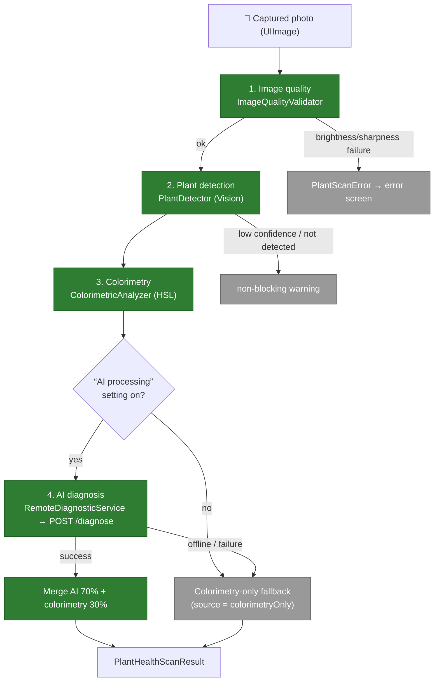

# Screen — Plant Health Scan

The health scan lets the user photograph a plant to get a **phytopathological diagnosis**: probable species, overall health, detected diseases, and recommendations. The pipeline combines **on-device pre-checks** (quality, detection, colorimetry) with an **AI analysis by the provider** (backend proxy), plus a **local fallback** based on colorimetry alone.

Code: `PlantHealthScanner.swift` (orchestrator + steps); view: `PlantHealthScannerView.swift`. The AI diagnosis goes through the backend `POST /diagnose` (see [`../architecture/03-components-backend.md`](../architecture/03-components-backend.md)). **The provider's name appears nowhere in the app**: the backend picks it (`AI_PROVIDER`), and it has changed once already.

## Pipeline

## Pipeline steps

| Step | Type | Role |
|---|---|---|
| `ImageQualityValidator.validate` | on-device (CoreImage) | Rejects an image that is **too dark** (mean luminance < 0.15) or **blurry** (Laplacian variance < threshold). Failure → blocking `PlantScanError`. |
| `PlantDetector.detect` | on-device (Vision `VNClassifyImageRequest`) | Checks a plant is present (labels `plant`/`flower`/`leaf`… ≥ 0.50). Low confidence or absence → **non-blocking warning** (the AI reinforces the analysis). Skipped on simulator. |
| `ColorimetricAnalyzer.analyze` | on-device | Classifies every pixel in HSL (healthy green / chlorotic yellow / necrotic brown / cottony white) → ratios + colorimetric `healthScore`. Also serves as the **local fallback**. |
| `AIProcessingPreference.estAutorise` | on-device (`UserDefaults`) | **Exit gate**: when the “AI processing” setting is off, the photo never leaves the device and the pipeline ends in `colorimetryOnly`. |
| `RemoteDiagnosticService.diagnose` | network (backend) | Resizes the image (800px, JPEG q0.6) + colorimetry + species name → `POST /diagnose`. Normalised JSON response (see the backend contract). |
| `PlantHealthScanner.analyze` | orchestrator (`@MainActor`) | Chains the steps, publishes `phase` (preview/capturing/analyzing/result/error) + live indicators (`brightnessOK`, `plantDetected`), merges the results. |

## “AI processing” setting (#549)

The setting lives in Profile → Privacy (`PrivacySettingsView`), its default in `ConsentDefaults.ai`, and every read goes through `AIProcessingPreference` (`UserDefaults` key `privacy_ai`). **Both** send sites consult it: this scan and the assistant (`ChatBotView`).

It is a **feature preference, not GDPR consent**: the diagnosis rests on the contractual basis art. 6(1)(b), and turning it off does not cut the service — it **degrades** it:

| Setting | Health scan | Assistant |
|---|---|---|
| On (default) | Full AI diagnosis, merged with colorimetry | Available |
| Off | `colorimetryOnly` + `SCAN_WARNING_AI_DISABLED` warning — **the photo never leaves the device** | Unavailable, with an explicit message |

## Catalogue grounding (#554)

The backend **grounds** the diagnosis on our own catalogue entries before calling the model, and reconciles its answer afterwards:

1. **Before the call** — if `plantName` is supplied and matches an entry, its data (watering, light, toxicity…) is attached to the prompt as a reference block.
2. **After the call** — if the returned `species` matches an entry, the response carries `catalogPlantId` + `catalogPlantName`; otherwise the initial grounding is used as a fallback.

`catalogPlantId` is **exposed by the backend but not yet consumed** by iOS's `LLMDiagnosticResponse`: the “diagnosis → catalogue entry” hand-off still has to be wired into the view.

## Merge & result

On AI success the two sources are combined:
- **Overall health** = AI `overallHealth` **70%** + colorimetric `healthScore` **30%**.
- **Diseases** = those returned by the AI (`name`, `severity`, `confidence`).
- **Uncertainty** (`isUncertain`) = the flag returned by the AI, or mean confidence < 0.60.

Result: `PlantHealthScanResult` — `overallHealth`, `confidence`, `species` (optional), `diseases: [DetectedDisease]`, `recommendations`, `isUncertain`, and **`source: DiagnosticSource`**:
- `remote` — full AI diagnosis.
- `colorimetryOnly` — **fallback** when offline, when the remote call fails, **or when the AI setting is off**: score and messages derived from colorimetry alone.

## AI disclaimer

The result screen always shows `AI_DISCLAIMER_SCAN` — “This diagnosis is an estimate, not professional plant health advice. AI can make mistakes: when in doubt, ask a specialist.” — translated into all **four** languages (fr/en/es/de) and covered by `LocalizationCoverageTests`.

## Errors (`PlantScanError`)

`lowBrightness` · `blurryImage` · `noPlantDetected` · `cameraUnavailable` · `analysisTimeout` · `llmError`. Each exposes a localised description and an SF Symbol icon for the error screen.

## Key points

- **Graceful degradation**: an invalid image is rejected early (no network call); an undetected plant is only a warning; AI unavailable **or declined by the user** → colorimetry fallback. The app stays usable offline with a degraded diagnosis.
- **Cost & latency under control**: image resized to 800px / JPEG 0.6 before sending; the backend caps the size (6 MB), the rate limit, the throughput towards the provider, and normalises the output.
- **GDPR**: the diagnosis photo is sent to the AI provider (outside the EU) through the backend proxy — disclosed in the in-app privacy policy, and switchable off via the setting above.
- **Tests**: the pure logic (errors, quality validator, colorimetry, contract decoding) is covered by `PlantHealthScannerTests.swift`, the setting by `AIProcessingPreferenceTests.swift` (see [`../testing/ios.md`](../testing/ios.md)).

## Out of scope for this view

- The `/diagnose` proxy (auth, rate limit, throughput, catalogue grounding, schema normalisation) is documented in [`../architecture/03-components-backend.md`](../architecture/03-components-backend.md).
- Provider choice and its terms of use: [`../operations/llm-providers.md`](../operations/llm-providers.md).
