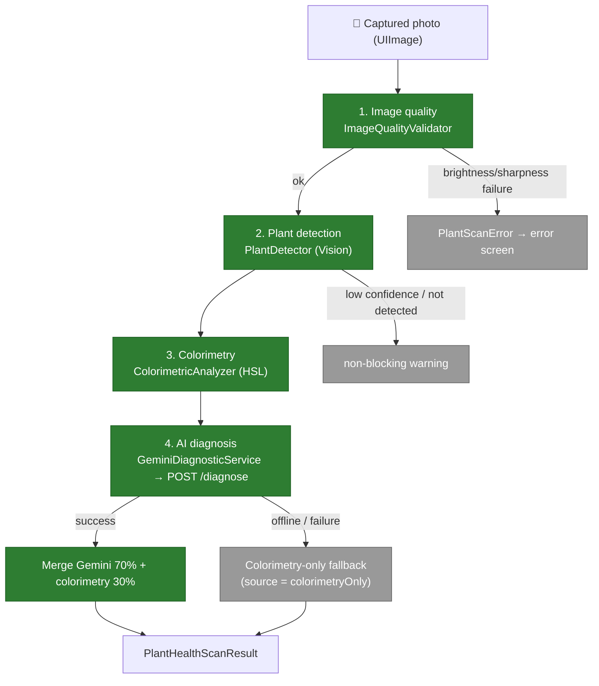

# Screen — Plant Health Scan

The health scan lets the user photograph a plant to get a **phytopathological diagnosis**: probable species, overall health, detected diseases, and recommendations. The pipeline combines **on-device pre-checks** (quality, detection, colorimetry) with an **AI analysis via Gemini** (backend proxy), plus an **offline fallback** based on colorimetry alone.

Code: `PlantHealthScanner.swift` (orchestrator + steps); view: `PlantHealthScannerView.swift`. The AI diagnosis goes through the backend `POST /diagnose` (see [`../architecture/03-components-backend.md`](../architecture/03-components-backend.md)).

## Pipeline

## Pipeline steps

| Step | Type | Role |
|---|---|---|
| `ImageQualityValidator.validate` | on-device (CoreImage) | Rejects an image that is **too dark** (mean luminance < 0.15) or **blurry** (Laplacian variance < threshold). Failure → blocking `PlantScanError`. |
| `PlantDetector.detect` | on-device (Vision `VNClassifyImageRequest`) | Checks a plant is present (labels `plant`/`flower`/`leaf`… ≥ 0.50). Low confidence or absence → **non-blocking warning** (AI reinforces the analysis). Skipped on the simulator. |
| `ColorimetricAnalyzer.analyze` | on-device | Classifies each pixel in HSL (healthy green / yellow chlorosis / brown necrosis / cottony white) → ratios + colorimetric `healthScore`. Also serves as the **offline fallback**. |
| `GeminiDiagnosticService.diagnose` | network (backend) | Resizes the image (800px, JPEG q0.6) + colorimetry + species name → `POST /diagnose`. Normalized JSON response (see backend contract). |
| `PlantHealthScanner.analyze` | orchestrator (`@MainActor`) | Chains the 4 steps, publishes `phase` (preview/capturing/analyzing/result/error) + real-time indicators (`brightnessOK`, `plantDetected`), merges the results. |

## Merge & result

On Gemini success, both sources are combined:
- **Overall health** = Gemini `overallHealth` **70%** + colorimetry `healthScore` **30%**.
- **Diseases** = those returned by Gemini (`name`, `severity`, `confidence`).
- **Uncertainty** (`isUncertain`) = Gemini flag, or average confidence < 0.60.

Result: `PlantHealthScanResult` — `overallHealth`, `confidence`, `species` (optional), `diseases: [DetectedDisease]`, `recommendations`, `isUncertain`, and **`source`**:
- `gemini` — full AI diagnosis.
- `colorimetryOnly` — **fallback** when Gemini is unavailable (offline / failure): score and messages derived from colorimetry alone.

## Errors (`PlantScanError`)

`lowBrightness` · `blurryImage` · `noPlantDetected` · `cameraUnavailable` · `analysisTimeout` · `geminiError`. Each exposes a localized description and an SF Symbol icon for the error screen.

## Key points

- **Graceful degradation**: an invalid image is rejected early (no network call); an undetected plant is only a warning; Gemini unavailable → colorimetry fallback. The app stays usable offline with a degraded diagnosis.
- **Bounded cost & latency**: image resized to 800px / JPEG 0.6 before sending; the backend bounds size, rate-limits, and normalizes the output.
- **GDPR**: the diagnosis photo is sent to **Google Gemini** (outside the EU) via the backend proxy — disclosed in the in-app privacy policy.
- **Tests**: the pure logic (errors, quality validator, colorimetry, contract decoding) is covered by `PlantHealthScannerTests.swift` (see [`../testing/ios.md`](../testing/ios.md)).

## Out of scope for this view

- The `/diagnose` proxy (auth, rate-limit, schema normalization) is documented in [`../architecture/03-components-backend.md`](../architecture/03-components-backend.md).
