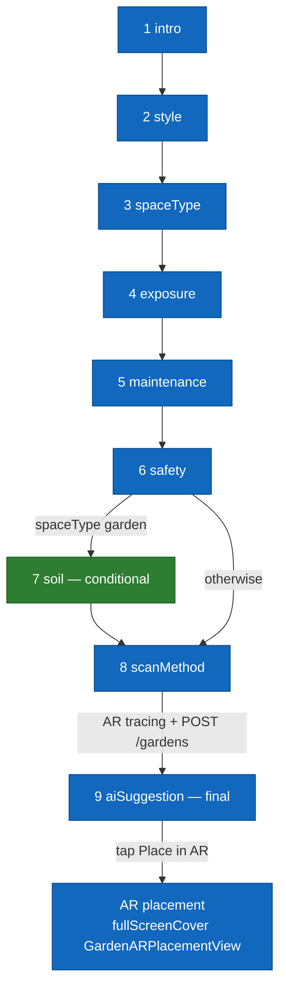

# Per-screen spec — `QuestionnaireView` (creation wizard)

## Purpose

This screen guides the user through the **complete creation of a garden**: aesthetic and functional profile (style, space, exposure, maintenance, safety, soil), choice of the scan method **that creates the garden in the database**, then AI-assisted plant selection. On exit, the user is routed to the AR placement view.

Implemented in `Views/GardenSteps/QuestionnaireView.swift`. Made up of 8 to 9 steps (depending on the choices), carried by a non-paginable `TabView` whose selection is governed by the `GardenWizardStep` enum. **Intentionally reversed order**: the `scanMethod` step first opens the AR tracing view, which creates the garden in the database with its boundary, **before** handing control back to the wizard for the **final** `aiSuggestion` step. There is **no** "summary" step.

## Entry points

| Source | Key parameters |
|---|---|
| **"Create a garden"** button from the Home | `uid: String`, `selectedPlants: [Plant]` (usually `[]`), `onFinish: (GardenWizardState) -> Void` |
| "Start over" action from the end of the wizard | Same parameters, `GardenWizardState` reset |

## Exit points

| User action | Destination |
|---|---|
| Tap **"Start tracing"** on the `scanMethod` step, `scanMethod == gardenPerimeter` | `fullScreenCover` to `ARViewContainerMeasure` (non-LiDAR perimeter tracing) → `POST /gardens` at the end of tracing → back to the wizard on `aiSuggestion`. |
| Tap **"Scan the room"** on the `scanMethod` step, `scanMethod == roomScan` | `fullScreenCover` to `LiDARScanWizardView` (RoomPlan) → `POST /gardens` → back to the wizard on `aiSuggestion`. |
| Tap **"Place my plants in AR"** on the final `aiSuggestion` step | `fullScreenCover` to `GardenARPlacementView` (plant placement, `PUT /gardens/:id`). |
| Tap **"Back"** on the first step (intro) or **X (close)** | `dismiss()` — back to the Home. No confirmation as long as the garden has not been created. |

## Screen-level flow

The full flow is documented in [`../flows/garden-creation.md`](../flows/garden-creation.md). The diagram below focuses on the **internal navigation between steps**, handled by the computed `visibleSteps` and the `goToNext` / `goToPrevious` helpers.

## Widgets

### `WizardProgressHeader`

Progress bar. Displays the current step (`currentIndex + 1`) and the total number of visible steps (`visibleSteps.count`). Recomputed when `visibleSteps` changes (for example if `spaceType` switches back from `garden` to `indoor`, the `soil` step appears/disappears).

### Navigation buttons

| Button | Style | Action |
|---|---|---|
| **"Continue"** | Primary | `goToNext()` — increments `currentIndex`. Disabled as long as the step has not received a valid answer. |
| **"Back"** | Secondary | `goToPrevious()` — decrements `currentIndex`. Disabled on the `intro` step. |

The `PrimaryWizardButtonStyle` / `SecondaryWizardButtonStyle` styles are shared across all steps.

### `ImprovedSelectableCard`

Selectable card used on most steps (style, spaceType, exposure, maintenance, scanMethod). System icon, title, subtitle, gradient; border + check when `isSelected`.

### `ScanMethodStepView` (step 8) — garden creation

Choice of the scan method, **the step that creates the garden**:

- **Trace my garden on the ground** (`gardenPerimeter`) — always active.
- **Scan the room in 3D** (`roomScan`) — disabled (`opacity(0.4)`) if `RoomCaptureSession.isSupported == false` (no LiDAR).

When the scan/tracing starts, the corresponding AR view opens; at the end of tracing, `POST /gardens` creates the document with its boundary, then the wizard returns to `aiSuggestion`.

### `AISuggestionStepView` (step 9, final)

Displays the plants recommended by `GardenSuggestionEngine` according to the profile. Primary button **"Place my plants in AR"** → opens `GardenARPlacementView` (placement, `PUT /gardens/:id`).

## Edge cases

| Situation | Behavior |
|---|---|
| "Back" all the way to `intro` | The "Back" button disables; exit via the X. |
| `spaceType` changed backward | `visibleSteps` recomputed: going from `garden` to `indoor` removes `soil`. An `onChange(of: visibleSteps)` repositions the current step if it disappears. |
| Backend down during tracing (`scanMethod`) | `POST /gardens` throws a `NetworkError`; inline message "Unable to create the garden. Try again." and a retry is possible. |
| LiDAR selected but not supported | Should not happen (card grayed out). Otherwise `LiDARScanWizardView` displays "3D scan unavailable" and offers to return to the choice. |
| Camera permission denied | Requested by `ARViewContainerMeasure` / `LiDARScanWizardView`; if denied, back to the wizard with an error message. |
| `selectedPlants == []` | Tolerated: the user can place plants from the AR picker. |
| Dismiss before creation | No disk persistence during the wizard as long as the garden has not been created. Decision tracked in [`../flows/garden-creation.md`](../flows/garden-creation.md). |

## Dependencies

### Backend endpoints

- `GET /plants` — loads the catalog for the `aiSuggestion` step (`onAppear`).
- `POST /gardens` — creates the garden document **at the end of tracing** (`scanMethod`).
- `PUT /gardens/:id` — updates the garden with the placed plants (from `GardenARPlacementView`).

### Shared states and services

- `GardenWizardState` (`@StateObject`) — lives for the duration of the wizard; stores the selections (style, spaceType, exposure, maintenance, safety, soil, scanMethod) and the scan data (`measuredBoundaryPoints`, `measuredArea`, `measuredPerimeter`).
- `GardenSuggestionEngine` — filters/suggests the plants suited to the profile for `aiSuggestion`.
- `TabRouter` (`@EnvironmentObject`) — redirect to the Home after creation.
- `NetworkManager.shared` — backend calls.

### iOS permissions

No permission required during the wizard itself. Camera/LiDAR permissions are requested by the AR views opened on the `scanMethod` step.

### Apple frameworks used

- **SwiftUI** for the entire view (non-paginable `TabView`).
- **RoomPlan** for `RoomCaptureSession.isSupported` on the `ScanMethodStepView` side.

## Related issues

| # | Topic |
|---|---|
| #139 | End-to-end LiDAR validation — "roomScan" button of the wizard. |
| #97 | Neural pipeline (future alternative to RoomPlan for non-LiDAR scanning). |
| #21 | Saving garden models with autosave and versions. |

## Out of scope for this spec

- The details of AR placement are documented in [`garden-ar-placement.md`](garden-ar-placement.md) and [`../flows/ar-placement.md`](../flows/ar-placement.md).
- The scoring of the AI filtering (`GardenSuggestionEngine`) is an implementation detail tested in unit tests.
- The backend spec of the `createGarden` handler is in [`../architecture/03-components-backend.md`](../architecture/03-components-backend.md).
