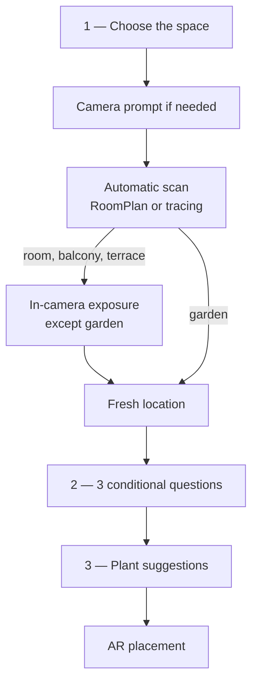

# Per-screen spec — `QuestionnaireView` (creation wizard)

## Purpose

`QuestionnaireView` takes the user from space selection to AR placement with **three visible screens**: `spaceType`, `essentialQuestions`, then `aiSuggestion`. Measurement, optional exposure, and location remain contextual sub-flows, with no recap page.

Main implementation: `Views/GardenSteps/QuestionnaireView.swift`.

## Entry and exits

| Action | Destination |
|---|---|
| “Create a garden” from Home | `GardenWizardView`, first `spaceType` step. |
| **Continue** after choosing a space | System camera prompt if needed, then direct scan. |
| Location confirmation | `essentialQuestions` step. |
| Questions confirmed or “Answer later” | `aiSuggestion` step. |
| **Place my plants in AR** | `GardenARPlacementView` with the already-created garden. |
| Back from the first step or X | `dismiss()` to Home. |

## Flow



`visibleSteps` contains only:

```swift
[.spaceType, .essentialQuestions, .aiSuggestion]
```

## Automatic method selection

- Room and `RoomCaptureSession.isSupported == true`: `roomScan`.
- Every other case: `gardenPerimeter`.
- “Change method” appears in the camera only for a RoomPlan-compatible room.

The `ScanMethodSelectionView` page no longer exists. The **Continue** CTA in `SpaceTypeStepView` sets `state.scanMethod`, directly requests system permission when status is `.notDetermined`, then opens the AR full-screen cover. `GardenAnalysisAuthorizationFlowView` is only a denial-recovery screen with access to Settings.

## Sub-flows

### Measurement and creation

`ARViewContainerMeasure` traces the floor outline. `LiDARScanWizardView` uses RoomPlan. Once dimensions are confirmed, no extra verification is requested. The scan saves the WorldMap and measurements, then creates the garden through `POST /gardens` with `plants: []`.

### Exposure

For a room, balcony, or terrace, `GardenExposureCaptureOverlay` appears without closing the camera. The user aims at the main light source and confirms. A garden skips this capture.

### Location

After the camera closes, `GardenLocationCaptureView` requests a new approximate location for every garden. `state.location` is always reset before creation. Manual city entry and continuing without location remain available. The value is added to the garden through `PUT /gardens/:id`.

### Conditional questions

`EssentialQuestionsStepView` fits on one page and shows three compact cards:

- Garden: planting mode, drainage after rain, safety.
- Balcony / terrace: wind, existing pots or a new composition, safety.
- Room: air humidity, nearby heating, safety.

Every card includes “I don’t know.” All answers are optional and the CTA stays active with zero, one, two, or three answers. Unknown values are not serialized. Known answers populate `wizard.conditionalAnswers`, while safety uses the existing `wizard.safety` field. They are saved before suggestions without blocking the user if the network fails.

### Suggestion and placement

`AISuggestionStepView` uses the catalog and available measurements. Its CTA opens `GardenARPlacementView` with `existingGardenId`; final confirmation updates the garden through `PUT /gardens/:id`, then opens its 2D plan directly in the Garden tab. The editable `GardenSpaceProfileView` groups measured, inferred, and declared data there without adding another wizard step.

## Edge cases

| Situation | Behavior |
|---|---|
| Camera already authorized | The scan opens directly. |
| First camera request | The iOS prompt appears over the space-selection screen. |
| Camera denied | Recovery screen with a Settings shortcut. |
| Location denied | Manual city or continue without location; no old position is reused. |
| Unknown or skipped question | No field is fabricated; suggestions continue with available data. |
| Saving questions unavailable | Answers stay in memory and are sent again with final placement. |
| Backend unavailable after tracing | Inline message and retry remain available. |
| Method change | The current camera closes and the other engine opens; only for a RoomPlan-compatible room. |

## Dependencies

- `AVFoundation`: camera status and request.
- `RoomPlan`: availability and 3D scan.
- `CoreLocation`: one-shot approximate location.
- `CoreMotion` and ARKit: orientation and light during exposure.
- `GardenAPI` / `NetworkManager`: garden creation and updates.
- Full flow: [`../flows/garden-creation.md`](../flows/garden-creation.md).
