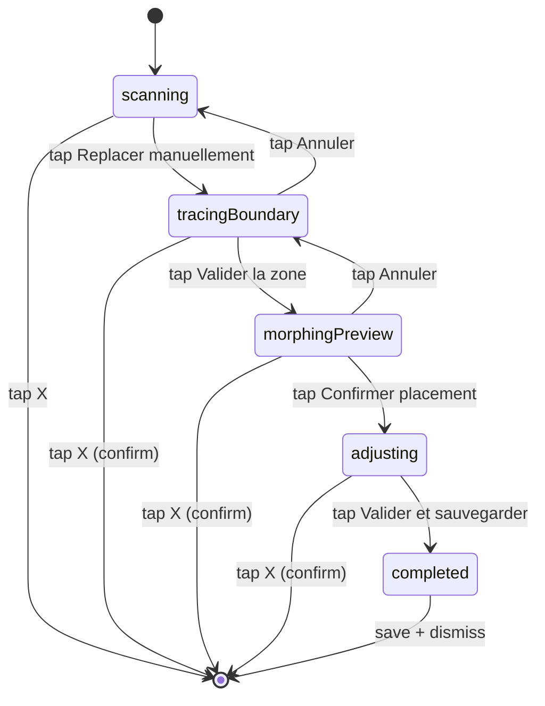

# State machine — `RelocationPhase`

`RelocationPhase` is the Swift enum defined in `ArboreUi/ArboreUi/ARGarden/ManualReplacement/RelocationPhase.swift` that drives the **manual garden re-placement flow** when `ARWorldMap` relocation fails (for example because the lighting has changed between two sessions on a non-LiDAR device — see issue #96).

This state machine is hosted by `GardenARPlacementView` and is only active in `.reopen` mode; in `.create` mode, the enum stays pinned to `.scanning` and the machine does not run.

For product context and history, see [issue #111](https://github.com/ArboreTeam/Arbore/issues/111) (merged on 2026-04-29).

## Diagram

The diagram below describes the states, the transitions, and the trigger event of each transition. The associated actions (snapshots, ghost rendering, anchor cleanup) are described in the next section.

The **self-transitions** are not shown on the diagram to keep it readable; they are described case by case in the "Detailed behavior by state" section below:

- `scanning → scanning`: ARKit `relocalize` succeeds in the background → the machine is short-circuited and `loadGardenFromDisk` is called without an explicit state transition.
- `tracingBoundary → tracingBoundary`: tap on the ground → a point is added to `newBoundary`.
- `adjusting → adjusting`: drag/tap of a plant → `recordDraggedTransform`. Or tap **"Annuler ajustements"** → revert to `preMorphAdjustment`.

## Detailed behavior by state

### `scanning`

ARKit attempts to relocate the saved `ARWorldMap`. The user sees:

- The rear camera in full screen.
- A **bottom-anchored coaching overlay** (`ScanningCoachingOverlay` component) prompting them to move the phone to recognize the environment.
- A **"Replacer manuellement"** button available immediately (no artificial timeout).
- An **X** button in the top right to fully dismiss the view.

**Possible exits**:

| Event | Transition |
|---|---|
| ARKit `relocalize` succeeds | The machine is short-circuited: `loadGardenFromDisk` is called and the plants are restored via their saved `ARAnchor`s. The machine stays at `scanning` but no manual overlay appears. |
| Tap "Replacer manuellement" | `enterManualReplacement()` → switches to `tracingBoundary`. |
| Tap X | Dismiss the view, machine finished. |

### `tracingBoundary`

The user retraces the garden boundary by tapping the ground. UI component: `BoundaryTracingOverlay`.

**Actions on each tap on the ground**:

1. `lastReticleTransform` is read, and its 3D position is added to `newBoundary: [SIMD3<Float>]`.
2. A **green sphere** is instantiated at the tapped point (pattern reused from `ARViewContainerMeasure`).
3. The cylinders connecting the points are updated to visualize the polygon.
4. The surface area (m²) is computed via Shoelace and displayed in real time.

**Three user actions**:

| Action | Result |
|---|---|
| Tap **"Effacer dernier"** | Removes the last point from `newBoundary` along with the associated sphere and segment. |
| Tap **"Annuler"** | Clears `newBoundary`, removes all spheres and the old-boundary ghost, returns to `scanning`. |
| Tap **"Valider la zone"** (disabled if < 3 points) | `validateNewBoundary()` → computes the morphing via `GardenMorpher` → switches to `morphingPreview`. |

### `morphingPreview`

The plants are displayed as a **golden ghost** (opacity 0.6) at their morphed position computed by Mean Value Coordinates. UI component: `MorphingPreviewOverlay`.

**Display**:

- If `distortionWarnings.isEmpty`: green message **"✓ Reliable placement"**.
- Otherwise: an orange card listing the at-risk plants (clickable to highlight a plant in the 3D scene). Plants in a high-distortion zone (score ≥ 1.8) are tinted orange instead of golden.

**Two user actions**:

| Action | Result |
|---|---|
| Tap **"Annuler"** | Returns to `tracingBoundary`; `newBoundary` and the ghosts are reset, and the user can retrace. |
| Tap **"Confirmer le placement"** | `confirmMorphedPlacement()` → actually instantiates the plants via `placeObject`, snapshots their transform into `preMorphAdjustment`, switches to `adjusting`. |

### `adjusting`

The plants become opaque. The user can fine-tune their position by hand. UI component: `AdjustingOverlay`.

**Available gestures**:

| Gesture | Action |
|---|---|
| Tap on a plant | Selects the plant, shows the pulsing green ring `selection_indicator`. |
| Tap on the ground (with a plant selected) | Teleports the plant to the raycast position → `recordDraggedTransform`. |
| Long-press + drag | Moves continuously → `recordDraggedTransform` on `.ended`. |
| Pinch | Scales (if allowed for the plant). |

**Two global actions**:

| Action | Result |
|---|---|
| Tap **"Annuler ajustements"** | Restores the positions snapshotted in `preMorphAdjustment`. The machine stays at `adjusting` (the user can resume). |
| Tap **"Valider et sauvegarder"** | Saves `ARWorldMap` + `scene_{id}.json` to disk, switches to `completed`. |

### `completed`

Transient state before dismiss. No user interaction. The view closes automatically after a few hundred milliseconds to give the success visual feedback time to be seen.

## `isManualReplacement` helper

The enum exposes a computed `isManualReplacement: Bool` that returns `true` for `.tracingBoundary`, `.morphingPreview`, `.adjusting`, and `.completed`, and `false` for `.scanning`. This flag is used by `GardenARPlacementView` to:

- Hide the dock's **"+"** button during manual re-placement (the catalog plant picker makes no sense while retracing a zone).
- Block late ARKit relocation events (the user has taken control, so we do not overwrite their positions).

## Exit via dismiss (X) — confirmation

The **X** button in the top right stays available in every state except `scanning`, where it is immediate. In the other states, a **confirmation modal** appears:

> "Cancel the replacement? Changes will not be saved."

This modal is mandatory to prevent an accidental tap from losing 5 minutes of retracing.

## Out of scope for this view

- The mathematical detail of the morphing (Mean Value Coordinates, Distortion Analyzer) is documented in the glossary and remains an implementation detail covered by unit tests (`GardenMorpherTests`, target of issue #123).
- The graphical rendering of the ghosts (golden material, pulsing ring) is documented inline in `GhostRenderer.swift` and is not relevant at the state-machine level.
- The full opening flow (from tapping a garden card on the Home screen through to arriving at `scanning`) will be documented in [`../flows/ar-placement.md`](../flows/ar-placement.md).
