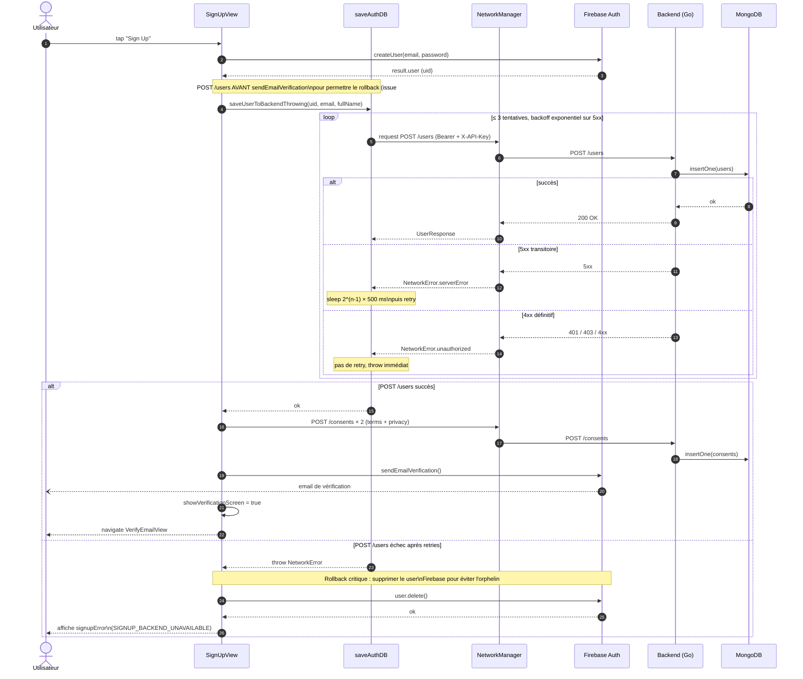

# Flux — Signup utilisateur

Ce document décrit le **flux complet d'inscription** d'un utilisateur, depuis le formulaire dans `SignUpView` jusqu'à l'écran de vérification d'email. Le contrat critique porté par ce flux : aucun utilisateur Firebase ne doit exister sans son document MongoDB associé. La cohérence est assurée par un **rollback explicite** côté iOS si l'enregistrement backend échoue (issue #137).

## Vue d'ensemble

| Étape | Acteur | Système |
|---|---|---|
| Saisie email / mot de passe / nom | Utilisateur | iOS — `SignUpView` |
| Création compte Firebase | iOS | Firebase Auth |
| Enregistrement document utilisateur | iOS | Backend Go → MongoDB Atlas |
| Enregistrement consentements RGPD initiaux | iOS | Backend Go → MongoDB Atlas |
| Envoi mail de vérification | Firebase | Firebase Auth (asynchrone) |
| Navigation vers `VerifyEmailView` | iOS | — |

## Diagramme de séquence

Le diagramme couvre le chemin nominal **et** le rollback en cas d'échec du `POST /users`. Les libellés des messages reprennent les fonctions Swift et endpoints Go concernés.



## Détails par étape

### 1. Création Firebase Auth

`Auth.auth().createUser(withEmail:password:)` crée le compte Firebase. Le `uid` retourné devient l'identifiant fonctionnel utilisé partout dans le backend (jamais l'`_id` Mongo).

**Erreurs gérées spécifiquement** :

- `emailAlreadyInUse` → `resendVerificationForExistingAccount` est appelé. Si le compte existe mais n'est pas vérifié, un nouveau mail de vérification est envoyé. Sinon, message d'erreur « This email is already verified. Please log in. ».
- Toute autre erreur Firebase → `signUpError` est posé avec `error.localizedDescription`, le flux s'arrête.

### 2. `POST /users` avec retry exponentiel et rollback

Implémenté dans `saveUserToBackendThrowing` (fichier `LoginAuth/saveAuthDB.swift`).

| Code HTTP | Comportement |
|---|---|
| `200` | Succès, on continue le flux. |
| `5xx` | Retry avec backoff exponentiel : 500 ms, 1 s, 2 s. Maximum 3 tentatives. |
| `401` / `403` | Échec définitif, throw immédiat (probablement clé API invalide ou token corrompu — un retry n'aiderait pas). |
| Autre `4xx` | Échec définitif, throw immédiat. |

**Heuristique de classification transitoire** : `isTransient(error)` retourne `true` si le message d'erreur contient `"Status code: 5"`. Cette logique est fragile et sera revue lorsque le backend renverra des codes d'erreur structurés (issue à créer si besoin).

### 3. Rollback Firebase en cas d'échec définitif

C'est le **point critique** introduit par l'issue #137. Sans ce rollback, le compte `apple-review@arbore.app` créé pendant la rotation de la clé API était resté orphelin (Firebase OK, Mongo KO). Désormais :

```swift
do {
    try await user.delete()
    print("🧹 Firebase user supprimé (rollback)")
} catch {
    print("⚠️ Rollback Firebase échoué — l'utilisateur devra réessayer plus tard")
}
```

L'utilisateur voit alors un message localisé (`SIGNUP_BACKEND_UNAVAILABLE`, `SIGNUP_BACKEND_UNAUTHORIZED` ou `SIGNUP_BACKEND_AUTH_ISSUE` selon le type d'erreur) et peut retenter sa signup avec le même email — le compte Firebase ayant été supprimé, il n'y a plus de collision.

### 4. Consentements initiaux (RGPD)

`recordInitialConsents(uid:acceptedTerms:acceptedPrivacy:)` envoie deux `POST /consents` (un par type). C'est **best-effort** : un échec n'annule pas la signup, mais est loggé. La traçabilité RGPD repose sur la garantie que ces appels sont émis ; un mécanisme de réconciliation pourra être ajouté si les logs montrent des échecs récurrents.

### 5. Vérification email asynchrone

`user.sendEmailVerification` est appelé après le `POST /users` réussi (et non avant — c'est volontaire). Cela garantit que l'utilisateur n'est jamais invité à vérifier son email avant que son document Mongo n'existe.

Le mail de vérification est asynchrone côté Firebase. L'utilisateur arrive sur `VerifyEmailView`, qui propose un bouton **« Renvoyer »** câblé sur `sendEmailVerification()` directement.

## Cas particuliers et erreurs

| Situation | Comportement |
|---|---|
| Backend down complet (timeout réseau) | 3 retries avec backoff, puis rollback Firebase. L'utilisateur voit `SIGNUP_BACKEND_UNAVAILABLE`. |
| Clé API obsolète après rotation côté serveur | Backend renvoie `401 INVALID_API_KEY`. Rollback Firebase immédiat, message `SIGNUP_BACKEND_UNAUTHORIZED`. |
| Mail Firebase invalide (`tooManyRequests`) | Le mail de vérification n'est pas envoyé, mais le compte est bien créé en base. L'utilisateur voit un message inline et peut retenter via le bouton « Renvoyer » sur `VerifyEmailView`. |
| Connexion réseau coupée pendant l'appel | Retry une fois (cf. `performWithRetry` dans `NetworkManager`) puis échec → rollback. |

## Vérifications côté backend

Le handler `createUser` dans `main.go` applique une discipline stricte :

1. Le `uid` du body est **ignoré** et écrasé par `tokenUID` extrait du middleware Firebase. Empêche un utilisateur d'enregistrer un document avec l'uid d'un autre.
2. Aucune vérification d'unicité applicative — le côté iOS contrôle déjà ce cas en amont via Firebase.

Pas d'index unique sur `uid` côté Mongo à ce jour. À ajouter (issue à créer si nécessaire) afin de protéger d'une réécriture si deux signups concurrents arrivent au backend simultanément.

## Métriques et observabilité

À ce stade, aucune métrique structurée n'est émise depuis le client iOS pour ce flux. Les seules traces sont les `print` dans `saveAuthDB.swift` consultables via le débogueur Xcode et Console.app sur le device. Une instrumentation Firebase Crashlytics + Performance sera ajoutée en Sprint 4 (issue à créer).

## Hors-scope de ce flux

- Le **login** existant (utilisateur qui revient) ne passe pas par ce flux. Voir `LoginView` → `Auth.auth().signIn(...)`.
- Le **Google Sign-In** crée également un compte si l'utilisateur est nouveau, via `saveUserToBackendIfNeeded` qui vérifie l'existence du document Mongo avant insertion. Le rollback n'y est pas implémenté car le coût d'un orphelin est moindre (pas de mot de passe à oublier). Une revue de ce flux est tracée dans les sous-tâches de l'issue #137.
- Le **flow d'edition du nom** post-signup est documenté dans la per-screen spec de `PersonalDetailsView` (Phase 4) et passe par `PATCH /users/me` introduit en #138.
