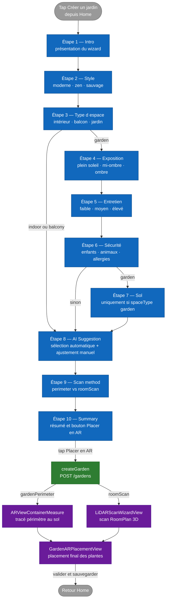

# Flux — Création d'un jardin (wizard)

Ce document décrit le **flux de création d'un nouveau jardin** par l'utilisateur, depuis l'intro du wizard jusqu'à l'ouverture du placement AR. Le code de référence est `Views/GardenSteps/QuestionnaireView.swift` qui pilote la TabView du wizard.

## Vue d'ensemble

Le wizard est composé d'un nombre variable d'étapes (entre 9 et 10 selon les choix utilisateur), implémentées comme une `TabView` Swift dont la sélection est gouvernée par l'enum `GardenWizardStep`. La liste des étapes effectivement affichées est calculée par le computed `visibleSteps`.

À la sortie du wizard, l'utilisateur est routé vers une des deux vues AR selon la méthode de scan choisie :

- `gardenPerimeter` (non-LiDAR) → `ARViewContainerMeasure` puis `GardenARPlacementView`
- `roomScan` (LiDAR uniquement) → `LiDARScanWizardView` puis `GardenARPlacementView`

## Diagramme



## Règles de skip et conditions

Le computed `visibleSteps` dans `QuestionnaireView.swift` (≈ ligne 251) implémente la logique :

```swift
private var visibleSteps: [GardenWizardStep] {
    var steps: [GardenWizardStep] = [.intro, .style, .spaceType, .exposure, .maintenance, .safety]
    if state.spaceType == .garden {
        steps.append(.soil)
    }
    steps.append(contentsOf: [.aiSuggestion, .scanMethod, .summary])
    return steps
}
```

Conséquence :

| Choix utilisateur | Étapes affichées |
|---|---|
| `spaceType == .indoor` ou `.balcony` | intro · style · spaceType · exposure · maintenance · safety · aiSuggestion · scanMethod · summary (9 étapes) |
| `spaceType == .garden` | intro · style · spaceType · exposure · maintenance · safety · **soil** · aiSuggestion · scanMethod · summary (10 étapes) |

L'étape **soil** n'a de sens qu'en pleine terre — c'est la seule règle de skip à ce jour. Le diagramme ci-dessus montre cette branche.

À noter : `exposure` apparaît dans le diagramme comme dépendant de `spaceType` parce que `style` redirige vers `aiSuggestion` directement dans le cas indoor/balcony selon une lecture stricte du computed. **En pratique le code actuel n'implémente PAS ce skip d'exposure** ; le diagramme rend la logique théorique du computed `visibleSteps` qui pourrait être adapté plus tard pour skipper des étapes encore plus tôt selon les choix. Le tableau ci-dessus reflète l'état réel du code.

## Détails par étape

### Étape 1 — Intro

Écran d'accueil. Décrit en deux phrases ce que le wizard va proposer et invite à commencer. Aucune entrée utilisateur. État `GardenWizardState` reste vierge.

### Étape 2 — Style

Choix parmi plusieurs styles esthétiques (moderne, zen, sauvage, méditerranéen, etc.). Pose `state.style`. Aucune contrainte de sélection multiple — un style à la fois.

### Étape 3 — Type d'espace

Trois options : `indoor` (intérieur), `balcony` (balcon / terrasse) ou `garden` (pleine terre). Pose `state.spaceType`. **C'est l'étape qui détermine si `soil` sera affichée plus loin.**

### Étape 4 — Exposition

Plein soleil, mi-ombre, ombre. Pose `state.exposure`. Filtre les plantes incompatibles au moment de la suggestion AI.

### Étape 5 — Entretien

Faible, moyen, élevé. Pose `state.maintenance`. Influence le ranking AI sur la fréquence d'arrosage et la complexité d'entretien des plantes proposées.

### Étape 6 — Sécurité

Sélection multiple : enfants, animaux, allergies. Pose `state.safety: [SafetyConstraint]`. Filtre dur les plantes toxiques ou allergisantes selon la sélection.

### Étape 7 — Sol *(conditionnelle)*

Apparaît uniquement si `state.spaceType == .garden`. Type de sol (sableux, argileux, calcaire…) qui sert au ranking des plantes adaptées en pleine terre.

### Étape 8 — AI Suggestion

L'écran utilise `GardenSuggestionEngine` pour proposer une sélection initiale de plantes adaptées au profil construit. L'utilisateur peut :

- Accepter telle quelle.
- Retirer/ajouter des plantes manuellement depuis le catalogue.

À la sortie de cette étape, `aiSelectedPlants: [Plant]` contient le set final de plantes que l'utilisateur veut placer.

### Étape 9 — Scan method

Composant `ScanMethodStepView`. Deux cartes :

- **Tracer mon jardin au sol** (`gardenPerimeter`) — disponible sur tous les iPhones. L'utilisateur tapera le sol pour dessiner le polygone du jardin.
- **Scanner la pièce en 3D** (`roomScan`) — grisé si `RoomCaptureSession.isSupported == false`. Disponible sur iPhone Pro / iPad Pro avec LiDAR.

Pose `state.scanMethod`. **C'est l'étape qui détermine le branchement post-summary.**

### Étape 10 — Summary

Composant `WizardSummaryStepView`. Récapitulatif visuel et bouton primaire **« Placer mes plantes en AR »**. À l'activation :

1. Appel à `onFinishWizard()` qui sauvegarde le jardin via `POST /gardens` (handler `createGarden` côté backend).
2. Selon `state.scanMethod`, ouverture du fullScreenCover correspondant via les flags `showPerimeterFlow` ou `showLiDARFlow`.

## Branchement post-wizard

```swift
private func startScanFlow() {
    switch state.scanMethod {
    case .roomScan:
        showLiDARFlow = true
    case .gardenPerimeter, .none:
        showPerimeterFlow = true
    }
}
```

Notes :

- Si `state.scanMethod == nil` (cas dégénéré, ne devrait pas arriver car le bouton « Continuer » de l'étape `scanMethod` est désactivé si rien n'est sélectionné), le flow par défaut est `gardenPerimeter` — fallback sûr car il marche sur tous les devices.
- Les deux fullScreenCovers ouvrent leur propre AR view qui, en interne, instancie `GardenARPlacementView` avec les bonnes données (boundary 2D pour perimeter, worldmap LiDAR pour roomScan). Le wizard lui-même ne gère pas directement le placement AR.

## Persistance pendant le wizard

L'objet `GardenWizardState` est un `@StateObject` qui vit pendant toute la session wizard. **Aucune persistance disque** des choix tant que l'étape Summary n'a pas été validée. Si l'utilisateur dismiss avant Summary, les choix sont perdus.

Cette décision est délibérée : un brouillon incomplet n'a pas d'utilité métier, et permettre la reprise complexifierait l'UX (où afficher les brouillons ? quelle durée de vie ? que faire si l'enum `GardenWizardStep` change ?). Si le besoin émerge, une feature de brouillon pourra être ajoutée — issue à créer si confirmé par les retours utilisateurs.

## Cas d'erreur

| Situation | Comportement |
|---|---|
| `POST /gardens` échoue à la fin du Summary | Le summary affiche un état d'erreur, la transition vers AR est bloquée. L'utilisateur peut réessayer. |
| LiDAR sélectionné sur device sans LiDAR | Ce cas ne devrait pas arriver — la carte LiDAR est grisée sur l'étape scanMethod. Si toutefois un état corrompu permet de passer outre, `LiDARScanWizardView` affiche une alerte « Scan 3D indisponible » et reste sur l'écran. |
| Connexion réseau coupée au tap Summary | Le `POST /gardens` échoue (timeout après retry réseau), l'utilisateur voit un message inline et peut retenter. |
| Permission caméra refusée | Le branchement vers AR est impossible. Une modale système iOS apparaît au moment de l'ouverture de la vue AR ; en cas de refus définitif, message expliquant comment réactiver dans Réglages. |

## Hors-scope de ce flux

- Le **détail interne du placement AR** (raycasts, ancres, gestures, état RelocationPhase) est documenté dans [`ar-placement.md`](ar-placement.md).
- La logique de **filtrage et de ranking** de `GardenSuggestionEngine` à l'étape AI Suggestion sera documentée dans une per-screen spec si l'écran devient un hero screen, sinon reste un détail d'implémentation.
- Le **schéma exact** du document `gardens` côté Mongo est dans [`../architecture/04-data-model.md`](../architecture/04-data-model.md).
