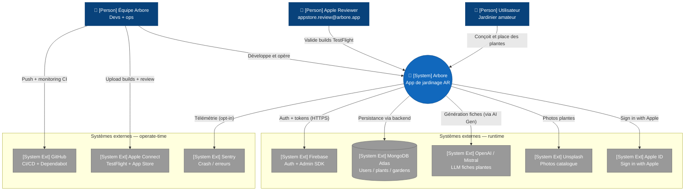

# C4 — Niveau 1 : Context

Cette vue décrit, au plus haut niveau d'abstraction, les **acteurs utilisant Arbore et les systèmes externes avec lesquels l'application interagit**. La structure interne d'Arbore n'est pas représentée à ce niveau : seules les frontières du système et ses interfaces sont visibles.

## Diagramme

> **Note de rendu** : la sémantique C4 (Person, System, External) est préservée dans les labels. La syntaxe utilisée est `flowchart` plutôt que `C4Context` natif, car le layout du C4 Mermaid est encore expérimental et produit des chevauchements d'arêtes sur les graphes denses. Voir [README](../README.md).

## Points clés

- **Arbore vu de l'extérieur** constitue une boîte unique qui communique avec plusieurs systèmes externes en runtime (Firebase, Apple ID, MongoDB Atlas, OpenAI/Mistral, Unsplash, Sentry) et des systèmes utilisés en operate-time (GitHub Actions, Apple Connect).
- **Trois catégories d'acteurs humains** sont distinguées : utilisateurs finaux (jardiniers), reviewer Apple (compte dédié `appstore.review@arbore.app`) et équipe interne. La review Apple est représentée comme un acteur distinct car son parcours d'usage fait l'objet d'une documentation spécifique (notes TestFlight).
- **Sign in with Apple** est intégré (Guideline 5.1.1) : à la suppression de compte, le backend révoque le token Apple associé (cf. [`03-components-backend.md`](03-components-backend.md)).
- **Sentry est opt-in** : la télémétrie n'est activée que si l'utilisateur accepte le partage de diagnostics (off par défaut), conformément au RGPD. Détails dans [`../operations/observability.md`](../operations/observability.md).
- **Aucun système de paiement externe** n'est intégré à ce jour : Arbore est gratuit et ne propose pas d'achats in-app. Toute évolution dans ce sens devra mettre à jour ce diagramme (Apple In-App Purchase et éventuellement un PSP).
- **iCloud Private Relay n'est pas représenté** car il ne constitue pas une intégration mais un proxy transparent susceptible de perturber les appels HTTP sortants (cf. issue #90 résolue ; l'accès public est désormais en HTTPS via Cloudflare, voir [`../operations/vps-bootstrap.md`](../operations/vps-bootstrap.md)).

## Vue suivante

Le [niveau 2 — Container](02-containers.md) ouvre la boîte « Arbore » et expose les applications et services qui la composent : application iOS, front web Next.js, backend Go et AI Generator Python.
