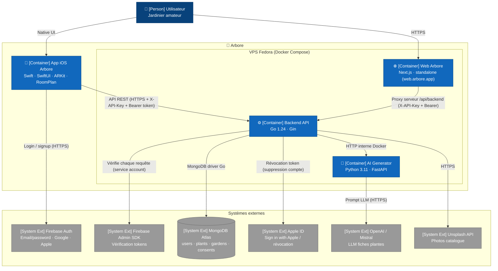

# C4 — Niveau 2 : Containers

Cette vue ouvre la boîte « Arbore » et représente les **applications et services déployables**. Un container correspond à une unité runtime indépendamment déployable : un process iOS, un container Docker ou un service Apple/cloud managé.

Pour le niveau supérieur (acteurs et systèmes externes), consulter [`01-context.md`](01-context.md).

## Diagramme

> **Note de rendu** : la sémantique C4 (Person, Container, System Ext) est préservée dans les labels. La syntaxe utilisée est `flowchart` plutôt que `C4Container` natif, car le layout du C4 Mermaid est encore expérimental et produit des chevauchements d'arêtes sur les graphes denses.

## Points clés

- **Quatre containers Arbore sont en production** : l'application iOS, le front web Next.js, le backend Go et l'AI Generator Python. Les trois derniers tournent en containers Docker sur un VPS Fedora unique, orchestrés par `docker-compose.yml`.
- **Le front web est déployé** sur `web.arbore.app` (Cloudflare → nginx → container `arbore-web` sur le port 3000). Il sert de compagnon à l'app iOS : consultation du catalogue, des jardins, calendrier d'arrosage, gestion du compte (export/suppression RGPD). Les jardins sont **créés sur iOS** (placement AR).
- **Le web n'expose jamais la clé API ni l'URL du backend au navigateur** : tous les appels passent par un **proxy serveur same-origin** (`/api/backend`) qui injecte `X-API-Key` côté serveur et relaie le token Firebase de l'utilisateur. Conséquence : pas de CORS côté navigateur, clé API jamais exposée.
- **Deux barrières de sécurité protègent l'accès aux données** :
  1. **X-API-Key** validée par un middleware backend dédié (comparaison à temps constant) — limite l'exposition aux requêtes automatisées non autorisées venant de l'extérieur.
  2. **Bearer Firebase token** validé par le Firebase Admin SDK côté backend — garantit que la requête provient d'un utilisateur authentifié, vérifié et non banni, et fournit son `uid`.
- **L'AI Generator est isolé du client** : seul le backend l'appelle (réseau Docker interne), jamais l'application iOS ou web directement. Ce choix cache la clé OpenAI/Mistral et permet caching et throttling côté backend.
- **MongoDB Atlas est externe au système Arbore** mais piloté exclusivement par le backend. Les clients (iOS, web) n'ouvrent **jamais** de connexion MongoDB directe.
- **Backend, AI Generator et Web partagent le même VPS** et communiquent via le réseau Docker interne (`http://ai-generator:8000`, `http://backend:8080`) plutôt que via l'IP publique.
- **HTTPS en façade** : l'accès public se fait en HTTPS via Cloudflare (Full strict), nginx restreint aux IP Cloudflare ; le durcissement TLS Cloudflare → origine est suivi côté opérations (cf. [`../operations/vps-bootstrap.md`](../operations/vps-bootstrap.md)).

## Choix d'infrastructure

- **VPS Fedora unique** : un serveur héberge backend, AI generator, web et le stockage des modèles/thumbnails de plantes. Cette topologie simple convient à l'échelle actuelle (beta étudiante). Une séparation en services indépendants sera envisagée si l'application monte en charge.
- **Docker Compose** orchestre les trois containers serveur via `docker-compose.yml` à la racine du dépôt. Kubernetes est volontairement écarté à ce stade pour limiter la complexité opérationnelle.
- **Firebase est un service managé** : le projet consomme l'authentification sans en assumer l'exploitation. Le compromis vendor lock-in / vitesse de delivery est tracé dans l'[ADR 0004](../decisions/0004-firebase-auth.md).

## Hors-scope de cette vue

- Le détail des **modules à l'intérieur** d'un container relève du niveau 3 (Component), traité dans [`03-components-ios.md`](03-components-ios.md), [`03-components-backend.md`](03-components-backend.md) et [`03-components-web.md`](03-components-web.md).
- Le **schéma de données MongoDB** est documenté dans [`04-data-model.md`](04-data-model.md).
- Les **parcours utilisateur** (signup, placement AR, sauvegarde de jardin) sont décrits dans [`../flows/`](../flows/).
- Le **déploiement** (VPS, Docker, TestFlight) est documenté dans [`../operations/`](../operations/).
