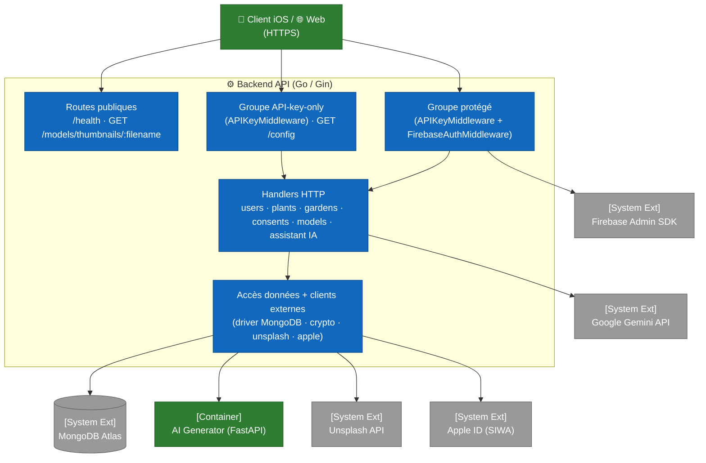

# C4 — Niveau 3 : Composants Backend

Cette vue ouvre le container **Backend API** (Go 1.24 + Gin) et expose ses modules principaux. Le code est organisé autour d'un fichier `main.go` (~2 140 lignes) regroupant déclarations de types, handlers et bootstrap, complété par un sous-dossier `middleware/` pour l'authentification et quelques fichiers spécialisés (`config.go`, `crypto.go`, `apple_revocation.go`, `unsplash.go`, `setdefault.go`), ainsi que les fichiers dédiés aux **proxies Gemini** (`ratelimit.go`, `httphardening.go`, `promptsafety.go`, `diagnose_normalize.go`).

Pour la vue d'ensemble des containers, consulter [`02-containers.md`](02-containers.md). Pour les composants côté iOS et web, consulter [`03-components-ios.md`](03-components-ios.md) et [`03-components-web.md`](03-components-web.md).

## Topologie en couches

Le backend expose **trois niveaux d'accès** distincts, définis dans `main()` : des routes **publiques** (aucun middleware), un groupe **API-key-only** et un groupe **protégé** (clé API *puis* token Firebase). Cette discipline est imposée par la composition des `router.Group(...)` dans `main.go`.

## Middleware

Le sous-dossier `middleware/` expose deux middlewares chaînés, dans cet ordre pour le groupe protégé.

| Fichier | Fonction | Rôle |
|---|---|---|
| `middleware/api_key.go` | `APIKeyMiddleware()` | Lit l'en-tête `X-API-Key` et le compare en **temps constant** (`crypto/subtle.ConstantTimeCompare`) à `ARBORE_API_KEY`. En-tête absent → `401 MISSING_API_KEY` ; clé invalide → `401 INVALID_API_KEY`. Si la clé correspond à `ARBORE_API_KEY_TEST`, le **sélecteur de base** (`DBSelectorKey`) est posé sur `test`, sinon `prod` — c'est le mécanisme de routage prod/test (#159). |
| `middleware/firebase_auth.go` | `InitFirebase()` | Initialise le SDK Admin Firebase au démarrage à partir de `FIREBASE_SERVICE_ACCOUNT_PATH`. En `GIN_MODE=release`, tout credential manquant/illisible est **fatal** ; en dev, l'auth est désactivée (fail-open). |
| `middleware/firebase_auth.go` | `FirebaseAuthMiddleware()` | Exige `Authorization: Bearer <token>` (`401 MISSING_AUTH_HEADER` / `INVALID_AUTH_FORMAT`), vérifie le token (`401 INVALID_TOKEN`), applique le **contrôle de bannissement** (`403 ACCOUNT_BANNED`) et la **vérification d'email** (`403 EMAIL_NOT_VERIFIED` pour toutes les routes sauf `POST /users`, #110), puis pose `uid` et `email` dans le contexte Gin. SDK indisponible → `503 AUTH_UNAVAILABLE` en release (fail-closed). |
| `middleware/firebase_auth.go` | `CheckUserBannedFunc` | Hook configurable injecté depuis `main.go` (`checkUserBannedFromDB`) ; interroge Mongo pour rejeter les UID `banned: true`. |

**Ordre critique** : `APIKeyMiddleware` précède `FirebaseAuthMiddleware` — inutile de consommer une vérification Firebase pour une requête sans clé applicative valide.

## Handlers HTTP (main.go)

### Routes publiques (aucun middleware)

| Endpoint | Handler | Notes |
|---|---|---|
| `GET /health` | inline | Healthcheck Docker. Renvoie `{status, service, version}`. |
| `GET /models/thumbnails/:filename` | inline (**public**) | Sert les PNG du catalogue depuis `THUMBNAILS_DIR`. Rejette `..` / `/`, exige `.png`. |

### Groupe API-key-only (`APIKeyMiddleware` seul)

| Endpoint | Handler | Notes |
|---|---|---|
| `GET /config` | `getConfig` (`config.go`) | Données de référence non sensibles nécessaires **avant** authentification : version de config, options du wizard (styles, expositions, sols…), barèmes d'entretien, poids du moteur de suggestion. Exige `X-API-Key` mais **pas** de token (#236). |

### Groupe protégé (`APIKeyMiddleware` + `FirebaseAuthMiddleware`)

Tous ces handlers reçoivent l'`uid` via `c.Get("uid")` après passage des deux middlewares.

#### Domaine Users (`/users`)

| Endpoint | Handler | Authz |
|---|---|---|
| `POST /users` | `createUser` | uid issu du token, ignore tout `uid` du body. **Seule route exemptée** de la vérification d'email. |
| `GET /users/:uid` | inline | self-only : `tokenUID == :uid` sinon `403`. |
| `POST /users/:uid/photo` | `uploadUserPhoto` | self-only ; multipart `photo`, stockée en base64 dans Mongo. |
| `GET /users/:uid/photo` | `getUserPhoto` | self-only ; renvoie les octets bruts ou `204`. |
| `GET /users/export` | `exportUserData` | RGPD art. 20 — user + gardens + consents au format JSON. |
| `PATCH /users/me` | `updateUserSelf` | self ; seul `name` éditable, trimé, max 100 runes (#138). |
| `POST /users/me/apple-link` | `linkAppleAccount` | self ; échange l'`authorizationCode` Apple contre un refresh token, **chiffré** puis stocké (#210). |
| `DELETE /users` | `deleteUser` | self ; cascade gardens + consents, révocation Apple best-effort, puis user. |

#### Domaine Plants (`/plants`)

| Endpoint | Handler | Notes |
|---|---|---|
| `POST /plants` | `createPlant` | Insertion (auth standard, pas d'authz supplémentaire). |
| `GET /plants` | `getPlants` | Catalogue complet. |
| `GET /plants/:id` | `getPlantByID` | Validation `ObjectIDFromHex`. |
| `POST /plants/generate` | `generatePlantWithAI` | Génère une fiche multilingue via l'AI Generator ; `409` si la plante existe déjà. |
| `POST /plants/generate-multiple` | `generateMultiplePlantsHandler` | Variante batch ; retourne created/skipped. |

#### Domaine Gardens (`/gardens`)

| Endpoint | Handler | Authz |
|---|---|---|
| `POST /gardens` | `createGarden` | uid forcé depuis le token. |
| `GET /gardens` | `listGardens` | Filtre par `uid`, tri `updatedAt` desc. |
| `GET /gardens/:id` | `getGardenByID` | Filtre `_id AND uid` (ownership, #222). |
| `PUT /gardens/:id` | `updateGarden` | Filtre `_id AND uid` ; mise à jour partielle (champs optionnels). |
| `DELETE /gardens/:id` | `deleteGarden` | Filtre `_id AND uid`. |

#### Domaine Consents (`/consents`) — RGPD

| Endpoint | Handler | Notes |
|---|---|---|
| `POST /consents` | `recordConsent` | Capture IP et User-Agent automatiquement si absents. |
| `GET /consents` | `getUserConsents` | Tri par timestamp descendant. |
| `GET /consents/latest` | `getLatestUserConsents` | Dernière entrée par `consentType`. |

#### Domaine Models 3D (`/models`)

| Endpoint | Handler | Notes |
|---|---|---|
| `GET /models/:filename` | inline (**protégé**) | Sert le modèle USDZ. Rejette `..` / `/` / `\`, exige `.usdz`, `Content-Type: model/vnd.usdz+zip`. Le paramètre `?lod=heavy` sert la variante haute définition depuis `./models/heavy/` (cf. [`../3d-lod-architecture.md`](../3d-lod-architecture.md)). |
| `POST /models/thumbnails/:plantId` | `uploadPlantThumbnail` | Restreint à `THUMBNAIL_UPLOAD_ALLOWED_UIDS` ; PNG, max 100 MB, `plantId` validé. |

> Contrairement au PNG de thumbnail (public), `GET /models/:filename` est dans le groupe **protégé** : la consultation d'un modèle 3D exige clé API **et** token Firebase.

#### Domaine Assistant IA (`/chat`, `/diagnose`)

Ces deux routes sont des **proxies** vers l'API **Google Gemini** : le backend relaie l'appel côté serveur pour que la clé Gemini ne soit **jamais** exposée au client. Le prompt système est envoyé via le champ `systemInstruction` (séparé du contenu utilisateur).

| Endpoint | Handler | Notes |
|---|---|---|
| `POST /chat` | `handleGeminiChat` | Assistant jardinage conversationnel (historique + message + image optionnelle). Réponse en texte brut (markdown retiré). |
| `POST /diagnose` | `handleGeminiDiagnose` | Diagnostic phytopathologique à partir d'une photo + données colorimétriques. Réponse **JSON normalisée** (cf. ci-dessous). |

L'appel sortant (`callGeminiAPI`) porte la clé dans l'en-tête `x-goog-api-key` (jamais dans l'URL, qui fuiterait dans les `*url.Error`), avec retries à backoff et **propagation du `context`** de la requête : un client déconnecté annule l'appel Gemini en cours (`http.NewRequestWithContext`). L'erreur brute n'est jamais renvoyée au client (log serveur + `502` générique).

### Durcissement des proxies Gemini (#303, #312)

Regroupé dans des fichiers dédiés, appliqué uniquement à `/chat` et `/diagnose` :

| Fichier | Rôle |
|---|---|
| `ratelimit.go` — `userRateLimiter` | **Rate limiting par `uid`** (token bucket `golang.org/x/time/rate`). `/chat` ~30 req/h (burst 10), `/diagnose` ~15 req/h (burst 5). Dépassement → `429` + `Retry-After`. Borne le coût Gemini et bloque un client qui boucle. |
| `httphardening.go` — `limitRequestBody` | **Cap du corps** à 16 Mo (`http.MaxBytesReader`) sur les deux routes (corps JSON avec image base64). |
| `httphardening.go` — `newServer` | **Timeouts serveur explicites** (`ReadHeaderTimeout` 15 s anti-Slowloris, `ReadTimeout` 60 s, `WriteTimeout` 300 s, `IdleTimeout` 120 s) — remplace `router.Run`. `MaxMultipartMemory` ramené de 1 Go à 32 Mo. |
| `httphardening.go` — `backoffOrCancel` | Backoff des retries **interruptible** par le `context` (pas d'attente ni de rappel Gemini pour une requête abandonnée). |
| `promptsafety.go` | **Anti-prompt-injection** : clause de sécurité prioritaire ajoutée aux system prompts (le contenu utilisateur est une donnée, jamais une instruction) ; entrées bornées (message, historique) ; `plantName` assaini (une ligne, sans caractères de contrôle) et encadré comme donnée non fiable au lieu d'être interpolé brut. |
| `diagnose_normalize.go` — `normalizeDiagnose` | **Validation du schéma de sortie** du diagnostic : décodage typé, valeurs numériques clampées dans `[0,1]`, tableaux bornés et jamais `null`, maladies sans nom écartées, défauts prudents. Respecte le contrat du décodeur iOS (`diseases[].name` toujours émis, clés camelCase). |

## Modules de support et clients externes

| Fichier / fonction | Rôle |
|---|---|
| `config.go` — `getConfig` | Données de référence du wizard et de l'entretien servies à `GET /config` (miroir du `GardenSuggestionEngine` iOS). |
| `crypto.go` — `encrypt` / `decrypt` | Chiffrement **AES-256-GCM** au repos. Clé maître 32 octets lue depuis `MASTER_ENCRYPTION_KEY` (64 hex), mise en cache via `sync.Once`. Format `nonce || ciphertext`. Seul appelant : le refresh token Apple (#210). |
| `apple_revocation.go` | Révocation **Sign in with Apple** (Guideline 5.1.1(v)) : `generateClientSecret()` (JWT ES256), `exchangeAuthorizationCode()` → refresh token, `revokeRefreshToken()` à la suppression de compte. `revokeAppleBestEffort` n'échoue jamais la suppression. |
| `unsplash.go` — `fetchUnsplashImageURLs(query, count)` | Récupère des photos via `UNSPLASH_ACCESS_KEY` ; fallback intégré si absente/échec. Alimente `Plant.imageURLs`. |
| `setdefault.go` — `(*Plant).SetDefaults()` | Remplit des valeurs par défaut défensives (nom, type, image, description, garantit les 4 langues) sans jamais fabriquer de données d'entretien. |
| `generateAndInsertPlant` (main.go) | Pipeline : dédup par nom → appel HTTP `AI_GENERATOR_URL/generate` → enrichissement Unsplash → résolution du fichier USDZ local → insertion Mongo. |
| `client` / `testClient` (`*mongo.Client`, main.go) | Connexions Mongo (`arbore`, et `arbore_test` optionnelle). `getDatabaseForRequest` choisit la base selon le sélecteur posé par la clé API ; fail-safe vers prod. |
| `loadDotEnv` (main.go) | Charge un `.env` local au démarrage (ne surcharge jamais l'environnement déjà défini). |
| CORS (`cors.New`, main.go) | `AllowOrigins: http://localhost:3000`, méthodes GET/POST/PUT/PATCH/DELETE/OPTIONS, en-têtes `Authorization` / `Content-Type` / `X-API-Key`, `AllowCredentials: true`. |

## Variables d'environnement

| Variable | Rôle | Sensibilité |
|---|---|---|
| `MONGODB_URI` | URI Mongo Atlas (prod). **Fatal si absente** (`log.Fatal`). | 🔒 secret |
| `MONGODB_URI_TEST` | URI Mongo pour `arbore_test` (mode test). Optionnelle. | 🔒 secret |
| `ARBORE_API_KEY` | Clé applicative attendue dans `X-API-Key` (prod). | 🔒 secret |
| `ARBORE_API_KEY_TEST` | Clé alternative routant vers `arbore_test`. Optionnelle. | 🔒 secret |
| `FIREBASE_SERVICE_ACCOUNT_PATH` | Chemin du JSON service account Firebase. | 🔒 secret |
| `MASTER_ENCRYPTION_KEY` | Clé AES-256 (64 hex) pour le chiffrement au repos (#210). | 🔒 secret |
| `APPLE_TEAM_ID` / `APPLE_KEY_ID` | Identifiants Apple Developer (révocation SIWA). | configuration |
| `APPLE_SIWA_CLIENT_ID` | `client_id` OAuth Apple. Flux natif iOS = bundle ID `com.arboreteam.arbore`. | configuration |
| `APPLE_SIWA_KEY_PATH` / `APPLE_SIWA_PRIVATE_KEY` | Clé privée `.p8` (PKCS8 EC) SIWA, par chemin ou contenu PEM. | 🔒 secret |
| `UNSPLASH_ACCESS_KEY` | Clé API Unsplash (photos du catalogue). | 🔒 secret |
| `GEMINI_API_KEY` | Clé de l'API Google Gemini pour les proxies `/chat` et `/diagnose`. Portée dans l'en-tête `x-goog-api-key`. | 🔒 secret |
| `GEMINI_MODEL` | Modèle Gemini utilisé. Défaut code : `gemini-2.5-flash`. | configuration |
| `AI_GENERATOR_URL` | URL de l'AI Generator. Défaut code : `http://localhost:8001` ; en prod : URL interne Docker. Endpoint `/generate`. | configuration |
| `THUMBNAILS_DIR` | Répertoire des thumbnails PNG. | configuration |
| `THUMBNAIL_UPLOAD_ALLOWED_UIDS` | UID autorisés à uploader des thumbnails. | configuration |
| `GIN_MODE` | `release` en prod, `debug` en local. | configuration |

> **Note `OPENAI_API_KEY`** : présente dans `.env.example` mais **consommée par l'AI Generator**, jamais par le backend Go. **Note `PORT`** : présente dans `.env.example` mais inerte — le serveur écoute en dur sur `:8080` (`http.Server` construit par `newServer` avec timeouts explicites, cf. durcissement Gemini) ; `PORT` n'agit que sur le mapping de port côté hôte (docker-compose).

## Points clés

- **Monolithe Go contenu** : `main.go` + `middleware/` + quelques fichiers spécialisés. La séparation par packages sera envisagée si le code dépasse ~2 500 lignes.
- **Aucun ORM** : driver MongoDB officiel utilisé directement avec `bson.M{...}`. Lisibilité maximale, pas de protection structurelle contre les fautes de frappe sur les champs.
- **Self-only authz omniprésente** : les handlers `users`/`gardens` filtrent par `uid` extrait du token, jamais par l'`uid` du body ou de l'URL (cf. [ADR 0005](../decisions/0005-self-authz-pattern.md)).
- **Défense en profondeur** : clé API (temps constant) **et** token Firebase (vérifié, email-verified, non banni) sur tout le trafic métier.
- **Proxies IA durcis** : les routes Gemini (`/chat`, `/diagnose`) ne relaient jamais la clé au client, sont rate-limitées par `uid`, bornées en taille de corps et en temps, protégées contre le prompt injection, et leur sortie de diagnostic est validée/normalisée avant renvoi (#303, #312).
- **Secrets chiffrés au repos** : le refresh token Apple est chiffré AES-256-GCM (`crypto.go`) avant écriture en base.
- **Configuration uniquement par l'environnement** : `MONGODB_URI` est obligatoire (`log.Fatal` si absente) — aucun credential Mongo n'est codé en dur.
- **HTTPS** : l'accès public se fait en HTTPS via Cloudflare (cf. [`../operations/vps-bootstrap.md`](../operations/vps-bootstrap.md)) ; le durcissement TLS Cloudflare → origine est suivi côté opérations.

## Hors-scope de cette vue

- Les séquences (signup avec rollback, sauvegarde de jardin) sont couvertes dans [`../flows/`](../flows/).
- Le schéma des collections est documenté dans [`04-data-model.md`](04-data-model.md).
- Les décisions architecturales (Firebase, self-authz, qualité AR) sont tracées dans [`../decisions/`](../decisions/).
