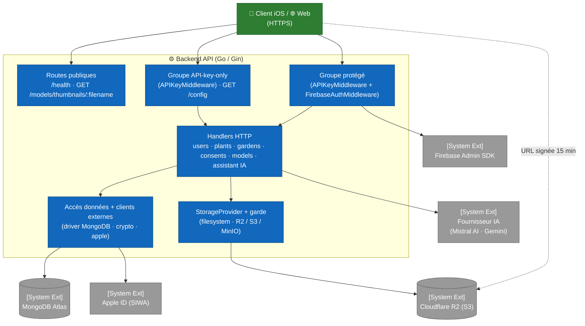

# C4 — Niveau 3 : Composants Backend

Cette vue ouvre le container **Backend API** (Go 1.25 + Gin) et expose ses modules principaux.

Le code est organisé autour d'un `main.go` (~2 500 lignes) regroupant déclarations de types, handlers et bootstrap, complété par :

- `middleware/` pour l'authentification et l'autorisation — `api_key.go`, `firebase_auth.go`, `roles.go`, `security.go` ;
- des fichiers spécialisés — `config.go`, `secrets.go`, `crypto.go`, `apple_revocation.go`, `setdefault.go`, `indexes.go`, `httplogging.go`, `observability.go`, `account_cleanup.go`, `climate.go` ;
- la **couche IA** — `llmprovider.go`, `gemini_provider.go`, `mistral_provider.go`, `llm_throttle.go`, `catalog_context.go`, `httphardening.go`, `promptsafety.go`, `diagnose_normalize.go` ;
- le **stockage des assets** — `storageprovider.go`, `storage_s3.go`, `storage_guard.go`.

Pour la vue d'ensemble des containers, consulter [`02-containers.md`](02-containers.md). Pour les composants côté iOS et web, consulter [`03-components-ios.md`](03-components-ios.md) et [`03-components-web.md`](03-components-web.md).

## Topologie en couches

Le backend expose **cinq niveaux d'accès** distincts, définis dans `buildRouter()` : des routes **publiques** (aucun middleware), un groupe **API-key-only**, un groupe **protégé** (clé API *puis* token Firebase), un sous-groupe **`account`** fermé aux invités, et un sous-groupe **`admin`**. Cette discipline est imposée par la composition des `router.Group(...)`.

`buildRouter()` est extrait de `main()` précisément pour être atteignable depuis les tests : le classement de chaque route entre ces groupes est verrouillé par un test d'inventaire (#381), qui échoue tant qu'une route ajoutée n'est pas explicitement rangée.

## Middleware

Le sous-dossier `middleware/` expose deux middlewares chaînés, dans cet ordre pour le groupe protégé.

| Fichier | Fonction | Rôle |
|---|---|---|
| `middleware/api_key.go` | `APIKeyMiddleware()` | Lit l'en-tête `X-API-Key` et le compare en **temps constant** (`crypto/subtle.ConstantTimeCompare`) à `ARBORE_API_KEY`. En-tête absent → `401 MISSING_API_KEY` ; clé invalide → `401 INVALID_API_KEY`. Si la clé correspond à `ARBORE_API_KEY_TEST`, le **sélecteur de base** (`DBSelectorKey`) est posé sur `test`, sinon `prod` — c'est le mécanisme de routage prod/test (#159). |
| `middleware/firebase_auth.go` | `InitFirebase()` | Initialise le SDK Admin Firebase au démarrage à partir de `FIREBASE_SERVICE_ACCOUNT_PATH`. En `GIN_MODE=release`, tout credential manquant/illisible est **fatal** ; en dev, l'auth est désactivée (fail-open). |
| `middleware/firebase_auth.go` | `FirebaseAuthMiddleware()` | Exige `Authorization: Bearer <token>` (`401 MISSING_AUTH_HEADER` / `INVALID_AUTH_FORMAT`), vérifie le token (`401 INVALID_TOKEN`), charge le **profil d'accès** (rôle + niveau d'abonnement + bannissement), applique le **contrôle de bannissement** (`403 ACCOUNT_BANNED`) et la **vérification d'email** (`403 EMAIL_NOT_VERIFIED` pour toutes les routes sauf `POST /users`, #110 — **et sauf les invités**, qui n'ont pas d'email), puis pose `uid`, `email` et le profil d'accès dans le contexte Gin. Le rôle `guest` est déduit de `sign_in_provider == "anonymous"` et imposé **après** la lecture en base, de sorte que `banned` reste opposable à une session anonyme (#381). SDK indisponible → `503 AUTH_UNAVAILABLE` en release (fail-closed). |
| `middleware/firebase_auth.go` | `LoadAccessProfileFunc` | Hook configurable injecté depuis `main.go` (`loadAccessProfileFromDB`) ; lit en **une seule requête** le bannissement, le rôle et le niveau d'abonnement. Un utilisateur absent de la base n'est pas une erreur : profil par défaut `member`/`free` — c'est le cas nominal de `POST /users`, qui s'exécute avant sa propre création. |
| `middleware/roles.go` | `RequireAccount()` / `RequireRole()` | Gardes d'autorisation. `RequireAccount` ferme la route aux invités (`403 ACCOUNT_REQUIRED`) ; formulé en « tout sauf `guest` » pour qu'un rôle ajouté plus tard ne soit pas exclu par oubli. Les deux **échouent en fermeture** (`500 AUTHZ_CONTEXT_MISSING`) si le profil d'accès est absent du contexte, c'est-à-dire si le garde a été monté sans `FirebaseAuthMiddleware` en amont. |
| `middleware/roles.go` | `NormalizeRole()` / `NormalizeTier()` | Normalisation à la lecture. Toute valeur vide ou inconnue replie sur `member`/`free` — **jamais** `guest` ni `admin` — ce qui rend tout backfill inutile et évite qu'une lecture dégradée n'ouvre ou ne ferme un accès par accident. `NormalizeTier` applique aussi l'expiration d'abonnement, sans dépendre d'un job externe. |

**Ordre critique** : `APIKeyMiddleware` précède `FirebaseAuthMiddleware` — inutile de consommer une vérification Firebase pour une requête sans clé applicative valide.

## Handlers HTTP (main.go)

### Routes publiques (aucun middleware)

| Endpoint | Handler | Notes |
|---|---|---|
| `GET /health` | `healthHandler` | Healthcheck Docker. Renvoie `{status, service, commit}`. `commit` est le SHA git injecté à la compilation (`-ldflags -X main.buildCommit`), et vaut `unknown` pour un binaire construit à la main. C'est le moyen de vérifier ce qui tourne réellement en production : `curl -s https://api.arbore.app/health \| jq -r .commit`. Remplace un `version` codé en dur qui n'était jamais mis à jour (cf. #341). |
| `GET /models/thumbnails/:filename` | inline (**public**) | Sert les PNG du catalogue depuis `THUMBNAILS_DIR`. Rejette `..` / `/`, exige `.png`. |

### Groupe API-key-only (`APIKeyMiddleware` seul)

| Endpoint | Handler | Notes |
|---|---|---|
| `GET /config` | `getConfig` (`config.go`) | Données de référence non sensibles nécessaires **avant** authentification : version de config, options du wizard (styles, expositions, sols…), barèmes d'entretien, poids du moteur de suggestion. Exige `X-API-Key` mais **pas** de token (#236). |

### Groupe protégé (`APIKeyMiddleware` + `FirebaseAuthMiddleware`)

Tous ces handlers reçoivent l'`uid` via `c.Get("uid")` après passage des deux middlewares.

Le sous-groupe `account` (`RequireAccount`) ne contient plus que ce qui suppose
un **document utilisateur** : profil, consentements, liaison Apple. Les jardins
en sont sortis avec #393 — ils y figuraient parce que rien ne garantissait le
sort de leurs données quand Firebase supprime un compte anonyme inactif au bout
de 30 jours, et le job de réconciliation apporte cette garantie.

Sont sorties avec eux `GET /users/export` et `DELETE /users`, sans lesquelles le
stockage serait indéfendable : un invité aurait des données sur le serveur sans
pouvoir y accéder (art. 15) ni les effacer (art. 17). Sa session courante est le
seul moment où il peut exercer ces droits — après, il n'a plus aucune identité à
prouver.

#### Domaine Users (`/users`)

| Endpoint | Handler | Authz |
|---|---|---|
| `POST /users` | `createUser` | uid issu du token, ignore tout `uid` du body. **Seule route exemptée** de la vérification d'email. |
| `GET /users/:uid` | inline | self-only : `tokenUID == :uid` sinon `403`. |
| `POST /users/:uid/photo` | `uploadUserPhoto` | self-only ; multipart `photo`, stockée en base64 dans Mongo. |
| `GET /users/:uid/photo` | `getUserPhoto` | self-only ; renvoie les octets bruts ou `204`. |
| `GET /users/export` | `exportUserData` | RGPD art. 15 et 20 — user + gardens + consents au format JSON. **Atteignable en session invité** : l'absence de document `users` n'est pas une erreur, le profil est renvoyé vide et `metadata.hasProfile` passe à `false`. |
| `PATCH /users/me` | `updateUserSelf` | self ; seul `name` éditable, trimé, max 100 runes (#138). |
| `POST /users/me/apple-link` | `linkAppleAccount` | self ; échange l'`authorizationCode` Apple contre un refresh token, **chiffré** puis stocké (#210). |
| `DELETE /users` | `deleteUser` | self ; cascade gardens + consents, révocation Apple best-effort, puis user. **Atteignable en session invité** (art. 17). La cascade Mongo est `purgeUserData`, partagée avec le job de réconciliation pour que les deux chemins ne divergent pas. |

#### Domaine Plants (`/plants`)

| Endpoint | Handler | Notes |
|---|---|---|
| `POST /plants` | `createPlant` | Insertion (auth standard, pas d'authz supplémentaire). |
| `GET /plants` | `getPlants` | Catalogue complet. |
| `GET /plants/:id` | `getPlantByID` | Validation `ObjectIDFromHex`. |

#### Domaine Gardens (`/gardens`) — ouvert aux invités depuis #393

| Endpoint | Handler | Authz |
|---|---|---|
| `POST /gardens` | `createGarden` | uid forcé depuis le token. |
| `GET /gardens` | `listGardens` | Filtre par `uid`, tri `updatedAt` desc. |
| `GET /gardens/:id` | `getGardenByID` | Filtre `_id AND uid` (ownership, #222). |
| `PUT /gardens/:id` | `updateGarden` | Filtre `_id AND uid` ; mise à jour partielle (champs optionnels). |
| `DELETE /gardens/:id` | `deleteGarden` | Filtre `_id AND uid`. |

#### Domaine Consents (`/consents`) — RGPD

| Endpoint | Handler | Notes |
|---|---|---|
| `POST /consents` | `recordConsent` | Capture IP et User-Agent automatiquement si absents. |
| `GET /consents` | `getUserConsents` | Tri par timestamp descendant. |
| `GET /consents/latest` | `getLatestUserConsents` | Dernière entrée par `consentType`. |

#### Domaine Models 3D (`/models`)

| Endpoint | Handler | Notes |
|---|---|---|
| `GET /models/:filename` | inline (**protégé**) | Sert le modèle USDZ. Rejette `..` / `/` / `\`, exige `.usdz`, `Content-Type: model/vnd.usdz+zip`. Le paramètre `?lod=heavy` sert la variante haute définition depuis `./models/heavy/` (cf. [`../3d-lod-architecture.md`](../3d-lod-architecture.md)). |
| `POST /models/thumbnails/:plantId` | `uploadPlantThumbnail` | Restreint à `THUMBNAIL_UPLOAD_ALLOWED_UIDS` ; PNG, max 100 MB, `plantId` validé. |

> Contrairement au PNG de thumbnail (public), `GET /models/:filename` est dans le groupe **protégé** : la consultation d'un modèle 3D exige clé API **et** token Firebase.

#### Domaine Assistant IA (`/chat`, `/diagnose`)

Ces deux routes sont des **proxies** vers le fournisseur d'IA configuré — **Mistral AI depuis le 2026-09-20** (#555), Gemini restant implémenté — : le backend relaie l'appel côté serveur pour que la clé ne soit **jamais** exposée au client. Le prompt système est envoyé via le champ `systemInstruction` (séparé du contenu utilisateur).

| Endpoint | Handler | Notes |
|---|---|---|
| `POST /chat` | `handleChat` | Assistant jardinage conversationnel (historique + message + image optionnelle). Réponse en texte brut (markdown retiré). |
| `POST /diagnose` | `handleDiagnose` | Diagnostic phytopathologique à partir d'une photo + données colorimétriques. Réponse **JSON normalisée** (cf. ci-dessous). |

Les handlers construisent une requête **neutre** (`LLMRequest`) et l'envoient via l'interface `LLMProvider` : ils ignorent tout du fournisseur. Avant l'envoi, ils **ancrent** la requête sur le catalogue (cf. `catalog_context.go` ci-dessous). L'implémentation `GeminiProvider` (`gemini_provider.go`) porte la clé dans l'en-tête `x-goog-api-key` (jamais dans l'URL, qui fuiterait dans les `*url.Error`), avec retries à backoff et **propagation du `context`** : un client déconnecté annule l'appel en cours (`http.NewRequestWithContext`). L'erreur brute n'est jamais renvoyée au client (log serveur + `502` générique). Changer de fournisseur (Gemini, Mistral, …) = ajouter une implémentation de `LLMProvider`, sans toucher aux handlers.

### Fournisseur IA & durcissement (#303, #312, #319)

Les proxies `/chat` et `/diagnose` sont découplés du fournisseur concret via `LLMProvider` ; le rate limiting et le cap de corps sont mutualisés avec le reste du groupe protégé (`middleware/security.go`) :

| Fichier | Rôle |
|---|---|
| `llmprovider.go` — `LLMProvider` | **Abstraction du fournisseur** : interface + types neutres (`LLMRequest`/`LLMResult`) + sélection via `AI_PROVIDER` (défaut `gemini`). Les handlers ignorent le fournisseur concret (couplage faible). |
| `gemini_provider.go` — `GeminiProvider` | Implémentation Gemini : traduction du payload (`systemInstruction`/`contents`/`inlineData`), appel HTTP (`x-goog-api-key`, retries), extraction des candidats. |
| `middleware/security.go` — `WindowLimiter` | **Rate limiting par `uid`** (fenêtre fixe, quotas minute + jour) : `/chat` 20/min, `/diagnose` 6/min (couvre aussi generate/uploads/thumbnails). Les quotas **journaliers** sont modulés par profil via `TieredWindowLimiter` — `/chat` 10 (invité) / 100 (free) / 500 (premium), `/diagnose` 3 / 20 / 100 : c'est le quota journalier qui borne la dépense Gemini, donc l'endroit où le niveau d'abonnement a du sens. Le quota minute reste uniforme, il protège le service contre les rafales. Dépassement → `429` + en-têtes `X-RateLimit-*`. Clé du compteur via `rateLimitKey` : `uid` authentifié en priorité, sinon l'IP réelle rendue par `TrustedClientIP` (`CF-Connecting-IP` puis `X-Real-IP`, validées comme IP). **`X-Forwarded-For` n'est jamais lu** — nginx le construit avec `$proxy_add_x_forwarded_for`, donc sa partie gauche vient du client et rendait le quota contournable (audit #338, constat 2). Mémoire bornée (constat 10) : purge des entrées expirées toutes les minutes indépendamment de la fenêtre (avant, une fenêtre de 24 h gardait une entrée expirée jusqu'à 48 h), et plafond de `limiterMaxEntries` compteurs — au-delà, les plus anciens sont évincés et l'événement est journalisé. Compromis assumé : évincer rend du quota gratuit, ce qui reste préférable à une croissance mémoire non bornée. |
| `middleware/security.go` — `MaxBodyBytes` | **Cap du corps** (10 Mo) global sur le groupe protégé : `413` anticipé sur `Content-Length` + `http.MaxBytesReader` (gère le chunked). |
| `httphardening.go` — `newServer` | **Timeouts serveur explicites** (`ReadHeaderTimeout` 15 s anti-Slowloris, `ReadTimeout` 60 s, `WriteTimeout` 300 s, `IdleTimeout` 120 s) au lieu de `router.Run`. |
| `httphardening.go` — `backoffOrCancel` | Backoff des retries **interruptible** par le `context` (pas d'attente ni de rappel du fournisseur pour une requête abandonnée). |
| `main.go` — `hardenClientIPResolution` | **Résolution non falsifiable de l'IP client** : `SetTrustedProxies(nil)` coupe la lecture de `X-Forwarded-For` (gin fait confiance à tous les proxies par défaut), et `TrustedPlatform = "X-Real-IP"` s'appuie sur l'en-tête que nginx écrase systématiquement. Échec fatal au démarrage. |
| `indexes.go` — `ensureIndexesAtStartup` | **Index Mongo sur les champs `uid`** créés au démarrage (idempotent, non bloquant). Évite un balayage complet de `users` à chaque requête authentifiée. Cf. [modèle de données](04-data-model.md#index). |
| `observability.go` — `initSentry` | **Reporting Sentry** (#388) : panics interceptés et 5xx remontés, ainsi que les échecs de démarrage. **No-op sans DSN**. Détails dans [`../operations/observability.md`](../operations/observability.md). |
| `promptsafety.go` | **Anti-prompt-injection** : clause de sécurité prioritaire ajoutée aux system prompts (le contenu utilisateur est une donnée, jamais une instruction) ; entrées bornées (message, historique) ; `plantName` assaini (une ligne, sans caractères de contrôle) et encadré comme donnée non fiable au lieu d'être interpolé brut. |
| `mistral_provider.go` — `MistralProvider` | Implémentation Mistral, **fournisseur en service depuis le 2026-09-20** (#555). Forme Chat Completions : prompt système en tour `system`, rôle `assistant` (et non `model`), image en objet `image_url` portant une URI de données. Les trois diffèrent de Gemini et sont verrouillées par test. Modèle par défaut `ministral-8b-2512` — seule la famille Ministral reçoit du quota sur le plan actuel. |
| `llm_throttle.go` — `throttledProvider` | **Porte globale** devant le fournisseur (#553). Les limiteurs de `middleware` sont posés PAR UTILISATEUR et répondent à l'équité ; ils ne peuvent pas protéger le quota du fournisseur, dix clients chacun dans son droit produisant ensemble bien plus que le débit autorisé. Décorateur plutôt qu'ajout dans `Generate` : chaque fournisseur garde une seule raison de changer, et un fournisseur ajouté demain en hérite. Attente bornée, puis `ErrLLMSurcharge` → **429 + `Retry-After`**, jamais 502. ⚠️ La porte est globale **par instance**. |
| `catalog_context.go` | **Ancrage sur le catalogue** (#554). Les noms de plantes cités sont rapprochés des 123 fiches, dont les soins, nuisibles et signes d'arrosage sont joints au prompt comme **données de référence** — jamais comme consignes, et assainies par `sanitizeLine`. Pas d'index vectoriel : l'appariement se fait sur les préfixes de mots du nom, sans distance d'édition, car trouver la MAUVAISE fiche injecterait les soins d'une autre plante présentés comme des faits vérifiés. Après coup, l'espèce rendue est réconciliée et la réponse porte `catalogPlantId`. |
| `diagnose_normalize.go` — `normalizeDiagnose` | **Validation du schéma de sortie** du diagnostic : décodage typé, valeurs numériques clampées dans `[0,1]`, tableaux bornés et jamais `null`, maladies sans nom écartées, défauts prudents. Respecte le contrat du décodeur iOS (`diseases[].name` toujours émis, clés camelCase). |

## Modules de support et clients externes

| Fichier / fonction | Rôle |
|---|---|
| `reconcile_guests.go` — `reconcileGuests` | **Job hors serveur** (#393), invoqué par `./main -reconcile-guests` : supprime les données Mongo dont l'`uid` a disparu de Firebase Auth, le nettoyage automatique des comptes anonymes inactifs les effaçant au bout de 30 jours. Quatre gardes, chacune sortant en erreur **sans rien supprimer** — fail-closed sur toute erreur Firebase, refus d'une énumération vide, grâce de 7 jours lue dans l'horodatage de l'`ObjectId`, simulation par défaut (`-apply` pour supprimer). La purge est `purgeUserData`, partagée avec `deleteUser`. Runbook : [`operations/vps-bootstrap.md`](../operations/vps-bootstrap.md). |
| `storageprovider.go` — `StorageProvider` | Abstraction du stockage des assets 3D (#401 étape 5), sur le modèle de `llmprovider.go` : les handlers manipulent des types neutres (`StorageObject`, `ObjectInfo`) et ignorent le support concret. `STORAGE_PROVIDER` choisit l'implémentation, `filesystem` par défaut — sans configuration, le comportement est celui d'avant l'abstraction. Deux propriétés ont guidé la forme de l'interface : `Open` rend un `io.ReadSeekCloser` pour que `http.ServeContent` honore les en-têtes `Range` (un modèle `heavy` atteint 121 Mo, un téléchargement interrompu doit pouvoir reprendre), et `PresignedURL` permet à un stockage objet de servir ses fichiers lui-même plutôt que de les relayer par le backend. `ErrObjectNotFound` distingue l'absence (404) de la panne du support (500) — les confondre masquerait une indisponibilité derrière un « modèle introuvable ». |
| `config.go` — `getConfig` | Données de référence du wizard et de l'entretien servies à `GET /config` (miroir du `GardenSuggestionEngine` iOS). |
| `crypto.go` — `encrypt` / `decrypt` | Chiffrement **AES-256-GCM** au repos. Clé maître 32 octets (64 hex) résolue par `resolveMasterEncryptionKey` : **fichier `MASTER_ENCRYPTION_KEY_PATH` en priorité**, sinon repli sur la variable `MASTER_ENCRYPTION_KEY`. Le fichier est préféré parce qu'une variable est lisible par `docker inspect` et `/proc/<pid>/environ` — or cette clé déchiffre les refresh tokens Apple, elle était donc moins protégée que ce qu'elle protège (#338 constat 4). Un chemin défini mais illisible est une **erreur**, jamais un repli silencieux. Mise en cache via `sync.Once`, format `nonce \|\| ciphertext`. Seul appelant : le refresh token Apple (#210). |
| `apple_revocation.go` | Révocation **Sign in with Apple** (Guideline 5.1.1(v)) : `generateClientSecret()` (JWT ES256), `exchangeAuthorizationCode()` → refresh token, `revokeRefreshToken()` à la suppression de compte. `revokeAppleBestEffort` n'échoue jamais la suppression. |
| `setdefault.go` — `(*Plant).SetDefaults()` | Remplit des valeurs par défaut défensives (nom, type, image, description, garantit les 4 langues) sans jamais fabriquer de données d'entretien. |
| `client` / `testClient` (`*mongo.Client`, main.go) | Connexions Mongo (`arbore`, et `arbore_test` optionnelle). `getDatabaseForRequest` choisit la base selon le sélecteur posé par la clé API ; fail-safe vers prod. |
| `loadDotEnv` (main.go) | Charge un `.env` local au démarrage (ne surcharge jamais l'environnement déjà défini). |
| CORS (`configureCORS`, main.go) | **Désactivé par défaut** : le middleware n'est installé que si `CORS_ALLOWED_ORIGINS` liste des origines (séparées par des virgules). Sans lui, aucun en-tête CORS n'est émis et le navigateur bloque toute requête cross-origin — comportement voulu, l'app web appelant l'API via son proxy Next.js **côté serveur** où CORS ne s'applique pas. Quand des origines sont configurées : méthodes GET/POST/PUT/PATCH/DELETE/OPTIONS, en-têtes `Authorization` / `Content-Type` / `X-API-Key`, `AllowCredentials: true`. L'ancienne config autorisait `http://localhost:3000` **en dur, y compris en production** (#338 constat 5). |

## Variables d'environnement

| Variable | Rôle | Sensibilité |
|---|---|---|
| `MONGODB_URI` | URI Mongo Atlas (prod). **Fatal si absente** (`log.Fatal`). | 🔒 secret |
| `MONGODB_URI_TEST` | URI Mongo pour `arbore_test` (mode test). Optionnelle. | 🔒 secret |
| `ARBORE_API_KEY` | Clé applicative attendue dans `X-API-Key` (prod). | 🔒 secret |
| `ARBORE_API_KEY_TEST` | Clé alternative routant vers `arbore_test`. Optionnelle. | 🔒 secret |
| `FIREBASE_SERVICE_ACCOUNT_PATH` | Chemin du JSON service account Firebase. | 🔒 secret |
| `MASTER_ENCRYPTION_KEY` | Clé AES-256 (64 hex) pour le chiffrement au repos (#210). | 🔒 secret |
| `APPLE_TEAM_ID` / `APPLE_KEY_ID` | Identifiants Apple Developer (révocation SIWA). | configuration |
| `APPLE_SIWA_CLIENT_ID` | `client_id` OAuth Apple. Flux natif iOS = bundle ID `com.arboreteam.arbore`. | configuration |
| `APPLE_SIWA_KEY_PATH` | Chemin interne vers la clé privée `.p8` SIWA, montée en lecture seule hors du dépôt. | 🔒 secret |
| `GEMINI_API_KEY` | Clé de l'API Google Gemini pour les proxies `/chat` et `/diagnose`. Portée dans l'en-tête `x-goog-api-key`. | 🔒 secret |
| `GEMINI_MODEL` | Modèle Gemini utilisé. Défaut code : `gemini-2.5-flash`. | configuration |
| `AI_PROVIDER` | Fournisseur retenu : `gemini` ou `mistral`. **Défaut du CODE : `gemini` ; défaut du DÉPLOIEMENT : `mistral`**, posé dans `docker-compose.yml`. Confondre les deux a produit une bascule accidentelle (#555). | configuration |
| `MISTRAL_API_KEY` | Clé Mistral, portée dans l'en-tête `Authorization` — jamais dans l'URL, qui fuirait dans les `*url.Error`. | 🔒 secret |
| `MISTRAL_MODEL` | Modèle Mistral. Défaut code : `ministral-8b-2512`. ⚠️ Seule la famille Ministral reçoit du quota ; `mistral-small` et `medium` répondent 429 avec une limite nulle. | configuration |
| `MISTRAL_RPS` / `GEMINI_RPS` | Débit déclaré par le fournisseur, en requêtes/seconde. Mistral : 3 par défaut, mesuré. Gemini : 0, soit **aucun étranglement** — son comportement ne change pas. | configuration |
| `AI_THROTTLE_MAX_WAIT` | Attente maximale devant la porte d'étranglement. Défaut 5 s : acceptable parce qu'un appel LLM en prend déjà plusieurs. | configuration |
| `MISTRAL_BASE_URL` | Surcharge de l'URL d'API. **Réservée aux tests** : permet de viser un serveur local. | configuration |
| `MONGODB_URI_PATH`, `ARBORE_API_KEY_PATH`, `GEMINI_API_KEY_PATH`, `MISTRAL_API_KEY_PATH`, `MASTER_ENCRYPTION_KEY_PATH` | Variantes **fichier** des secrets (#338 constat 4, #543). Une variable d'environnement est lisible par `docker inspect` et dans `/proc/<pid>/environ`. Vides par défaut : un montage oublié retombe sur la variable plutôt que d'empêcher le démarrage. | configuration |
| `STORAGE_PROVIDER` | `filesystem` (défaut) ou `s3`. En production : R2 via l'API S3. | configuration |
| `STORAGE_S3_ENDPOINT`, `_BUCKET`, `_REGION`, `_ACCESS_KEY`, `_SECRET_KEY`, `_USE_SSL` | Configuration du stockage objet. Les deux clés sont des secrets. | 🔒 secret / configuration |
| `CORS_ALLOWED_ORIGINS` | Origines navigateur autorisées. **Vide = CORS désactivé** (#338 constat 5) : le web passe par son proxy Next.js côté serveur. | configuration |
| `SENTRY_DSN` | DSN du projet backend. Source `SENTRY_DSN_BACKEND` dans compose — un nom partagé enverrait les erreurs du web dans le projet du backend (#388). Sans DSN, le SDK ne démarre pas et le comportement est identique. | 🔒 secret |
| `METEOFRANCE_API_KEY` / `_TOKEN`, `METEOFRANCE_CLIMATE_BASE_URL`, `GEOGOUV_API_BASE_URL` | Profil climatique local (`/climate/profile`). | 🔒 secret / configuration |
| `THUMBNAILS_DIR` | Répertoire des thumbnails PNG. | configuration |
| `ARBORE_ADMIN_UIDS` | Liste d'amorçage des UID administrateurs ; préférer ensuite les claims Firebase. | 🔒 secret |
| `GIN_MODE` | `release` en prod, `debug` en local. | configuration |

> **Note `PORT`** : définit le port d'écoute du serveur Go en exécution locale ; en conteneur, c'est la publication de port de `docker-compose.yml` qui décide.

## Points clés

- **Monolithe Go contenu** : `main.go` + `middleware/` + quelques fichiers spécialisés. La séparation par packages sera envisagée si le code dépasse ~2 500 lignes.
- **Aucun ORM** : driver MongoDB officiel utilisé directement avec `bson.M{...}`. Lisibilité maximale, pas de protection structurelle contre les fautes de frappe sur les champs.
- **Self-only authz omniprésente** : les handlers `users`/`gardens` filtrent par `uid` extrait du token, jamais par l'`uid` du body ou de l'URL (cf. [ADR 0005](../decisions/0005-self-authz-pattern.md)).
- **Défense en profondeur** : clé API (temps constant) **et** token Firebase (vérifié, email-verified, non banni) sur tout le trafic métier.
- **Proxies IA durcis** : les routes `/chat` et `/diagnose` ne relaient jamais la clé au client, sont rate-limitées par `uid`, bornées en taille de corps et en temps, protégées contre le prompt injection, et leur sortie de diagnostic est validée/normalisée avant renvoi (#303, #312).
- **Secrets chiffrés au repos** : le refresh token Apple est chiffré AES-256-GCM (`crypto.go`) avant écriture en base.
- **Configuration uniquement par l'environnement** : `MONGODB_URI` est obligatoire (`log.Fatal` si absente) — aucun credential Mongo n'est codé en dur.
- **HTTPS** : l'accès public se fait en HTTPS via Cloudflare (cf. [`../operations/vps-bootstrap.md`](../operations/vps-bootstrap.md)) ; le durcissement TLS Cloudflare → origine est suivi côté opérations.

## Hors-scope de cette vue

- Les séquences (signup avec rollback, sauvegarde de jardin) sont couvertes dans [`../flows/`](../flows/).
- Le schéma des collections est documenté dans [`04-data-model.md`](04-data-model.md).
- Les décisions architecturales (Firebase, self-authz, qualité AR) sont tracées dans [`../decisions/`](../decisions/).
