# C4 — Niveau 3 : Composants iOS

Cette vue ouvre le container **App iOS Arbore** et expose ses modules principaux. Le code source SwiftUI est organisé en dossiers fonctionnels regroupés en trois couches : présentation, domaine et infrastructure.

Pour la vue d'ensemble des containers, consulter [`02-containers.md`](02-containers.md). Pour les composants côté backend, consulter [`03-components-backend.md`](03-components-backend.md).

## Diagramme

Le diagramme ci-dessous expose **tous les modules et leurs dépendances**. Les flèches reflètent les appels effectifs identifiés dans le code.

**Convention de couleurs** : chaque module est colorisé selon sa couche d'appartenance.

- 🔵 **Bleu** — Couche présentation (SwiftUI Views)
- 🟢 **Vert** — Couche domaine (Models et Services métier)
- 🟣 **Violet** — Couche infrastructure (Network, persistance, config)
- ⚪ **Gris** — Systèmes externes (Firebase Auth SDK, Backend API)
- 🟦 **Bleu marine** — Acteurs humains

Cette représentation par classes plutôt que par subgraphs imbriqués est un parti pris assumé : la codebase contient des appels qui sautent la couche domaine (`GardenARPlacementView` qui écrit directement dans `GardenLocalStore`, par exemple), ce que les subgraphs imbriqués peinent à rendre lisiblement. L'approche par color-coding est utilisée par Shopify Polaris, Material Design 3 et IBM Carbon pour les mêmes raisons, et reste conforme à la sémantique C4 (la couche est portée par le label et la couleur du nœud).

```mermaid
flowchart TB
    user["👤 Utilisateur"]

    login["📱 LoginAuth/<br/>SignUpView · LoginView · VerifyEmailView · ReAuthView"]
    wizard["📱 Views/GardenSteps/<br/>QuestionnaireView · GardenAnalysisAuthorizationFlowView<br/>GardenExposureCaptureOverlay · GardenLocationCaptureView<br/>SpaceTypeStepView · EssentialQuestionsStepView<br/>AISuggestionStepView · LiDARScanWizardView"]
    ar_view["📱 ARGarden/<br/>GardenARPlacementView · PlantCatalogView"]
    manual_rep["📱 ARGarden/ManualReplacement/<br/>RelocationPhase · GardenMorpher · MVC · DistortionAnalyzer · Overlays"]
    profile["📱 Views/Profile/<br/>PersonalDetailsView · DataExportView · PrivacySettingsView · CloseAccountView"]
    measure["📱 measure app/<br/>ARViewContainerMeasure"]

    models["🌿 Models/<br/>User · Plant · GardenProject · WizardPlantFilter · WateringRoutine · PotMeasurement"]
    user_svc["🌿 UserService.swift"]
    garden_svc["🌿 GardenProjectService.swift"]
    suggest["🌿 Services/GardenSuggestionEngine.swift"]
    calendar["🌿 Services/CalendarService.swift"]
    save_auth["🌿 LoginAuth/saveAuthDB.swift<br/>(retry exponentiel + rollback Firebase)"]

    network["⚙️ Services/NetworkManager.swift<br/>(singleton HTTP)"]
    model_cache["⚙️ Services/ModelCacheManager.swift<br/>(cache USDZ)"]
    local_store["⚙️ Views/GardenLocalStore.swift<br/>(WorldMap + scene JSON)"]
    firestore["⚙️ DatabaseFireBaseStore/<br/>(deprecated)"]
    config["⚙️ Config/AppConfig.swift<br/>(Secrets.xcconfig)"]
    logger["⚙️ ARGarden/ArboreLog.swift<br/>(os_log catégorisé)"]
    quality["⚙️ ARGarden/Quality/<br/>ARQuality · DeviceCapabilities · ARQualityObserver · ThermalStateBanner"]

    fb_auth_ext["[System Ext] Firebase Auth SDK"]
    backend_ext["[Container] Backend API"]

    user --> login
    user --> wizard
    user --> ar_view
    user --> profile
    user --> measure

    login --> save_auth
    login --> fb_auth_ext
    save_auth --> network

    wizard --> garden_svc
    wizard --> models
    garden_svc --> models
    garden_svc --> network

    ar_view --> manual_rep
    ar_view --> local_store
    ar_view --> model_cache
    ar_view --> models
    ar_view --> quality
    model_cache --> network

    profile --> network
    profile --> fb_auth_ext

    measure --> local_store
    suggest --> models
    calendar --> models
    user_svc --> network

    network --> config
    network --> fb_auth_ext
    network --> backend_ext

    classDef person fill:#08427B,stroke:#073B6F,color:#fff
    classDef ui     fill:#1168BD,stroke:#0B4884,color:#fff
    classDef domain fill:#2E7D32,stroke:#1B5E20,color:#fff
    classDef infra  fill:#6A1B9A,stroke:#4A148C,color:#fff
    classDef ext    fill:#999,stroke:#666,color:#fff
    class user person
    class login,wizard,ar_view,manual_rep,profile,measure ui
    class models,user_svc,garden_svc,suggest,calendar,save_auth domain
    class network,model_cache,local_store,firestore,config,logger,quality infra
    class fb_auth_ext,backend_ext ext
```

## Modules par couche

### Couche présentation — SwiftUI Views

| Dossier / fichier | Rôle |
|---|---|
| `LoginAuth/` | Signup, login, vérification email, reset mot de passe (`SignUpView`, `LoginView`, `VerifyEmailView`, `ReAuthView`). |
| `Views/GardenSteps/` | Wizard piloté par `QuestionnaireView` avec trois écrans visibles : choix de l'espace, trois questions conditionnelles dans `EssentialQuestionsStepView`, puis suggestion finale. La méthode est choisie automatiquement et le prompt système caméra précède directement le scan ; `GardenAnalysisAuthorizationFlowView` ne sert qu'après un refus. `GardenExposureCaptureOverlay` collecte la direction lumineuse sans quitter la caméra pour une pièce, un balcon ou une terrasse ; `GardenLocationCaptureView` demande une nouvelle localisation après chaque scan. `LiDARScanWizardView` gère RoomPlan. |
| `ARGarden/` | Placement et visualisation des plantes en AR (`GardenARPlacementView`, god object ~4 700 LOC, `PlantCatalogView`). |
| `ARGarden/SceneUnderstanding/` | Compréhension de scène (profondeur, segmentation sémantique, fusion) : `SceneUnderstandingController`, grilles `VoxelGrid`/`TSDFGrid`, `MarchingCubes`, classifieur `SurfaceClassifier`. |
| `ARGarden/ManualReplacement/` | Sous-module dédié au flow de re-placement manuel (#111). Composants : `RelocationPhase`, `MeanValueCoordinates`, `GardenMorpher`, `DistortionAnalyzer`, `DistortionWarning`, `GhostRenderer`, plus quatre overlays SwiftUI (`Scanning`, `BoundaryTracing`, `MorphingPreview`, `Adjusting`). La machine d'états sera diagrammée dans `state-machines/relocation-phase.md` (Phase 3). |
| `Views/Profile/` | Gestion du compte (`PersonalDetailsView`, `DataExportView`, `PrivacySettingsView`, `CloseAccountView`). |
| `measure app/` | Tracé guidé du périmètre au sol via viseur central et raycasts ARKit (`ARViewContainerMeasure`). Le contour est rendu en AR, réordonné automatiquement et décroisé ; utilisé hors RoomPlan. Il expose aussi la direction caméra et la luminosité ambiante à la capture d'exposition. |

### Couche domaine — Models et Services métier

| Fichier | Rôle |
|---|---|
| `Models/User.swift` | Struct utilisateur, miroir du document MongoDB côté serveur. |
| `Models/Plant.swift` | Struct catalogue plante avec traductions multilingues et URL USDZ. |
| `Models/GardenProject.swift` | Représentation locale d'un jardin (boundary, plants placées, métadonnées). |
| `Models/WizardPlantFilter.swift` | Filtre les plantes du catalogue selon les choix du wizard (luminosité, entretien, etc.). |
| `Models/WateringRoutine.swift` | Routine d'arrosage attachée à une plante. |
| `Models/PotMeasurement.swift` | Mesure du diamètre d'un pot via ARKit (feature secondaire). |
| `UserService.swift` | Récupère l'utilisateur courant via `GET /users/:uid`. |
| `Models/GardenProjectService.swift` | CRUD des jardins via le backend. |
| `Services/GardenSuggestionEngine.swift` | Filtre et propose les plantes adaptées au profil. |
| `Services/CalendarService.swift` | Génère le calendrier d'arrosage à partir des `WateringRoutine`. |
| `LoginAuth/saveAuthDB.swift` | Pont entre Firebase Auth et `POST /users` — implémente retry exponentiel et rollback Firebase (issue #137). |

### Couche infrastructure

| Fichier | Rôle |
|---|---|
| `Services/NetworkManager.swift` | Singleton HTTP. Injecte automatiquement `X-API-Key` (depuis `AppConfig`) et `Bearer` token Firebase. Retry unique sur erreurs réseau transitoires (issue #90). |
| `Services/ModelCacheManager.swift` | Télécharge et cache les modèles USDZ depuis `GET /models/:filename` (issue #91). |
| `Views/GardenLocalStore.swift` | Persistance disque iOS — `worldmap_{id}.arworldmap` (binaire ARKit) et `scene_{id}.json` (positions des plantes). Local-only à ce jour (origine de l'issue #114). |
| `DatabaseFireBaseStore/` | Wrappers historiques autour de Firestore. **En cours de dépréciation** : les nouveaux écrans passent par le backend Go via `NetworkManager`. |
| `Config/AppConfig.swift` | Lit `baseURL` et `apiKey` depuis `Secrets.xcconfig` non versionné (cf. issue #117 résolue : rotation + purge historique). |
| `ARGarden/ArboreLog.swift` | Wrapper `os_log` catégorisé (`plants`, `network`, `AR`). Utilisé par tous les modules. |
| `ARGarden/Quality/` | Module adaptatif AR. `ARQuality` décide `environmentTexturing` au démarrage selon `DeviceCapabilities` (RAM physique) + `ProcessInfo.thermalState`. `ARQualityObserver` (singleton) écoute le thermal state au long de la vie de l'app et republie `.arboreThermalCritical`/`.arboreThermalRecovered`. `ThermalStateBanner` (SwiftUI) s'attache en overlay des vues AR. `PlantLODPolicy` pilote le LOD 3D adaptatif (thermique/budget/distance) — cf. [`../3d-lod-architecture.md`](../3d-lod-architecture.md). Issue #80 + #82 closes. |
| `Observability/` | `SentryManager` — reporting crash/erreurs **opt-in RGPD** (off par défaut). Détails dans [`../operations/observability.md`](../operations/observability.md). |

## Points clés

- **Trois couches sont clairement séparées** par convention de dossiers : présentation, domaine, infrastructure. Aucun framework MVVM n'est imposé ; la discipline tient à la review des PRs.
- **`GardenARPlacementView` est le seul god object** du codebase (≈ 4 700 lignes, extensions comprises). Sa refactorisation est suivie par l'issue #124.
- **`NetworkManager` est le point d'entrée unique** des appels HTTP. Toute requête sortante passe par ce singleton afin de garantir l'injection des credentials et le retry réseau.
- **`saveAuthDB.swift` est le seul appelant** à implémenter un retry métier avec backoff exponentiel et un rollback Firebase Auth. Cette logique est dédiée à la signup (issue #137).
- **`DatabaseFireBaseStore/` est en cours de dépréciation** au profit du backend Go pour toutes les opérations métier hors authentification.
- **`GardenLocalStore` est local-only** : aucune donnée n'est partagée entre appareils, ce qui motive l'issue #114 (récupération cross-install).

## Frameworks Apple utilisés

- **SwiftUI** pour l'ensemble de la couche UI (sauf SCNView/ARSCNView intégrés via `UIViewRepresentable`).
- **ARKit** pour le tracking AR et la sérialisation `ARWorldMap`.
- **SceneKit** pour le rendu 3D des plantes — migration vers RealityKit suivie par l'issue #83.
- **RealityKit** pour les previews de thumbnails et la mesure de pots.
- **RoomPlan** (LiDAR uniquement) pour le scan structuré de pièces.
- **FirebaseAuth** pour l'auth utilisateur ; **GoogleSignIn** pour Google ; **AuthenticationServices** pour Sign in with Apple.

## Hors-scope de cette vue

- Le détail interne de `GardenARPlacementView` (gestures, raycasts, cycle de vie ARKit) relève d'une per-screen spec (Phase 4).
- La machine d'états de `ManualReplacement/` (`RelocationPhase`) sera diagrammée dans `state-machines/relocation-phase.md` (Phase 3).
- Les champs et invariants des modèles côté backend sont documentés dans [`04-data-model.md`](04-data-model.md).
