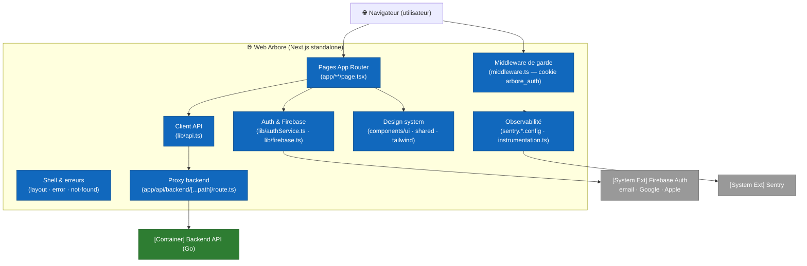

# C4 — Niveau 3 : Composants Web

Cette vue ouvre le container **Web Arbore** (Next.js 13, App Router, React 18, TypeScript) déployé sur `web.arbore.app`. Le web est un **compagnon** de l'application iOS : les jardins sont **créés sur iOS** (placement AR) ; le web permet de consulter le catalogue, ses jardins et leurs plantes, un calendrier d'arrosage, un guide saisonnier, et de gérer son compte (export / suppression RGPD).

Pour la vue d'ensemble des containers, consulter [`02-containers.md`](02-containers.md). Pour le backend qu'il consomme, voir [`03-components-backend.md`](03-components-backend.md).

## Topologie en composants

## Composants

### 1. Pages (App Router)

Le routage suit la convention App Router (`web/app/`). Le layout racine `web/app/layout.tsx` pose `<html lang="fr">`, charge la police d'affichage, le lien « passer au contenu » et la bannière hors-ligne.

| Zone | Pages | Rôle |
|---|---|---|
| Marketing | `web/app/page.tsx`, `web/app/features/page.tsx`, `web/app/pricing/page.tsx`, `web/app/about/page.tsx` | Landing, fonctionnalités, tarifs (gratuit pendant la beta), à propos. |
| Auth | `web/app/login/page.tsx`, `web/app/signup/page.tsx` | Connexion / inscription (email + boutons Google & Apple). |
| Application | `web/app/welcome/page.tsx`, `web/app/garden/page.tsx`, `web/app/garden/catalogue/page.tsx`, `web/app/garden/plant/[id]/page.tsx`, `web/app/garden/seasons/page.tsx`, `web/app/garden/calendar/page.tsx`, `web/app/garden/history/page.tsx`, `web/app/profile/page.tsx` | Tableau de bord, jardins, catalogue, fiche plante, guide des saisons, calendrier et historique d'arrosage, profil/RGPD. |

Les pages applicatives sont des composants client (`'use client'`) : elles vérifient l'état d'authentification via `onAuthStateChange` et redirigent vers `/login` si l'utilisateur n'est pas connecté.

### 2. Shell & frontières d'erreur

`web/app/error.tsx` (erreur de route, capturée vers Sentry), `web/app/global-error.tsx` (repli du layout racine) et `web/app/not-found.tsx` (404). Le shell expose aussi `OfflineBanner` et le lien d'accessibilité.

### 3. Middleware de garde

`web/middleware.ts` s'exécute avant le rendu et garde les préfixes protégés (`/garden`, `/profile`, `/welcome`) sur la base d'un cookie `arbore_auth` ; il renvoie `/login` et `/signup` vers `/garden` quand l'utilisateur est déjà connecté. **C'est un garde d'UX uniquement** — la vraie sécurité est la vérification du token Firebase par le backend à chaque appel.

### 4. Proxy backend (composant clé de sécurité)

`web/app/api/backend/[...path]/route.ts` (`runtime = 'nodejs'`) est un **reverse-proxy same-origin** vers le backend Go :

- lit l'environnement **serveur** `BACKEND_API_URL` (défaut `http://localhost:8080`) et `ARBORE_API_KEY` ;
- impose une **allowlist** de premiers segments (`users`, `plants`, `gardens`, `consents`, `models`, `config`) et bloque le path traversal (`404`) ;
- bloque explicitement `plants/generate` / `plants/generate-multiple` (génération IA non exposée au web) ;
- relaie méthode/corps/query, ajoute `X-API-Key` **côté serveur** et transmet l'en-tête `Authorization` du client ; renvoie `502` si le backend est injoignable.

Le navigateur n'appelle donc **que sa propre origine** : pas de CORS, et la clé API n'atteint jamais le client.

### 5. Client API

`web/lib/api.ts` : `API_URL = '/api/backend'`. `fetchWithAuth` attache `Content-Type: application/json` et, si un utilisateur est connecté, `Authorization: Bearer <ID token Firebase>` (via `getFirebaseToken()`). Helpers typés `apiGet` / `apiSend` ; erreurs non-2xx levées en `ApiError(status, message)`. Le module exporte les types de domaine `Plant`, `PlantFlags`, `Garden`.

### 6. Authentification & Firebase

`web/lib/firebase.ts` initialise le SDK client depuis les variables `NEXT_PUBLIC_FIREBASE_*`. `web/lib/authService.ts` fournit `signUp` / `login` / `logout` / `getFirebaseToken` / `onAuthStateChange`, ainsi que `signInWithGoogle` / `signInWithApple` (`signInWithPopup`) ; après chaque connexion réussie il **upsert l'utilisateur backend** (`POST /api/backend/users`). Un handler `onIdTokenChanged` écrit/efface le cookie d'UX `arbore_auth` consommé par le middleware.

> En production, `NEXT_PUBLIC_FIREBASE_AUTH_DOMAIN` est fixé à `web.arbore.app` (auth same-origin, `/__/auth/` relayé par nginx) pour éviter le bug « missing initial state » du popup OAuth.

### 7. Design system

- **shadcn/ui** (`web/components.json`) : ~50 primitives sous `web/components/ui/` enrobant **Radix UI** (dialog, dropdown, select, tabs, toast, tooltip…), variantes via `class-variance-authority`, `cn()` dans `web/lib/utils.ts`.
- **Marque Arbore** : palette et rayons mirrorant le design system iOS dans `web/tailwind.config.ts` ; classes utilitaires `arbore-*` dans `web/app/globals.css`.
- **Composants partagés** : `web/components/shared/` (`Navbar`, `Footer`, `OfflineBanner`, `AuthLoadingOverlay`, `SectionTitle`…) et sections d'accueil `web/components/home/` (`HeroSection`, `QuestionnaireModal`…). Icônes via `lucide-react`, animations via `framer-motion`.

### 8. Observabilité

`@sentry/nextjs` via `web/sentry.client.config.ts`, `web/sentry.server.config.ts`, `web/sentry.edge.config.ts`, chargés (serveur/edge) par `web/instrumentation.ts`. Tout est **no-op sans DSN** ; `tracesSampleRate 0.1`, `sendDefaultPii: false`, pas de Session Replay. Voir [`../operations/observability.md`](../operations/observability.md).

## Configuration & build

| Aspect | Détail |
|---|---|
| Framework | Next.js 13 (App Router), React 18, TypeScript, Tailwind. `web/next.config.js` : `output: 'standalone'`, en-têtes de sécurité globaux, pas de CSP (différée). |
| Variables publiques | `NEXT_PUBLIC_FIREBASE_*`, `NEXT_PUBLIC_SENTRY_DSN`, `NEXT_PUBLIC_APP_VERSION` (inlinées au build). |
| Variables serveur | `BACKEND_API_URL`, `ARBORE_API_KEY` (jamais préfixées `NEXT_PUBLIC_`). Source de vérité : `web/.env.example`. |
| i18n | Pas de framework i18n : interface **français uniquement** (`<html lang="fr">`) ; le contenu d'entretien est lu depuis `translations.fr.*` du backend. |
| Docker | `web/Dockerfile` multi-stage `node:20-alpine` → image `standalone` (non-root, `:3000`). |

## Points clés

- **Sécurité par le proxy serveur** : la clé API et l'URL backend restent côté serveur ; le navigateur ne voit que `/api/backend`.
- **Le web ne crée pas de jardins** : la création passe par l'AR iOS ; le web lit/édite les jardins existants et l'état d'arrosage (persistance locale `localStorage` pour le calendrier/historique).
- **Parité de marque iOS/web** : même palette, mêmes rayons et ombres pour une expérience cohérente.

## Hors-scope de cette vue

- Le backend qu'il consomme est documenté dans [`03-components-backend.md`](03-components-backend.md).
- Les tests web (Vitest) sont décrits dans [`../testing/web.md`](../testing/web.md).
- Le déploiement (Docker Compose, nginx, Cloudflare) est documenté dans [`../operations/vps-bootstrap.md`](../operations/vps-bootstrap.md).
