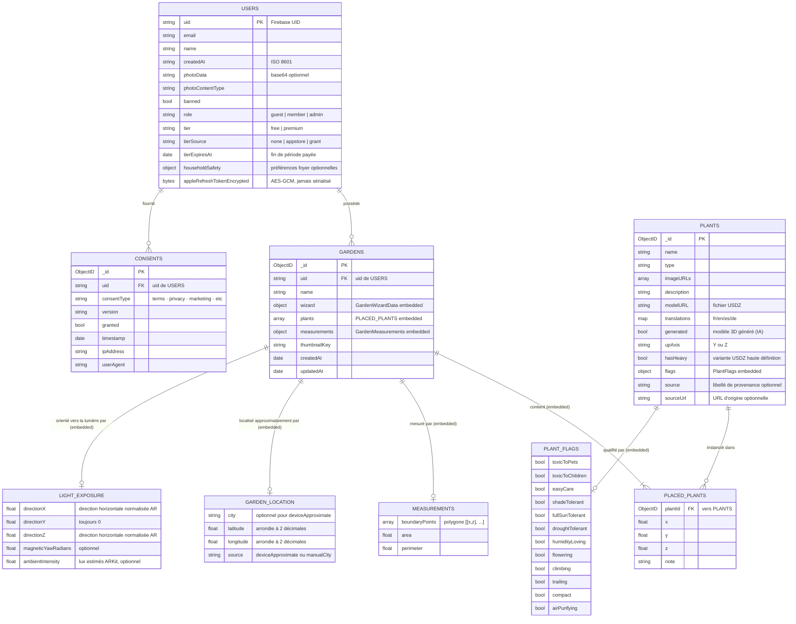

# Modèle de données — MongoDB

Cette vue décrit le schéma des collections MongoDB utilisées par Arbore. Le backend Go est le **seul** consommateur direct de cette base ; l'application iOS et le front web passent obligatoirement par l'API REST.

Le schéma est volontairement **dénormalisé** sur certains aspects (traductions de plantes embarquées, plantes placées embarquées dans le jardin) afin de réduire le nombre d'aller-retours Mongo lors des appels API. Aucune contrainte d'intégrité référentielle n'est appliquée par Mongo : la cohérence est assurée applicativement par le backend.

Il existe **quatre collections** : `users`, `plants`, `gardens`, `consents`. Deux bases physiques sont sélectionnées par requête (`arbore` en prod, `arbore_test` en test) selon le sélecteur posé par la clé API.

## Diagramme ER



## Collections

### `users`

Document représentant un utilisateur authentifié. La clé fonctionnelle est `uid` (UID Firebase), pas l'`_id` Mongo.

| Champ | Type | Notes |
|---|---|---|
| `uid` | string | UID Firebase. Clé fonctionnelle de tous les filtres `bson.M{"uid": ...}`. |
| `email` | string | Email fourni par Firebase Auth. |
| `name` | string | Nom affiché. Éditable via `PATCH /users/me` (#138). |
| `createdAt` | string | Date d'inscription au format ISO 8601 (stockée en **string**, pas en date BSON). |
| `photoData` | string (optionnel) | Photo de profil en base64. Source de vérité. |
| `photoContentType` | string (optionnel) | MIME type associé. |
| `banned` | bool | Flag de modération vérifié par le middleware Firebase à chaque requête. |
| `role` | string (optionnel) | `guest` \| `member` \| `admin` (`owner` et `support` réservés, non implémentés). **Défaut `member`** : un champ absent — tous les documents antérieurs à #377 — se normalise à la lecture, aucun backfill n'est nécessaire. N'est **jamais** alimenté depuis un binding client (#377). |
| `tier` | string (optionnel) | `free` \| `premium`. Défaut `free`. Axe **distinct** du rôle : les fusionner produirait un produit cartésien dès qu'un administrateur est aussi abonné. |
| `tierSource` | string (optionnel) | `none` \| `appstore` \| `grant` — provenance de l'abonnement, conservée pour l'audit : un `premium` doit toujours être explicable. |
| `tierExpiresAt` | date (optionnel) | Fin de période payée. Vérifiée **à la lecture** (`NormalizeTier`) : sans cela un abonnement échu resterait `premium` jusqu'au passage d'un job externe. |
| `householdSafety` | object (optionnel) | Préférences durables `avoidPetToxicity` et `avoidChildToxicity`, modifiables avec le nom via `PATCH /users/me`. Elles sont appliquées automatiquement aux nouveaux jardins. |
| `appleRefreshTokenEncrypted` | bytes (optionnel) | Refresh token Apple chiffré **AES-256-GCM**. `json:"-"` — **jamais** sérialisé vers les clients ; `nil` si l'utilisateur n'a jamais utilisé Sign in with Apple. Écrit par `linkAppleAccount`, lu par `deleteUser` pour la révocation (#210). |

### `plants`

Document du catalogue de plantes. Chaque plante embarque ses traductions multilingues afin qu'un seul `findOne` rapatrie toutes les informations.

| Champ | Type | Notes |
|---|---|---|
| `_id` | ObjectID | Clé primaire. Référencée par `PlacedPlant.plantId`. |
| `name` | string | Nom canonique. |
| `type` | string | Famille / type botanique. |
| `imageURLs` | array<string> | Photos (Unsplash) via `fetchUnsplashImageURLs`. |
| `description` | string | Description en français (servie par défaut). |
| `modelURL` | string | Nom de fichier USDZ servi par `GET /models/:filename`. |
| `translations` | map<lang, LanguageData> | Sous-document par langue (`fr`, `en`, `es`, `de`). |
| `generated` | bool (optionnel) | `true` si le modèle 3D est généré par IA (badge BETA, #84). |
| `upAxis` | string (optionnel) | `"Y"` ou `"Z"` — rotation appliquée au chargement (#89). |
| `hasHeavy` | bool (optionnel) | `true` si une variante USDZ **haute définition** existe (servie via `?lod=heavy`). Pilote le swap LOD en AR — cf. [`../3d-lod-architecture.md`](../3d-lod-architecture.md). |
| `flags` | `PlantFlags` (optionnel) | Drapeaux legacy encore utilisés pour les filtres visuels et comme indice faible. Ils ne certifient plus seuls une compatibilité. |
| `botanicalProfile` | `PlantBotanicalProfile` (optionnel) | Contraintes horticoles canoniques, structurées et sourcées champ par champ. Son absence force le verdict « Probablement compatible » ou « Non adaptée », jamais « Adaptée ». |
| `source` | string (optionnel) | Libellé de provenance optionnel (catalogue curé vs entrées legacy/beta). |
| `sourceUrl` | string (optionnel) | URL d'origine optionnelle, conservée pour mise à jour ultérieure. |

Le sous-document `translations[lang]` (type `LanguageData`) regroupe :

```
LanguageData {
  description, plantType,
  sun: {lightType, durationPerDay, orientation, windowDistance, recommendedRooms, tips},
  water: {frequency, amount, method, humidity, signsLack, signsExcess, recommendedWater},
  soilAndPot: {substrate, drainage, potSize, repotFrequency, repotSigns},
  health: {commonProblems, symptomsAndCauses, pests, treatments, prevention},
  lifeCycle: {growth, flowering, dormancy, fertilizer, pruning},
  care: {weekly, monthly, yearly, extraTips}
}
```

#### Sous-document `PlantBotanicalProfile`

Le moteur environnemental utilise en priorité ce sous-document. Il contient : environnements intérieur/extérieur, température minimale, heures de soleil direct, humidité intérieure, intervalle d'arrosage, drainage, hauteur et largeur adultes, volume et profondeur minimaux du pot, tolérance au vent, à la sécheresse et aux embruns, toxicité animaux/enfants et version du schéma.

Chaque valeur est un `PlantFact<T>` (`value` + `evidence`) ou un `PlantRangeFact` (`minimum`, `maximum`, `unit`, `evidence`). `evidence` conserve `sourceName`, `sourceURL`, `reviewedAt` et `reliability`. Pour permettre le verdict **Adaptée**, la donnée utilisée doit posséder une source, une date de revue et une fiabilité `high`. Une valeur absente ou insuffisamment sourcée reste explicitement à confirmer.

Les contraintes critiques — intérieur/extérieur, rusticité, lumière directement incompatible, toxicité demandée, volume du pot et dimensions disponibles — sont évaluées avant le classement esthétique. Un conflit connu produit **Non adaptée**. Sans conflit mais avec une donnée critique inconnue, le verdict maximal est **Probablement compatible**.

#### Sous-document legacy `PlantFlags`

Douze booléens historiques. Ils restent utiles pour la recherche et les filtres d'apparence. Une toxicité `true` peut encore déclencher une exclusion de précaution, mais une valeur `false` ne prouve pas que la plante est sûre car l'ancien schéma confondait « faux » et « non recherché ».

| Drapeau | Signification |
|---|---|
| `toxicToPets` | Toxique pour les animaux. |
| `toxicToChildren` | Toxique pour les enfants. |
| `easyCare` | Entretien facile. |
| `shadeTolerant` | Tolère l'ombre. |
| `fullSunTolerant` | Tolère le plein soleil. |
| `droughtTolerant` | Tolère la sécheresse. |
| `humidityLoving` | Aime l'humidité. |
| `flowering` | Plante à fleurs. |
| `climbing` | Grimpante. |
| `trailing` | Retombante. |
| `compact` | Format compact. |
| `airPurifying` | Dépolluante. |

### `gardens`

Document représentant un jardin créé par un utilisateur. Les plantes placées sont **embedded** — la lecture d'un jardin entier ne coûte qu'un `findOne`.

| Champ | Type | Notes |
|---|---|---|
| `_id` | ObjectID | Clé primaire. |
| `uid` | string | UID propriétaire (FK logique vers `users.uid`). Posé côté serveur depuis le token, filtré dans tous les CRUD. |
| `name` | string | Nom affiché. |
| `wizard` | `GardenWizardData` | Choix du wizard, méthode de scan, capture d'exposition optionnelle, localisation approximative, réponses conditionnelles et fiche d'espace optionnelle. |
| `plants` | array<`PlacedPlant`> | Plantes placées (voir ci-dessous). |
| `measurements` | `GardenMeasurements` (optionnel) | Géométrie de la pièce/jardin tracée en AR : `boundaryPoints` (polygone), `area`, `perimeter`. Acceptée en création et en mise à jour. |
| `thumbnailKey` | string (optionnel) | Clé d'image pour la vignette du jardin sur la home. |
| `createdAt`, `updatedAt` | date | Timestamps gérés par le backend (`updateGarden` met à jour `updatedAt`). |

Sous-document optionnel `wizard.location` (`GardenLocationData`) :

| Champ | Type | Notes |
|---|---|---|
| `city` | string (optionnel) | Ville issue du géocodage approximatif ou saisie manuelle. |
| `latitude`, `longitude` | float (optionnels) | Coordonnées appareil arrondies à deux décimales côté iOS avant envoi ; absentes lors d'une saisie manuelle. |
| `source` | string | `deviceApproximate` ou `manualCity`. |

Le modèle ne possède volontairement aucun champ d'adresse exacte. Le backend persiste uniquement le DTO déjà minimisé par le client.

`state.location` est réinitialisé au lancement de chaque nouveau jardin. Après le scan, l'application effectue une nouvelle mesure ponctuelle ou demande une nouvelle ville ; elle ne copie jamais la localisation d'un autre jardin.

Sous-document optionnel `wizard.lightExposure` (`GardenLightExposureData`), collecté uniquement pour une pièce, un balcon ou une terrasse :

| Champ | Type | Notes |
|---|---|---|
| `directionX`, `directionY`, `directionZ` | float | Direction visée par la caméra dans le repère AR du scan, projetée et normalisée horizontalement (`directionY = 0`). |
| `magneticYawRadians` | float (optionnel) | Lacet par rapport au nord magnétique lorsque Core Motion fournit ce repère. |
| `ambientIntensity` | float (optionnel) | Estimation instantanée de la lumière ambiante fournie par `ARLightEstimate`, en lux. |

La direction AR et le lacet magnétique permettent de relier la géométrie mesurée à une orientation réelle. La valeur de luminosité est un indice ponctuel, pas une mesure durable de l'ensoleillement.

Sous-document optionnel `wizard.conditionalAnswers` (`GardenConditionalAnswersData`), déclaré après la localisation :

| Champ | Valeurs | Contexte |
|---|---|---|
| `plantingMode` | `inGround`, `containers`, `both` | Jardin. |
| `drainage` | `fast`, `normal`, `slow` | Jardin, comportement de l'eau après une forte pluie. |
| `windExposure` | `sheltered`, `sometimesWindy`, `veryExposed` | Balcon ou terrasse. |
| `maximumContainerSize` | `small`, `medium`, `large` | Balcon ou terrasse, soit jusqu'à 10 L, jusqu'à 30 L, ou 30 L et plus. |
| `wateringCapacity` | `low`, `regular`, `frequent` | Jardin, balcon ou terrasse. |
| `directSunDuration` | `none`, `oneToThreeHours`, `fourToSixHours`, `moreThanSixHours` | Pièce ; remplace toute déduction depuis un lux instantané. |
| `indoorHumidity` | `dry`, `normal`, `humid` | Pièce. |
| `nearbyHeat` | `none`, `radiator`, `underfloorHeating`, `airConditioning`, `heatingAndAirConditioning` | Pièce. |

`containerProject` reste décodable uniquement pour les anciens jardins. La sécurité reste lisible dans `wizard.safety`, mais n'est plus redemandée pour chaque jardin : les préférences persistantes `users.householdSafety` sont chargées au démarrage du wizard et copiées dans le snapshot du nouveau jardin pour permettre les exclusions de toxicité. Une question ignorée ou « Je ne sais pas » n'est jamais encodée.

Sous-document optionnel `wizard.siteProfile` (`GardenSiteProfileData`), édité depuis le plan 2D :

| Champ | Type | Notes |
|---|---|---|
| `orientation` | `GardenOrientationData` (optionnel) | Direction 0–360°, 0° = nord. |
| `sunlight` | `GardenSunlightData` (optionnel) | Fourchette `minimumHours` / `maximumHours`. |
| `wind` | `GardenWindData` (optionnel) | `sheltered`, `light`, `moderate` ou `strong`. |
| `availableHeight` | `GardenAvailableHeightData` (optionnel) | Hauteur en mètres, déclarée tant qu'elle n'est pas mesurée. |
| `climate` | `GardenClimateData` (optionnel) | Températures historiques min/max, risque de gel, altitude et exposition littorale, avec provenance. Alimenté automatiquement par `POST /climate/profile` après la localisation quand une ville ou position approximative est disponible. |
| `plantingZones` | array<`GardenPlantingZoneData`> | Polygones X/Y/Z dans le repère du contour, nommables et excluables. |

Chaque valeur possède un `metadata` avec `source` (`measured`, `inferred`, `declared`, `regionalEstimate`), `confidence` (`high`, `medium`, `low`), ainsi que `sourceReference` et `observedAt` optionnels. Les champs restent absents tant qu'aucune donnée réelle n'est disponible ; l'interface ne fabrique pas de valeur de remplacement. L'enrichissement climat côté backend peut utiliser Météo-France Données Publiques lorsqu'une clé serveur est configurée, sinon il renvoie une estimation régionale Arbore avec une confiance plus faible.

Sous-document `PlacedPlant` :

| Champ | Type | Notes |
|---|---|---|
| `plantId` | ObjectID | FK vers `plants._id`. |
| `x`, `y`, `z` | float | Position 3D **dans le repère du jardin** (pas le repère monde ARKit, local-only iOS). |
| `note` | string (optionnel) | Note libre. |

⚠️ **Limite actuelle** : la position 3D persistée côté serveur n'inclut ni rotation ni échelle. Les transformations 4×4 réelles vivent uniquement dans le `scene_{id}.json` local côté iOS (#114).

### `consents` — RGPD

Trace d'audit append-only. Une entrée est créée à chaque action (accept/decline), jamais modifiée.

| Champ | Type | Notes |
|---|---|---|
| `_id` | ObjectID | Clé primaire. |
| `uid` | string | UID utilisateur (FK logique vers `users.uid`). |
| `consentType` | string | `"terms"`, `"privacy"`, `"marketing"`, etc. (#67). |
| `version` | string | Version du document de consentement présenté. |
| `granted` | bool | `true` si accepté, `false` si refusé/retiré. |
| `timestamp` | date | Auto-set à `time.Now()` si absent. |
| `ipAddress` | string | **Toujours vidé** par `recordConsent` : l'IP n'est pas nécessaire pour prouver le consentement et ajouterait une donnée personnelle en base. Le champ reste dans le schéma pour les documents historiques. |
| `userAgent` | string | Auto-set au User-Agent si absent. |

## Index

Déclarés dans `indexes.go` (`requiredIndexes`) et créés au démarrage par `ensureIndexesAtStartup()`, sur la base prod **et** sur `arbore_test`. L'opération est idempotente, et un échec est journalisé sans bloquer le démarrage (sans index l'API reste fonctionnelle, seulement plus lente).

| Collection | Index | Sert à |
|---|---|---|
| `users` | `{uid: 1}` **unique** | Lecture du profil d'accès à **chaque requête authentifiée** (`loadAccessProfileFromDB` : bannissement, rôle et niveau d'abonnement en une requête) + lectures/écritures de profil, et **garantie structurelle d'unicité du compte** |
| `gardens` | `{uid: 1, updatedAt: -1}` | `listGardens` (filtre `uid` + tri `updatedAt`) ; sert aussi de préfixe aux requêtes sur `uid` seul |
| `consents` | `{uid: 1, timestamp: -1}` | `getUserConsents` / `getLatestUserConsents` (filtre `uid` + tri `timestamp`) |

Avant ces index, la seule collection indexée l'était sur `_id` : chaque requête authentifiée déclenchait un **balayage complet** de `users` (audit #338, constat 7).

> ✅ **`users.uid` est unique.** Deux protections complémentaires, et il faut les deux : `createUser` en **upsert** évite de créer des doublons, mais seul l'**index unique** rend la duplication impossible — y compris pour un script, une écriture manuelle ou un futur chemin de code qui oublierait la règle (audit #338, constat 1).
>
> **Historique.** `createUser` faisait un `InsertOne` inconditionnel et `deleteUser` un `DeleteOne` : la production comptait 30 documents pour 7 uid, et l'effacement d'un compte laissait des données personnelles derrière lui alors que l'identité Firebase était supprimée. Migration appliquée le 26/07/2026 via `ArboreBackend/scripts/dedupe-users.js` : **48 → 25 documents, 0 doublon, aucun utilisateur perdu**.
>
> **Règle de fusion** : champ absent/vide → la valeur non vide gagne ; deux valeurs non vides qui diffèrent → la plus récente gagne ; `createdAt` → la plus ancienne ; `banned` → `true` si n'importe quelle copie l'est. Le survivant est le document au `_id` le plus ancien.
>
> Cette règle n'est pas « garder la copie la plus récente », et ce n'est pas un détail : mesuré en production, **2 des 7 comptes dupliqués ne portaient leur `appleRefreshTokenEncrypted` que sur leur copie la plus ancienne**. Les perdre aurait rendu la révocation du compte Apple impossible à la suppression (Guideline 5.1.1(v), cf. #210).
>
> ⚠️ **Changer les caractéristiques d'un index existant est impossible en place.** MongoDB renvoie selon le cas `IndexOptionsConflict` (**85**, les options divergent) ou `IndexKeySpecsConflict` (**86**, les specs de clé divergent). Ajouter `unique: true` à un index existant renvoie **86** — vérifié en production. `ensureIndexes` ne tente donc **pas** de remplacer l'index automatiquement : un `drop` suivi d'un `create` qui échoue laisserait la collection sans aucun index, donc en balayage complet à chaque requête authentifiée. Le log affiche à la place la commande `dropIndex`/`createIndex` à exécuter, une fois les doublons éliminés.

`plants` n'est pas indexée : sa seule recherche par nom (`generateAndInsertPlant`) est une regex insensible à la casse, qu'un index classique ne peut pas exploiter efficacement. Si ce chemin devient chaud, la bonne réponse est un champ `nameNormalized` indexé.

## Relations entre collections

Toutes les relations sont **logiques** (par `uid` ou `ObjectID`), aucune n'est imposée par Mongo. La cohérence repose sur :

- `deleteUser` qui supprime **en cascade** : gardens → consents → (révocation Apple best-effort si `appleRefreshTokenEncrypted` présent) → user.
- Les filtres `bson.M{"_id": id, "uid": uid}` qui garantissent l'ownership sur update/delete des jardins.
- L'`uid` toujours injecté depuis le token, jamais accepté du body.
- `exportUserData` (RGPD art. 20) qui agrège user + gardens + consents, mais **exclut** `appleRefreshTokenEncrypted`.

## Note — documents en mode test

Les insertions via le sélecteur de base **test** sont étiquetées par `maybeLabelTestDoc` avec deux champs hors-schéma : `_test: true` et `_createdAtUTC`. Ces champs n'apparaissent **jamais** dans les documents de production et ne figurent dans aucune structure Go ; ils permettent un nettoyage sûr de la base de test.

## Hors-scope de cette vue

- Le pipeline de génération de plantes (`generateAndInsertPlant`) relève de [`03-components-backend.md`](03-components-backend.md).
- Les fichiers locaux iOS (`scene_{id}.json`, `worldmap_{id}.arworldmap`) sont propres au client et n'apparaissent pas dans Mongo — voir [`03-components-ios.md`](03-components-ios.md).
- Les séquences signup et sauvegarde de jardin sont documentées dans [`../flows/`](../flows/).
