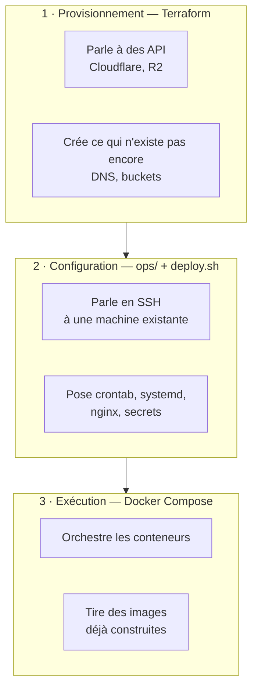
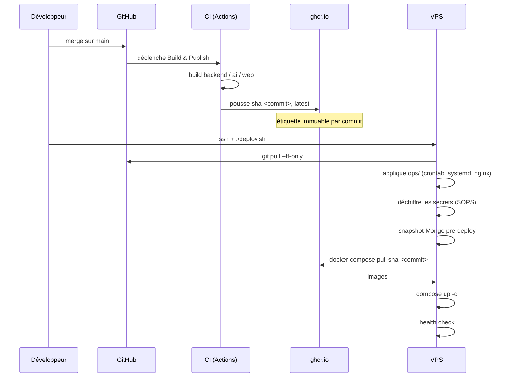
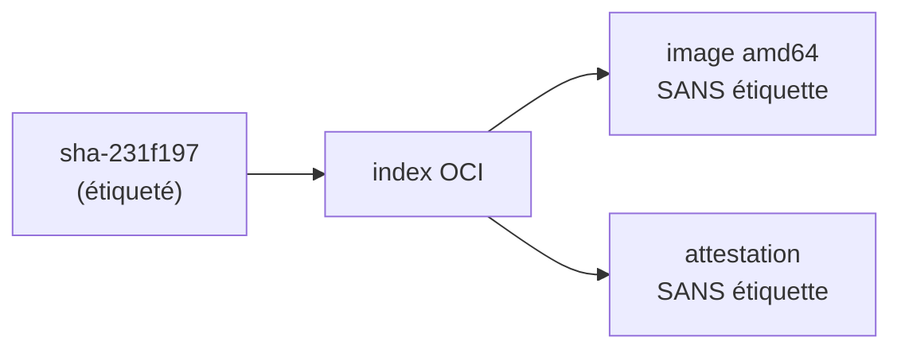
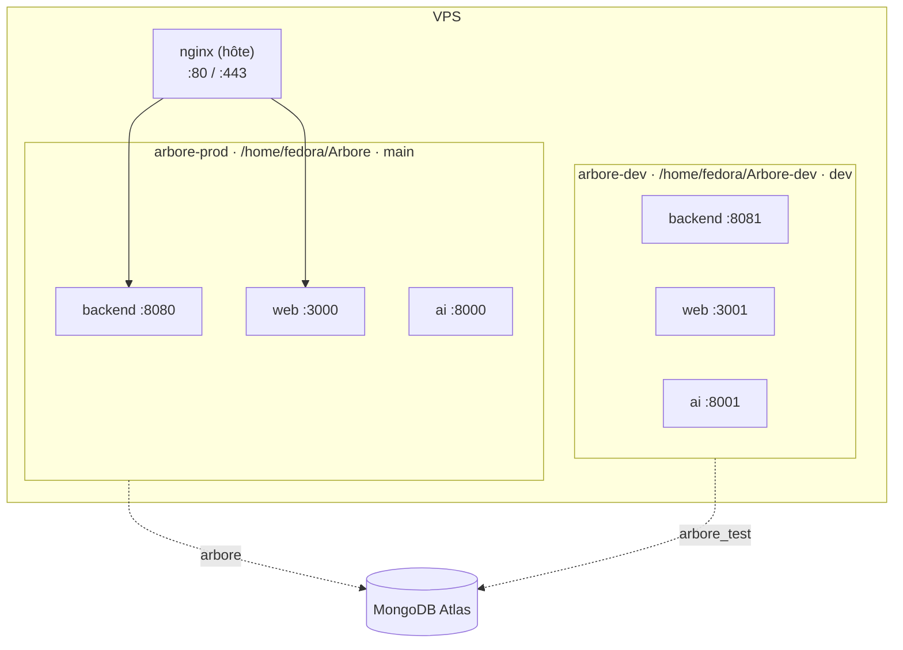
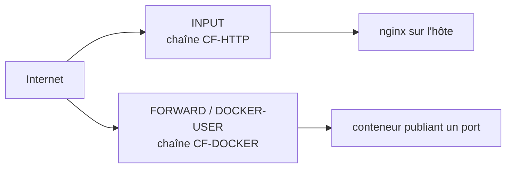

# C4 — Vue de déploiement : infrastructure et exploitation

Cette vue décrit **comment le code devient un service qui tourne**, et ce qui
garantit qu'on sait lequel tourne.

Pour les containers eux-mêmes, voir [`02-containers.md`](02-containers.md).

## Le principe

> **Le dépôt est la définition complète d'un déploiement.**
>
> `git clone`, fournir les secrets, lancer le déploiement avec un type
> d'environnement — tout est actif, sans commande tapée à la main ensuite.

Ce principe a une conséquence qui gouverne tout le reste : **aucune
configuration ne doit exister uniquement sur une machine**. Ce qui n'existe que
là dérive sans que rien ne le signale, et la documentation qui la décrit dérive
avec elle.

La preuve historique : `vps-bootstrap.md` documentait *un* cron quand le VPS en
avait *deux*. La dérive a survécu des mois, découverte par hasard en tapant
`crontab -l` pour en installer un troisième.

---

## Les trois couches

Elles se distinguent par **le canal qu'elles empruntent**, et cette distinction
explique pourquoi on ne peut pas les fusionner.



| Couche | Canal | Crée / modifie |
|---|---|---|
| **Terraform** | API du fournisseur | la machine, le DNS, le bucket |
| **`ops/` + `deploy.sh`** | SSH sur une machine qui existe | paquets, crontab, systemd, nginx, secrets |
| **Docker Compose** | démon Docker local | les conteneurs applicatifs |

> **Terraform ne se connecte jamais à une machine.** Il clique les boutons du
> tableau de bord à votre place, par la même API. Un accès SSH ne lui sert à
> rien — c'est le mauvais type d'accès.

Les brancher l'une sur l'autre par un `provisioner "remote-exec"` est un
anti-patron : un provisioner ne tourne qu'à la création, ne rejoue jamais, et ne
détecte aucune dérive.

---

## Le trajet d'un commit jusqu'à la production



**Le VPS ne compile plus rien.** Il tirait auparavant trois builds à chaque
déploiement — dix minutes de CPU et plusieurs Go de couches intermédiaires sur
un disque déjà tendu — pour refaire ce que la CI venait de produire.

### Le repli est délibéré, et bruyant

Si ghcr est injoignable ou l'image absente, `deploy.sh` **construit en local**
et le signale. Un déploiement ne doit pas dépendre de la disponibilité d'un
registre ; mais il ne doit jamais dériver en silence.

---

## Étiquetage des images

| Étiquette | Portée | Durée de vie |
|---|---|---|
| `sha-<commit complet>` | tout push sur `main` ou `dev` | 10 dernières par package |
| `1.2.3`, `1.2` | étiquette git `v*` | **indéfinie** |
| `latest` | branche par défaut uniquement | mouvante |
| `main`, `dev`, `pr-42` | branche ou PR | mouvante |

Le **SHA complet** est requis : `deploy.sh` tire `sha-$(git rev-parse HEAD)`.
Un SHA court ne correspondrait à rien et le déploiement retomberait
silencieusement sur un build local.

`latest` est restreinte à la branche par défaut. Sans cette garde, une
publication depuis `dev` déplacerait l'étiquette et le repli manuel
`docker pull …:latest` servirait autre chose que la production.

### Purge et rétention

Un piège mérite d'être connu, parce qu'il coûte la production :

> **« Sans étiquette » ne veut pas dire « supprimable ».**
>
> Une étiquette ne porte pas l'image : elle porte un **index** qui référence
> l'image et son attestation de provenance, **elles-mêmes sans étiquette**.



L'option `delete-only-untagged-versions: true` — celle que suggèrent tous les
exemples — supprimerait l'image servie en production et laisserait un index
pointant dans le vide.

`scripts/purge-package-versions.py` descend donc dans chaque manifeste
**étiqueté** pour construire l'ensemble protégé. Quatre gardes, reprises du job
de réconciliation : simulation par défaut, fail-closed, refus si aucune
étiquette n'est trouvée, et exclusion du commit lu depuis `GET /health`.

---

## Les environnements

Deux piles indépendantes sur une machine. Elles partagent le noyau, le disque et
le projet Firebase ; elles ne partagent **ni la version, ni les ports, ni le
fichier d'environnement**.



**Un checkout git par environnement est nécessaire, pas confortable.**
`deploy.sh` calcule l'étiquette d'image depuis `git rev-parse HEAD` : un
checkout partagé ferait déployer le même commit des deux côtés, ce qui
annulerait l'intérêt d'avoir deux environnements.

**Un environnement non primaire ne touche pas à la configuration hôte.** Le
crontab est rendu avec le chemin du checkout courant : appliqué depuis
`Arbore-dev`, il ferait pointer les tâches de production vers ce répertoire, job
de réconciliation compris.

Détail opérationnel dans [`../operations/vps-bootstrap.md`](../operations/vps-bootstrap.md).

---

## Secrets

Chiffrés dans le dépôt par **SOPS + age**. SOPS chiffre les **valeurs** et
laisse les **clés** lisibles : l'inventaire est versionné et relisible en revue
de PR, les valeurs ne le sont pas.

```
GHCR_TOKEN=ENC[AES256_GCM,data:rcfZ…]
```

Une clé age par environnement. `apply_secrets` déchiffre au déploiement vers le
fichier d'environnement et `arbore-data/secrets/`.

**Sans clé privée, le déploiement continue** avec la configuration en place. Une
machine sans clé doit se déployer comme avant, pas échouer.

### Le secret zéro

Il reste un secret qui ne peut pas vivre dans le dépôt : **la clé age**, puisque
c'est elle qui déchiffre les autres.

> L'automatisation ne crée pas de confiance, elle la propage. Le geste manuel ne
> disparaît jamais : il remonte d'un niveau et s'amortit.

| | Gestes manuels |
|---|---|
| Machine sans identité, N machines | **N** — une pose de clé par machine |
| Cloud avec identité d'instance | **1, une fois** — les identifiants du compte |

Sur un cloud, l'instance lit ses secrets par son identité et SOPS accepte
**AWS KMS** comme destinataire supplémentaire — le `.sops.yaml` gagne une ligne,
rien n'est à réécrire.

⚠️ **Terraform ne doit jamais porter la clé age.** La valeur atterrirait en clair
dans le state. Il déclare *« cette instance a le droit de lire ce secret »*,
jamais le secret.

---

## Réseau et pare-feu d'origine

L'origine n'accepte `:80` et `:443` que depuis les plages Cloudflare. Ce
verrouillage couvre **deux chemins distincts**, et c'est le point le plus facile
à manquer :



> Le trafic destiné à un **conteneur** ne traverse pas `INPUT`. Ne protéger que
> `INPUT` laisserait l'origine ouverte dès qu'un service passerait en conteneur
> — sans erreur, le site continuant de fonctionner.

Dans `DOCKER-USER` il faut **`RETURN`** et non `ACCEPT` : un `ACCEPT` est
terminal pour tout le hook `FORWARD` et court-circuiterait les règles propres de
Docker.

---

## Ce qui est garanti, et comment le vérifier

| Garantie | Vérification |
|---|---|
| La production sert le commit attendu | `curl -s https://api.arbore.app/health \| jq -r .commit` |
| Le DNS et le bucket R2 sont conformes | `terraform plan` — code de sortie 0 |
| L'origine reste fermée en direct | connexion TCP à l'IP sur `:443` depuis l'extérieur |
| Les deux environnements sont indépendants | `/health` sur `:8080` et `:8081` — commits distincts |
| Rien n'a été construit sur le VPS | « Images tirées depuis ghcr » dans le journal |

---

## Ce qui n'est délibérément pas automatisé

| | Pourquoi |
|---|---|
| **Le déploiement lui-même** | il reste un geste décidé. Le rendre automatique est traité en #430, et suppose d'abord une remontée d'alerte |
| **La pose de la clé age** | secret zéro — irréductible sans identité de machine |
| **La création des projets Firebase** | le critère du §1 vise le déploiement, pas la création initiale d'un compte fournisseur |
| **La suppression d'un package entier** | opération unique et irréversible ; doter un script hebdomadaire d'une telle capacité serait un mauvais échange |

---

## Références

- [#401](https://github.com/ArboreTeam/Arbore/issues/401) — issue parente : rendre le dépôt déployable sur N environnements
- [#341](https://github.com/ArboreTeam/Arbore/issues/341) — la dérive non détectée à l'origine du chantier
- [#425](https://github.com/ArboreTeam/Arbore/issues/425) — tirage d'images
- [#427](https://github.com/ArboreTeam/Arbore/pull/427) — déclaration Terraform
- [#434](https://github.com/ArboreTeam/Arbore/issues/434) — seconde pile
- [#442](https://github.com/ArboreTeam/Arbore/issues/442) — purge et rétention
- [`../operations/vps-bootstrap.md`](../operations/vps-bootstrap.md) — procédures
- [`../operations/stockage-assets.md`](../operations/stockage-assets.md) — R2 et MinIO
