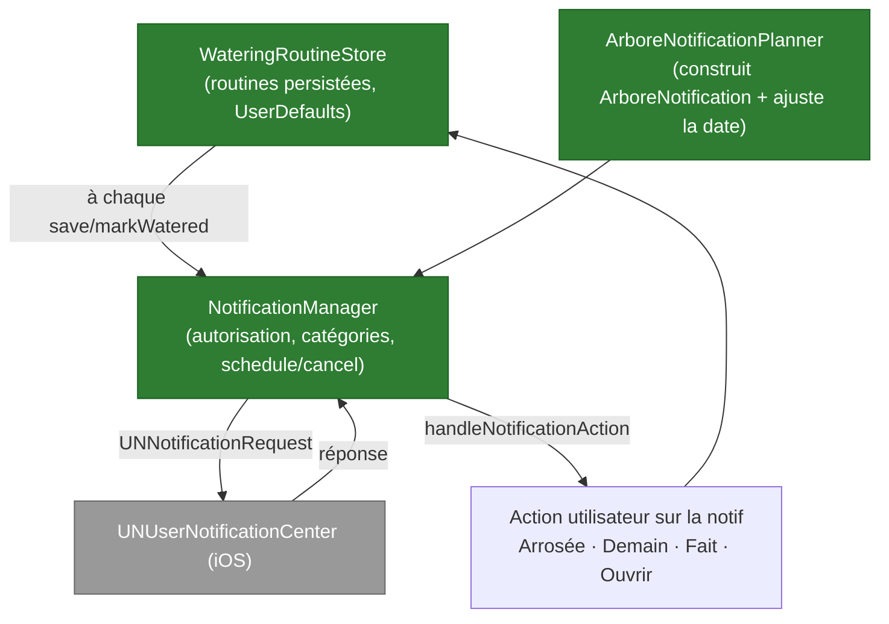

# Composant — Notifications locales

Arbore programme des **notifications locales** (`UNUserNotificationCenter`) pour rappeler à l'utilisateur d'**arroser** ses plantes, d'effectuer un **soin** (rempotage, taille, engrais…), et pour quelques nudges (jardin non finalisé, alerte climatique). **Aucune notification distante (push/APNs)** : l'infrastructure push a été retirée, tout est planifié on-device.

Fichiers : `NotificationManager.swift` (accès système + planification), `ArboreNotificationPlanner.swift` (construction des notifs + ajustements), `ArboreNotification.swift` (modèle + trigger + deep-link), `WateringRoutine.swift` (routines + `WateringRoutineStore`).

## Vue d'ensemble

## Composants

| Fichier / type | Rôle |
|---|---|
| `NotificationManager` | Demande l'autorisation (`requestAuthorization`, alert/badge/sound, provisoire possible), expose l'état (`currentAuthorizationState`), enregistre les **catégories** (arrosage, soin, urgence climat) avec leurs actions, et planifie/annule les `UNNotificationRequest`. `handleNotificationAction` route les actions vers `WateringRoutineStore`. |
| `ArboreNotificationPlanner` | Construit un `ArboreNotification` à partir d'une `WateringRoutine`/`PlantCareRoutine` (titre, corps contextualisé, catégorie, planning, deep-link, metadata). Calcule la **date d'arrosage ajustée**. Fournit les identifiants stables (`watering.<id>`, `care.<id>`, `project-completion.<id>`). |
| `ArboreNotification` + `ArboreNotificationSchedule` | Modèle neutre → `UNNotificationTrigger` : `.date` / `.timeInterval` / `.calendar`. Porte un `NotificationRoute` (deep-link vers le jardin/la tâche) et des `metadata` (routineId, plantId, gardenId). |
| `WateringRoutine` / `PlantCareRoutine` / `WateringRoutineStore` | Routines d'arrosage et de soin, persistées en `UserDefaults`. À chaque création/`markWatered`/`defer`, le store **re-synchronise** la notification correspondante. |

## Ajustement intelligent de la date d'arrosage

`adjustedWateringDate` module la prochaine date selon le contexte (dans une fenêtre bornée) :
- **Profil d'entretien** : besoin en eau élevé → −1 j ; faible → +1 j ; écart d'intervalle préféré borné à ±2 j.
- **Météo** (si dispo) : chaleur ≥ 30 °C → −1 j ; air sec (humidité < 35 %) → −1 j ; en extérieur, pluie probable (≥ 65 %) → +1 j ; risque de gel + espèce sensible → +1 j.
- Garde-fou : jamais avant `maintenant + 60 s`.

Le corps de la notification est lui aussi contextualisé (quantité d'eau, alerte chaleur/air sec, notes de la routine).

## Actions rapides

Depuis une notification, sans ouvrir l'app :
- **Arrosée** (`markWatered`) → marque la routine arrosée, replanifie la suivante.
- **Fait** (`markCareDone`) → valide le soin.
- **Demain** (`deferTomorrow`) → reporte d'un jour.
- **Ouvrir** → deep-link vers le jardin/la tâche.

`rescheduleAllRoutineNotifications` (au démarrage/refresh) replanifie toutes les routines actives et `cancelObsoleteRoutineNotifications` purge celles dont la routine n'existe plus.

## Points clés

- **100 % local** : aucune dépendance réseau ni serveur ; fonctionne hors-ligne. Le background mode `remote-notification` a été retiré de l'`Info.plist` (plus de push).
- **Idempotent** : chaque routine a un identifiant stable → replanifier remplace la notif existante (pas de doublon).
- **Persistance** : les routines vivent dans `UserDefaults` (pas encore synchronisées cross-device — cf. backlog).
- **Tests** : la logique pure du planner (identifiants, `adjustedWateringDate`, construction des notifs) est couverte par `ArboreNotificationPlannerTests.swift` (cf. [`../testing/ios.md`](../testing/ios.md)).
