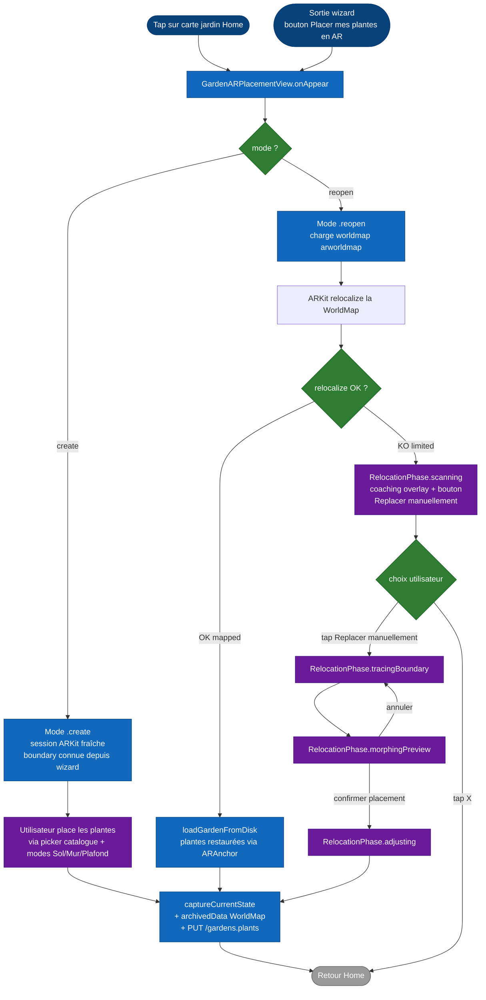

# Flux — Placement AR (création et réouverture)

Ce document décrit le **flux complet d'ouverture de la vue AR** qui permet à l'utilisateur de placer des plantes en réalité augmentée. Deux entrées principales : la création d'un jardin neuf (depuis le wizard) et la réouverture d'un jardin existant (depuis la Home). Le code de référence est `ARGarden/GardenARPlacementView.swift`.

## Vue d'ensemble

| Mode | Entrée | Comportement |
|---|---|---|
| `.create` | Sortie du wizard → `ARViewContainerMeasure` (perimeter) **ou** `LiDARScanWizardView` (LiDAR) | Démarre une session ARKit fraîche, l'utilisateur place les plantes manuellement, sauvegarde finale via `Valider`. |
| `.reopen` | Tap sur une carte jardin de la Home | Tente de relocaliser la `ARWorldMap` sauvegardée. En cas d'échec, le manual replace (#111) prend le relais. |

Le pivot entre ces deux modes est porté par la machine d'états [`RelocationPhase`](../state-machines/relocation-phase.md) documentée séparément.

## Diagramme

## Mode `.create` — création nouvelle session

L'entrée se fait depuis la sortie du wizard (cf. [`garden-creation.md`](garden-creation.md)). La vue AR reçoit déjà :

- `selectedPlants: [Plant]` — set de plantes choisies par l'utilisateur.
- `boundaryPoints: [SIMD3<Float>]` — polygone du sol tracé en non-LiDAR.
- `measurementWorldMapId: String?` — UUID renseigné si le scan a été fait en LiDAR (la WorldMap a déjà été sauvegardée par `LiDARScanWizardView` au chemin `worldmap_{measurementWorldMapId}.arworldmap`).
- `mode: .create`.

**Comportement** :

1. `ARSession` démarrée fraîchement (pas de relocalisation à tenter).
2. La boundary est dessinée au sol en cylindres bleus.
3. L'utilisateur choisit un mode **Sol**, **Mur** ou **Plafond**, ouvre le **picker catalogue** via le bouton **+**, puis tape sur une surface compatible pour placer une plante. Il peut ensuite drag/scale/rotate.
4. Bouton **Valider** : la WorldMap actuelle est archivée, le `scene_{id}.json` est écrit, et `PUT /gardens/:id` envoie l'état des plantes au backend.
5. Retour Home avec feedback de succès.

À ce stade, `RelocationPhase` reste à sa valeur initiale `.scanning` mais aucun overlay manual replace n'apparaît — la machine n'est pas pertinente en mode `.create`.

### Interface de placement

Le HUD garde la caméra comme surface principale : la barre haute contient retour, undo/redo et validation avec des boutons compacts, tandis que le dock bas tient sur une seule rangée. En placement, le dock affiche les modes **Sol/Mur/Plafond**, la capture photo/vidéo de partage et l'ajout de plante, puis se replie automatiquement sur le mode actif pour libérer la caméra. Quand une plante est sélectionnée, ce même dock remplace les actions de placement par le mode édition compact : nom de la plante, quitter l'édition, rotation, zoom +/− et suppression. L'indicateur lux n'est plus affiché ; la luminosité reste seulement un signal interne pour les anciennes heuristiques d'auto-placement. Le bouton de partage ouvre un mode capture dédié inspiré de l'app Caméra : HUD masqué, réticule de placement caché, déclencheur central, sélecteur **Photo/Vidéo** compact, compteur pendant l'enregistrement vidéo et miniature de la dernière capture. La miniature ouvre une galerie AR locale persistée pour le jardin ; les captures peuvent être supprimées, et toucher une capture ouvre ensuite une page édition/partage séparée avec reprise, partage et ajout facultatif du logo Arbore.

Le catalogue AR s'ouvre en page plein écran opaque et reçoit le `GardenWizardDTO` du jardin. L'onglet **Adaptées à mon espace**, sélectionné par défaut, classe les plantes à partir des données réellement disponibles : type d'espace, ensoleillement estimé, sécurité enfants/animaux, plantation en pot, drainage, vent, humidité intérieure, source de chaleur et hauteur disponible. Une donnée inconnue n'est pas inventée : la plante reste **À vérifier** et n'entre pas dans la sélection adaptée. L'onglet **Toutes les plantes** conserve ces badges, trie les meilleurs résultats en premier et demande une confirmation avant de poser une plante identifiée comme peu adaptée. La compatibilité physique **Sol/Mur/Plafond** reste un filtre dur indépendant.

La recherche est complétée par trois raccourcis (**Fleuries**, **Compactes**, **Faciles**) et par une page de préférences organisée en cinq familles : objectif, type de plante, couleurs et feuillage, dimensions, puis entretien. Chaque famille ouvre une sous-page visuelle et contextuelle au type d'espace ainsi qu'au mode Sol/Mur/Plafond. Plusieurs choix d'une même famille sont combinés en OU ; les familles actives sont combinées en ET. Le bouton fixe affiche le nombre de résultats avant validation.

La page rappelle que l'**adaptation Arbore** reste active : lumière, climat, vent, drainage, humidité, sécurité enfants/animaux, hauteur disponible et mode de plantation proviennent du jardin et ne sont donc pas redemandés comme préférences. Les filtres manuels expriment uniquement l'intention de l'utilisateur (par exemple fleurir, créer de l'intimité, attirer les pollinisateurs, choisir une couleur ou limiter l'entretien). Toucher le badge d'une carte ouvre les raisons favorables et les points à vérifier ; la fiche botanique reste accessible depuis ce détail ou le menu contextuel.

Pour préserver la fluidité, les caractéristiques textuelles et structurées de chaque plante sont indexées une seule fois hors du rendu SwiftUI. L'index est conservé quinze minutes en mémoire, les scores adaptés au jardin sont calculés une fois à l'ouverture et le tri est réutilisé par la recherche et les filtres. Les miniatures utilisent d'abord le cache disque puis le rendu distant. Un PNG dépourvu de la signature du design courant est écarté : la photo catalogue s'affiche immédiatement comme aperçu pendant qu'une miniature corrigée est régénérée localement depuis l'USDZ.

### Modes multi-surfaces

La session ARKit détecte maintenant les plans horizontaux et verticaux (`planeDetection = [.horizontal, .vertical]`). Le réticule utilise le mode courant pour choisir son raycast :

| Mode | Surfaces acceptées | Règle plante |
|---|---|---|
| **Sol** | `floor`, `shelf`, `table`, `windowsill`, `furniture`, ou fallback estimé horizontal | Toutes les plantes. Les étagères/tables/rebords restent donc du mode Sol. |
| **Mur** | `wall`, plan vertical infini, ou fallback estimé vertical | Plantes `climbing`/`trailing` ou reconnues par mots-clés de catalogue (lierre, pothos, philodendron scandens, hoya, ceropegia, etc.). |
| **Plafond** | `ceiling`, plan horizontal infini au-dessus de la caméra, ou fallback estimé au-dessus de la caméra | Plantes retombantes/suspendues uniquement. |

Le raycast essaie `existingPlaneGeometry`, puis `existingPlaneInfinite`, puis `estimatedPlane`. Ce fallback rend les murs/plafonds blancs plus faciles à viser, tout en gardant le filtrage plante/surface avant la pose. Avant de créer l'`ARAnchor` final, `PlacementReliabilityScorer` combine la source du hit, l'état de tracking, la taille du plan, la distance caméra et la stabilité du réticule pendant quelques dixièmes de seconde. Les surfaces estimées doivent donc rester stables brièvement avant validation ; sinon un feedback court demande de balayer la surface. Le catalogue est filtré en mode Mur/Plafond, et le tap affiche un message HUD si la plante ou la surface ne correspond pas.

Chaque pose sauvegarde aussi un `surfaceAnchor` relatif à la surface : source du hit, score, normale, centre/étendue du plan, offset local et position monde. À la réouverture, si une plane actuelle correspond à cette surface sauvegardée, la plante est recollée sur cette plane avant le fallback par coordonnée Y. Si une plante a d'abord été posée sur un hit estimé et qu'ARKit détecte ensuite une vraie plane compatible, l'app migre automatiquement son ancrage vers cette plane et met à jour la metadata persistée.

## Mode `.reopen` — réouverture jardin existant

L'entrée se fait depuis la Home, tap sur une carte jardin. La vue AR reçoit :

- `existingGardenId: String` — ID du jardin Mongo.
- `mode: .reopen`.

**Comportement** :

1. `onAppear` charge en parallèle :
   - La WorldMap depuis disque (`GardenLocalStore.worldMapURL(for: id)`).
   - Le scene JSON (positions des plantes) depuis disque.
2. `ARSession` est démarrée avec `initialWorldMap` posée sur la WorldMap chargée → ARKit entre en mode **relocalisation**.
3. Le coaching overlay (composant `ScanningCoachingOverlay`) est affiché au bas de l'écran sous forme de carte compacte au thème Arbore, **non-bloquante** : l'utilisateur voit la caméra, les gestes attendus et peut bouger son téléphone.
4. ARKit lance un thread de relocalisation qui tourne tant que `frame.camera.trackingState != .normal`.

À partir de là, deux chemins possibles.

### Chemin nominal : relocalisation réussie

`session(_:didUpdate:)` détecte que la WorldMap est passée en état `.mapped` :

1. `loadGardenFromDisk` est appelé. Il restaure :
   - Chaque plante via son `ARAnchor` lu dans la WorldMap (les ancres reprennent leur position exacte).
   - Les modèles USDZ depuis `ModelCacheManager` (déjà cachés sur disque, pas de re-téléchargement).
2. La vue passe en mode édition : l'utilisateur peut modifier les positions, ajouter/retirer des plantes via le picker.
3. À la validation, même flow de sauvegarde que `.create`.

Ce chemin est le plus rapide en UX (quelques secondes pour la relocalisation si l'éclairage est similaire).

### Chemin dégradé : relocalisation échoue

Si après quelques secondes la WorldMap reste en `.limited` (changement d'éclairage entre sessions, environnement modifié — cf. issue #96), le coaching overlay reste affiché avec le bouton secondaire **« Replacer manuellement »** accessible.

À ce moment, deux options pour l'utilisateur :

| Action | Effet |
|---|---|
| Continuer à attendre / bouger le téléphone | L'ARKit `relocalize` peut encore réussir si l'éclairage devient compatible. Si jamais, la machine reste à `.scanning`. |
| Tap **« Replacer manuellement »** | `enterManualReplacement()` → la machine [`RelocationPhase`](../state-machines/relocation-phase.md) bascule sur `.tracingBoundary` et le flux manuel prend le relais. |
| Tap retour | Dismiss complet, retour Home sans modification du jardin. |

Une fois le manual replace lancé (`tracingBoundary` → `morphingPreview` → `adjusting`), la fin du flow rejoint le chemin de sauvegarde commun.

## Sauvegarde finale

Quelle que soit l'origine du flow (`create`, `reopen` nominal, `reopen` manual replace), la validation finale appelle `captureCurrentState` qui :

1. Itère sur les nodes de plante et lit leur transform 4×4. Pour chaque plante :
   - Si une override drag/teleport est présente dans `pendingDragTransform[uuid]`, l'utilise (issue #138 — garantit que le dernier geste utilisateur est persisté même si le `rebaseAnchorAtCurrentPosition` échoue silencieusement).
   - Sinon, lit le transform de l'`ARAnchor` associée.
   - En dernier recours, lit `node.simdWorldTransform` directement.
2. Persiste aussi `surfaceType`, `surfaceHeight`, `placementMode` et `surfaceAnchor` pour conserver l'intention de pose (`floor`, `wall`, `ceiling`) et la relation relative à la surface entre deux sessions.
3. Archive la `ARWorldMap` actuelle via `NSKeyedArchiver` et l'écrit sur disque (`worldmap_{id}.arworldmap`).
4. Sérialise le scene JSON (positions, modèles, scales) et l'écrit sur disque (`scene_{id}.json`).
5. Émet un `PUT /gardens/:id` avec les positions actualisées (champ `plants[]` du document `gardens`).

Après la sauvegarde, `pendingDragTransform` est purgée et la vue se ferme.

## Cas particuliers

| Situation | Comportement |
|---|---|
| **Premier lancement, app fraîchement installée, jardin créé sur un ancien device** | Aucun fichier `worldmap_{id}.arworldmap` n'existe sur le nouvel appareil. La relocalisation est impossible. → Issue #114 : reconstruction depuis le backend, prévue Sprint 3+. |
| **Plante dont le modèle USDZ n'est pas téléchargé** | `ModelCacheManager` télécharge en tâche de fond. La plante apparaît en placeholder (sphère grise) puis est remplacée par le vrai modèle quand disponible. |
| **Permission caméra refusée** | iOS bloque l'ouverture d'`ARSession`. La vue affiche un état d'erreur avec un bouton pour ouvrir les Réglages. |
| **Device sans LiDAR ouvrant un jardin créé avec LiDAR** | La WorldMap LiDAR contient des plans hautement densifiés. La relocalisation reste possible mais avec une qualité dégradée. Pas de support spécial à ce jour. |
| **App backgroundée pendant 30+ secondes** | ARKit perd le tracking. Au retour, `session(_:didUpdate:)` détecte `.limited` et le coaching overlay peut réapparaître si l'on est en mode `.reopen`. |

## Gestes disponibles

| Geste | Effet |
|---|---|
| Tap sur une plante (mode `.adjusting` ou édition normale) | Sélectionne la plante, affiche l'anneau vert pulsant. |
| Tap sur une surface compatible avec une plante sélectionnée | Téléporte la plante à la position raycast du mode courant. |
| Long-press + drag | Déplace la plante en continu. |
| Pinch | Met à l'échelle (si autorisé pour la plante). |
| Two-finger rotate | Rotation autour de l'axe Y. |

## Hors-scope de ce flux

- Le détail de la machine d'états `RelocationPhase` (transitions, guards, comportement annuler) est documenté dans [`../state-machines/relocation-phase.md`](../state-machines/relocation-phase.md).
- Le détail mathématique du morphing MVC est dans `ManualReplacement/MeanValueCoordinates.swift` (math pure, testable isolément).
- Le **per-screen spec** complet de `GardenARPlacementView` (incluant l'inventaire de ses widgets internes et de ses overlays) sera ajouté en Phase 4 sous `docs/screens/garden-ar-placement.md`.
- La spec backend du save (`PUT /gardens/:id`) est dans [`../architecture/03-components-backend.md`](../architecture/03-components-backend.md).
