# Flux — Création d'un jardin (wizard)

Ce document décrit le **flux de création d'un nouveau jardin** par l'utilisateur, depuis le choix de l'espace jusqu'à la sauvegarde finale du placement. Le code de référence est `Views/GardenSteps/QuestionnaireView.swift` qui pilote la `TabView` du wizard.

## Vue d'ensemble

Le wizard comporte désormais trois écrans visibles : choix de l'espace, questions conditionnelles essentielles, puis suggestion de plantes. Arbore choisit la méthode d'analyse automatiquement et ouvre directement le scan, sans page intermédiaire. Les anciens questionnaires génériques d'exposition, d'entretien, de sécurité et de sol ont été retirés. L'exposition est maintenant une capture très courte dans la caméra, uniquement pour une pièce, un balcon ou une terrasse.

Le **scan du jardin** intervient après le premier écran : le CTA « Choisir l'espace » détermine la méthode, demande directement l'autorisation système caméra si nécessaire, puis ouvre la vue AR. Dès que les dimensions sont validées, Arbore ne présente pas d'écran récapitulatif. Pour une pièce, un balcon ou une terrasse, l'utilisateur reste dans la même caméra et indique la source lumineuse principale ; un jardin passe directement à la création. Après le `POST /gardens`, la caméra se ferme et un écran demande une nouvelle localisation propre à ce jardin. Le wizard reprend ensuite la main avec trois questions adaptées au type d'espace, puis présente `aiSuggestion`.

## Diagramme

```mermaid
flowchart TB
    start_node([Tap Créer un jardin<br/>depuis Home])

    spaceType["Étape 1 — Choisir l espace<br/>pièce, balcon, terrasse, jardin"]
    permissions["Prompt système caméra si nécessaire<br/>méthode choisie automatiquement"]
    trace_ar["fullScreenCover AR<br/>ARViewContainerMesure ou LiDARScanWizardView<br/>mesure des dimensions"]
    exposure["Exposition dans la même caméra<br/>pièce, balcon ou terrasse"]
    post_garden["POST /gardens<br/>boundary + wizard + plants: []"]
    location["Caméra fermée — nouvelle localisation<br/>position approximative, ville ou passer"]
    update_garden["PUT /gardens/:id<br/>wizard.location"]
    questions["Étape 2 — 3 questions essentielles<br/>selon le type d espace, réponses facultatives"]
    update_constraints["PUT /gardens/:id<br/>wizard.conditionalAnswers + safety"]

    ai["Étape 3 — AI Suggestion<br/>sélection plantes affinée"]
    placement["fullScreenCover<br/>GardenARPlacementView (.create + existingGardenId)"]
    auto_place["Auto-placement IA<br/>+ ajustement manuel"]
    put_garden["PUT /gardens/:id<br/>plants positions"]

    plan2d([Onglet Jardin — plan 2D<br/>fiche de l espace éditable])

    start_node --> spaceType
    spaceType -->|tap Continuer| permissions
    permissions --> trace_ar
    trace_ar -->|pièce, balcon, terrasse| exposure
    trace_ar -->|jardin| post_garden
    exposure --> post_garden
    post_garden --> location
    location --> update_garden
    update_garden -->|retour wizard| questions
    questions --> update_constraints --> ai
    ai -->|tap Placer mes plantes en AR| placement
    placement --> auto_place
    auto_place -->|tap Valider et sauvegarder| put_garden
    put_garden --> plan2d

    classDef step  fill:#1168BD,stroke:#0B4884,color:#fff
    classDef cond  fill:#2E7D32,stroke:#1B5E20,color:#fff
    classDef ar    fill:#6A1B9A,stroke:#4A148C,color:#fff
    classDef io    fill:#999,stroke:#666,color:#fff
    class spaceType,permissions,location,questions,ai step
    class post_garden,update_garden,update_constraints,put_garden cond
    class trace_ar,exposure,placement,auto_place ar
    class start_node,plan2d io
```



## Choix automatique de la méthode

Le computed `visibleSteps` dans `QuestionnaireView.swift` implémente la logique :

```swift
private var visibleSteps: [GardenWizardStep] {
    [.spaceType, .essentialQuestions, .aiSuggestion]
}
```

Au tap sur **Continuer** dans `SpaceTypeStepView`, `QuestionnaireView` applique la règle suivante :

| Contexte | Méthode |
|---|---|
| Pièce et `RoomCaptureSession.isSupported == true` | `roomScan` avec RoomPlan |
| Pièce sans LiDAR | `gardenPerimeter`, présenté comme un tracé guidé des coins |
| Balcon ou terrasse | `gardenPerimeter`, présenté comme un tracé du contour |
| Jardin | `gardenPerimeter`, présenté comme un tracé du périmètre |

Il n'existe plus de page de sélection de méthode. Le lien « Changer de méthode » est affiché directement dans la caméra uniquement lorsque deux moteurs sont réellement utilisables : pour une pièce, sur un appareil compatible RoomPlan. Il est absent pour les pièces sans LiDAR, les balcons, les terrasses et les jardins.

## Détails par étape

### Étape 1 — Choisir l'espace

Premier écran affiché après le tap sur « Créer un jardin ». Quatre cartes illustrées en grille 2 × 2 : `interior` (Pièce), `balcony` (Balcon), `terrace` (Terrasse) et `garden` (Jardin). Pose `state.spaceType`.

### Ouverture directe du scan

Le CTA **Continuer** de `SpaceTypeStepView` sélectionne la méthode à partir de `state.spaceType` et de la disponibilité de RoomPlan. Il n'affiche aucun récapitulatif : il enchaîne sur l'autorisation caméra puis la vue AR correspondante.

#### Sous-flow autorisation caméra

Le parcours normal n'affiche plus d'écran Arbore avant le prompt :

1. Au tap sur **Continuer**, si l'état est `.notDetermined`, le prompt système iOS est déclenché directement au-dessus de l'écran de choix de l'espace.
2. Une fois l'accès obtenu, le scan recommandé démarre immédiatement.
3. Si la permission a déjà été accordée, le scan s'ouvre sans transition supplémentaire.
4. `GardenAnalysisAuthorizationFlowView` n'est présenté qu'en cas de refus ou de restriction afin d'expliquer le blocage et de proposer les Réglages iOS.

La localisation n'est pas demandée avant le scan : elle n'est pas nécessaire à la mesure. Elle est présentée sur un écran distinct après la fermeture de la caméra. `state.location` est remis à `nil` au début de chaque création et Arbore déclenche une nouvelle mesure ponctuelle, même lorsque l'autorisation iOS est déjà accordée. La localisation d'un jardin précédent n'est donc jamais réutilisée. L'utilisateur peut aussi saisir sa ville ou continuer sans localisation.

#### Sous-flow tracé AR (perimeter)

Lorsque l'utilisateur arrive dans `ARViewContainerMesure` :

1. ARSession démarre et un viseur central indique si un sol horizontal est détecté.
2. L'utilisateur vise chaque limite de l'espace puis tape **Ajouter un point**. Le point est posé par raycast au centre de l'écran ; les doubles poses à moins de 12 cm sont refusées.
3. Les points et les segments sont visibles directement dans la caméra. À partir de trois sommets, leur ordre cyclique est recalculé et les arêtes croisées sont supprimées automatiquement, y compris si les coins d'un rectangle ont été posés en diagonale.
4. Le panneau affiche en direct le nombre de points, la surface et le périmètre. **Annuler** retire le dernier point effectivement posé, **Recommencer** efface le contour, et **Plan** ouvre la vue du dessus.
5. Au tap sur **Valider le périmètre** :
   1. Pour une pièce, un balcon ou une terrasse, les contrôles de tracé disparaissent mais la caméra reste ouverte. L'utilisateur vise la fenêtre principale, l'extérieur ou le côté le plus ouvert, puis tape **Définir cette exposition**. Arbore enregistre la direction horizontale dans le repère AR, l'orientation magnétique disponible et la luminosité ambiante instantanée.
   2. Pour un jardin, cette capture est ignorée : l'exposition pourra être estimée ultérieurement depuis la localisation et la géométrie.
   3. La WorldMap ARKit courante est sauvegardée sur disque sous `tempGardenId`.
   4. Un fichier `scene_{tempGardenId}.json` est écrit avec `plants: []`, la boundary, l'area, le perimeter.
   5. `POST /gardens` est appelé avec `name`, `wizard` (dont `lightExposure` lorsqu'elle existe), `plants: []`, `thumbnailKey`.
   6. Si le serveur renvoie un `id` différent de `tempGardenId`, les deux fichiers locaux sont migrés vers le nouvel id.
   7. La caméra se ferme. `GardenLocationCaptureView` demande une nouvelle position approximative, une ville manuelle ou permet de passer. Le résultat est copié dans `state.location` puis envoyé par `PUT /gardens/:id`.
   8. Le wizard appelle `goToNext()` → étape `essentialQuestions`.

#### Sous-flow scan LiDAR (roomScan)

Symétrique au flow perimeter, dans `LiDARScanWizardView` :

1. RoomPlan capture la pièce en 3D.
2. Au tap sur **Scanner terminé**, Arbore conserve la session caméra et présente la même capture d'exposition. Une fois la source lumineuse indiquée, RoomPlan est arrêté et l'area / perimeter sont extraits du `CapturedRoom`.
3. La WorldMap est sauvegardée, puis `POST /gardens` et migration de fichiers sont exécutés à l'identique.
4. La caméra se ferme et le même écran de localisation fraîche est présenté avant le retour au wizard.

### Étape 2 — Questions conditionnelles essentielles

`EssentialQuestionsStepView` affiche exactement trois questions compactes, adaptées à `state.spaceType` :

- Jardin : pleine terre / bac, vitesse de drainage après une forte pluie, animaux ou jeunes enfants.
- Balcon ou terrasse : exposition au vent, pots déjà présents ou nouvelle composition, animaux ou jeunes enfants.
- Pièce : air sec / normal / humide, source de chaleur proche, animaux ou jeunes enfants.

Chaque question propose « Je ne sais pas » et peut aussi rester sans réponse. Ces deux cas ne créent aucune valeur fictive dans `wizard.conditionalAnswers`. « Répondre plus tard » vide les réponses de cette étape et poursuit le parcours. Les réponses connues sont persistées par `PUT /gardens/:id`; la sécurité continue d'utiliser `wizard.safety`. Le classement de `GardenSuggestionEngine` est ensuite affiné de façon non bloquante avec les drapeaux structurés du catalogue.

### Étape 3 — AI Suggestion

Composant `AISuggestionStepView`. L'étape **finale** du wizard. Utilise `GardenSuggestionEngine` pour proposer une sélection de plantes adaptée au profil construit (et potentiellement à la surface mesurée — enrichissement en cours, cf. issue #125). L'utilisateur peut :

- Accepter la suggestion telle quelle.
- Ajouter / retirer des plantes manuellement depuis le catalogue.

Le CTA primaire **« Placer X plantes en AR »** :

1. Met à jour `aiSelectedPlants` à partir des cards acceptées.
2. Appelle `startFinalPlacement()` qui ouvre `GardenARPlacementView` en mode `.create` avec `existingGardenId = state.createdGardenId`, `measurementWorldMapId = state.createdGardenId`, et la boundary mesurée.
3. La vue AR charge la WorldMap depuis disque, démarre une session, et auto-place les plantes au moment où le tracking devient stable.
4. À la validation finale, **`PUT /gardens/:id`** met à jour le jardin existant avec les positions des plantes (`POST` est évité parce que le jardin existe déjà).
5. `TabRouter` mémorise l'identifiant créé, sélectionne l'onglet Jardin et ouvre directement son plan 2D.

### Fiche de l'espace dans le plan 2D

Le récapitulatif n'est pas une étape bloquante du wizard. Il vit durablement sous le plan dans `GardenSpaceProfileView` et distingue systématiquement la source (`mesurée`, `déduite`, `déclarée`, `estimation régionale`) ainsi que la confiance.

- Le type d'espace, la surface, le périmètre, l'orientation, l'ensoleillement, le type de sol, la localisation, le vent, la hauteur et les zones végétalisables sont affichés.
- Une donnée absente reste « Mesure indisponible » ; aucune valeur par défaut n'est présentée comme réelle.
- Surface et périmètre se corrigent avec « Refaire les dimensions ». Le scan remplace le contour local et persiste `measurements.boundaryPoints`, `area` et `perimeter` par `PUT /gardens/:id` afin de rester cohérent avec le plan.
- Les autres valeurs se corrigent dans une feuille persistée par `PUT /gardens/:id`.
- Les zones végétalisables sont des polygones dans le même repère que le contour. Elles peuvent être dessinées, renommées, exclues ou supprimées et sont superposées au plan 2D.

## Création du jardin en base — récap

Le `POST /gardens` historique avait lieu **à la toute fin** du placement (dans `GardenARPlacementView.handleValidateNotif`). Le nouveau flux le déclenche **à la fin du tracé**, avec `plants: []`. Conséquences :

- Le jardin existe en base dès l'étape `aiSuggestion`, ce qui permettrait à terme une étape `aiSuggestion` area-aware (issue #125).
- L'utilisateur qui dismiss après le tracé mais avant de placer les plantes laisse un jardin orphelin avec `plants: []`. Il sera visible depuis la Home et supprimable manuellement.
- Le save logic dans `GardenARPlacementView.handleValidateNotif` choisit `PUT` vs `POST` selon `existingGardenId` (et non plus selon `mode == .reopen`).

## Persistance pendant le wizard

`GardenWizardState` est un `@StateObject` qui vit pendant toute la session wizard. **Aucune persistance disque** du type d'espace ou de la méthode choisie tant que le tracé n'est pas validé. Si l'utilisateur dismiss avant le tracé, les choix sont perdus.

**À partir du tracé validé**, le jardin existe en base. Les dimensions et l'éventuelle exposition sont persistées via `POST /gardens`. Après la fermeture de la caméra, la localisation propre à cette création est ajoutée au même `garden.wizard` par `PUT /gardens/:id`, puis les réponses conditionnelles connues sont enregistrées par un second `PUT`. La mise à jour finale du placement réenvoie également le wizard complet, ce qui permet de retenter ces persistances si un premier `PUT` réseau a échoué.

Après la création, les corrections de la fiche 2D sont persistées dans `wizard.siteProfile` par `PUT /gardens/:id`.

## Cas d'erreur

| Situation | Comportement |
|---|---|
| `POST /gardens` échoue à la fin du tracé | Message d'erreur inline dans la fullScreenCover de tracé. Le bouton de validation reste disponible pour retry. Aucun jardin n'est créé tant que le POST n'a pas réussi. |
| LiDAR sélectionné sur device sans LiDAR | Ne devrait pas arriver — la carte LiDAR est grisée. Si toutefois un état corrompu permet de passer outre, `LiDARScanWizardView` affiche une alerte « Scan 3D indisponible » et reste sur l'écran. |
| Connexion réseau coupée au tap sur la validation | Le `POST /gardens` échoue, message inline, retry possible. |
| Permission caméra refusée | Le branchement vers AR est impossible. L'écran contextuel propose d'ouvrir les Réglages iOS. |
| Localisation refusée ou indisponible | L'écran propose la saisie manuelle de la ville ou la poursuite sans localisation. Aucun ancien emplacement n'est repris. |
| `PUT /gardens/:id` de la localisation échoue | Le parcours continue avec la valeur conservée dans `GardenWizardState`; le `PUT` final du placement réessaie de persister le wizard complet. |
| `PUT /gardens/:id` des questions échoue | Le parcours continue et les réponses restent dans `GardenWizardState`; le `PUT` final les renvoie. |
| User dismiss après tracé mais avant placement | Jardin orphan en base avec `plants: []`. Visible et supprimable depuis la Home. |
| `PUT /gardens/:id` échoue à la fin du placement | Fichiers locaux conservés sous le tempID. Message d'erreur. À retry. |

## Hors-scope de ce flux

- Le **détail interne du placement AR** (raycasts, ancres, gestures, état RelocationPhase) est documenté dans [`ar-placement.md`](ar-placement.md).
- La logique de **filtrage et de ranking** de `GardenSuggestionEngine` à l'étape AI Suggestion sera documentée dans une per-screen spec si l'écran devient un hero screen.
- Le **schéma exact** du document `gardens` côté Mongo est dans [`../architecture/04-data-model.md`](../architecture/04-data-model.md).
