# Flux — Création d'un jardin (wizard)

Ce document décrit le **flux de création d'un nouveau jardin** par l'utilisateur, depuis l'intro du wizard jusqu'à la sauvegarde finale du placement. Le code de référence est `Views/GardenSteps/QuestionnaireView.swift` qui pilote la `TabView` du wizard.

## Vue d'ensemble

Le wizard est composé d'un nombre variable d'étapes (entre 8 et 9 selon les choix utilisateur), implémentées comme une `TabView` SwiftUI non-paginable dont la sélection est gouvernée par l'enum `GardenWizardStep`. La liste des étapes effectivement affichées est calculée par le computed `visibleSteps`.

Le **scan du jardin** intervient à l'étape `scanMethod` (avant la suggestion AI) : le tap sur le CTA principal ouvre directement la vue de tracé AR, qui appelle `POST /gardens` à la fin du tracé pour créer le jardin en base avec sa boundary. Après le scan, la caméra se ferme et l'utilisateur peut fournir une localisation propre à ce jardin ; quand elle existe, cette localisation déclenche un enrichissement climat côté backend. Le wizard reprend ensuite la main et présente l'étape `aiSuggestion`, qui peut consommer les vraies mesures `state.measuredArea` / `state.measuredPerimeter` et le profil climat pour son ranking. Le CTA final de l'étape `aiSuggestion` ouvre `GardenARPlacementView` sur le jardin tout neuf en mode `.create` et déclenche l'auto-placement des plantes sélectionnées.

## Diagramme

```mermaid
flowchart TB
    start_node([Tap Créer un jardin<br/>depuis Home])

    intro["Étape 1 — Intro"]
    style_step["Étape 2 — Style"]
    spaceType["Étape 3 — Type d espace"]
    exposure["Étape 4 — Exposition"]
    maintenance["Étape 5 — Entretien"]
    safety["Étape 6 — Sécurité"]
    soil["Étape 7 — Sol<br/>(spaceType garden uniquement)"]
    scan["Étape 8 — Scan method<br/>perimeter vs roomScan"]

    trace_ar["fullScreenCover AR<br/>ARViewContainerMesure ou LiDARScanWizardView<br/>user trace + valide"]
    post_garden["POST /gardens<br/>boundary + wizard + plants: []"]
    location["Localisation du jardin<br/>position approximative, ville ou passer"]
    climate["POST /climate/profile<br/>climat régional + gel + littoral"]
    update_garden["PUT /gardens/:id<br/>wizard.location + wizard.siteProfile"]
    ai["Étape 9 — AI Suggestion<br/>sélection plantes (area-aware)"]
    placement["fullScreenCover<br/>GardenARPlacementView (.create + existingGardenId)"]
    auto_place["Auto-placement IA<br/>+ ajustement manuel"]
    put_garden["PUT /gardens/:id<br/>plants positions"]

    home([Retour Home])

    start_node --> intro --> style_step --> spaceType
    spaceType -->|indoor ou balcony| exposure
    spaceType -->|garden| exposure
    exposure --> maintenance --> safety
    safety -->|garden| soil --> scan
    safety -->|sinon| scan

    scan -->|tap Démarrer le scan| trace_ar
    trace_ar --> post_garden
    post_garden --> location
    location --> climate
    climate --> update_garden
    update_garden -->|retour wizard| ai
    ai -->|tap Placer mes plantes en AR| placement
    placement --> auto_place
    auto_place -->|tap Valider et sauvegarder| put_garden
    put_garden --> home

    classDef step  fill:#1168BD,stroke:#0B4884,color:#fff
    classDef cond  fill:#2E7D32,stroke:#1B5E20,color:#fff
    classDef ar    fill:#6A1B9A,stroke:#4A148C,color:#fff
    classDef io    fill:#999,stroke:#666,color:#fff
    class intro,style_step,spaceType,exposure,maintenance,safety,soil,scan,location,ai step
    class post_garden,climate,update_garden,put_garden cond
    class trace_ar,placement,auto_place ar
    class start_node,home io
```



## Règles de skip et conditions

Le computed `visibleSteps` dans `QuestionnaireView.swift` implémente la logique :

```swift
private var visibleSteps: [GardenWizardStep] {
    var steps: [GardenWizardStep] = [.intro, .style, .spaceType, .exposure, .maintenance, .safety]
    if state.spaceType == .garden {
        steps.append(.soil)
    }
    steps.append(contentsOf: [.scanMethod, .aiSuggestion])
    return steps
}
```

Conséquence :

| Choix utilisateur | Étapes affichées |
|---|---|
| `spaceType == .indoor` ou `.balcony` | intro · style · spaceType · exposure · maintenance · safety · scanMethod · aiSuggestion (8 étapes) |
| `spaceType == .garden` | intro · style · spaceType · exposure · maintenance · safety · **soil** · scanMethod · aiSuggestion (9 étapes) |

L'étape `soil` n'a de sens qu'en pleine terre — c'est la seule règle de skip à ce jour.

## Détails par étape

### Étape 1 — Intro

Écran d'accueil. Décrit en deux phrases ce que le wizard va proposer et invite à commencer. Aucune entrée utilisateur. État `GardenWizardState` reste vierge.

### Étape 2 — Style

Choix parmi plusieurs styles esthétiques (moderne, zen, sauvage, méditerranéen, etc.). Pose `state.style`.

### Étape 3 — Type d'espace

Trois options : `indoor`, `balcony`, `garden`. Pose `state.spaceType`. **C'est l'étape qui détermine si `soil` sera affichée plus loin.**

### Étape 4 — Exposition

Plein soleil, mi-ombre, ombre. Pose `state.exposure`.

### Étape 5 — Entretien

Faible, moyen, élevé. Pose `state.maintenance`.

### Étape 6 — Sécurité

Sélection multiple : enfants, animaux, allergies. Pose `state.safetySelections`.

### Étape 7 — Sol *(conditionnelle)*

Apparaît uniquement si `state.spaceType == .garden`. Type de sol qui servira au ranking AI ultérieur.

### Étape 8 — Scan method

Composant `ScanMethodStepView`. Deux cartes :

- **Tracer mon jardin au sol** (`gardenPerimeter`) — disponible sur tous les iPhones.
- **Scanner la pièce en 3D** (`roomScan`) — grisé si `RoomCaptureSession.isSupported == false`.

Pose `state.scanMethod`. Le CTA primaire **« Démarrer le scan »** ouvre directement la vue AR correspondante (pas un simple `Continuer`).

#### Sous-flow tracé AR (perimeter)

Lorsque l'utilisateur arrive dans `ARViewContainerMesure` :

1. ARSession démarre et un viseur central indique si un sol horizontal est détecté.
2. L'utilisateur vise chaque limite de l'espace puis tape **Ajouter un point**. Le point est posé par raycast au centre de l'écran ; les doubles poses à moins de 12 cm sont refusées.
3. Les points et les segments sont visibles directement dans la caméra. À partir de trois sommets, leur ordre cyclique est recalculé et les arêtes croisées sont supprimées automatiquement, y compris si les coins d'un rectangle ont été posés en diagonale.
4. Le panneau affiche en direct le nombre de points, la surface et le périmètre. **Annuler** retire le dernier point effectivement posé, **Recommencer** efface le contour, et **Plan** ouvre la vue du dessus.
5. Au tap sur **Valider le périmètre** :
   1. Pour une pièce, un balcon ou une terrasse, les contrôles de tracé disparaissent mais la caméra reste ouverte. L'utilisateur vise la fenêtre principale, l'extérieur ou le côté le plus ouvert, puis tape **Définir cette exposition**. Arbore enregistre la direction horizontale dans le repère AR, l'orientation magnétique disponible et la luminosité ambiante instantanée.
   2. Pour un jardin, cette capture est ignorée : l'exposition pourra être estimée ultérieurement depuis la localisation et la géométrie.
   3. La WorldMap ARKit courante est sauvegardée sur disque sous `tempGardenId`.
   4. Un fichier `scene_{tempGardenId}.json` est écrit avec `plants: []`, la boundary, l'area, le perimeter.
   5. `POST /gardens` est appelé avec `name`, `wizard` (dont `lightExposure` lorsqu'elle existe), `plants: []`, `thumbnailKey`.
   6. Si le serveur renvoie un `id` différent de `tempGardenId`, les deux fichiers locaux sont migrés vers le nouvel id.
   7. La caméra se ferme. `GardenLocationCaptureView` demande une nouvelle position approximative, une ville manuelle ou permet de passer. Le résultat est copié dans `state.location`, envoyé à `POST /climate/profile` lorsque disponible, puis persisté avec `wizard.siteProfile` par `PUT /gardens/:id`.
   8. Le wizard appelle `goToNext()` → étape `aiSuggestion`.

#### Sous-flow scan LiDAR (roomScan)

Symétrique au flow perimeter, dans `LiDARScanWizardView` :

1. RoomPlan capture la pièce en 3D.
2. Au tap sur **Scanner terminé**, la WorldMap est sauvegardée et l'area / perimeter sont extraits du `CapturedRoom`.
3. `POST /gardens` puis migration de fichiers à l'identique.
4. `state.createdGardenId` est posé (boundary 2D reste vide pour le LiDAR), retour au wizard.

### Étape 9 — AI Suggestion

Composant `AISuggestionStepView`. L'étape **finale** du wizard. Utilise `GardenSuggestionEngine` pour proposer une sélection de plantes adaptée au profil construit (et potentiellement à la surface mesurée — enrichissement en cours, cf. issue #125). L'utilisateur peut :

- Accepter la suggestion telle quelle.
- Ajouter / retirer des plantes manuellement depuis le catalogue.

Le CTA primaire **« Placer X plantes en AR »** :

1. Met à jour `aiSelectedPlants` à partir des cards acceptées.
2. Appelle `startFinalPlacement()` qui ouvre `GardenARPlacementView` en mode `.create` avec `existingGardenId = state.createdGardenId`, `measurementWorldMapId = state.createdGardenId`, et la boundary mesurée.
3. La vue AR charge la WorldMap depuis disque, démarre une session, et auto-place les plantes au moment où le tracking devient stable.
4. À la validation finale, **`PUT /gardens/:id`** met à jour le jardin existant avec les positions des plantes (`POST` est évité parce que le jardin existe déjà).

### Fiche de l'espace dans le plan 2D

Le récapitulatif n'est pas une étape bloquante du wizard. Il vit durablement sous le plan dans `GardenSpaceProfileView` et distingue systématiquement la source (`mesurée`, `déduite`, `déclarée`, `estimation régionale`) ainsi que la confiance.

- Le type d'espace, la surface, le périmètre, l'orientation, l'ensoleillement, le type de sol, la localisation, le vent, la hauteur et les zones végétalisables sont affichés.
- Pour une pièce, un balcon ou une terrasse, l'orientation magnétique capturée devient une valeur mesurée avec confiance moyenne. Arbore peut en déduire une plage d'ensoleillement large à partir de l'orientation et de l'hémisphère lorsque les coordonnées sont exploitables ; elle reste marquée « déduite » avec confiance faible. Une durée déclarée dans la pièce remplace cette estimation. L'intensité lumineuse instantanée ARKit n'est jamais convertie en heures de soleil quotidiennes.
- Une donnée absente reste « Mesure indisponible » ; aucune valeur par défaut n'est présentée comme réelle.
- Surface et périmètre se corrigent avec « Refaire les dimensions ». Le scan remplace le contour local et persiste `measurements.boundaryPoints`, `area` et `perimeter` par `PUT /gardens/:id` afin de rester cohérent avec le plan.
- Les autres valeurs se corrigent dans une feuille persistée par `PUT /gardens/:id`.
- Les zones végétalisables sont des polygones dans le même repère que le contour. Elles peuvent être dessinées, renommées, exclues ou supprimées et sont superposées au plan 2D.

## Création du jardin en base — récap

Le `POST /gardens` historique avait lieu **à la toute fin** du placement (dans `GardenARPlacementView.handleValidateNotif`). Le nouveau flux le déclenche **à la fin du tracé** (step `scanMethod`), avec `plants: []`. Conséquences :

- Le jardin existe en base dès l'étape `aiSuggestion`, ce qui permettrait à terme une étape `aiSuggestion` area-aware (issue #125).
- L'utilisateur qui dismiss après le tracé mais avant de placer les plantes laisse un jardin orphelin avec `plants: []`. Il sera visible depuis la Home et supprimable manuellement.
- Le save logic dans `GardenARPlacementView.handleValidateNotif` choisit `PUT` vs `POST` selon `existingGardenId` (et non plus selon `mode == .reopen`).

## Persistance pendant le wizard

`GardenWizardState` est un `@StateObject` qui vit pendant toute la session wizard. **Aucune persistance disque** des champs de préférences (style, spaceType, etc.) tant que le tracé n'est pas validé. Si l'utilisateur dismiss avant le tracé, les choix sont perdus.

**À partir du tracé validé**, le jardin existe en base. Les choix de préférences, les dimensions et l'éventuelle exposition sont persistés via `POST /gardens`. Après la fermeture de la caméra, la localisation propre à cette création est ajoutée au même `garden.wizard` par `PUT /gardens/:id`. Quand une ville ou position approximative est disponible, le client appelle aussi `POST /climate/profile` : le backend géocode grossièrement la commune, récupère si possible une station Météo-France configurée côté serveur, puis renvoie un profil régional avec températures historiques, risque de gel, vent et exposition littorale. Ces écritures sont sérialisées pour qu'un ancien snapshot ne puisse pas terminer en dernier et effacer la localisation ou le climat. Avant chaque envoi, Arbore matérialise également dans `wizard.siteProfile` l'orientation, l'ensoleillement effectivement mesuré ou déduit et l'enrichissement climat. Le même wizard résolu est sauvegardé localement sous forme de snapshot JSON propre au jardin par `ArboreUi/ArboreUi/Views/GardenLocalStore.swift`. Le plan 2D restaure uniquement les données capturées absentes du serveur, les affiche immédiatement puis répare le document distant sans écraser une correction existante. La mise à jour finale du placement réenvoie le wizard complet et attend la fin des écritures intermédiaires.

Après la création, les corrections de la fiche 2D sont persistées dans `wizard.siteProfile` par `PUT /gardens/:id`.

## Cas d'erreur

| Situation | Comportement |
|---|---|
| `POST /gardens` échoue à la fin du tracé (step `scanMethod`) | Message d'erreur inline dans la fullScreenCover de tracé. Le bouton CONTINUER reste disponible pour retry. Aucun jardin n'est créé tant que le POST n'a pas réussi. |
| LiDAR sélectionné sur device sans LiDAR | Ne devrait pas arriver — la carte LiDAR est grisée. Si toutefois un état corrompu permet de passer outre, `LiDARScanWizardView` affiche une alerte « Scan 3D indisponible » et reste sur l'écran. |
| Connexion réseau coupée au tap CONTINUER step `scanMethod` | Le `POST /gardens` échoue, message inline, retry possible. |
| Permission caméra refusée | Le branchement vers AR est impossible. Une modale système iOS apparaît au moment de l'ouverture de la vue AR. |
| Localisation refusée ou indisponible | L'écran propose la saisie manuelle de la ville ou la poursuite sans localisation. Aucun ancien emplacement n'est repris. |
| Enrichissement climat indisponible | Le parcours continue sans bloquer. Le moteur catalogue garde les données manquantes en « à confirmer ». |
| `PUT /gardens/:id` de la localisation échoue | Le parcours continue avec la valeur conservée dans `GardenWizardState`; le `PUT` final du placement réessaie de persister le wizard complet. |
| User dismiss après tracé mais avant placement | Jardin orphan en base avec `plants: []`. Visible et supprimable depuis la Home. |
| `PUT /gardens/:id` échoue à la fin du placement | Fichiers locaux conservés sous le tempID. Message d'erreur. À retry. |

## Hors-scope de ce flux

- Le **détail interne du placement AR** (raycasts, ancres, gestures, état RelocationPhase) est documenté dans [`ar-placement.md`](ar-placement.md).
- La logique de **filtrage et de ranking** de `GardenSuggestionEngine` à l'étape AI Suggestion sera documentée dans une per-screen spec si l'écran devient un hero screen.
- Le **schéma exact** du document `gardens` côté Mongo est dans [`../architecture/04-data-model.md`](../architecture/04-data-model.md).
