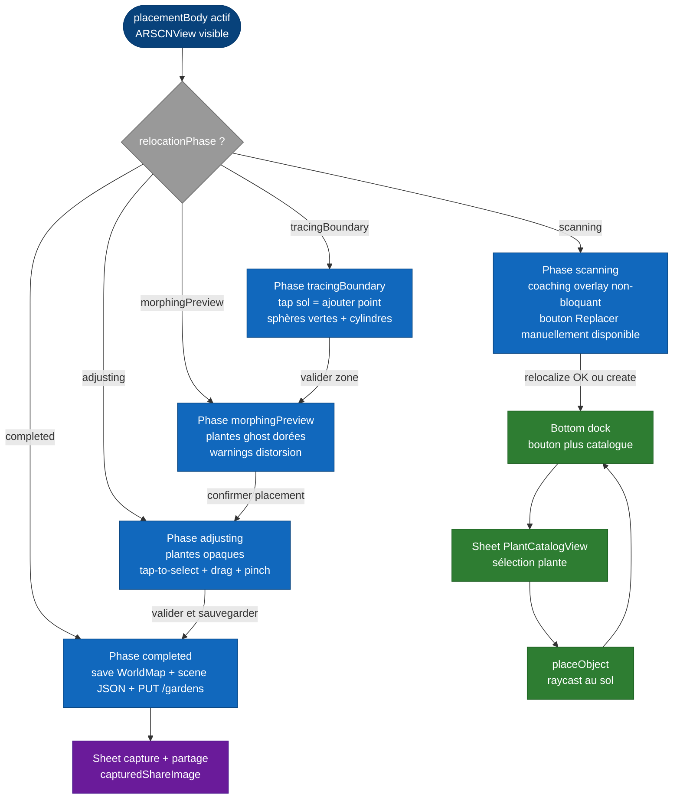

# Per-screen spec — `GardenARPlacementView`

## Purpose

Cet écran est le **cœur AR de l'application** : il permet à l'utilisateur de placer, déplacer et sauvegarder les plantes 3D dans son jardin via la caméra AR du téléphone. Il fonctionne aussi bien à la création d'un nouveau jardin qu'à la réouverture d'un jardin existant, avec ou sans LiDAR.

Le fichier est aussi le seul **god object** du codebase (≈ 3 300 lignes, suivi par l'issue #124).

## Entry points

| Source | Mode | Paramètres clés |
|---|---|---|
| Sortie du wizard de création (chemin perimeter non-LiDAR) | `.create` | `selectedPlants`, `boundaryPoints`, `wizard`, `gardenName`, `existingGardenId == nil`, `measurementWorldMapId == nil` |
| Sortie du wizard de création (chemin LiDAR) | `.create` | `selectedPlants`, `boundaryPoints == []`, `wizard`, `gardenName`, `existingGardenId == nil`, `measurementWorldMapId == UUID` (WorldMap pré-sauvegardée par `LiDARScanWizardView`) |
| Tap sur une carte jardin de la Home | `.reopen` | `existingGardenId: String` (ID Mongo), tout le reste lu depuis le disque (`worldmap_{id}.arworldmap` et `scene_{id}.json`) |
| Tap « Re-mesurer » depuis `ManageGardenView` | `.create` avec flag `measurementOnly` | Cas particulier suivi par l'issue #136 |

## Exit points

| Action utilisateur | Destination |
|---|---|
| Tap **« Valider et sauvegarder »** | Sauvegarde puis dismiss → callback `onValidated()` qui retourne à la Home et rafraîchit la liste des jardins. |
| Tap **X (back button)** en haut à gauche | Dismiss sans sauvegarde. Une modale de confirmation apparaît si l'utilisateur est en cours de manual replace (phase autre que `.scanning`). |
| Tap **partager** après sauvegarde | Ouvre un share sheet iOS avec une capture annotée de l'écran. |
| Détection de jardin indisponible (cf. issue #114) | Affiche `gardenUnavailableView` plutôt que `placementBody` — message d'erreur et bouton de retour. |

## Screen-level flow

Le flux global d'ouverture est documenté dans [`../flows/ar-placement.md`](../flows/ar-placement.md). Le diagramme ci-dessous se concentre sur le **flow intra-écran** une fois l'utilisateur dans la session AR active.

## Widgets

### `ARSCNView` (le canvas AR)

Vue ARKit + SceneKit pleine page. Délégates :

- `ARSCNViewDelegate` pour les ajouts/mises à jour d'`ARAnchor`.
- `ARSessionDelegate` pour les changements de tracking state et la détection de relocalisation réussie.
- `UIGestureRecognizerDelegate` pour gérer les conflits entre long-press, pan et pinch.

**Gestes attachés** : tap, long-press, pan, pinch, two-finger rotation. Tous routés à travers le **Coordinator** qui dispatche selon `relocationPhase` et selon la présence d'une plante sélectionnée.

### Bottom dock (bouton **+** catalogue)

Visible uniquement lorsque `relocationPhase == .scanning || relocationPhase == .completed` (cf. helper `isManualReplacement`). Ouvre la sheet `PlantCatalogView` qui propose la liste filtrée des plantes selon le profil du jardin.

**Pourquoi cette restriction** : le picker catalogue n'a pas de sens pendant qu'on retrace une zone ou qu'on prévisualise un morphing. Décision tracée dans #111.

### `PlantCatalogView` (sheet)

Sheet modale (présentée via `.sheet(isPresented: $showPicker)`). Liste filtrée des plantes du catalogue. À la sélection :

1. Le modèle USDZ est téléchargé via `ModelCacheManager` si pas déjà en cache.
2. Pendant le téléchargement, `isDownloadingModel = true` → un loader apparaît dans la dock bar.
3. À la fin du téléchargement, le tap suivant sur le sol invoque `placeObject` pour instancier la plante.

### Selection indicator (anneau pulsant)

Quand une plante est sélectionnée via tap, un `SCNTorus` vert pulsant (`selection_indicator`) est ajouté en enfant du nœud plante (cf. issue #111). L'animation oscille l'opacité entre 0.45 et 0.95 toutes les 0.6 s.

### Overlays Manual Replacement

Quatre overlays SwiftUI exclusifs au flow de #111, alternativement affichés selon `relocationPhase` :

| Overlay | Phase | Composant |
|---|---|---|
| Coaching | `.scanning` | `ScanningCoachingOverlay` — bottom-anchored, bouton « Replacer manuellement ». |
| Boundary tracing | `.tracingBoundary` | `BoundaryTracingOverlay` — compteur de points, surface live, trois boutons (effacer dernier, annuler, valider). |
| Morphing preview | `.morphingPreview` | `MorphingPreviewOverlay` — résumé des `distortionWarnings`, bouton « Confirmer » ou « Annuler ». |
| Adjusting | `.adjusting` | `AdjustingOverlay` — hint discret, deux boutons (annuler ajustements, valider et sauvegarder). |

### Share sheet (capture)

Après une sauvegarde réussie, l'utilisateur peut tap sur un bouton de partage. Une capture de l'écran AR est prise (`shouldCaptureSharePhoto = true` déclenche le `snapshot()` du `ARSCNView`), puis présentée dans une sheet de prévisualisation, puis dans le `UIActivityViewController` natif iOS.

### Lux widget

Petit widget en surimpression qui affiche la luminosité (lux) mesurée par `LuxAnalyzer`. Aide l'utilisateur à comprendre si les conditions d'éclairage sont compatibles avec une relocalisation AR fiable.

### Auto-placement (IA, en cours, #125)

`isAutoPlacing` et `autoPlaceToast` sont les états dédiés au placement automatique des plantes par une IA en cours de spécification (issue #125, Sprint 3). Le widget est masqué tant que la feature n'est pas activée.

## Edge cases

| Situation | Comportement |
|---|---|
| Permission caméra refusée | iOS bloque le démarrage de l'`ARSession`. `gardenUnavailable = true` et l'utilisateur voit un message « Activez l'accès caméra dans Réglages » avec un bouton vers l'app Settings. |
| Pas de tracking AR (device incompatible) | `ARWorldTrackingConfiguration.isSupported == false`. L'écran retombe sur `gardenUnavailableView`. |
| Réouverture d'un jardin avec WorldMap absente (issue #114) | `gardenUnavailable = true`, message dédié. À terme, reconstruction depuis le backend. |
| Modèle USDZ inaccessible (404 backend) | Logge l'erreur, retombe sur un placeholder gris pour la plante concernée. Le bouton de sauvegarde reste actif. |
| Relocalisation prend > 30 s sans succès | Aucun timeout dur — l'utilisateur peut continuer à attendre ou basculer en manual replace. |
| Backgrounding > 30 s | ARKit perd le tracking. Au retour, `session(_:cameraDidChangeTrackingState:)` détecte `.limited`. En mode `.reopen`, le coaching overlay peut réapparaître. |
| Save backend échoue après sauvegarde locale réussie | Les fichiers locaux (`worldmap_{id}.arworldmap` et `scene_{id}.json`) sont écrits avant le `PUT /gardens`. Si le `PUT` échoue, un retry réseau est tenté ; en cas d'échec définitif, l'écran reste ouvert avec un message d'erreur et un bouton « Réessayer ». |
| Coordinator deinit pendant un téléchargement de modèle | Le `ModelCacheManager` annule la tâche réseau (signal via le contexte du Combine cancellable). |

## Dependencies

### Endpoints backend

- `GET /models/:filename` (via `ModelCacheManager`) — téléchargement des USDZ.
- `POST /gardens` (en mode `.create`) — création initiale du document jardin si pas encore présent.
- `PUT /gardens/:id` — sauvegarde des positions actualisées en fin de session.
- `GET /plants/:id` (occasionnellement, via le picker) — détails d'une plante absente du catalogue local.

### États partagés et services

- `ModelCacheManager.shared` — cache disque + LRU des USDZ.
- `GardenLocalStore` — lecture/écriture de `worldmap_{id}.arworldmap` et `scene_{id}.json`.
- `NetworkManager.shared` — toutes les requêtes HTTP passent par ce singleton.
- `LuxAnalyzer` — instance par session AR, lit la luminosité depuis l'environnement ARKit.

### Permissions iOS

- **Caméra** — obligatoire (`NSCameraUsageDescription` dans `Info.plist`).
- **Photo Library** (Add Only) — uniquement si l'utilisateur active la sauvegarde de la capture de partage dans sa photothèque.

### Frameworks Apple utilisés

- **ARKit** (`ARWorldTrackingConfiguration`, `ARSCNView`, `ARWorldMap`, `ARAnchor`).
- **SceneKit** (`SCNNode`, `SCNScene`, `SCNTorus` pour l'anneau de sélection, `SCNAction` pour les pulses).
- **SwiftUI** pour tous les overlays et le dock.
- **Combine** pour les Cancellables de téléchargement et les pipelines réactifs.

## Dette et issues associées

| # | Sujet |
|---|---|
| #124 | Refactor god object — séparer le coordinator en sous-coordinators thématiques. |
| #123 | Race conditions identifiées dans le coordinator et tests manquants pour le morphing. |
| #114 | Récupération du jardin après désinstallation/réinstallation. |
| #113 | Plantes en hauteur mal repositionnées au reload. |
| #138 | Wired récemment — `pendingDragTransform` qui garantit la persistance du dernier drag. |
| #111 | Manual replacement — mergée mais reste à enrichir. |
| #97 | Pipeline neural depth-anything pour améliorer la relocalisation non-LiDAR. |
| #96 | Relocalisation échoue si l'éclairage change — racine de tous les flows manuels. |

## Hors-scope de cette spec

- Le détail mathématique du morphing MVC (méthode Floater 2003) reste dans `ManualReplacement/MeanValueCoordinates.swift`.
- Les transitions précises de `RelocationPhase` sont dans [`../state-machines/relocation-phase.md`](../state-machines/relocation-phase.md).
- Le rendu graphique des plantes (matériaux, ombres, sky-light) n'est pas couvert ici — c'est un détail SceneKit/RealityKit auquel un développeur AR aura accès via le code.
