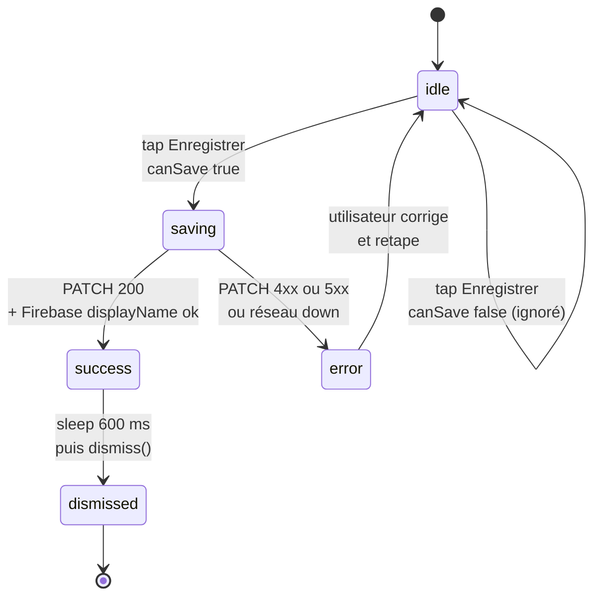

# Per-screen spec — `PersonalDetailsView`

## Purpose

Cet écran permet à l'utilisateur d'**éditer son nom de profil** et de consulter son email. Il était auparavant un *no-op visuel* (le bouton « Enregistrer » ne faisait que `dismiss()`, ce qui donnait l'illusion d'une sauvegarde sans rien persister — issue #138). Depuis son recâblage, il appelle `PATCH /users/me` côté backend puis met à jour le `displayName` Firebase Auth, garantissant la cohérence entre les deux sources de vérité.

Implémenté dans `Views/Profile/PersonalDetailsView.swift`.

## Entry points

| Source | Paramètres clés |
|---|---|
| Section **« Informations personnelles »** depuis `ProfileView` | Aucun paramètre — l'utilisateur courant est lu via `Auth.auth().currentUser`. |

## Exit points

| Action utilisateur | Destination |
|---|---|
| Tap **« Enregistrer les modifications »** (succès) | Affichage du toast inline « Modifications enregistrées ✓ » pendant 600 ms, puis `dismiss()` automatique. |
| Tap **« Enregistrer les modifications »** (erreur backend) | L'écran reste ouvert, message d'erreur inline en rouge (`PERSONAL_DETAILS_SAVE_ERROR`), `isSaving = false`, l'utilisateur peut retenter. |
| Tap **système de retour** (swipe ou back nav) | `dismiss()` immédiat sans sauvegarde. Bloqué pendant `isSaving == true` via `.interactiveDismissDisabled(isSaving)`. |

## Screen-level flow

Le bouton « Enregistrer » porte une **mini machine d'états** sur quatre statuts dérivés de trois `@State` : `isSaving`, `errorMessage`, `didSave`. Cette machine est implicite dans le code Swift mais explicite ci-dessous pour faciliter la review et le maintien.

L'état `idle` est l'état par défaut au mount. `canSave` est un computed qui retourne `true` uniquement si :

- L'écran n'est pas en cours de sauvegarde (`isSaving == false`).
- Le nom trimé n'est pas vide (`!trimmedName.isEmpty`).
- Le nom a été modifié depuis le mount (`trimmedName != initialName`).

Cette dernière condition empêche l'utilisateur de tap « Enregistrer » alors qu'il n'a rien changé.

## Widgets

### `inputField` (nom complet)

Composant interne basé sur `AppTextField` avec une icône système et un placeholder localisé. Lié à `$fullName: String`. Désactivé pendant `isSaving == true`.

### `readOnlyField` (email)

Composant interne en lecture seule. Affiche l'email courant du compte Firebase (`Auth.auth().currentUser?.email`). L'icône `envelope` et le style atténué (opacity 0.5 sur le fond de carte) signalent visuellement que le champ n'est pas éditable.

**Pourquoi en lecture seule** : Firebase Auth est la source de vérité pour l'email. Une modification implique un flow de vérification (mail de confirmation, ré-authentification), qui n'est pas dans le scope de cet écran. Si la feature est demandée, elle fera l'objet d'un écran dédié `ChangeEmailView`.

### Bouton primaire « Enregistrer »

Bouton plein-largeur stylé via `.buttonStyle(.arborePrimary)`. Comportement visuel selon l'état :

| État | Apparence |
|---|---|
| `idle` et `canSave == false` | Opacité 0.5, désactivé. |
| `idle` et `canSave == true` | Pleine opacité, tap réactif. |
| `saving == true` | Pleine opacité, `ProgressView()` à gauche du label. Désactivé. |

### Toast feedback (succès)

Affiché sous le formulaire, au-dessus du bouton, en vert (`ArboreDesign.Colors.success`). Apparaît brièvement avant le `dismiss()` automatique.

### Toast feedback (erreur)

Affiché sous le formulaire, en rouge (`ArboreDesign.Colors.danger`). Le message provient soit du `NetworkError.errorDescription`, soit du fallback localisé `PERSONAL_DETAILS_SAVE_ERROR`.

## Edge cases

| Situation | Comportement |
|---|---|
| Backend renvoie 401 / 403 | `NetworkError.unauthorized` ou `.forbidden`. Le message d'erreur est affiché tel quel par `errorDescription`. L'utilisateur peut retenter, mais en pratique cela signifie qu'il faut relancer l'app (token expiré) ou que le device est banni. |
| Backend renvoie 422 (nom trop long, > 100 caractères) | Message backend transmis via `NetworkError.serverError(message)`. L'utilisateur voit « Le nom est trop long (max 100 caractères) » et peut raccourcir. |
| Backend renvoie 400 (nom vide après trim) | Ne devrait pas arriver puisque le `canSave` côté iOS empêche déjà le tap si trim est vide. Si toutefois cela passe (cas de course par exemple), le message backend est affiché. |
| Connexion réseau coupée | `NetworkManager` tente un retry transparent (cf. `performWithRetry`). Si toujours échec, `NetworkError.serverError` est levée. Message fallback `PERSONAL_DETAILS_SAVE_ERROR`. |
| Backend down (5xx) | Idem : retry interne `NetworkManager` puis fallback. Aucun backoff explicite spécifique à cet écran — la requête est petite et l'utilisateur peut retenter manuellement. |
| Firebase `commitChanges()` échoue alors que `PATCH` a réussi | Le backend a la nouvelle source de vérité. Firebase reste désynchronisé jusqu'à la prochaine session (l'erreur est silencieusement loggée — `try? await`). À surveiller en cas de retours utilisateurs ; un retry plus robuste pourra être ajouté. |
| Utilisateur dismiss pendant `isSaving == true` | `.interactiveDismissDisabled(isSaving)` empêche le swipe-to-dismiss iOS. Le bouton de retour reste accessible mais le dismiss est bloqué le temps de la requête. |
| Email Firebase nul (compte non-vérifié) | `email` affiché en read-only avec le tiret « — ». L'utilisateur peut éditer son nom sans bloquer. |

## Dependencies

### Endpoints backend

- **`PATCH /users/me`** — endpoint introduit par l'issue #138. Payload : `{ "name": "..." }`. Authz self-only via le token Firebase. Validation backend : trim + max 100 caractères.

### États partagés et services

- `NetworkManager.shared` — appel `PATCH /users/me`.
- `Auth.auth().currentUser` — lecture initiale du `displayName` et de l'`email`, puis appel à `createProfileChangeRequest()` pour mettre à jour le `displayName` côté Firebase après succès backend.
- `ThemeManager` (`@EnvironmentObject`) — pour le `colorScheme` et les couleurs adaptatives.

### Localisation

Trois clés ajoutées en fr/en/de/es par l'issue #138 :

- `PERSONAL_DETAILS_SAVE_BUTTON` — déjà existante.
- `PERSONAL_DETAILS_SAVE_SUCCESS` — toast vert après succès.
- `PERSONAL_DETAILS_SAVE_ERROR` — fallback si le `NetworkError` n'a pas de message localisé.

### Permissions iOS

Aucune permission iOS requise par l'édition du nom. Pour la photo de profil (écran parent, cf. ci-dessous), `PHPickerViewController` s'exécute **hors-process** et ne demande donc **aucune autorisation d'accès** à la photothèque.

### Frameworks Apple utilisés

- **SwiftUI** pour toute la vue.
- **FirebaseAuth** pour la lecture du profil courant et la mise à jour du `displayName`.
- **PhotosUI** (`PHPickerViewController`) pour la sélection de la photo de profil depuis l'écran parent.

## Photo de profil (écran parent `ProfileView`)

La photo de profil n'est pas éditée depuis `PersonalDetailsView` mais depuis son **écran parent** `ProfileView` (bouton sur l'avatar de l'en-tête). Elle est documentée ici car elle fait partie des données d'identité.

| Étape | Détail |
|---|---|
| Sélection | `PhotoPicker` (`ProfileComponents.swift`) enveloppe `PHPickerViewController` (`filter = .images`, `selectionLimit = 1`). Aucune permission requise. |
| Normalisation | `normalizedProfileImage()` puis encodage **JPEG qualité 0.86**. |
| Stockage | ⚠️ **Local uniquement** : `Documents/ProfileImages/<uid>.jpg` (écriture atomique). La photo est rechargée au montage de l'écran (`fetchProfileImage`). |
| Réseau | **Aucun envoi.** L'endpoint backend `POST /users/:uid/photo` existe toujours côté serveur mais **n'est plus appelé par l'app iOS** — la photo ne quitte pas l'appareil. |
| Erreur | Échec d'écriture → message « Impossible de sauvegarder la photo. » (`uploadError`), pas de retry. |

**Conséquences** (suivies dans #329) : la photo n'est **pas synchronisée entre appareils** et disparaît à la désinstallation. Côté RGPD c'est le comportement le plus protecteur (donnée locale, jamais transmise) — mais l'export de données (art. 20) ne peut pas l'inclure tant qu'elle reste on-device.

> **Sauvegarde d'une capture en photothèque** — dans un flow distinct (`ARViewContainerMeasure`), l'app propose d'enregistrer une capture via `UIImageWriteToSavedPhotosAlbum`, ce qui **exige** `NSPhotoLibraryAddUsageDescription` dans l'`Info.plist` (absente, l'app crashait — corrigé, cf. #304).

## Issues associées

| # | Sujet |
|---|---|
| #138 | Wiring du bouton Save (cet écran). |
| #137 | Signup rollback — flow complémentaire qui garantit qu'un utilisateur Firebase a toujours son document Mongo associé. |
| #67 | Consentements RGPD étendus — la gestion des préférences marketing/notifications passera par un écran similaire (à créer). |

## Hors-scope de cette spec

- La **photo de profil** est éditée depuis l'écran parent `ProfileView` — décrite ci-dessus, dans la section dédiée.
- Le **changement d'email** et le **changement de mot de passe** sont des flows séparés non encore implémentés.
- La spec backend de `PATCH /users/me` est dans [`../architecture/03-components-backend.md`](../architecture/03-components-backend.md).
