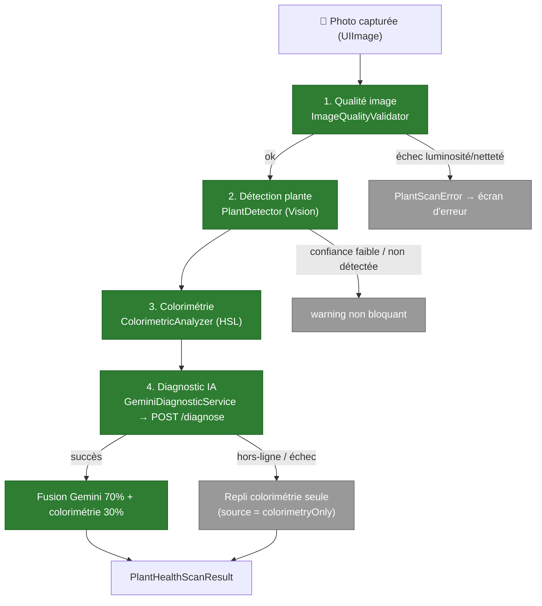

# Écran — Scan de santé des plantes

Le scan de santé permet à l'utilisateur de photographier une plante pour obtenir un **diagnostic phytopathologique** : espèce probable, état de santé global, maladies détectées et recommandations. Le pipeline combine des **pré-vérifications on-device** (qualité, détection, colorimétrie) et une **analyse IA via Gemini** (proxy backend), avec un **repli hors-ligne** basé sur la seule colorimétrie.

Code : `PlantHealthScanner.swift` (orchestrateur + étapes) ; vue : `PlantHealthScannerView.swift`. Le diagnostic IA passe par le backend `POST /diagnose` (cf. [`../architecture/03-components-backend.md`](../architecture/03-components-backend.md)).

## Pipeline

## Étapes du pipeline

| Étape | Type | Rôle |
|---|---|---|
| `ImageQualityValidator.validate` | on-device (CoreImage) | Rejette une image **trop sombre** (luminance moyenne < 0.15) ou **floue** (variance du Laplacien < seuil). Échec → `PlantScanError` bloquant. |
| `PlantDetector.detect` | on-device (Vision `VNClassifyImageRequest`) | Vérifie qu'une plante est présente (labels `plant`/`flower`/`leaf`… ≥ 0.50). Confiance faible ou absence → **warning non bloquant** (l'IA renforce l'analyse). Sautée sur simulateur. |
| `ColorimetricAnalyzer.analyze` | on-device | Classe chaque pixel en HSL (vert sain / jaune chlorose / brun nécrose / blanc cotonneux) → ratios + `healthScore` colorimétrique. Sert aussi de **repli hors-ligne**. |
| `GeminiDiagnosticService.diagnose` | réseau (backend) | Redimensionne l'image (800px, JPEG q0.6) + colorimétrie + nom d'espèce → `POST /diagnose`. Réponse JSON normalisée (cf. contrat backend). |
| `PlantHealthScanner.analyze` | orchestrateur (`@MainActor`) | Enchaîne les 4 étapes, publie `phase` (preview/capturing/analyzing/result/error) + indicateurs temps réel (`brightnessOK`, `plantDetected`), fusionne les résultats. |

## Fusion & résultat

En cas de succès Gemini, les deux sources sont combinées :
- **Santé globale** = `overallHealth` Gemini **70 %** + `healthScore` colorimétrie **30 %**.
- **Maladies** = celles renvoyées par Gemini (`name`, `severity`, `confidence`).
- **Incertitude** (`isUncertain`) = flag Gemini, ou confiance moyenne < 0.60.

Résultat : `PlantHealthScanResult` — `overallHealth`, `confidence`, `species` (optionnel), `diseases: [DetectedDisease]`, `recommendations`, `isUncertain`, et **`source`** :
- `gemini` — diagnostic IA complet.
- `colorimetryOnly` — **repli** quand Gemini est indisponible (hors-ligne / échec) : score et messages dérivés de la seule colorimétrie.

## Erreurs (`PlantScanError`)

`lowBrightness` · `blurryImage` · `noPlantDetected` · `cameraUnavailable` · `analysisTimeout` · `geminiError`. Chacune expose une description localisée et une icône SF Symbol pour l'écran d'erreur.

## Points clés

- **Dégradation gracieuse** : une image invalide est refusée tôt (pas d'appel réseau) ; une plante non détectée n'est qu'un avertissement ; Gemini indisponible → repli colorimétrie. L'app reste utilisable hors-ligne avec un diagnostic dégradé.
- **Coût & latence maîtrisés** : image redimensionnée à 800px / JPEG 0.6 avant envoi ; le backend borne la taille, le rate-limit et normalise la sortie.
- **RGPD** : la photo de diagnostic est envoyée à **Google Gemini** (hors UE) via le proxy backend — divulgué dans la politique de confidentialité in-app.
- **Tests** : la logique pure (erreurs, validateur de qualité, colorimétrie, décodage du contrat) est couverte par `PlantHealthScannerTests.swift` (cf. [`../testing/ios.md`](../testing/ios.md)).

## Hors-scope de cette vue

- Le proxy `/diagnose` (auth, rate-limit, normalisation du schéma) est documenté dans [`../architecture/03-components-backend.md`](../architecture/03-components-backend.md).
