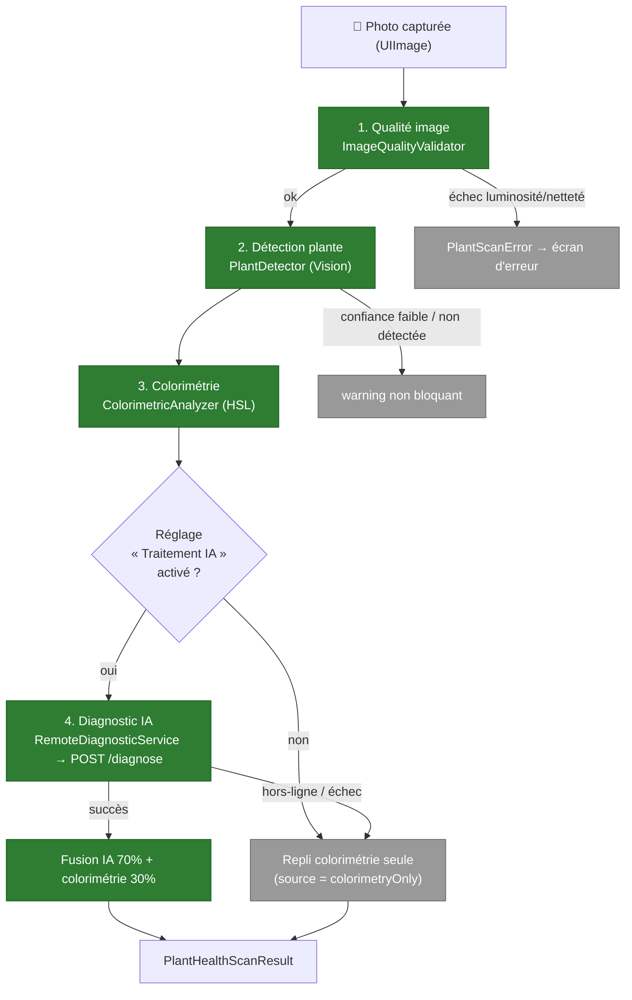

# Écran — Scan de santé des plantes

Le scan de santé permet à l'utilisateur de photographier une plante pour obtenir un **diagnostic phytopathologique** : espèce probable, état de santé global, maladies détectées et recommandations. Le pipeline combine des **pré-vérifications on-device** (qualité, détection, colorimétrie) et une **analyse par le fournisseur d'IA** (proxy backend), avec un **repli local** basé sur la seule colorimétrie.

Code : `PlantHealthScanner.swift` (orchestrateur + étapes) ; vue : `PlantHealthScannerView.swift`. Le diagnostic IA passe par le backend `POST /diagnose` (cf. [`../architecture/03-components-backend.md`](../architecture/03-components-backend.md)). **Le nom du fournisseur n'apparaît nulle part côté app** : c'est le backend qui choisit (`AI_PROVIDER`), et il a déjà changé une fois.

## Pipeline

## Étapes du pipeline

| Étape | Type | Rôle |
|---|---|---|
| `ImageQualityValidator.validate` | on-device (CoreImage) | Rejette une image **trop sombre** (luminance moyenne < 0.15) ou **floue** (variance du Laplacien < seuil). Échec → `PlantScanError` bloquant. |
| `PlantDetector.detect` | on-device (Vision `VNClassifyImageRequest`) | Vérifie qu'une plante est présente (labels `plant`/`flower`/`leaf`… ≥ 0.50). Confiance faible ou absence → **warning non bloquant** (l'IA renforce l'analyse). Sautée sur simulateur. |
| `ColorimetricAnalyzer.analyze` | on-device | Classe chaque pixel en HSL (vert sain / jaune chlorose / brun nécrose / blanc cotonneux) → ratios + `healthScore` colorimétrique. Sert aussi de **repli local**. |
| `AIProcessingPreference.estAutorise` | on-device (`UserDefaults`) | **Porte de sortie** : si le réglage « Traitement IA » est éteint, la photo ne quitte pas l'appareil et le pipeline se termine en `colorimetryOnly`. |
| `RemoteDiagnosticService.diagnose` | réseau (backend) | Redimensionne l'image (800px, JPEG q0.6) + colorimétrie + nom d'espèce → `POST /diagnose`. Réponse JSON normalisée (cf. contrat backend). |
| `PlantHealthScanner.analyze` | orchestrateur (`@MainActor`) | Enchaîne les étapes, publie `phase` (preview/capturing/analyzing/result/error) + indicateurs temps réel (`brightnessOK`, `plantDetected`), fusionne les résultats. |

## Réglage « Traitement IA » (#549)

Le réglage vit dans Profil → Confidentialité (`PrivacySettingsView`), sa valeur par défaut dans `ConsentDefaults.ai`, et sa lecture est centralisée par `AIProcessingPreference` (clé `UserDefaults` `privacy_ai`). Les **deux** points d'envoi le consultent : ce scan et l'assistant (`ChatBotView`).

C'est une **préférence de fonctionnalité**, pas un consentement RGPD : le diagnostic repose sur la base contractuelle art. 6(1)(b), et l'éteindre ne coupe pas le service — il le **dégrade** :

| Réglage | Scan de santé | Assistant |
|---|---|---|
| Activé (défaut) | Diagnostic IA complet, fusionné avec la colorimétrie | Disponible |
| Éteint | `colorimetryOnly` + warning `SCAN_WARNING_AI_DISABLED` — **la photo ne quitte pas l'appareil** | Indisponible, message explicite |

## Ancrage sur le catalogue (#554)

Le backend **ancre** le diagnostic sur nos propres fiches avant d'appeler le modèle, et réconcilie sa réponse après :

1. **Avant l'appel** — si `plantName` est fourni et correspond à une fiche, ses données (arrosage, lumière, toxicité…) sont jointes au prompt comme bloc de référence.
2. **Après l'appel** — si l'`species` renvoyée correspond à une fiche, la réponse porte `catalogPlantId` + `catalogPlantName` ; sinon, l'ancrage initial sert de repli.

Le champ `catalogPlantId` est **exposé par le backend mais pas encore consommé** par `LLMDiagnosticResponse` côté iOS : l'enchaînement « diagnostic → fiche du catalogue » reste à câbler dans la vue.

## Fusion & résultat

En cas de succès de l'IA, les deux sources sont combinées :
- **Santé globale** = `overallHealth` IA **70 %** + `healthScore` colorimétrie **30 %**.
- **Maladies** = celles renvoyées par l'IA (`name`, `severity`, `confidence`).
- **Incertitude** (`isUncertain`) = flag renvoyé par l'IA, ou confiance moyenne < 0.60.

Résultat : `PlantHealthScanResult` — `overallHealth`, `confidence`, `species` (optionnel), `diseases: [DetectedDisease]`, `recommendations`, `isUncertain`, et **`source: DiagnosticSource`** :
- `remote` — diagnostic IA complet.
- `colorimetryOnly` — **repli** hors-ligne, échec distant, **ou réglage IA éteint** : score et messages dérivés de la seule colorimétrie.

## Avertissement IA

L'écran de résultat affiche systématiquement `AI_DISCLAIMER_SCAN` — « Ce diagnostic est une estimation, pas un avis vétérinaire ou phytosanitaire. L'IA peut se tromper : en cas de doute, demande à un professionnel. » — traduit dans les **quatre** langues (fr/en/es/de) et couvert par `LocalizationCoverageTests`.

## Erreurs (`PlantScanError`)

`lowBrightness` · `blurryImage` · `noPlantDetected` · `cameraUnavailable` · `analysisTimeout` · `llmError`. Chacune expose une description localisée et une icône SF Symbol pour l'écran d'erreur.

## Points clés

- **Dégradation gracieuse** : une image invalide est refusée tôt (pas d'appel réseau) ; une plante non détectée n'est qu'un avertissement ; IA indisponible **ou refusée par l'utilisateur** → repli colorimétrie. L'app reste utilisable hors-ligne avec un diagnostic dégradé.
- **Coût & latence maîtrisés** : image redimensionnée à 800px / JPEG 0.6 avant envoi ; le backend borne la taille (6 Mo), le rate-limit, le débit vers le fournisseur et normalise la sortie.
- **RGPD** : la photo de diagnostic est envoyée au fournisseur d'IA (hors UE) via le proxy backend — divulgué dans la politique de confidentialité in-app, et coupable par le réglage ci-dessus.
- **Tests** : la logique pure (erreurs, validateur de qualité, colorimétrie, décodage du contrat) est couverte par `PlantHealthScannerTests.swift`, le réglage par `AIProcessingPreferenceTests.swift` (cf. [`../testing/ios.md`](../testing/ios.md)).

## Hors-scope de cette vue

- Le proxy `/diagnose` (auth, rate-limit, débit, ancrage catalogue, normalisation du schéma) est documenté dans [`../architecture/03-components-backend.md`](../architecture/03-components-backend.md).
- Le choix du fournisseur et ses conditions d'utilisation : [`../operations/fournisseurs-llm.md`](../operations/fournisseurs-llm.md).
