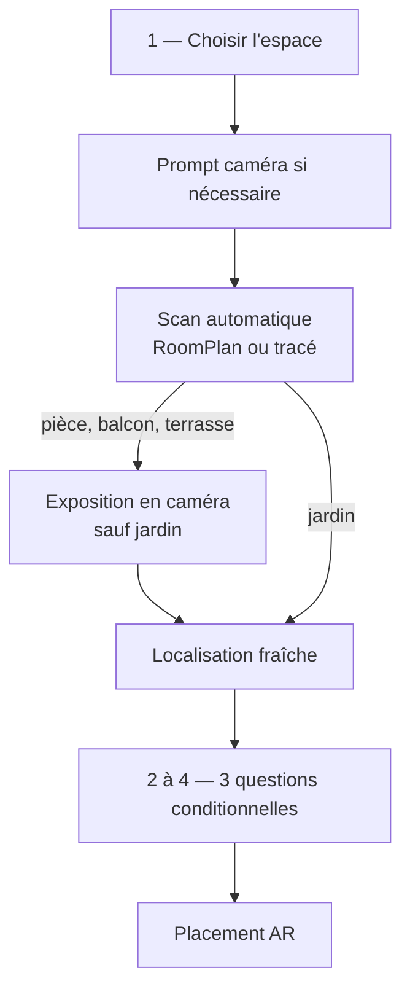

# Per-screen spec — `QuestionnaireView` (wizard de création)

## Objectif

`QuestionnaireView` conduit l'utilisateur du choix de l'espace au placement AR sans écran de suggestion intermédiaire. La progression visible comporte quatre niveaux : choix de l'espace, puis chacune des trois questions conditionnelles. La mesure, l'exposition éventuelle et la localisation restent des sous-flows contextuels, sans page de récapitulatif.

Implémentation principale : `Views/GardenSteps/QuestionnaireView.swift`.

## Entrée et sorties

| Action | Destination |
|---|---|
| « Créer un jardin » depuis la Home | `GardenWizardView`, première étape `spaceType`. |
| **Continuer** après le choix de l'espace | Prompt système caméra si nécessaire, puis scan direct. |
| Validation de la localisation | Étape `essentialQuestions`. |
| Validation de la troisième question | `GardenARPlacementView` avec le jardin déjà créé. |
| Retour depuis la première étape ou X | `dismiss()` vers la Home. |

## Flux



`visibleSteps` ne contient que :

```swift
[.spaceType, .essentialQuestions]
```

## Choix automatique de la méthode

- Pièce et `RoomCaptureSession.isSupported == true` : `roomScan`.
- Tous les autres cas : `gardenPerimeter`.
- « Changer de méthode » apparaît dans la caméra uniquement pour une pièce compatible RoomPlan.

La page `ScanMethodSelectionView` n'existe plus. Le CTA **Continuer** de `SpaceTypeStepView` pose `state.scanMethod`, demande directement l'autorisation système si son état est `.notDetermined`, puis ouvre la full-screen cover AR. `GardenAnalysisAuthorizationFlowView` est uniquement un écran de récupération après refus, avec accès aux Réglages.

## Sous-flows

### Mesure et création

`ARViewContainerMeasure` trace le contour au sol. `LiDARScanWizardView` utilise RoomPlan. Après validation des dimensions, aucune vérification supplémentaire n'est demandée. Le scan enregistre la WorldMap et les mesures, puis crée le jardin avec `POST /gardens` et `plants: []`.

### Exposition

Pour une pièce, un balcon ou une terrasse, `GardenExposureCaptureOverlay` apparaît sans fermer la caméra. L'utilisateur vise la source lumineuse principale et confirme. Un jardin ignore cette capture.

### Localisation

Après fermeture de la caméra, `GardenLocationCaptureView` demande une nouvelle localisation approximative pour chaque jardin. `state.location` est toujours réinitialisé avant une création. La ville manuelle et la poursuite sans localisation restent disponibles. La valeur est ajoutée au jardin par `PUT /gardens/:id`.

Le snapshot résolu du wizard (localisation approximative, exposition, orientation et ensoleillement déduit) est également écrit dans `wizard_<gardenId>.json`. À l'ouverture du plan 2D, les seules valeurs capturées absentes de la réponse serveur sont restaurées depuis ce snapshot, affichées immédiatement puis renvoyées au backend. Une valeur distante existante, notamment une correction manuelle, reste toujours prioritaire.

### Questions conditionnelles

`EssentialQuestionsStepView` est découpé en trois mini-écrans internes. Chacun reprend strictement la structure de `SpaceTypeStepView` : un titre, une courte consigne, quatre grandes cartes en grille 2 × 2, puis les boutons « Continuer » et « Retour ». Aucun indicateur, libellé ou CTA secondaire propre aux questions n'est ajouté. La progression globale passe successivement de 1/4 sur le choix de l'espace à 2/4, 3/4 et 4/4 sur les questions.

- Jardin : mode de plantation, drainage après pluie, sécurité.
- Balcon / terrasse : vent, pots existants ou nouvelle composition, sécurité.
- Pièce : humidité de l'air, chauffage proche, sécurité.

Chaque question possède « Je ne sais pas ». Toutes les réponses sont facultatives et le CTA reste actif sans sélection. Pour la sécurité, « Animaux » et « Jeunes enfants » peuvent être sélectionnés ensemble afin de conserver quatre cartes. « Retour » revient à la question précédente ; depuis la première, il rouvre la localisation. Les valeurs inconnues ne sont pas sérialisées. Les réponses connues alimentent `wizard.conditionalAnswers`, tandis que la sécurité alimente le champ existant `wizard.safety`. La sauvegarde des questions attend celle de la localisation afin qu'un ancien snapshot ne puisse pas effacer le plus récent, sans bloquer la lecture de l'écran.

### Placement direct

La validation de la troisième question ouvre directement `GardenARPlacementView` avec `existingGardenId`. L'utilisateur peut y choisir et placer ses plantes depuis les outils AR existants. La validation finale met à jour le jardin par `PUT /gardens/:id`, puis ouvre directement son plan 2D dans l'onglet Jardin. La fiche éditable `GardenSpaceProfileView` y regroupe les données mesurées, déduites ou déclarées sans ajouter d'étape au wizard.

## Cas limites

| Situation | Comportement |
|---|---|
| Caméra déjà autorisée | Le scan s'ouvre directement. |
| Première demande caméra | Le prompt iOS apparaît sur l'écran de choix de l'espace. |
| Caméra refusée | Écran de récupération avec ouverture des Réglages. |
| Localisation refusée | Ville manuelle ou poursuite sans localisation ; aucune ancienne position n'est reprise. |
| Question inconnue ou ignorée | Aucun champ n'est inventé ; le placement AR reste accessible. |
| Enregistrement des questions indisponible | Les réponses restent en mémoire et seront renvoyées lors du placement final. |
| Backend indisponible après le tracé | Message inline et nouvelle tentative possible. |
| Changement de méthode | L'ancienne caméra se ferme et l'autre moteur s'ouvre ; uniquement pour une pièce compatible RoomPlan. |

## Dépendances

- `AVFoundation` : statut et demande caméra.
- `RoomPlan` : disponibilité et scan 3D.
- `CoreLocation` : localisation ponctuelle approximative.
- `CoreMotion` et ARKit : orientation et luminosité lors de l'exposition.
- `GardenAPI` / `NetworkManager` : création et mises à jour du jardin.
- Détail du flux : [`../flows/garden-creation.md`](../flows/garden-creation.md).
