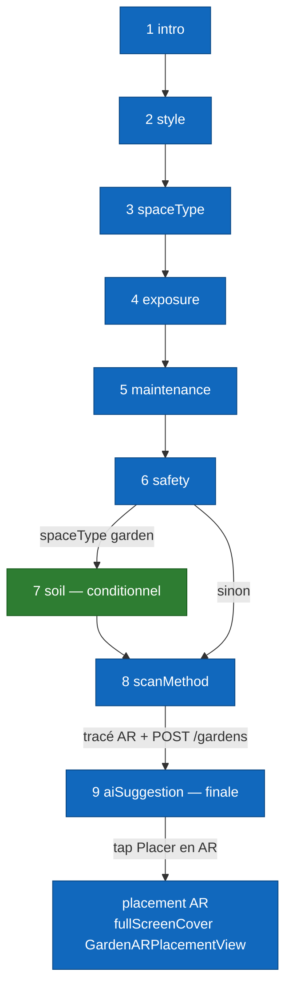

# Per-screen spec — `QuestionnaireView` (wizard de création)

## Purpose

Cet écran guide l'utilisateur à travers la **création complète d'un jardin** : profil esthétique et fonctionnel (style, espace, exposition, entretien, sécurité, sol), choix de la méthode de scan **qui crée le jardin en base**, puis sélection de plantes assistée par IA. À sa sortie, l'utilisateur est routé vers la vue AR de placement.

Implémenté dans `Views/GardenSteps/QuestionnaireView.swift`. Composé de 8 à 9 étapes (selon les choix), portées par une `TabView` non-paginable dont la sélection est gouvernée par l'enum `GardenWizardStep`. **Ordre inversé volontaire** : l'étape `scanMethod` ouvre d'abord la vue AR de tracé, qui crée le jardin en base avec sa boundary, **avant** de rendre la main au wizard pour l'étape **finale** `aiSuggestion`. Il n'y a **pas** d'étape « summary ».

## Entry points

| Source | Paramètres clés |
|---|---|
| Bouton **« Créer un jardin »** depuis la Home | `uid: String`, `selectedPlants: [Plant]` (généralement `[]`), `onFinish: (GardenWizardState) -> Void` |
| Action « Recommencer » depuis la fin du wizard | Mêmes paramètres, état `GardenWizardState` réinitialisé |

## Exit points

| Action utilisateur | Destination |
|---|---|
| Tap **« Démarrer le tracé »** à l'étape `scanMethod`, `scanMethod == gardenPerimeter` | `fullScreenCover` vers `ARViewContainerMeasure` (tracé périmètre non-LiDAR) → `POST /gardens` à la fin du tracé → retour au wizard sur `aiSuggestion`. |
| Tap **« Scanner la pièce »** à l'étape `scanMethod`, `scanMethod == roomScan` | `fullScreenCover` vers `LiDARScanWizardView` (RoomPlan) → `POST /gardens` → retour au wizard sur `aiSuggestion`. |
| Tap **« Placer mes plantes en AR »** à l'étape finale `aiSuggestion` | `fullScreenCover` vers `GardenARPlacementView` (placement des plantes, `PUT /gardens/:id`). |
| Tap **« Retour »** sur la première étape (intro) ou **X (close)** | `dismiss()` — retour à la Home. Aucune confirmation tant que le jardin n'est pas créé. |

## Screen-level flow

Le flux complet est documenté dans [`../flows/garden-creation.md`](../flows/garden-creation.md). Le diagramme ci-dessous se concentre sur la **navigation interne entre étapes**, gérée par le computed `visibleSteps` et les helpers `goToNext` / `goToPrevious`.

## Widgets

### `WizardProgressHeader`

Barre de progression. Affiche l'étape courante (`currentIndex + 1`) et le total d'étapes visibles (`visibleSteps.count`). Recalculée quand `visibleSteps` change (par exemple si `spaceType` repasse de `garden` à `indoor`, l'étape `soil` apparaît/disparaît).

### Boutons de navigation

| Bouton | Style | Action |
|---|---|---|
| **« Continuer »** | Primary | `goToNext()` — incrémente `currentIndex`. Désactivé tant que l'étape n'a pas reçu de réponse valide. |
| **« Retour »** | Secondary | `goToPrevious()` — décrémente `currentIndex`. Désactivé à l'étape `intro`. |

Les styles `PrimaryWizardButtonStyle` / `SecondaryWizardButtonStyle` sont partagés entre toutes les étapes.

### `ImprovedSelectableCard`

Carte sélectionnable utilisée sur la plupart des étapes (style, spaceType, exposure, maintenance, scanMethod). Icône système, titre, sous-titre, dégradé ; bordure + check quand `isSelected`.

### `ScanMethodStepView` (étape 8) — création du jardin

Choix de la méthode de scan, **étape qui crée le jardin** :

- **Tracer mon jardin au sol** (`gardenPerimeter`) — toujours active.
- **Scanner la pièce en 3D** (`roomScan`) — désactivée (`opacity(0.4)`) si `RoomCaptureSession.isSupported == false` (pas de LiDAR).

Au lancement du scan/tracé, la vue AR correspondante s'ouvre ; à la fin du tracé, `POST /gardens` crée le document avec sa boundary, puis le wizard revient sur `aiSuggestion`.

### `AISuggestionStepView` (étape 9, finale)

Affiche les plantes recommandées par `GardenSuggestionEngine` selon le profil. Bouton primaire **« Placer mes plantes en AR »** → ouvre `GardenARPlacementView` (placement, `PUT /gardens/:id`).

## Edge cases

| Situation | Comportement |
|---|---|
| « Retour » jusqu'à `intro` | Le bouton « Retour » se désactive ; quitter via le X. |
| `spaceType` modifié en arrière | `visibleSteps` recalculé : passer de `garden` à `indoor` retire `soil`. Un `onChange(of: visibleSteps)` repositionne l'étape courante si elle disparaît. |
| Backend down au tracé (`scanMethod`) | `POST /gardens` lève une `NetworkError` ; message inline « Impossible de créer le jardin. Réessayez. » et nouvelle tentative possible. |
| LiDAR sélectionné mais non supporté | Ne devrait pas arriver (carte grisée). Sinon `LiDARScanWizardView` affiche « Scan 3D indisponible » et propose de revenir au choix. |
| Permission caméra refusée | Demandée par `ARViewContainerMeasure` / `LiDARScanWizardView` ; si refusée, retour au wizard avec message d'erreur. |
| `selectedPlants == []` | Toléré : l'utilisateur peut placer des plantes depuis le picker AR. |
| Dismiss avant création | Aucune persistance disque pendant le wizard tant que le jardin n'est pas créé. Décision tracée dans [`../flows/garden-creation.md`](../flows/garden-creation.md). |

## Dependencies

### Endpoints backend

- `GET /plants` — chargement du catalogue pour l'étape `aiSuggestion` (`onAppear`).
- `POST /gardens` — création du document jardin **à la fin du tracé** (`scanMethod`).
- `PUT /gardens/:id` — mise à jour du jardin avec les plantes placées (depuis `GardenARPlacementView`).

### États partagés et services

- `GardenWizardState` (`@StateObject`) — vit le temps du wizard ; stocke les sélections (style, spaceType, exposure, maintenance, safety, soil, scanMethod) et les données de scan (`measuredBoundaryPoints`, `measuredArea`, `measuredPerimeter`).
- `GardenSuggestionEngine` — filtre/propose les plantes adaptées au profil pour `aiSuggestion`.
- `TabRouter` (`@EnvironmentObject`) — redirection vers la Home après création.
- `NetworkManager.shared` — appels backend.

### Permissions iOS

Aucune permission requise pendant le wizard lui-même. Les permissions caméra/LiDAR sont demandées par les vues AR ouvertes à l'étape `scanMethod`.

### Frameworks Apple utilisés

- **SwiftUI** pour l'intégralité de la vue (`TabView` non-paginable).
- **RoomPlan** pour `RoomCaptureSession.isSupported` côté `ScanMethodStepView`.

## Issues associées

| # | Sujet |
|---|---|
| #139 | Validation LiDAR end-to-end — bouton « roomScan » du wizard. |
| #97 | Pipeline neural (alternative future à RoomPlan pour le scan non-LiDAR). |
| #21 | Sauvegarde des modèles de jardin avec autosave et versions. |

## Hors-scope de cette spec

- Le détail du placement AR est documenté dans [`garden-ar-placement.md`](garden-ar-placement.md) et [`../flows/ar-placement.md`](../flows/ar-placement.md).
- Le scoring du filtrage AI (`GardenSuggestionEngine`) est un détail d'implémentation testé en unitaire.
- La spec backend du handler `createGarden` est dans [`../architecture/03-components-backend.md`](../architecture/03-components-backend.md).
