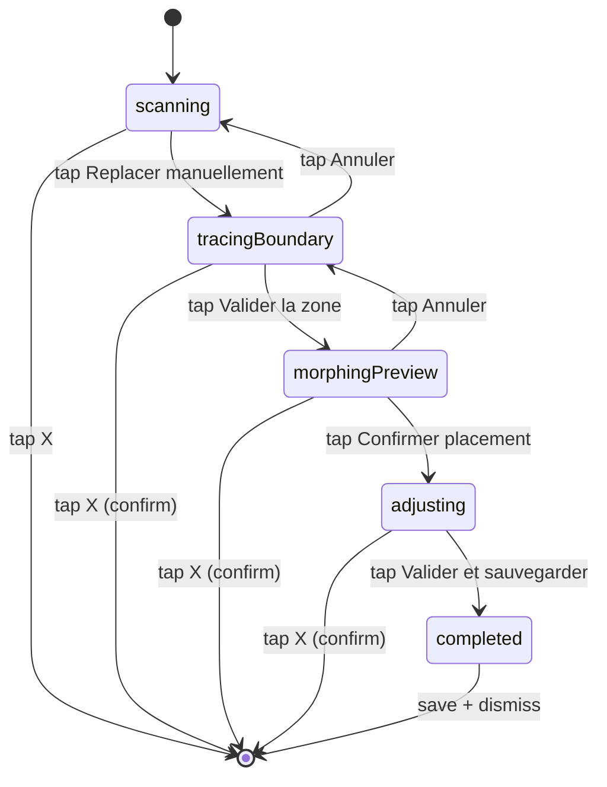

# Machine d'états — `RelocationPhase`

`RelocationPhase` est l'enum Swift défini dans `ArboreUi/ArboreUi/ARGarden/ManualReplacement/RelocationPhase.swift` qui pilote le **flow de re-placement manuel** du jardin lorsque la relocalisation `ARWorldMap` échoue (par exemple parce que l'éclairage a changé entre deux sessions sur un device non-LiDAR — cf. issue #96).

Cette machine d'états est portée par `GardenARPlacementView` et n'est active qu'en mode `.reopen` ; en mode `.create`, l'enum reste figée sur `.scanning` et la machine ne s'exécute pas.

Pour le contexte produit et l'historique, voir l'[issue #111](https://github.com/ArboreTeam/Arbore/issues/111) (mergée le 2026-04-29).

## Diagramme

Le diagramme ci-dessous décrit les états, les transitions, et l'événement déclencheur de chaque transition. Les actions associées (snapshots, ghost rendering, anchor cleanup) sont décrites dans la section suivante.

Les **self-transitions** ne sont pas représentées sur le diagramme pour préserver sa lisibilité ; elles sont décrites au cas par cas dans la section « Comportement détaillé par état » plus bas :

- `scanning → scanning` : ARKit `relocalize` réussit en arrière-plan → la machine est court-circuitée et `loadGardenFromDisk` est appelé sans transition d'état explicite.
- `tracingBoundary → tracingBoundary` : tap au sol → un point est ajouté à `newBoundary`.
- `adjusting → adjusting` : drag/tap d'une plante → `recordDraggedTransform`. Ou tap **« Annuler ajustements »** → revert vers `preMorphAdjustment`.

## Comportement détaillé par état

### `scanning`

ARKit tente de relocaliser le `ARWorldMap` sauvegardé. L'utilisateur voit :

- La caméra arrière en plein écran.
- Un **coaching overlay bottom-anchored** (composant `ScanningCoachingOverlay`) qui invite à bouger le téléphone pour reconnaître l'environnement.
- Un bouton **« Replacer manuellement »** disponible immédiatement (pas de timeout artificiel).
- Un bouton **X** en haut à droite pour dismiss totalement la vue.

**Sortie possibles** :

| Événement | Transition |
|---|---|
| ARKit `relocalize` succeeds | La machine est court-circuitée : `loadGardenFromDisk` est appelé et les plantes sont restaurées via leurs `ARAnchor` sauvegardés. La machine reste à `scanning` mais aucun overlay manuel n'apparaît. |
| Tap "Replacer manuellement" | `enterManualReplacement()` → bascule sur `tracingBoundary`. |
| Tap X | Dismiss de la vue, machine terminée. |

### `tracingBoundary`

L'utilisateur retrace la boundary du jardin en tapant le sol. Composant UI : `BoundaryTracingOverlay`.

**Actions à chaque tap au sol** :

1. `lastReticleTransform` est lu, sa position 3D est ajoutée à `newBoundary: [SIMD3<Float>]`.
2. Une **sphère verte** est instanciée au point tapé (pattern réutilisé de `ARViewContainerMeasure`).
3. Des cylindres reliant les points sont mis à jour pour visualiser le polygone.
4. La surface (m²) est calculée via Shoelace et affichée en temps réel.

**Trois actions utilisateur** :

| Action | Résultat |
|---|---|
| Tap **« Effacer dernier »** | Retire le dernier point de `newBoundary` ainsi que la sphère et le segment associés. |
| Tap **« Annuler »** | Vide `newBoundary`, retire toutes les sphères et le ghost old boundary, retour à `scanning`. |
| Tap **« Valider la zone »** (désactivé si < 3 points) | `validateNewBoundary()` → calcule le morphing via `GardenMorpher` → bascule sur `morphingPreview`. |

### `morphingPreview`

Les plantes sont affichées en **ghost doré** (opacity 0.6) à leur position morphée calculée par les Mean Value Coordinates. Composant UI : `MorphingPreviewOverlay`.

**Affichage** :

- Si `distortionWarnings.isEmpty` : message vert **« ✓ Placement fiable »**.
- Sinon : carte orange listant les plantes à risque (cliquable pour highlighter une plante dans la scène 3D). Les plantes en zone de forte distorsion (score ≥ 1.8) sont teintées orange au lieu de dorées.

**Deux actions utilisateur** :

| Action | Résultat |
|---|---|
| Tap **« Annuler »** | Retour à `tracingBoundary` ; `newBoundary` et les ghosts sont remis à zéro, l'utilisateur peut retracer. |
| Tap **« Confirmer le placement »** | `confirmMorphedPlacement()` → instancie réellement les plantes via `placeObject`, snapshot leur transform dans `preMorphAdjustment`, bascule sur `adjusting`. |

### `adjusting`

Les plantes deviennent opaques. L'utilisateur peut affiner leur position à la main. Composant UI : `AdjustingOverlay`.

**Gestures disponibles** :

| Geste | Action |
|---|---|
| Tap sur une plante | Sélectionne la plante, affiche l'anneau vert pulsant `selection_indicator`. |
| Tap sur le sol (avec une plante sélectionnée) | Téléporte la plante à la position raycast → `recordDraggedTransform`. |
| Long-press + drag | Déplace en continu → `recordDraggedTransform` à `.ended`. |
| Pinch | Met à l'échelle (si autorisé pour la plante). |

**Deux actions globales** :

| Action | Résultat |
|---|---|
| Tap **« Annuler ajustements »** | Restaure les positions snapshottées dans `preMorphAdjustment`. La machine reste à `adjusting` (l'utilisateur peut reprendre). |
| Tap **« Valider et sauvegarder »** | Sauve `ARWorldMap` + `scene_{id}.json` sur disque, bascule sur `completed`. |

### `completed`

État transitoire avant dismiss. Aucune interaction utilisateur. La vue ferme automatiquement après quelques centaines de millisecondes pour laisser le temps au feedback visuel de succès.

## Helper `isManualReplacement`

L'enum expose un computed `isManualReplacement: Bool` qui retourne `true` pour `.tracingBoundary`, `.morphingPreview`, `.adjusting` et `.completed`, `false` pour `.scanning`. Ce flag est utilisé par `GardenARPlacementView` pour :

- Masquer le bouton **« + »** du dock pendant le re-placement manuel (le picker plantes du catalogue n'a aucun sens pendant qu'on retrace une zone).
- Bloquer les events ARKit de relocalisation tardive (l'utilisateur a pris la main, on ne réécrase pas ses positions).

## Sortie par dismiss (X) — confirmation

Le bouton **X** en haut à droite reste disponible à tous les états sauf `scanning` où il est immédiat. Dans les autres états, une **modale de confirmation** apparaît :

> « Annuler le replacement ? Les changements ne seront pas sauvegardés. »

Cette modale est obligatoire pour éviter qu'un tap accidentel ne fasse perdre 5 minutes de retraçage.

## Hors-scope de cette vue

- Le détail mathématique du morphing (Mean Value Coordinates, Distortion Analyzer) est documenté dans le glossaire et reste un détail d'implémentation testé en unitaire (`GardenMorpherTests` cible de l'issue #123).
- Le rendu graphique des ghosts (matériau doré, anneau pulsant) est documenté inline dans `GhostRenderer.swift` et n'est pas pertinent au niveau de la machine d'états.
- Le flow d'ouverture complet (depuis le tap sur une carte jardin de la Home jusqu'à l'arrivée sur `scanning`) sera documenté dans [`../flows/ar-placement.md`](../flows/ar-placement.md).
