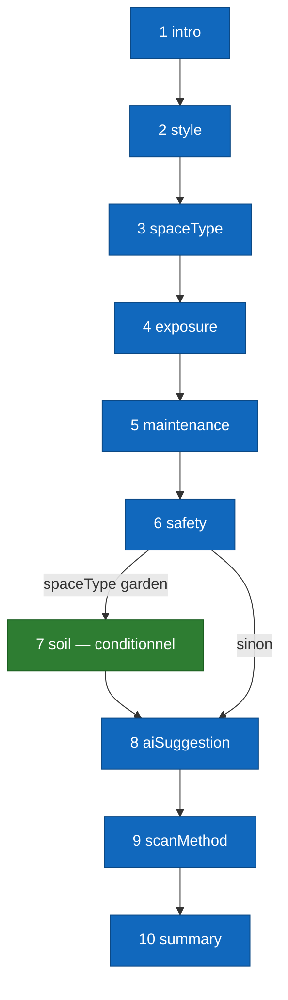

# Per-screen spec — `GardenWizardView` (wizard de création)

## Purpose

Cet écran guide l'utilisateur à travers la **création complète d'un jardin** : profil esthétique et fonctionnel (style, espace, exposition, entretien, sécurité, sol), sélection de plantes assistée par IA, choix de la méthode de scan, et validation finale. À sa sortie, l'utilisateur est routé vers une vue AR adaptée à sa méthode de scan.

Implémenté dans `Views/GardenSteps/QuestionnaireView.swift`. Composé de 10 étapes maximum (entre 9 et 10 selon les choix), portées par une `TabView` non-paginable dont la sélection est gouvernée par l'enum `GardenWizardStep`.

## Entry points

| Source | Paramètres clés |
|---|---|
| Bouton **« Créer un jardin »** depuis la Home | `uid: String`, `selectedPlants: [Plant]` (généralement `[]`), `onFinish: (GardenWizardState) -> Void` |
| Action « Recommencer » depuis la fin du wizard | Mêmes paramètres, état `GardenWizardState` réinitialisé |

## Exit points

| Action utilisateur | Destination |
|---|---|
| Tap **« Placer mes plantes en AR »** à l'étape Summary, `scanMethod == gardenPerimeter` | `fullScreenCover` vers `ARViewContainerMeasure` (tracé périmètre non-LiDAR) → puis `GardenARPlacementView`. |
| Tap **« Placer mes plantes en AR »** à l'étape Summary, `scanMethod == roomScan` | `fullScreenCover` vers `LiDARScanWizardView` (RoomPlan) → puis `GardenARPlacementView`. |
| Tap **« Retour »** sur la première étape (intro) | `dismiss()` — retour à la Home, aucun jardin créé. |
| Tap **X (close)** en haut de l'écran | Idem — retour à la Home, aucun jardin créé. Aucune confirmation à ce stade puisque rien n'est encore persisté. |

## Screen-level flow

Le flux complet est documenté dans [`../flows/garden-creation.md`](../flows/garden-creation.md). Le diagramme ci-dessous se concentre sur la **navigation interne entre étapes**, gérée par le computed `visibleSteps` et les helpers `goToNext` / `goToPrevious`.

## Widgets

### `WizardProgressHeader`

Barre de progression en haut de l'écran. Affiche l'étape courante (`currentIndex + 1`) et le nombre total d'étapes visibles (`visibleSteps.count`). La barre s'allonge à mesure que l'utilisateur progresse.

Mis à jour automatiquement quand `visibleSteps` est recalculé (par exemple si l'utilisateur change `spaceType` en arrière puis revient en avant : `soil` apparaît/disparaît et le total change).

### Boutons de navigation

Chaque écran d'étape expose deux boutons standardisés :

| Bouton | Style | Action |
|---|---|---|
| **« Continuer »** | Primary | `goToNext()` — incrémente `currentIndex` dans `visibleSteps`. Désactivé tant que l'étape n'a pas reçu de réponse valide. |
| **« Retour »** | Secondary | `goToPrevious()` — décrémente `currentIndex`. Désactivé à l'étape `intro`. |

Les styles `PrimaryWizardButtonStyle` et `SecondaryWizardButtonStyle` sont partagés entre toutes les étapes pour garantir la cohérence visuelle.

### `ImprovedSelectableCard`

Composant carte sélectionnable utilisé sur la plupart des étapes (style, spaceType, exposure, maintenance, scanMethod). Affiche une icône système, un titre, un sous-titre et un dégradé de couleur. Quand `isSelected == true`, une bordure colorée et un check apparaissent.

Réutilisé partout pour éviter la divergence visuelle entre étapes.

### `ScanMethodStepView` (étape 9)

Composant dédié au choix de la méthode de scan. Deux cartes :

- **Tracer mon jardin au sol** (`gardenPerimeter`) — toujours active.
- **Scanner la pièce en 3D** (`roomScan`) — `opacity(0.4)` et tap désactivé si `RoomCaptureSession.isSupported == false` (pas de LiDAR sur le device).

À l'activation d'une carte, `state.scanMethod` est posée et le bouton « Continuer » est déverrouillé.

### `WizardSummaryStepView` (étape 10)

Écran final récapitulatif. Affiche une carte unique avec un titre, un sous-titre, et trois `BenefitRow` qui rappellent les choix faits. Le bouton primaire évolue selon `isSaving` :

| État | Label du bouton |
|---|---|
| `isSaving == false` | « Placer mes plantes en AR » + icône `arkit` |
| `isSaving == true` | « Sauvegarde… » + icône `arrow.triangle.2.circlepath` |

À l'activation :

1. `onFinishWizard()` est appelé en parent → `POST /gardens` côté backend.
2. À la résolution, `state.scanMethod` détermine le branchement via `startScanFlow()` :
   - `.gardenPerimeter` ou `nil` → `showPerimeterFlow = true`
   - `.roomScan` → `showLiDARFlow = true`
3. Le `fullScreenCover` correspondant s'ouvre.

## Edge cases

| Situation | Comportement |
|---|---|
| Utilisateur tap « Retour » multiple fois jusqu'à l'étape `intro` | Le bouton « Retour » devient désactivé. Pas de pop arrière implicite — l'utilisateur doit utiliser le X pour quitter. |
| `state.spaceType` modifié en allant en arrière | `visibleSteps` est recalculé à chaque accès au computed. Si l'utilisateur passe de `garden` à `indoor`, l'étape `soil` disparaît à la prochaine évaluation. Un `onChange(of: visibleSteps)` repositionne `currentStep` sur `.summary` si l'étape courante n'est plus dans la liste. |
| Backend down au tap final du Summary | `isSaving = true`, puis `NetworkError` levée. L'utilisateur voit un message inline « Impossible de créer le jardin. Réessayez. » et peut retenter. |
| LiDAR sélectionné mais non supporté | Ne devrait pas arriver — la carte est grisée. Si toutefois `state.scanMethod == .roomScan` sur un device sans LiDAR, le `fullScreenCover` `LiDARScanWizardView` affiche immédiatement une alerte « Scan 3D indisponible » et propose de revenir au choix. |
| Permission caméra refusée à l'étape suivante | La permission est demandée par `ARViewContainerMeasure` ou `LiDARScanWizardView` après dismissal du wizard. Si refusée, l'utilisateur revient au wizard avec un message d'erreur en bas du Summary. |
| `selectedPlants == []` à l'étape 8 | L'utilisateur peut continuer mais le résumé final indique « 0 plantes — ajoutez-en depuis le picker AR ». Cas dégénéré toléré. |
| Brouillon perdu si dismiss avant Summary | Aucune persistance disque pendant le wizard. Décision tracée dans [`../flows/garden-creation.md`](../flows/garden-creation.md). |

## Dependencies

### Endpoints backend

- `GET /plants` — chargement du catalogue pour l'étape 8 (AI Suggestion). Appelé à `onAppear`.
- `POST /gardens` — création du document jardin à la validation du Summary.

### États partagés et services

- `GardenWizardState` (`@StateObject`) — vit le temps du wizard. Stocke toutes les sélections (style, spaceType, exposure, maintenance, safety, soil, scanMethod, etc.) et les données de scan (`measuredBoundaryPoints`, `measuredArea`, `measuredPerimeter`).
- `GardenSuggestionEngine` — pour l'étape AI Suggestion, filtre et propose les plantes adaptées au profil.
- `TabRouter` (`@EnvironmentObject`) — pour rediriger vers la Home après création.
- `NetworkManager.shared` — appel `POST /gardens`.

### Permissions iOS

Aucune permission iOS n'est requise pendant le wizard lui-même. Les permissions caméra/LiDAR sont demandées par les vues qui ouvrent après le Summary.

### Frameworks Apple utilisés

- **SwiftUI** pour l'intégralité de la vue, y compris la `TabView` non-paginable (`PageTabViewStyle` désactivé).
- **RoomPlan** importé pour utiliser `RoomCaptureSession.isSupported` côté `ScanMethodStepView`.

## Issues associées

| # | Sujet |
|---|---|
| #139 | Validation LiDAR end-to-end (côté mate) — bouton « roomScan » du wizard. |
| #97 | Pipeline neural Depth Anything V2 / SuperPoint / LightGlue — alternative future à RoomPlan pour le scan non-LiDAR. |
| #21 | Sauvegarde des modèles de jardin avec autosave et versions — pourrait introduire la persistance des brouillons. |

## Hors-scope de cette spec

- Le détail du flux post-Summary (création de la session AR, placement des plantes) est documenté dans [`garden-ar-placement.md`](garden-ar-placement.md) et [`../flows/ar-placement.md`](../flows/ar-placement.md).
- Le scoring exact du filtrage AI à l'étape 8 (algorithme de `GardenSuggestionEngine`) reste un détail d'implémentation testable en unitaire.
- La spec backend du handler `createGarden` est dans [`../architecture/03-components-backend.md`](../architecture/03-components-backend.md).
